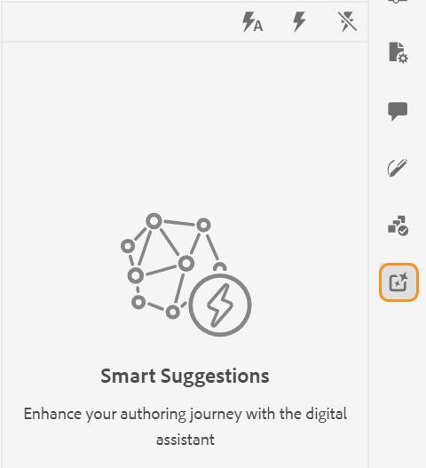

# AI-baserade smarta förslag för att skapa innehåll

Experience Manager Guides har funktionen **Smarta förslag** som hjälper dig att skapa enhetligt och korrekt innehåll.

När du redigerar innehåll kan funktionen **Smarta förslag** söka med hjälp av AI och visa det befintliga innehåll som semantiskt liknar ditt innehåll. Du kan sedan välja det bästa matchande innehållet som du vill ta med i det aktuella ämnet som referens.

Detta gör att du kan återanvända befintligt innehåll från dokumentationsdatabasen och skapa enhetligt innehåll. Du skapar till exempel ett dokument som innehåller information om **Adobe Firefly**, inklusive ett stycke om **Adobe**. I så fall kan du snabbt visa och lägga till innehållsreferensen från ett annat ämne, som **Adobe Photoshop**, som innehåller samma stycke.

När du öppnar ett ämne i Web Editor visas panelen **Smarta förslag** till höger.

>[!NOTE]
>
> Administratören måste konfigurera funktionen **Smarta förslag**. Mer information finns i avsnittet [Konfigurera smarta förslag för AI-baserad redigering](/help/product-guide/cs-install-guide/conf-smart-suggestions.md) i installations- och konfigurationshandboken för Cloud Service.

{width="300" align="left"}

*Visa panelen **Smarta förslag**.*

Följ de här stegen för att visa smarta förslag på hur du lägger till lämpliga innehållsreferenser till ditt ämne:

1. Välj ikonen **Smarta förslag**  för att öppna panelen.

   >[!NOTE]
   >
   > I de [globala profilerna eller mappnivåprofilerna](/help/product-guide/cs-install-guide/conf-folder-level.md#conf-ai-smart-suggestions) måste administratören definiera filerna eller mapparna som ska indexeras för smarta förslag, det minsta antal tecken som du måste ange för att kunna visa förslagen och det högsta antalet förslag som du kan visa i listan.

1. Skriv in innehållet i ditt ämne för att visa relaterade förslag. Kontrollera att innehållets teckenlängd överskrider vad administratören har angett i mappprofilen för att innehållsförslagen ska visas.

1. Välj **Förslag för den aktuella taggen**  om du vill visa redigeringsförslagen för den tagg där du placerar muspekaren.  Förslagen för att visa och lägga till innehållsreferenser från de indexerade filerna visas baserat på innehållet i den aktuella taggen.

   Kortkommando: **Windows** (*Ctrl* + *K*), **macOS** (*Command* + *K*)
1. Välj **Förslag för det fullständiga dokumentet**  om du vill visa förslag baserat på innehållet i det fullständiga dokumentet.  Ikonen  visas bredvid innehållet där en lämplig matchning finns.

   Kortkommando: **Windows** ( *Ctrl* + *Skift* + *K* ), **macOS** (*Kommando* + *Skift* + *K* )

   >[!NOTE]
   >
   > Du kan bara visa förslagen för den aktuella visningsrutan (det innehåll som visas på skärmen). Om du vill visa förslag på annat innehåll i dokumentet rullar du uppåt eller nedåt för att visa det i visningsrutan och väljer sedan ikonen  .

1. Markera ikonen **Smarta förslag**  bredvid taggarna som du har lagt till i dokumentet för att visa smarta förslag.
1. Du kan visa smarta förslag i rutan **Återanvänd innehåll** .  Experience Manager Guides ger förslag på exakt matchning av innehåll och innehåll med samma innebörd. Du kan t.ex. söka efter ämnet som innehåller det exakta versionsnumret, som&quot;release version 2023.03.12&quot;. Du kan också söka efter &quot;Adobe har huvudkontor i San Jose i Kalifornien&quot; och hitta liknande material som &quot;San Jose har kvartal av många programvaruföretag som Adobe.&quot;
1. Välj **Innehållsinformation**  om du vill visa informationen.
   {width="300" align="left"}

   *Visa detaljerad information om innehållsreferensen.*

   1. Titeln på det ämne som innehåller innehållsreferensen visas som en hyperlänk.
   1. Sökvägen till filen som innehåller innehållsreferensen.
   1. Den typ av referens där innehållet refereras.
   1. Namnen på DITA-filer där ämnet refereras visas som hyperlänkar.
1. Välj **Förhandsgranska föreslaget innehåll**  om du vill jämföra det aktuella innehållet med det föreslagna innehållet. Detta hjälper dig att jämföra skillnaderna och avgöra om du vill lägga till innehållsreferensen för det föreslagna innehållet och göra den konsekvent eller behålla det aktuella innehållet.

   {width="800" align="left"}

   *Förhandsgranska jämförelsen mellan det aktuella innehållet och det föreslagna innehållet.*

1. Klicka på **Acceptera** för att lägga till den föreslagna innehållsreferensen i dialogrutan **Förhandsvisa föreslaget innehåll**.
1. Du kan också välja **Acceptera** eller **Avvisa** i rutan **Återanvänd innehåll** för lämpliga rekommendationer.

Denna intelligenta funktion är praktisk och minimerar arbetet med manuell innehållssökning, så att du kan koncentrera dig mer på att skapa nytt innehåll. Det underlättar också bättre teamsamarbete och ger enhetlighet i det innehåll som skapas av olika författare.

>[!NOTE]
>
>Smarta förslag bevarar inte dina data efter den aktuella sessionen. För svar förlitar sig smarta förslag enbart på det index som skapas för innehållet i din interna databas. Externa AI-verktyg används inte, vilket säkerställer att data ligger kvar i systemet.
