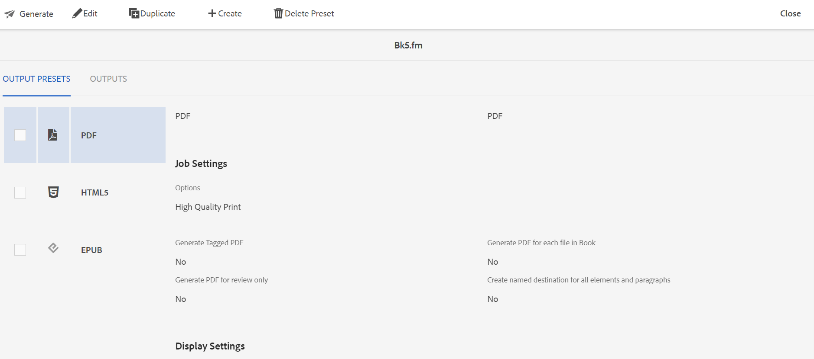

# Generera utdata från .book- eller .fm-filer {#generating_output_fm_docs}

Så här genererar du utdata för FrameMaker-dokument:

1. I Assets-gränssnittet går du till och klickar på den `.book`- eller `.fm`-fil som du vill publicera.

   DITA-kartkonsolen visas med en lista över tillgängliga utdatapresentationer för att generera utdata.

   {width="800" align="left"}

1. Välj en eller flera förinställningar som du vill använda för att generera utdata.

1. Klicka på ikonen Generera för att starta genereringsprocessen för utdata.

>[!NOTE]
>
> Du kan visa aktuell status för begäran om generering av utdata genom att klicka på Utdata. Mer information finns i [Visa status för utdatagenereringsaktiviteten](fm-output-view-status.md).

**Överordnat ämne:**[ Generera utdata för FrameMaker-dokument](fm-output-generatation.md)
