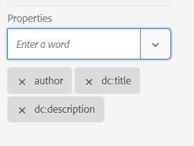

# Skicka metadata till utdata med DITA-OT {#id21BJ00QD0XA}

Metadata är ytterligare information om utdata. I AEM Guides kan du överföra befintliga metadata eller skapa anpassade metadatataggar. Du kan skicka metadata till AEM, PDF, HTML 5, EPUB och anpassade format via DITA-OT-publicering.

Utför följande steg för att skicka metadata till utdata med DITA-OT-publicering:

1. I **Assets-gränssnittet** går du till och klickar på den DITA-kartfil som du vill skicka metadata till DITA-OT.
1. Markera och redigera en förinställning som du vill skicka metadatafälten till. Välj t.ex. förinställningen PDF.
1. Välj **DITA-OT** under Generera &lt;output\> Använda i den valda utdataförinställningen.

   {width="800" align="left"}

1. I listrutan Egenskaper väljer du de metadata som du vill skicka till DITA-OT-publicering.

   I listrutan Egenskaper visas både de anpassade egenskaperna och standardegenskaperna. I skärmbildsförfattaren ovan är till exempel den anpassade egenskapen medan `dc:description`, `dc:language`, `dc:title` och `docstate` är standardegenskaper.

   >[!NOTE]
   >
   > Dessa egenskaper hämtas från filen metadataList som finns på följande plats:`/libs/fmdita/config/metadataList`. Som standard visas fyra egenskaper i den här filen - `dc:description`, `dc:language`, `dc:title` och `docstate`.

   Den här filen kan överlappas av: `/apps/fmdita/config/metadataList`.

   Om du vill skicka en anpassad egenskap som du redan har definierat värdena för läser du [Använd AEM metadata i DITA-OT PDF-utdata](https://experienceleaguecommunities.adobe.com/t5/xml-documentation-discussions/use-aem-metadata-in-dita-ot-pdf-output/td-p/411880).

1. Välj önskade anpassade egenskaper och standardegenskaper i listrutan **Egenskaper**. Välj till exempel `author`, `dc:title` och `dc:description`. Det här är standarden `metadata/properties` som skapas när vi skapar en fil. De valda egenskaperna visas under listrutan.

   {width="300" align="left"}

1. Klicka på **Klar** uppe till vänster för att spara ändringarna.
1. Generera utdata.

De valda metadataegenskaperna skickas till utdata som genereras med DITA-OT.

**Överordnat ämne:**[ Utdatagenerering](generate-output.md)
