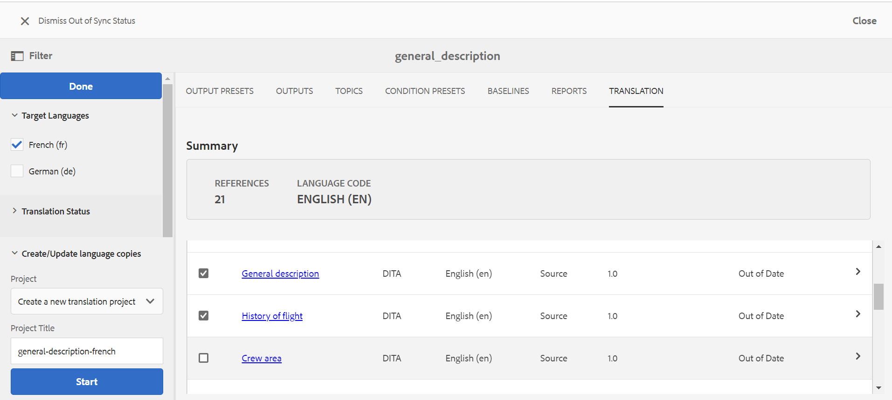

# Bästa tillvägagångssätt för innehållsöversättning {#id1678G0S702F}

Tänk på följande när du översätter innehåll:

- Mappens och filens namn måste uppfylla filnamnsstandarderna, t.ex.: blanksteg, apostrof, klammerparenteser, likhetstecken, specialtecken eller icke-ASCII-tecken.

- Om du översätter innehåll på olika språk måste du skapa mappar för varje språk. Var och en av dessa språkmappar kommer att innehålla det innehåll som motsvarar det språket. Du kan till exempel skapa mappar med språkdesignern som `de` för tyska, `fr` för franska och så vidare. Eller så kan du skapa mappar med språk- och regiondesigners som `fr-FR` för franska som används i Frankrike eller `fr-CA` för franska som används i Kanada.
- Målspråket ska också ha de faktiska språkinställningarna valda enligt målspråksmapparna i sin förekomst.
- Molnkonfigurationen bör vara densamma som för källmappen och det ska bara finnas en molnkonfiguration i en mapp. Du kan skapa flera mappar under /conf om du vill använda flera översättningskopplingar.
- En mapp får inte innehålla fler än 1 000 filer.
- Kontrollera att den användare som ansvarar för att initiera översättningsprocessen har behörigheterna Läs, Ändra, Skapa och Ta bort för käll- och målspråksmapparna.
- Eftersom översättning av innehåll kräver att ett översättningsprojekt skapas, måste användaren ha tillgång till projektet i AEM.
- Om du vill använda villkorliga förinställningar tillsammans med kartan måste du skapa dem innan du startar översättningsprocessen. Eftersom villkorliga förinställningar också paketeras i den översatta versionen av kartan, kan du se till att de är tillgängliga i den översatta versionen genom att skapa förinställningarna innan översättningsprocessen påbörjas.
- Översättningsprocessen för innehåll måste startas från DITA-kartkonsolen och inte från AEM Assets-gränssnittet.
- Det komponentbaserade arbetsflödet för DITA-översättning får inte användas om du översätter innehåll via mänsklig översättning. Det här alternativet måste dock användas för maskinöversättning.
- Det globalt använda innehållet och mediet som inte kräver lokalisering bör inte tas med i språkkopiorna.
- Allt vanligt innehåll som måste lokaliseras ska finnas i en gemensam mapp i mappen language.

Följande bild visar ett exempel på en mappstruktur i AEM när du har globalt använt innehåll och tre språkversioner.

{width="800" align="left"}

## Konfigurera översättningstjänst

Utför följande steg för att konfigurera den mänskliga översättningstjänsten eller maskinöversättningstjänsten att använda:

1. I Assets-gränssnittet väljer du källspråksmappen.

1. Öppna mappegenskaperna och gå till fliken **Cloud Service**.

1. Konfigurera översättningstjänsten som du vill använda på fliken **Cloud Service**.

   Du kan konfigurera maskinbaserad eller mänsklig översättning.

   Se till att det bara finns en konfiguration för översättningskopplingen i en mapp. Flera mappar kan skapas under /conf om det finns flera översättningskopplingar. En molnkonfiguration måste vara markerad för källspråksmappen innan översättningsprocessen startas.

   >[!NOTE]
   >
   > Mer information om hur du integrerar med översättningstjänster finns i [Konfigurera översättningsintegreringsramverket](https://experienceleague.adobe.com/docs/experience-manager-cloud-service/sites/administering/reusing-content/translation/integration-framework.html?lang=en) i AEM.

1. Klicka på **Spara och stäng** för att spara de uppdaterade mappegenskaperna.

>[!TIP]
>
> I avsnittet *Översättning* i guiden om bästa praxis finns information om de bästa sätten att översätta innehåll.

## Skapa ett nytt översättningsprojekt

Så här skapar du ett översättningsprojekt:

>[!NOTE]
>
> Innan du utför stegen i den här proceduren måste du se till att du har skapat den språkrot och målmapp som krävs enligt beskrivningen i [Bästa tillvägagångssätt för innehållsöversättning](#id1678G0S702F).

1. Klicka på DITA-kartfilen i Assets-användargränssnittet.

1. Klicka på fliken **Översättning**.

1. I listan **Målspråk** väljer du den språkinställning som du vill översätta projektet till och klickar på **Klar**.

   En sammanfattning och information om ämnen och associerade resurser visas.

   >[!IMPORTANT]
   >
   > **Målspråk** visar endast de språk för vilka en språkmapp skapas parallellt med källspråket. En språkmapp som skapats på en annan nivå, t.ex. en nivå ned från källspråksmappen, visas inte heller. Se till att du skapar alla målspråksmappar på samma nivå som källspråksmappen.

1. Markera de ämnen som du vill skicka för översättning.

   Du kan även använda följande alternativ för ämnesfiltrering:

   >[!NOTE]
   >
   > När du har tillämpat det önskade filtret klickar du på **Klar** på panelen Filter för att filtrera ämnen baserat på ditt val.

   - **Översättningsstatus**: Välj om du vill filtrera ämnen baserat på deras översättningsstatus. De tillgängliga alternativen är: Osynkroniserad, Kopia saknas, Pågår och Synkroniserad.
   - **Sök**: Ange ett eller flera sökord i ämnesrubrikerna.
   - **Source Type**: Välj om du vill filtrera ämnen baserat på deras filtyper. De tillgängliga alternativen är: Alla, DITA, DITA Map, Resurs.
   - **Source-versionen ändrad efter**: Välj om du vill filtrera ämnet baserat på ändringsdatum och -tid. Alla ämnen som ändrats efter det angivna datumet och tiden visas i listan.
   - **Baslinje**: Klicka på Använd baslinje och välj en baslinje som skapats på kartan. Alla filer som ingår i den valda baslinjen visas på översättningssidan. Du kan välja önskade filer från baslinjen och fortsätta med översättningsprocessen. När innehållet har översatts kan du exportera den översatta baslinjen. Mer information om hur du exporterar den översatta baslinjen finns i [Exportera översatt baslinje](generate-output-use-baseline-for-publishing.md#id196SE600GHS).
1. Klicka på **Skapa/uppdatera språkkopior** längst ned på panelen Filter.

1. Välj **Skapa ett nytt översättningsprojekt** i listan **Projekt**.

   >[!NOTE]
   >
   > Om du redan har ett översättningsprojekt kan du lägga till ämnen i det projektet. Välj alternativet **Lägg till i befintligt översättningsprojekt** i listan **Projekt** och välj ett projekt i listan **Befintligt översättningsprojekt**.

1. Ange en rubrik för projektet i fältet **Projektnamn**.

1. Välj alternativet **Inkludera DITA-karta** om du vill skicka kartan för översättning.
1. Klicka på **Start** för att skapa ett nytt översättningsprojekt.

   Ett nytt översättningsprojekt skapas med den valda versionen av ämnena. Nu visas ett popup-meddelande som bekräftar att översättningsprojektet har skapats. När alla målspråkskopior är tillgängliga i översättningsprojektet visas ett meddelande i Inkorgen. När målspråkets kopieringsområde är tillgängligt i översättningsprojektet kan du påbörja översättningsjobbet.

   {width="800" align="left"}

På fliken Översättning finns följande avsnitt:

- **Sammanfattning**: Visar antalet refererade ämnen och källspråk tillsammans med koden.
- **Detaljer**: Visar ämnesrubriken, typen av ämne, språkkoden för ämnet, källspråket, versionen av källämnet, etiketten som har lagts till i ämnet och översättningsstatusen.

## Starta översättningsjobbet {#id225IK030OE8}

Så här startar du översättningsjobbet:

1. Gå till projektmappen som du skapade för lokalisering i **Project**-konsolen.

1. Klicka på lokaliseringsprojektet för att öppna informationssidan.

1. Klicka på pilen i rutan **Översättningsjobb** och välj **Start** i listan för att starta översättningsarbetsflödet.

   >[!NOTE]
   >
   > Om du använder översättningstjänsten för människor måste du exportera innehållet för översättning. När du har det översatta innehållet måste du importera det tillbaka till översättningsprojektet.

1. Om du vill visa översättningsjobbets status klickar du på ellipsen längst ned i rutan **Översättningsjobb**.

När översättningen är klar ändras översättningsjobbets status till *Klar att granskas*. För att slutföra översättningsprocessen måste du godkänna den översatta kopian och resursmetadata från översättningsjobbpanelen i projektkonsolen.

>[!NOTE]
>
> Om du avvisar översättningen för ett eller flera ämnen i ett översättningsjobb återställs översättningsstatusen **Pågår** för alla avvisade ämnen till den ursprungliga statusen. Statusen för de refererade ämnena kontrolleras och återställs enligt det senaste översättningstillståndet. Översättningsfilerna som skapats i målprojektet tas inte bort även om översättningen avvisas för dem.

**Överordnat ämne:**[&#x200B;Översätta innehåll](translation.md)
