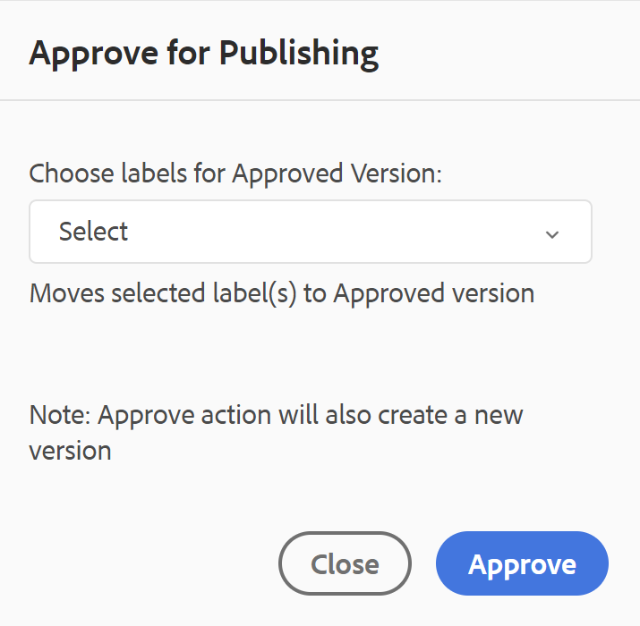

# Dokumenttillstånd {#id1821HC00URO}

För att hantera dokumentens beredskap tillhandahåller AEM Guides en dokumentlägesegenskap som anger dokumentets aktuella tillstånd. Med dokumentlägen kan du snabbt ta reda på om ett dokument är nytt, håller på att granskas eller granskas som färdigt.

## Typer av dokumentlägen

Ett dokument kan ha något av de dokumentlägen som är definierade i dokumentlägesprofilen. Ett dokument kan till exempel ha något av följande dokumentlägen:

- Utkast - Anger att dokumentet har skapats och sparats med nya ändringar.
- Granskning - Anger att ett granskningsarbetsflöde har initierats för dokumentet.
- Granskad - Anger att dokumentet har granskats av de avsedda användarna.

Dessa lägen ställs in manuellt eller automatiskt enligt dokumentlägesprofilinställningarna. Om dokumentlägesprofilen till exempel är konfigurerad med startläge som utkast och läget Under granskning är definierat för dokument som granskas. När du sedan skapar ett dokument ställs dokumentläget in på *Utkast*. Om du initierar en granskningsåtgärd ändras dokumentets status till Under granskning.

Du kan också ändra dokumentläget manuellt för ett eller flera dokument. Om du väljer att ändra dokumentläget för flera dokument bestäms emellertid det tillåtna läget av de gemensamma lägena som är tillåtna för de markerade dokumenten. Anta att du har definierat dokumentlägena som Utkast, Under granskning, Granskad och Klar för Publish i samma ordning. I dokument ett.dita är läget inställt på *Utkast* och i dokument två.dita är läget inställt på Granskad. När du väljer båda - one.dita och two.dita, blir det tillåtna dokumentläget *Klar för Publish*. Eftersom läget two.dita är i läget *Granskad* är nästa möjliga läge för two.dita bara *Klar för Publish*, som visas när båda dokumenten är markerade.

>[!NOTE]
>
> Ett dokument kan bara finnas i ett läge åt gången.

## Ändra dokumentläge

Så här ändrar du ett dokuments status:

1. I Assets-gränssnittet markerar du ett eller flera dokument som du vill ändra dokumentstatus för.
1. Klicka på **Egenskaper** i huvudverktygsfältet.
1. Välj det nya läget i listrutan **Dokumentläge**. Du kan bara markera de dokumentlägen som är tillåtna i avsnittet Tillståndsövergång i dokumentlägesprofilen.

   >[!NOTE]
   >
   >Administratörer kan se alla dokumenttillstånd och ändra dokumentet till ett möjligt läge.

1. Klicka på **Spara och stäng**.

## Visa dokumentläge

Kortvyn i Assets UI visar det aktuella läget tillsammans med datum och storlek för när respektive DITA-avsnitt eller DITA-karta skapades.

{width="800" align="left"}

## Använd dokumentlägen i DDLC

Dokumenttillstånd spelar en viktig roll när det gäller att hantera dokumentens livscykel i DDLC. Om organisationen följer DDLC:n strikt blir det en viktig funktion att ha en funktion för att styra redigering av dokument baserat på deras tillstånd. Du kan till exempel tillåta redigering av dokument när de är i läget *Utkast* eller *Under granskning* . När ett dokument har granskats och är klart att publiceras bör det dock finnas ett sätt att förhindra ytterligare ändringar av dokumentet.

AEM Guides tillhandahåller ett arbetsflöde för dokumentgodkännande som hjälper dig att styra dokumentutvecklingsprocessens livscykel. När ett dokument är klart att publiceras eller har nått det näst sista läget kan du markera det som godkänt. När ett dokument har godkänts skapar AEM Guides en ny version av dokumentet och gör det skrivskyddat. Du kan sedan flytta dokumentet för publicering eller skapa en baslinje för vidare bearbetning.

Om du vill starta ett nytt releaseformulär för de dokument som har markerats som godkända måste en författare starta en ny release. Om du startar en ny version ändras dokumentläget till *Utkast* igen. Genom att ändra dokumentläget till *Utkast* kan dokumentet redigeras igen och du kan fortsätta arbeta med nästa version.

Så här använder du funktionen för dokumentgodkännande:

>[!NOTE]
>
> Arbetsflödesfunktionen för godkännande måste aktiveras av administratören. Mer information finns i avsnittet *Aktivera arbetsflöde för godkännande* i Installera och konfigurera Adobe Experience Manager Guides as a Cloud Service.

1. Öppna det dokument som du vill markera för godkännande i Web Editor.

1. Klicka på ikonen **Markera som godkänd**.

1. Om dokumentet är i ett läge som ska markeras som godkänt visas följande dialogruta:

   {width="300" align="left"}

   Om dokumentet inte kan markeras som godkänt visas följande meddelande:

   {width="300" align="left"}

1. Om dokumentet är klart att markeras som godkänt väljer du en etikett i listrutan och klickar på **Godkänn**.

   >[!NOTE]
   >
   > Om administratören inte har konfigurerat en fördefinierad lista med etiketter visas ett friformstextfält där du kan ange en etikett.

1. När dokumentet har markerats som godkänt visas en **förhandsgranskning** av dokumentet i skrivskyddat läge.

   {width="650" align="left"}

   >[!NOTE]
   >
   > I förhandsgranskningsläget tas alla redigeringsalternativ bort från verktygsfältet. Dessutom togs dokumentets författarvy och Source-vy bort från den övre navigeringen.

När ett dokument har markerats som godkänt går det inte längre att redigera. Om du vill använda dokumentet för nästa version måste du återställa det till läget *Utkast*. Så här ändrar du dokumentläget för ett godkänt dokument till läget *Utkast*:

1. Klicka på ikonen **Starta en ny version**  i ett godkänt dokument.

   Meddelandet Starta ny release visas.

1. Klicka på **Bekräfta**.

   Dokumentets läge ändras till Utkast och dokumentet öppnas i webbredigeraren i redigeringsläge.

**Överordnat ämne:**[ Arbeta med webbredigeraren](web-editor.md)
