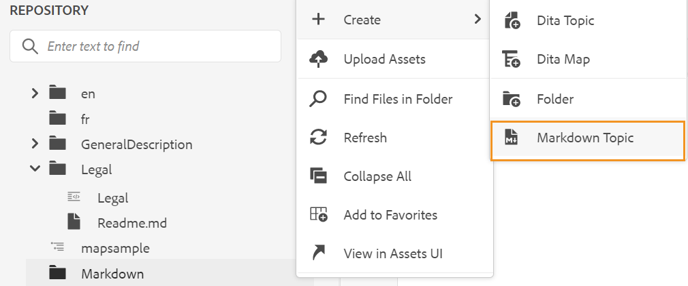
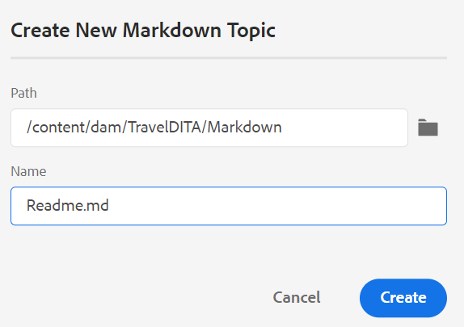

# Skapa markeringsdokument från webbredigeraren {#id223MIE0B079}

Markering är ett lättviktigt markeringsspråk som du kan använda för att lägga till formateringselement i vanliga textdokument. I AEM Guides finns funktioner för att skapa, redigera och förhandsgranska ett markeringsämne \(.md\) från webbredigeraren. Du kan också överföra befintliga Markdown-dokument och redigera dem i webbredigeraren.

## Skapa ett markeringsämne

Följ de här stegen för att skapa ett markeringsämne från webbredigeraren:

1. Välj en mapp i databasvyn.
1. Skapa **markeringsämne** på något av följande sätt:
   1. Klicka på ikonen **Skapa DITA-fil** i det övre högra hörnet av databaspanelen och välj sedan **Markeringsämne** i listrutan.

   {width="550" align="left"}

   1. Välj **Skapa** på Alternativ-menyn i den markerade mappen och välj sedan **Markeringsämne** i listrutan.

   {width="550" align="left"}

1. Ange namn och sökväg för markeringsämnet i dialogrutan **Skapa nytt markeringsämne** .

{width="350" align="left"}

1. Klicka på **Skapa**.

Avsnittet Markering skapas vid den markerade banan och är öppet för redigering.

## Skriv och förhandsgranska ett markeringsämne

Följ de här stegen för att skapa ett markeringsämne från webbredigeraren:

1. Välj ett befintligt markeringsämne\(.md\) i databasvyn.
1. Dubbelklicka på ämnet för att öppna det i redigeringsfönstret.

   Ämnet öppnas i Source-läge.

1. Uppdatera innehållet i Markdown-avsnittet.
1. Klicka på **Förhandsgranska** i det övre högra hörnet om du vill förhandsgranska ämnet.

   >[!NOTE]
   >
   > I förhandsgranskningsläget visas hur ett ämne visas när det visas av en användare i webbläsaren.

1. Använd **Spara som ny version** i huvudverktygsfältet om du vill spara ändringarna du gjort i ämnet och skapa en ny version av ämnet. Du kan också använda **Spara alla** i huvudverktygsfältet om du vill spara ändringarna i alla öppna avsnitt.

1. Klicka på **Stäng** överst till höger för att stänga avsnittet Markering.

>[!NOTE]
>
> Om du inte har sparat ändringarna visas ett popup-fönster och du uppmanas att spara avsnittet innan du stänger det.

**Överordnat ämne:**[ Arbeta med webbredigeraren](web-editor.md)
