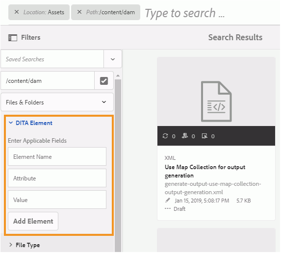

# Konfigurera sökning i AEM Assets UI {#id192SC800MY4}

Som standard känner AEM inte igen DITA-innehåll, vilket innebär att det inte finns någon mekanism för att söka efter DITA-innehåll i dess databas. Det finns heller ingen OOTB-funktion för att söka efter innehåll baserat på deras UUID. Med AEM Guides kan du lägga till funktionerna för sökning efter DITA-innehåll och UUID-baserad sökning i AEM-databasen.

När du konfigurerar innehållssökning i DITA utförs följande uppgifter:

1. [Lägg till sökkomponenten för DITA-element i Assets UI](#id192SF0F50HS)
1. [Lägg till UUID-baserad sökkomponent i Assets UI](#id2034F04K05Z)
1. [Ge behörigheter till användare](#id192SF0G0RUI)
1. [Lägg till anpassade element eller attribut i sökningen](#id192SF0G10YK)
1. [Extrahera metadata från befintligt innehåll](#id192SF0GA0HT)

Förutom att lägga till sökfunktioner kan du även konfigurera de mappar som inte ska ingå i sökningen. Mer information finns i [Uteslut temporära filer från sökresultat](#id197AHI0035Z).

## Lägg till sökkomponenten för DITA-element i Assets UI {#id192SF0F50HS}

Gör följande för att lägga till en sökkomponent för DITA-innehåll i AEM Assets-gränssnittet:

1. Logga in i Adobe Experience Manager som administratör.

1. Klicka på länken **Adobe Experience Manager** överst och välj **Verktyg**.

1. Välj **Allmänt** i listan över verktyg och klicka på rutan **Sök i Forms**.

1. I listan **Sök i Forms** väljer du **Assets Admin Search Rail**.

1. Klicka på **Redigera**.
1. Bläddra till slutet av listan på fliken **Välj predikat**.

1. Dra och släpp **DITA-elementpredikatet** på önskad plats i sökformuläret.

   

1. Klicka på **Klar** för att spara ändringarna.

   När du öppnar filteralternativet i Assets-gränssnittet får du sökfilteralternativet DITA-element.

   


## Lägg till UUID-baserad sökkomponent i Assets UI {#id2034F04K05Z}

Gör följande för att lägga till UUID-baserad sökkomponent i AEM Assets UI:

1. Logga in i Adobe Experience Manager som administratör.

1. Klicka på länken **Adobe Experience Manager** överst och välj **Verktyg**.

1. Välj **Allmänt** i listan över verktyg och klicka på rutan **Sök i Forms**.

1. I listan **Sök i Forms** väljer du **Assets Admin Search Rail**.

1. Klicka på **Redigera**.
1. På fliken **Välj predikat** väljer du **Egenskapspredikat** och drar och släpper det på önskad plats i sökformuläret.

1. På fliken **Inställningar** anger du följande information för den nyligen tillagda **komponenten** för egenskapsförutsägelse:

   - **Fältetikett**: UUID
   - **Egenskapsnamn**: jcr:content/fmUuid
1. Klicka på **Klar** för att spara ändringarna.

   När du öppnar filteralternativet i Assets UI får du det UIS-baserade sökfiltreringsalternativet.


## Ge behörigheter till användare {#id192SF0G0RUI}

Författare och utgivare måste få explicit behörighet för att kunna komma åt sökfunktionerna från Assets användargränssnitt. Om du inte ger dessa behörigheter kommer dina användare inte att kunna söka efter DITA-innehåll baserat på deras element-/attributvärden eller UUID.

Utför följande steg för att ge åtkomst till DITA-sökfunktionen:

1. Gå till sidan med användar- och gruppbehörigheter.

1. Sök efter användargruppen eller en enskild användare som du vill ge åtkomst till. Om du till exempel vill ge åtkomst till alla användare i gruppen författare anger du författare i fältet **Filterfråga** och trycker på **Retur**.

   

1. Markera gruppen **författare**.

1. Välj fliken **Behörigheter** i den högra rutan.

1. Navigera till följande mapplats:

   /conf/global/settings/dam/search

1. Ge **läsbehörighet** till sökmappen.

   

1. Klicka på **Spara**.


Den valda användaren eller användargruppen har nu tillgång till sökfunktionen för DITA-innehåll i Assets användargränssnitt.

## Lägg till anpassade element eller attribut i sökningen {#id192SF0G10YK}

För att DITA-sökningen ska fungera krävs viss förbearbetning av DITA-innehållet. Detta förbearbetningssteg extraherar selektivt innehåll från enskilda DITA-kartor och -ämnen så att det kan indexeras för snabbare sökning. Internt kallas den här processen *Serialisering*. Serialisering av DITA-filer sker under överföring av innehåll eller kan även utföras on-demand. Den använder en konfigurationsfil för att avgöra hur mycket innehåll från varje DITA-fil som ska indexeras. Standardplatsen för serialiseringsfilen är:

/libs/fmdita/config/serializationconfig.xml

Med standardsökkonfigurationen kan du söka efter alla element och attribut i DITA-elementet `prolog`. Om du vill söka baserat på andra element eller attribut måste du konfigurera sökserialiseringsfilen.

>[!NOTE]
>
> Om du vill använda standardsökkonfigurationen i elementet `prolog` kan du hoppa över den här processen.

Filen innehåller två huvudavsnitt - attributuppsättning och regeluppsättning. Nedan visas ett utdrag av regeluppsättningsavsnittet:

```
<ruleset filetypes="xml dita"><!-- Element rules --><rule xpath="//[contains(@class, 'topic/topic')]/[contains(@class, 'topic/prolog')]//*[not(*)]" text="yes" attributeset="all-attrs" /><!-- Attribute rules --><rule xpath="//[contains(@class, 'topic/topic')]/[contains(@class, 'topic/prolog')]///@[local-name() != 'class']" /></ruleset>
```

I avsnittet Regeluppsättning kan du ange:

- Regler för att extrahera elementen

- Regler för att extrahera attribut


En regel består av följande:

**xpath** - Det här är XPath-frågan som hämtar element eller attribut från DITA-filer. Standardkonfigurationen för elementregeln hämtar alla `prolog`-element. Standardkonfigurationen för attributregeln hämtar alla attribut för `prolog`-element. Du kan ange en XPath-fråga för att serialisera de element eller attribut som du vill söka efter.

XPath-frågan innehåller dokumenttypens klassnamn. Klassen `topic/topic` används för DITA-dokument av ämnestyp. Om du vill skapa en regel för andra DITA-dokument måste du använda följande klassnamn:

| Dokumenttyp | Klassnamn |
|-------------|----------|
| Ämne | - ämne |
| Uppgift | - ämne/ämne uppgift/uppgift |
| Koncept | - ämne/ämne/begrepp |
| Referens | - ämnesreferens/referens |
| Karta | - karta/karta |

**text** - Om du vill söka efter texten i det angivna elementet anger du yes-värdet. Om du anger nej som värde serialiseras bara attributen i elementet. Attributen som du vill söka efter måste anges i attributuppsättningsavsnittet.

**attributuppsättning** - Ange ID:t för den attributuppsättning som du vill associera med den här regeln. Värdet all-attributes är ett specialfall som anger att alla attribut för den här regeln måste serialiseras.

En attributuppsättning innehåller en lista med attribut som du vill söka efter i DITA-innehåll. Attributuppsättningen innehåller följande:

**id** - En unik identifierare för attributuppsättningen. Detta ID anges i attributuppsättningsparametern för en regeluppsättning.

**attribute** - En lista med attribut som du vill söka efter. För varje attribut måste du skapa en enskild post i elementet `attribute`.

Utför följande steg för att lägga till anpassade DITA-element eller attribut i sökserialiseringsfilen:

1. Använd Package Manager för att hämta /libs/fmdita/config/serializationconfig.xml.

1. Skapa en överläggsnod av mappen `config` i noden `apps`.

1. Navigera till konfigurationsfilen som finns i noden `apps`:

   `/apps/fmdita/config/serializationconfig.xml`

1. Lägg till nödvändiga element- eller attributregeluppsättningar.

1. Genomför ändringarna och kör Cloud Manager \(CI/CD\)-pipeline för att distribuera konfigurationsändringar.


Den nya serialiseringsinformationen lagras och aktiveras för sökning. Du måste dock extrahera metadata från ditt befintliga DITA-innehåll för att bli tillgängligt för sökning.

## Extrahera metadata från befintligt innehåll {#id192SF0GA0HT}

När du har ändrat standardfilen för sökserialisering måste du aktivera alternativet DITA-metadataextrahering i paketet *com.adobe.fmdita.config.ConfigManager* och sedan köra arbetsflödet för att extrahera metadata. Detta extraherar de metadata som krävs från de befintliga DITA-filerna och det samma görs sedan tillgängligt för sökning.

Om du skapar nya filer eller redigerar en fil efter att du har uppdaterat serialiseringsfilen, extraheras metadata automatiskt från sådana filer. Processen att extrahera metadata krävs bara för filer som redan finns i AEM-databasen.

Det finns två saker att extrahera metadata från befintliga DITA-filer:

1. Aktivera alternativet för metadataextrahering i configMgr
1. Köra arbetsflödet för metadataextrahering

Använd instruktionerna i [Konfigurationsåsidosättningar](download-install-additional-config-override.md#) för att skapa konfigurationsfilen. Ange följande \(egenskap\)-information i konfigurationsfilen för att konfigurera alternativet för metadataextrahering:

| PID | Egenskapsnyckel | Egenskapsvärde |
|---|------------|--------------|
| `com.adobe.fmdita.config.ConfigManager` | `dita.serialization` | Boolean \(true/false\).<br> **Standardvärde**: `false` |

Utför följande steg för att köra arbetsflödet för metadataextrahering:

1. Logga in i Adobe Experience Manager som administratör.

1. Klicka på länken **Adobe Experience Manager** överst och välj **Verktyg**.

1. Välj **Stödlinjer** i listan över verktyg och klicka på rutan **DITA-metadataextrahering** .

1. Om du vill extrahera metadata från en enskild fil och dess beroenden klickar du på länken **Välj en fil** och söker efter en fil.

1. Om du vill extrahera metadata från flera filer i en mapp klickar du på länken **Välj mapp\(ar\)** och bläddrar till önskad mapp. Klicka på knappen **Lägg till** för att lägga till mappen i listan över serialiseringsåtgärder.

   >[!NOTE]
   >
   > Du kan markera och lägga till flera mappar i en serialiseringsåtgärd.

1. Klicka på **Start**.

1. Klicka på **OK** i dialogrutan Bekräfta extrahering av metadata.


## Uteslut temporära filer från sökresultat {#id197AHI0035Z}

Som standard utförs sökningen på hela AEM-databasen. Det kan finnas platser som du vill utesluta från sökningen. När du till exempel initierar arbetsflödet för översättning av innehåll blir de ogodkända filerna kvar i en tillfällig mapp. När du utför sökningen returneras filer från den här tillfälliga platsen också i sökresultaten.

Om du inte vill att AEM Guides ska kunna söka i den tillfälliga översättningsmappens plats måste du lägga till en tillfällig mappsökväg i exkluderingslistan.

Utför följande steg för att exkludera den tillfälliga översättningsmappen från sökningen:

>[!NOTE]
>
> Du kan lägga till andra mapplatser i exkluderingslistan med den här proceduren. Mer information om hur du arbetar med index finns i [Innehållssökning och indexering](https://experienceleague.adobe.com/docs/experience-manager-cloud-service/operations/indexing.html?lang=sv-SE).

1. Lägg till följande egenskap i det anpassade index för damAssetLucene:

   | Egenskapsnamn | Typ | Värde |
   |-------------|----|-----|
   | excludePaths | Sträng\[\] | Lägg till följande värde i den här egenskapen:<br> `/content/dam/projects/translation\_output` |

1. Navigera till lucene-noden på följande plats:

   /oak:index/lucene

1. Lägg till följande egenskap i noden lucene:

   | Egenskapsnamn | Typ | Värde |
   |-------------|----|-----|
   | excludePaths | Sträng\[\] | Lägg till följande värden i den här egenskapen:<br> `/content/dam/projects/translation\_output` |
