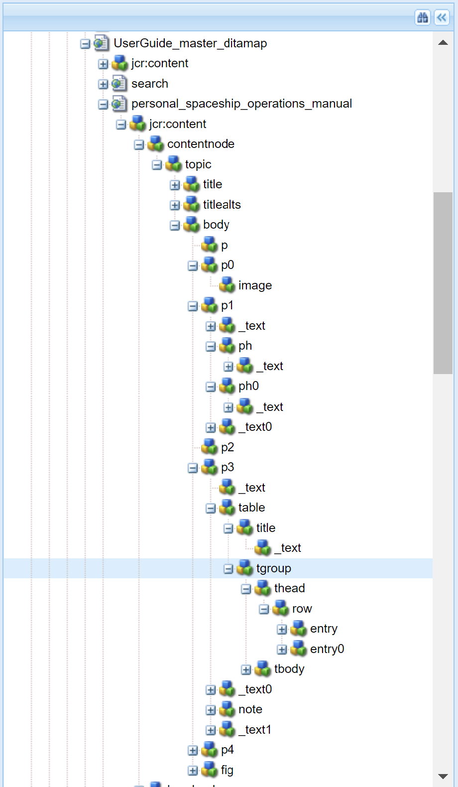

# Konfigurera inställningar för utdatagenerering {#id181AI0B0E30}

AEM Guides har många konfigurationsalternativ som du kan använda för att anpassa processen för generering av utdata. I det här avsnittet beskrivs alla konfigurationer och anpassningar som kan hjälpa dig att skapa utdata.

## Konfigurera fliken Baslinje på kontrollpanelen för DITA-kartor {#id223MD0D0YRM}

Så här döljer du fliken Baslinje på DITA-kartkontrollpanelen:

1. Använd instruktionerna i [Konfigurationsåsidosättningar](download-install-additional-config-override.md#) för att skapa konfigurationsfilen.
1. Ange följande \(egenskap\)-information i konfigurationsfilen för att konfigurera baslinjefliken på kartkontrollpanelen.

| PID | Egenskapsnyckel | Egenskapsvärde |
|---|------------|--------------|
| `com.adobe.fmdita.config.ConfigManager` | `hide.tabs.baseline` | Boolean\(`true/false`\).**Standardvärde**: `true` |

>[!NOTE]
>
> Den här konfigurationen är aktiverad som standard och fliken Baslinje är inte tillgänglig på kartkontrollpanelen.

## Konfigurera blandad publicering på en befintlig AEM-webbplats {#id1691I0V0MGR}

Om du har en AEM-webbplats som innehåller DITA-innehåll kan du konfigurera dina AEM Site-utdata så att DITA-innehåll publiceras på en fördefinierad plats på webbplatsen. I följande skärmbild på en AEM Site-sida är noden `ditacontent` reserverad för lagring av DITA-innehåll:


De återstående noderna på sidan redigeras direkt i AEM Site Editor. Om du konfigurerar publiceringsinställningen för att publicera DITA-innehåll på en fördefinierad plats, säkerställs att inget av ditt befintliga icke-DITA-innehåll ändras i AEM Guides publiceringsprocess.

Du måste göra följande konfigurationer på din befintliga webbplats för att tillåta publicering av DITA-innehåll till en fördefinierad nod:

- Konfigurera platsens mallegenskaper

- Lägg till noder på webbplatsen för att publicera DITA-innehåll


Utför följande steg för att konfigurera den befintliga platsens mallegenskaper:

1. Använd Package Manager för att hämta /libs/fmdita/config/templates/default-filen.

   >[!NOTE]
   >
   > Gör inga anpassningar i standardkonfigurationsfilerna tillgängliga i noden `libs`. Du måste skapa en övertäckning av noden `libs` i noden `apps` och endast uppdatera de filer som krävs i noden `apps`.

1. Lägg till följande egenskaper:

   | Egenskapsnamn | Typ | Värde |
   |-------------|----|-----|
   | `topicContentNode` | Sträng | Ange det nodnamn där du vill publicera DITA-innehållet. Standardnoden där AEM Guides publicerar DITA-innehåll är: <br> `jcr:content/contentnode` |
   | `topicHeadNode` | Sträng | Ange det nodnamn där du vill lagra metadatainformationen för DITA-innehållet. Standardnoden där AEM Guides lagrar metadatainformation är till exempel: <br> `jcr:content/headnode` |


Nästa gång du publicerar DITA-innehåll med mallkonfigurationer för din webbplats publiceras innehållet i de noder som anges i egenskaperna `topicContentNode` och `topicHeadNode`.

## Anpassa utdata för AEM Site {#id166TG0B30WR}

AEM Guides har stöd för att skapa utdatafiler i följande format:

- AEM Site
- PDF
- HTML5
- EPUB
- Anpassade utdata via DITA-OT

För utdata från AEM Site kan du tilldela olika designmallar med olika utdatauppgifter. Dessa designmallar kan återge DITA-innehållet i olika layouter. Du kan till exempel ange olika designmallar för interna och externa målgrupper.

Du kan också använda anpassade DITA Open Toolkit-plugin-program \(DITA-OT\) med AEM Guides. Du kan överföra dessa anpassade DITA-OT-plugin-program för att generera PDF-utdata på ett specifikt sätt.

>[!TIP]
>
> Mer information om hur du skapar utdata för AEM-webbplatsen finns i avsnittet *AEM Site publishing* i guiden om bästa praxis.


### Anpassa designmall för generering av utdata {#customize_xml-add-on}

AEM Guides använder en uppsättning fördefinierade designmallar för att generera utdata från AEM Site. Du kan anpassa AEM Guides designmallar för att generera utdata som passar företagets grafiska profil. En designmall är en samling med olika format \(CSS\), skript \(både server- och klientsidan\), resurser \(bilder, logotyper och andra resurser\) och JCR-noder som knyter samman alla dessa resurser. En designmall kan vara så enkel som ett enda skript på servern med bara ett par JCR-noder, eller en komplex kombination av format, resurser och JCR-noder. Designmallar används av AEM Guides undersystem för publicering när utdata från AEM Site genereras och de styr strukturen, utseendet och känslan hos de genererade utdata.

Det finns ingen begränsning för var designmallresurserna ska placeras på servern, men de är vanligtvis logiskt ordnade efter sin funktion. Standardmallen innehåller till exempel alla sina JavaScript- och CSS-filer som lagras i mappen `/etc/designs/fmdita/clientlibs/siteoutput/default`. Oavsett var filerna finns länkas de ihop av en samling JCR-noder. Tillsammans utgör dessa JCR-noder och filerna hela designmallen.

Med standarddesignmallen som levereras med AEM Guides kan du anpassa komponenterna för landning, ämne och söksida. Du kan skapa en kopia av standarddesignen och motsvarande referensmallar och ange olika komponenter för att generera önskat utvärde.

Gör så här för att ange en egen designmall som ska användas för att generera utdata för AEM Site:

1. Använd pakethanteraren för att hämta standarddesignmallen från följande plats:

   /libs/fmdita/config/templates

1. Skapa en kopia av de hämtade filerna på följande plats i Cloud Manager Git-databasen:

   /apps/fmdita/config/templates

1. Du måste också hämta och kopiera mallarna som refereras från standardmallnoden. De refererade mallarna placeras under:

   /libs/fmdita/templates/default/cqtemplates

   AEM Guides designmallsegenskaper beskrivs i följande tabell.

   | Egenskap | Beskrivning |
   |--------|-----------|
   | `landingPageTemplate`, `searchPageTemplate`, `topicPageTemplate`, `shadowPageTemplate` | Ange noden `cq:Template` för de motsvarande sidorna \(landning, sökning och ämne\). Som standard finns noden `cq:Template` för de här sidorna i noden `/libs/fmdita/templates/default/cqtemplates`. Den här noden definierar strukturen och egenskaperna för landnings-, söknings- och ämnessidorna.<br> `shadowPageTemplate` används för att optimera det segmenterade innehållet. Du måste ange värdet för den här egenskapen till: `fmdita/templates/default/cqtemplates/shadowpage` <br> **Obs!** Du måste ange ett värde för `topicPageTemplate`. `landingPageTemplate` och `searchPageTemplate` är valfria egenskaper. Om du inte vill att sök- och landningssidorna ska genereras ska du inte ange dessa egenskaper. |
   | `title` | Ett beskrivande namn på designmallen. |
   | `topicContentNode` | Platsen för noden som ska innehålla DITA-innehållet på en ämnessida. Sökvägen är relativ till ämnessidan. |
   | `topicHeadNode` | Platsen för noden som ska innehålla huvudvärdena \(eller metadata\) som härleds från DITA-innehållet. Sökvägen är relativ till ämnessidan. |
   | `tocNode` | Platsen för noden som ska innehålla innehållsförteckningen. Sökvägen är relativ till landningssidan eller målsökvägen. |
   | `basePathProp` | Egenskapsnamnet för lagring av sökvägen till den publicerade platsens rot. |
   | `indexPathProp` | Egenskapsnamnet för lagring av sökvägen till den publicerade platsens landnings-/indexsida. |
   | `pdfPathProp` | Egenskapsnamnet för lagring av PDF-ämnets sökväg, om PDF-generering är aktiverat. |
   | `pdfTypeProp` | Egenskapsnamnet för lagring av typen av PDF-generering. För närvarande innehåller den här egenskapen alltid&quot;Ämne&quot;. |
   | `searchPathProp` | Egenskapsnamnet för lagring av söksidans sökväg, om mallen innehåller en söksida. |
   | `siteTitleProp` | Egenskapsnamnet för lagring av titeln på den webbplats som publiceras. Den här titeln är vanligtvis densamma som titeln på kartan som publiceras. |
   | `sourcePathProp` | Egenskapsnamnet för lagring av sökvägen till källans DITA-ämne för den aktuella sidan. |
   | `tocPathProp` | Egenskapsnamnet för lagring av sökvägen till TOC-roten för den publicerade webbplatsen. |


>[!NOTE]
>
> När du har skapat en anpassad designmallsnod måste du uppdatera designalternativet i förinställningarna för AEM Site-utdata för att kunna använda den anpassade designmallsnoden.

Mer information finns i [Skapa din första Adobe Experience Manager-webbplats](https://experienceleague.adobe.com/docs/experience-manager-learn/getting-started-wknd-tutorial-develop/overview.html?lang=sv-SE) och [Grunderna](https://experienceleague.adobe.com/docs/experience-manager-cloud-service/implementing/developing/full-stack/develop-wknd-tutorial.html?lang=sv-SE) för att utveckla din egen webbplats på AEM.

### Använd dokumenttitel för att generera utdata från AEM webbplats

När du genererar utdata för AEM Site spelar det sätt på vilket URL:er genereras en viktig roll för att ditt innehåll ska kunna upptäckas. Om du använder UUID-baserade filnamn är det inte sökvänligt att generera URL:er baserade på UUID för dina filer. Som administratör eller utgivare kan du styra hur du vill generera URL:er för utdata från AEM Site. AEM Guides ger dig en konfiguration genom vilken du kan välja att generera URL:er för AEM Site-utdata med hjälp av filens titel i stället för UID-baserade filnamn. Som standard är det här alternativet aktiverat för UUID-baserade filsystem. Detta innebar att när du genererade utdata från AEM Site för UUID-baserade filsystem används filens namn för att generera URL:er och inte UUID:n för filerna.

>[!NOTE]
>
> Du kan konfigurera regler så att endast en teckenuppsättning tillåts i URL:er för utdata från AEM Site. Mer information finns i [Konfigurera regler för filtrering av filnamn för att skapa ämnen och publicera utdata för AEM Site](#id2164D0KD0XA).

Använd instruktionerna i [Konfigurationsåsidosättningar](download-install-additional-config-override.md#) för att skapa konfigurationsfilen. Ange följande \(egenskap\)-information i konfigurationsfilen för att konfigurera URL-generering i utdata för AEM Site:

| PID | Egenskapsnyckel | Egenskapsvärde |
|---|------------|--------------|
| `com.adobe.fmdita.config.ConfigManager` | `aemsite.pagetitle` | Boolean \(true/false\). Om du vill generera utdata med sidrubriken ställer du in egenskapen på true. Som standard används filnamnet.<br> **Standardvärde**: false |

### Konfigurera URL:en för AEM Site-utdata så att dokumenttiteln används

Du kan använda dokumenttitlarna i URL:en för utdata från AEM Site. Om filnamnet inte finns eller innehåller alla specialtecken kan du konfigurera systemet så att specialtecknen ersätts med en avgränsare i URL:en för utdata från AEM Site. Du kan också konfigurera den så att den ersätter dem med namnet på det första underordnade ämnet.


Så här konfigurerar du sidnamnen:

1. Använd instruktionerna i [Konfigurationsåsidosättningar](download-install-additional-config-override.md#) för att skapa konfigurationsfilen.
1. Ange följande (egenskap) information i konfigurationsfilen för att konfigurera sidnamnen för avsnitten.

| PID | Egenskapsnyckel | Egenskapsvärde |
|---|------------|--------------|
| `com.adobe.fmdita.common.SanitizeNodeName` | `nodename.systemDefinedPageName` | Boolean (`true/false`). **Standardvärde**: `false` |

Om exempelvis *@navtitle* i `<topichead>` har alla specialtecken och du anger egenskapen `aemsite.pagetitle` till true, används som standard en avgränsare. Om du ställer in egenskapen `nodename.systemDefinedPageName` på true visas det första underordnade ämnets namn.


### Konfigurera filnamnssaneringsregler för att skapa ämnen och publicera utdata i AEM Sites och andra format {#id2164D0KD0XA}

Som administratör kan du definiera en lista med giltiga specialtecken som tillåts i filnamn, som till slut utgör URL:en för utdata från en AEM-plats. I tidigare versioner tilläts användare att definiera filnamn som innehåller specialtecken som `@`, `$`, `>` med flera. Specialtecknen resulterade i kodad URL för generering av AEM Site-sidor.

Från och med version 3.8 har konfigurationer lagts till för att definiera en lista med specialtecken som tillåts i filnamnen. Som standard innehåller den giltiga filnamnskonfigurationen `a-z A-Z 0-9 - _`. Detta innebär att när du skapar en fil kan du ha ett specialtecken i filens titel, men internt kommer det att ersättas med ett bindestreck \(`-`\) i filnamnet. Du kan t.ex. ha filens namn som Introduktion 1 eller Introduction@1, så kommer motsvarande filnamn som skapas för båda dessa fall att vara Introduktion-1.

När du definierar en lista med giltiga tecken måste du komma ihåg att de här tecknen `*/:[\]|#%{}?&<>"/+` och `a space` alltid ersätts med ett bindestreck \(`-`\).

>[!NOTE]
>
> Om du inte konfigurerar den giltiga specialteckenlistan kan det hända att du får oväntade resultat när du skapar filen.

Använd instruktionerna i [Konfigurationsåsidosättningar](download-install-additional-config-override.md#) för att skapa konfigurationsfilen. Ange följande \(egenskap\)-information i konfigurationsfilen för att konfigurera giltiga specialtecken i filnamn och utdata för AEM-plats:

| PID | Egenskapsnyckel | Egenskapsvärde |
|---|------------|--------------|
| `com.adobe.fmdita.common.SanitizeNodeNameImpl` | `aemsite.DisallowedFileNameChars` | Kontrollera att egenskapen är inställd på ``'<>`@$``. Du kan lägga till fler specialtecken i listan. |

>[!NOTE]
> 
> Ovanstående konfiguration gäller för alla utdataformat. Det innebär att när du genererar ett PDF-, HTML- eller anpassat utdata kommer det slutliga resultatet att följa de konfigurerade reglerna för sanitifiering av filnamn.

Du kan också konfigurera andra egenskaper, till exempel använda gemener i filnamn, avgränsare för att hantera ogiltiga tecken och maximalt antal tecken som tillåts i filnamnen. Om du vill konfigurera de här egenskaperna lägger du till följande nyckelvärdepar i konfigurationsfilen:

| Egenskapsnyckel | Egenskapsvärde |
|------------|--------------|
| `nodename.uselower` | Boolean \(true/false\).<br> **Standardvärde**: true |
| `nodename.separator` | Alla tecken. <br> **Standardvärde**: \_ *\(understreck\)* |
| `nodename.maxlength` | Heltalsvärde.<br> **Standardvärde**: 50 |

### Konfigurera förenkling av nodstrukturen för AEM Site

När du genererar utdata för AEM Site skapas en nod för varje element i avsnitten internt. För en DITA-karta med tusentals ämnen kan den här nodstrukturen bli för djup. Den här typen av djupt kapslad nodstruktur kan ha prestandaproblem för större platser. Följande bild visar djupt kapslad nodstruktur för utdata från AEM Site:



Observera att det i ögonblicksbilden ovan finns en nod som skapas för varje `p`-element och dess efterföljande underelement, och en liknande struktur skapas för alla andra element som används i avsnittet.

Med AEM Guides kan du konfigurera hur nodstrukturen för AEM Site-utdata ska skapas internt. Du kan förenkla nodstrukturen vid angivna element, vilket innebär att du kan definiera ett element som ska betraktas som huvudelement och alla underelement i det sammanfogas med huvudelementet. Om du till exempel bestämmer dig för att förenkla elementet `p` sammanfogas alla element som finns i elementet `p` med huvudelementet `p`. Ingen separat anteckning skulle skapas för något underelement i elementet `p`. I följande ögonblicksbild visas nodstrukturen förenklad vid elementet `p`:


Så här förenklar du nodstrukturen i AEM Site:

1. Identifiera det eller de element som du vill förenkla nodstrukturen vid:

1. Täcka över noden `libs` i noden `apps` och öppna filen elementmapping.xml.

1. Lägg till egenskapen `<flatten>true</flatten>` i definitionen av elementet där du vill lägga samman nodstrukturen. Om du till exempel vill förenkla nodstrukturen vid elementet `p` lägger du till attributet flatten i definitionen av elementet `p` enligt nedan:

   ```XML
   <ditaelement>
         <name>p</name>
         <class>- topic/p</class>
         <componentpath>fmdita/components/dita/wrapper</componentpath>
         <type>COMPOSITE</type>
         <target>para</target>
         <flatten>true</flatten>
         <wrapelement>div</wrapelement>
      </ditaelement>
   ```

   >[!NOTE]
   >
   > Som standard har egenskapen flatten node konfigurerats vid elementet `p`.

1. Använd instruktionerna i [Konfigurationsåsidosättningar](download-install-additional-config-override.md#) för att skapa konfigurationsfilen.
1. Ange följande \(egenskap\)-information i konfigurationsfilen:

   | PID | Egenskapsnyckel | Egenskapsvärde |
   |---|------------|--------------|
   | `com.adobe.dxml.flattening.FlatteningConfigurationService` | `flattening.enabled` | Boolean \(true/false\).<br> **Standardvärde**: `false` |


När du genererar AEM Site-utdata förenklas nu noderna i elementet `p` och lagras i själva elementet `p`. Du hittar de nya förenklingsegenskaperna för elementet `p` i CRXDE.


**Sök efter en sträng i innehållet i AEM Site-utdata**

Som standard kan du bara söka efter en sträng i titlarna i utdata för AEM Site. Du kan konfigurera systemet så att det söker efter en sträng både i titlarna och i innehållet eller i texten i utdata för AEM Site.

>[!NOTE]
>
> Ibland kan din sökning fungera för vissa element i innehållet, men du kan konfigurera det så att det fungerar för hela innehållet.


Om du vill aktivera sökningen bör du konfigurera förenklingen av nodstrukturen för AEM Site.

VARNING:

Du kan söka efter upp till 1 MB förenklat innehåll. I den föregående skärmbilden kan du till exempel söka efter om innehållet under taggen &lt;p\> är &lt;= 1 MB.

>[!NOTE]
>
> Sökningen fungerar bara på elementen om attributet `<flatten>` har värdet true. Som standard har AEM Guides attributet `<flatten>` angivet till true för de vanligaste textelementen som &lt;p\> &lt;ul\> &lt;lI\>. Om du har skapat några anpassade element bör du emellertid ange attributet `<flatten>` till true i filen elementmapping.xml.

**Förhindra förenkling av nodstrukturen för AEM Site**

På samma sätt som du anger vilken nod som ska förenklas i utdata för AEM Site, kan du även ange ett element som du vill utesluta från den här konfigurationen. Om du till exempel vill lägga samman noder vid elementet `body`, men inte vill att något `table` -element i `body` ska läggas samman, kan du lägga till egenskapen exclude i elementets definition för `table` .

Om du vill utesluta elementet `table` från förenkling lägger du till följande egenskap i elementets definition för `table`:

`<preventancestorflattening>true|false</preventancestorflattening>`

### Konfigurera versionshantering för borttagna sidor i AEM Site-utdata

När du genererar utdata för AEM-webbplatsen med alternativet **Ta bort och** Skapa **&#x200B;**&#x200B;valt för inställningen Befintliga utdatasidor skapas en version för sidan/sidorna som tas bort. Du kan konfigurera systemet så att det inte längre skapas en version innan du tar bort den.

Utför följande steg för att stoppa skapandet av en version för den sida/de sidor som ska tas bort:

1. Använd instruktionerna i [Konfigurationsåsidosättningar](download-install-additional-config-override.md#) för att skapa konfigurationsfilen.
1. Ange följande \(egenskap\)-information i konfigurationsfilen för att konfigurera alternativet **Skapa inte version för borttagna sidor**:

   | PID | Egenskapsnyckel | Egenskapsvärde |
   |---|------------|--------------|
   | `com.adobe.fmdita.confi g.ConfigManager` | `no.version.creation.on.deletion` | Boolean \(true/false\).<br> **Standardvärde**: `true` |

   >[!NOTE]
   >
   > När det här alternativet är markerat kan användare ta bort alla sidor direkt utan att skapa någon version för dem. Om alternativet inte är markerat skapas en version innan sidan tas bort.

### Konfigurera anpassad omskrivare med Experience Manager Guides {#custom-rewriter}

Experience Manager Guides har en anpassad [**rewriter**](https://sling.apache.org/documentation/bundles/output-rewriting-pipelines-org-apache-sling-rewriter.html)-modul för hantering av länkar som genereras vid korsmappningar (länkar mellan ämnen på två olika kartor). Denna omskrivarkonfiguration installeras på följande sökväg: <br> `/apps/fmdita/config/rewriter/fmdita-crossmap-link-patcher`.

Om du har en annan anpassad återskrivningsskrivare i kodbasen använder du ett `'order'`-värde som är större än 50, eftersom Experience Manager Guides återskrivningsprogram använder `'order'` 50.  Om du vill åsidosätta detta måste du ange ett värde >50. Mer information finns i [Skriva om utdata](https://sling.apache.org/documentation/bundles/output-rewriting-pipelines-org-apache-sling-rewriter.html).


## Använda metadata i publicering via DITA-OT {#id191LF0U0TY4}

AEM Guides erbjuder ett sätt att skicka anpassade metadata när utdata publiceras med DITA-OT. Som administratör och utgivare måste du utföra följande uppgifter för att konfigurera och använda anpassade metadata i publicerade utdata:

- Som administratör lägger du till nödvändiga metadata i systemet så att de blir tillgängliga på sidan Egenskaper på DITA-kartan.

- Som administratör lägger du till anpassade metadata i metadatalistan så att den visas i DITA-kartkonsolen.

- Som utgivare konfigurerar och lägger du till anpassade metadata med DITA-kartan och skapar önskade utdata.


Så här lägger du till de metadata som krävs i systemet:

1. Logga in i Adobe Experience Manager som administratör.

1. Klicka på länken Adobe Experience Manager överst och välj **Verktyg**.

1. Välj **Assets** i listan över verktyg.

1. Klicka på panelen **Metadatascheman**.

   Forms-sidan Metadata Schema visas.

1. Välj **standardformuläret** i listan.

   >[!NOTE]
   >
   > Egenskaperna som visas på egenskapssidan för en DITA-karta hämtas från det här formuläret.

1. Klicka på **Redigera**.

1. Lägg till anpassade metadata som du vill använda i publicerade utdata. Vi lägger till exempel till målgruppsmetadata med följande steg:

   1. Dra och släpp komponenten **Enkelradig text** på formuläret från komponentlistan **Skapa formulär** .

   2. Markera det nya fältet för att öppna fältets **inställningar**.

   3. I **fältetikett** anger du metadatanamnet - målgrupp.

   4. I inställningen **Mappa till egenskap** anger du ./jcr:content/metadata/&lt;namn på metadata\>. Vi kommer till exempel att ställa in den på ./jcr:content/metadata/publik.

   Lägg till alla metadataparametrar som krävs med dessa steg.

1. Klicka på **Spara**.


Den nya parametern visas nu på sidan Egenskaper för alla DITA-kartor.


Därefter måste du göra anpassade metadata tillgängliga i DITA-kartkonsolen. Gör så här för att göra anpassade metadata tillgängliga på DITA-kartans dashboard:

1. Använd pakethanteraren för att komma åt metadatalistfilen som finns på följande plats i din Cloud Manager Git-databas:

   /libs/fmdita/config/metadataList

   >[!NOTE]
   >
   > Filen metadataList innehåller en lista med egenskaper som visas i listrutan **Egenskaper** för en DITA-karta på kartkontrollpanelen. Som standard visas fyra egenskaper i den här filen - docstate, dc:language, dc:description och dc:title.

1. Lägg till anpassade metadata som du har lagt till på Forms-sidan Metadata Schema. Lägg till exempel till målgruppsparameter i slutet av standardlistan.


Nu visas anpassade metadata i DITA-kartkonsolens **Egenskaper**-listruta.

Som utgivare måste du slutligen inkludera anpassade metadata i publicerade utdata. Så här bearbetar du anpassade metadata när du genererar utdata:

1. Navigera till den DITA-karta som du vill publicera i Assets-gränssnittet.

1. Markera DITA-schemafilen och öppna egenskapssidan.

1. Ange värdet för anpassade metadata på sidan Egenskaper. Vi har till exempel angett värdet External som målgruppsparameter.

   

1. Klicka på **Spara och stäng**.

1. Klicka på DITA-kartfilen för att öppna DITA-kartkonsolen.

1. Välj den förinställning du vill använda för att generera utdata på fliken **Utdatainställningar**.

1. Klicka på **Redigera**.

1. I listrutan **Egenskaper** väljer du de egenskaper som du vill skicka vidare till publiceringsprocessen.

   


De valda egenskaperna/metadata skickas vidare till publiceringsprocessen och blir tillgängliga i det slutliga resultatet.

### Validera metadata som skickas till DITA-OT för bearbetning

För att validera de metadatavärden som skickas till DITA-OT kan man använda en molnklar burk. Eftersom vi inte har åtkomst till det lokala filsystemet i molnet kan vi bara validera metadatafilen via molnklar behållare.

- Filnamn: metadata.xml
- Filplats: crx-quickstart/profiles/ditamaps/&lt;ditamap-1234\>

  Så här kommer du åt metadata.xml:

   - Logga in på serverplatsen där AEM-instansen körs.
   - Migrera till crx-quickstart/profiles/ditamaps/&lt;recently-directory-name\>/metadata.xml.
- Exempelfilformat:

  **metadata.xml**

  ```XML
  <?xml version="1.0" encoding="UTF-8" standalone="no"?>
  <root>
     <Path id="/absolutePath/sampleMap.ditamap">
        <metadata>
           <meta isArray="false" key="dc:description">This is a file</meta>
           <meta isArray="false" key="dc:title">Myfile</meta>
           <meta isArray="true" key="multivalueText">One;Two;Three</meta>
        </metadata>
     </Path>
     <Path id="/absolutePath/sampleTopic.dita">
        <metadata>
           <meta isArray="false" key="dc:description">description for the accountability</meta>
           <meta isArray="false" key="dc:title">accountability title</meta>
           <meta isArray="true" key="multivalueText">value1</meta>
        </metadata>
     </Path>
  </root>
  ```


- isArray: Ett booleskt attribut som definierar om metadata är ett \(Array\) med flera värden eller inte. Värdena avgränsas av ett semikolon.
- Sökvägs-ID: Absolut sökväg till filen som lagras under den tillfälliga katalogen.

>[!NOTE]
>
> Om det inte finns några metadata för filen visas inte &lt;meta\>-taggen med nyckeln som egenskap för filen i filen metadata.xml.

## Konfigurera kommandoradsargumentfältet DITA-OT så att det accepterar metadata för rotmappning

Så här använder du kommandoradsargumentfältet DITA-OT för att skicka metadata för rotmappning:

1. Använd instruktionerna i [Konfigurationsåsidosättningar](download-install-additional-config-override.md#) för att skapa konfigurationsfilen.
1. Ange följande \(egenskap\)-information i konfigurationsfilen för att konfigurera kommandoradsargumentfältet DITA-OT i förinställningen:

| PID | Egenskapsnyckel | Egenskapsvärde |
|---|------------|--------------|
| `com.adobe.fmdita.config.ConfigManager` | `pass.metadata.args.cmd.line` | Boolean\(`true/false`\).**Standardvärde**: `true` |

- Om du anger egenskapsvärdet till **true** aktiveras kommandoradsfunktionen DITA-OT, vilket gör att du kan skicka metadata via DITA-OT-kommandoraden.
- Om egenskapsvärdet anges till **false** inaktiveras kommandoradsfunktionen DITA-OT. Du kan sedan använda egenskapsfältet i förinställningen för att skicka metadata.


## Anpassa DITA-elementmappning med AEM-komponenter {#id1679J600HEL}

DITA-element i AEM Guides mappas till motsvarande AEM-komponenter. AEM Guides använder den här mappningen i arbetsflöden som publicering och granskning för att konvertera DITA-element till en motsvarande AEM-komponent. Mappningen definieras i filen `elementmapping.xml` som du kan komma åt med hjälp av pakethanteraren.

>[!NOTE]
>
> Gör inga anpassningar i standardkonfigurationsfilerna tillgängliga i noden ``libs``. Du måste skapa en övertäckning av noden ``libs`` i noden ``apps`` och endast uppdatera de filer som krävs i noden ``apps``.

Du kan använda de fördefinierade DITA-elementmappningarna eller mappa DITA-element till dina anpassade AEM-komponenter. Om du vill använda dina anpassade AEM-komponenter måste du förstå strukturen för filen `elementmapping.xml`.

### elementmapping.xml-struktur

En översikt på hög nivå av strukturen `elementmapping.xml` förklaras nedan:

1. Alla DITA-element söks först efter en motsvarande komponentmappning baserat på elementnamnet. Till exempel:

   ```XML
   <ditaelement>     
      <name>**substeps**</name>  
      <class>- topic/ol task/substeps</class>  
      <componentpath>dita/components/ditaolist</componentpath>  
      <type>COMPOSITE</type>  
      <target>para</target>
   </ditaelement>
   ```

   I ovanstående exempel återges alla `substeps` DITA-element med komponenten `dita/components/ditaolist`.

1. Om ett DITA-element inte hittar någon matchning baserat på namnet görs en matchning utifrån `class`. Till exempel:

   ```XML
   <ditaelement>  
      <name>topic</name>  
      <class>**- topic/topic**</class>  
      <componentpath>fmdita/components/dita/topic</componentpath>  
      <type>COMPOSITE</type>  
      <target>para</target>  
      <attributemap> 
         <attribute from="id" to="id" />  
      </attributemap>
   </ditaelement>
   ```

   Om ingen mappning har definierats för elementet `task` i ovanstående exempel mappas elementet `task` till ovanstående komponent eftersom `task` ärvs från komponenten `topic`.

1. När ett element har en motsvarande komponentmappning bestäms vidare bearbetning av dess underordnade element av `type`. Till exempel:

   ```XML
   <ditaelement>  
      <name>title</name>  
      <class>- topic/title</class>  
      <componentpath>foundation/components/title</componentpath>  
      <type>**STANDALONE**</type>  
      <target>para</target>  
      <textprop>jcr:title</textprop>
   </ditaelement>
   ```

   `type` har följande värden:

   - COMPOSITE: Mappningen av element till komponent *fortsätter även för underordnade element*.

   - STANDALONE: underordnade element för det aktuella elementet har *inte mappats ytterligare*.

   Om elementet `<title>` har några underordnade element mappas de inte till någon annan komponent i ovanstående exempel. Komponenten för elementet `<title>` ansvarar för återgivningen av alla underordnade element i elementet `<title>`.

1. Om det finns flera komponenter som är mappade till ett enskilt DITA-element väljs den bästa matchningen för elementet. För att välja den bästa matchningskomponenten övervägs domän- och strukturexSpecialisering för DITA-element.

   Om det finns DITA-element med domänspecialisering och en komponent mappas för domänspecialisering får den komponenten hög prioritet.

   Om det finns DITA-element med strukturell specialisering och en komponent mappas för strukturell specialisering får den komponenten hög prioritet.

1. Du kan använda `<attributemap>` i elementmappningen för att mappa attributvärden till motsvarande nodegenskaper.
1. `textprop` kan användas för att serialisera textinnehållet i ett DITA-element till en nodegenskap. Dessutom kan den användas flera gånger i en elementtagg för att serialisera textinnehållet på flera platser i den publicerade hierarkin. Du kan också anpassa platsen och namnet för målegenskapen. Till exempel:

   ```XML
   <ditaelement>
      <name>title</name>
      <componentpath>foundation/components/title</componentpath>
      <type>STANDALONE</type>
      <target>para</target>
       <textprop>**jcr:title**</textprop>
   </ditaelement>
   ```

   Ovanstående elementmappning anger att textinnehållet i elementet `<title>` kommer att sparas som värdet för en egenskap med namnet `jcr:title` på utdatanoden.

1. `xmlprop` kan användas för serialisering av hela XML för ett givet element till en nodegenskap. Komponenten kan sedan läsa den här nodegenskapen och göra anpassad återgivning. Till exempel:

   ```XML
   <ditaelement>
       <name>svg-container</name>
      <class>+ topic/foreign svg-d/svg-container</class>
       <componentpath>fmdita/components/dita/svg</componentpath>
       <type>STANDALONE</type>
       <target>para</target>
      <xmlprop>**data**</xmlprop>
   </ditaelement>
   ```

   Ovanstående elementmappning anger att hela XML-koden för elementet `<svg-container>` kommer att sparas som ett värde för egenskapen `data` på utdatanoden.

1. Det finns en särskild attributmappning som hanterar sökvägsupplösning i utdatagenereringsprocessen. Till exempel:

   ```XML
   <attributemap>
      <attribute from="href" to="fileReference" ispath="true" rel="source" />
      <attribute from="height" to="height" />
       <attribute from="width" to="width" />
   </attributemap>
   ```

   För ovanstående `attributemap` mappas attributet `href` i DITA-elementet till en nodegenskap med namnet `fileReference`. Eftersom `ispath` är inställt på `true` löser utdatagenereringsprocessen den här sökvägen och anger den sedan i nodegenskapen `fileReference`.

   Hur den här upplösningen sker bestäms utifrån värdet för attributet `rel` i attributmappningen.

   - Om `rel=source`, löses värdet för `href` med avseende på DITA-källfilen som bearbetas just nu. Värdet för `href` tolkas och placeras i värdet för egenskapen `fileReference`.

   - Om `rel=target` tolkas värdet för `href` med avseende på rotpubliceringsplatsen. Värdet för `href` tolkas och placeras i värdet för egenskapen `fileReference`.

   Om du inte vill att någon förbearbetning eller upplösning ska ske för sökvägsattribut behöver du inte ange attributet `ispath`. Värdet kopieras som det är och komponenten kan utföra den önskade upplösningen.


### DITA-elementschema

Följande är ett exempel på DITA-elementschemat i filen `elementmapping.xml`:

```XML
<ditaelement>        
    <name>element_name</name>    
    <class>element_class</class>    
    <componentpath>fmdita/components/dita/component_name</componentpath>    
    <type>COMPOSITE|STANDALONE</type>     
    <attributeprop>propname_a</attributeprop>      
    <textprop>propname_t</textprop>    
    <xmlprop>propname_x</xmlprop>     
    <xpath>xpath expression string</xpath>     
    <target>head|para</target>     
    <wrapelement>div</wrapelement>     
    <wrapclass>class_name</wrapclass>     
    <attributemap>         
        <attribute from="attrname"         to="propname"         ispath="true|false"         rel="source|target" />    
    </attributemap>    
    <skip>true|false</skip> 
</ditaelement>
```

I följande tabell beskrivs elementen i DITA-elementschemat:

| Element | Beskrivning |
|-------|-----------|
| `<ditaelement>` | Den översta noden för varje mappningselement. |
| `<class>` | Klassattributet för det DITA-målelement som du skriver komponenten för.<br> Klassattributet för DITA-ämnet är till exempel: <br> `- topic/topic` |
| `<componentpath>` | CRXDE-sökvägen för den mappade AEM-komponenten. |
| `<type>` | Möjliga värden:<br> -   **COMPOSITE**: Bearbeta även underordnade element <br> -   **STANDALONE**: Hoppar över bearbetning av underordnade element |
| `<attributeprop>` | Används för att mappa serialiserade DITA-attribut och -värden till AEM-noder som egenskap. Om du till exempel har elementet `<note type="Caution">` och komponenten som är mappad för det här elementet har `<attributeprop>attr_t</ attributeprop>` serialiseras nodens attribut och värde till egenskapen `attr_t` för motsvarande AEM-nod \( `attr_t->type="caution"`\). |
| `<textprop>propname_t</textprop>` | Spara `getTextContent()`-utdata till en egenskap som definieras av `propname_t.` <br> **Obs!** Det här är en optimerad egenskap. |
| `<xmlprop>propname_x </xmlprop>` | Spara serialiserad XML för den här noden i egenskap som definierats av `propname_x.<br> `**Obs!** Detta är en optimerad egenskap. |
| `<xpath>` | Om XPath-elementet anges i elementmappningen ska XPath-villkoret också uppfyllas tillsammans med elementnamnet och klassen för att komponentmappningen ska användas. |
| `<target>` | Placera DITA-elementet i crx-databasen på den angivna platsen.<br> Möjliga värden: <br> - **head**: Under huvudnoden <br> - **text**: Under styckenoden |
| `<wrapelement>` | Det HTML-element som innehållet ska radbrytas i. |
| `<wrapclass>` | Elementvärdet för egenskapen `wrapclass.` |
| `<attributemap>` | Behållarnod som innehåller en eller flera `<attribute>`-noder. |
| `<attribute from="attrname" to="propname" ispath="true\|false" rel="source\|target" />` | Mappar DITA-attributen till AEM-egenskaper: <br> -   **`from`**: DITA-attributnamn <br> -   **`to`**: AEM-komponentens egenskapsnamn <br> -   **`ispath`**: Om attributet är ett sökvägsvärde \(till exempel: *image*\) <br> -   **`rel`**: Om sökvägen är källan eller målet <br> **Obs!** Om `attrname` börjar med `%` mappar du `attrname minus '%'` till prop `propname`. |

**Ytterligare information**

- Om du tänker åsidosätta standardelementmappningen rekommenderar vi att du inte gör ändringarna i standardfilen `elementmapping.xml`. Du bör skapa en ny XML-mappningsfil och placera filen på en annan plats, helst i en anpassad programmapp som du skapar.

- I filen `elementmapping.xml` finns det många mappningsposter som refererar till komponenten fmdita/components/dita/wrapper. Wrapper är en generisk komponent som återger relativt enkla DITA-konstruktioner med hjälp av egenskaper på webbplatsnoden för att generera relevanta HTML. Egenskapen `wrapelement` används för att generera omslutande taggar och för att delegera den underordnade återgivningen till motsvarande komponenter. Detta är användbart om du bara vill ha en behållarkomponent. I stället för att skapa en ny komponent som återger en viss behållartagg som `div` eller `p` kan du använda komponenten Wrapper med egenskaperna `wrapelement` och `wrapclass` för att uppnå samma effekt.

- Du bör inte spara stora mängder text i JCR-egenskaper för strängar. Beräkningen av den optimerade egenskapstypen i utdatagenereringen säkerställer att stort textinnehåll inte sparas som strängtyp. Om innehåll som är större än ett visst tröskelvärde behöver sparas, ändras egenskapstypen till binär. Som standard är det här tröskelvärdet konfigurerat till 512 byte, men du kan ändra det i Configuration Manager \(*com.adobe.fmdita.config.ConfigManager*\) genom att ändra inställningen **Spara som binärt tröskelvärde** .

- Om du tänker åsidosätta en del \(och inte alla\) av elementmappningarna behöver du inte replikera hela `elementmapping.xml`-filen. Du måste skapa en ny XML-mappningsfil och definiera endast de element som du åsidosätter.

- När du har skapat XML-filen på den anpassade platsen uppdaterar du inställningen `Override Element Mapping` i `com.adobe.fmdita.config.ConfigManager`-paketet.


## Anpassa DITA-kartkonsolen {#id188HC08M0CZ}

AEM Guides ger dig flexibiliteten att utöka funktionerna i DITA-kartkonsolen. Om du t.ex. har en uppsättning rapporter som skiljer sig från vad som finns i AEM Guides kan du lägga till sådana rapporter i kartkonsolen. Om du vill anpassa kartkonsolen måste du skapa ett AEM-klientbibliotek \(eller ClientLib\) som innehåller koden för att kunna utföra de funktioner du behöver.

>[!NOTE]
>
> Direktändringar av sidkomponenter rekommenderas inte eftersom de skrivs över i nya versioner av produkten.

AEM Guides tillhandahåller kategorin `apps.fmdita.dashboard-extn` för att anpassa kartkonsolen. När kartkonsolen läses in körs och läses de funktioner som skapas under kategorin `apps.fmdita.dashboard-extn` in.

>[!NOTE]
>
> Mer information om hur du skapar AEM-klientbibliotek finns i [Använda klientbibliotek](https://experienceleague.adobe.com/docs/experience-manager-cloud-service/implementing/developing/full-stack/clientlibs.html?lang=sv-SE).

## Hantera bildåtergivning under generering av utdata {#id177BF0G0VY4}

AEM innehåller en uppsättning standardarbetsflöden och mediehandtag för att bearbeta resurser. I AEM finns det fördefinierade arbetsflöden för att hantera resurshantering för de vanligaste MIME-typerna. För varje bild som du överför skapas vanligtvis flera återgivningar av samma bild i binärt format i AEM. Dessa återgivningar kan ha olika storlek, med olika upplösning, med vattenstämpel eller någon annan förändrad egenskap. Mer information om hur AEM hanterar resurser finns i [Bearbeta Assets med mediehanterare och arbetsflöden](https://experienceleague.adobe.com/docs/experience-manager-cloud-service/assets/asset-microservices-overview.html?lang=sv-SE) i dokumentationen för AEM.

Med AEM Guides kan du konfigurera vilken bildåtergivning som ska användas när utdata genereras för dina dokument. Du kan till exempel välja mellan en av standardbildåtergivningarna eller skapa en och använda samma för att publicera dina dokument. Mappning av bildåtergivning för publicering av dina dokument lagras i filen `/libs/fmdita/config/ **renditionmap.xml**`. Ett fragment av filen `renditionmap.xml` är följande:

>[!NOTE]
>
> Vi rekommenderar att du skapar en kopia av filen `renditionmap.xml` i mappen `apps` för alla anpassningar.

```XML
<renditionmap>
   <mapelement>
      <mimetype>image/png</mimetype>
      <rendition output="AEMSITE">cq5dam.web.1280.1280.jpeg</rendition>
      <rendition output="PDF">original</rendition>
      <rendition output="HTML5">cq5dam.web.1280.1280.jpeg</rendition>
      <rendition output="HTML5" outputName="ditahtml5">cq5dam.thumbnail.319.319.png</rendition>
      <rendition output="EPUB">cq5dam.web.1280.1280.jpeg</rendition>
      <rendition output="CUSTOM">cq5dam.web.1280.1280.jpeg</rendition>
   </mapelement>
...
</renditionmap>
```

Elementet `mimetype` anger filformatets MIME-typ. Elementet `rendition output` anger vilken typ av utdataformat och namnet på återgivningen \(till exempel `cq5dam.web.1280.1280.jpeg`\) som ska användas för att publicera den angivna utdatafilen. Du kan ange bildåtergivningarna som ska användas för alla utdataformat som stöds - AEMSITE, PDF, HTML5, EPUB och CUSTOM.

Om du vill ange olika bildåtergivningar för en förinställning kan du använda attributet `outputName`, med dess värde inställt på förinställningens titel, för att definiera anpassade återgivningar för specifika förinställningar under samma utdatatyp. Detta är användbart när du behöver olika bildstorlekar eller format för olika publiceringsscenarier.

Till exempel:


```XML
<renditionmap>
   <mapelement>
      <mimetype>image/png</mimetype>
      
      <rendition output="HTML5">cq5dam.web.1280.1280.jpeg</rendition>
      <rendition output="HTML5" outputName="ditahtml5">cq5dam.thumbnail.319.319.png</rendition>
      
   </mapelement>
...
</renditionmap>
```

När attributet `outputName` är inställt på `ditahtml5`(förinställningstitel) används miniatyrbilden `ditahtml5` i de ovanstående återgivningarna. `cq5dam.thumbnail.319.319.png` Om attributet `outputName` inte anges används den större bilden `cq5dam.web.1280.1280.jpeg` för alla utdata i HTML5.

Om den angivna återgivningen inte finns söker AEM Guides först efter webbåtergivningen av den angivna bilden. Om inte ens webbåtergivningen hittas används den ursprungliga återgivningen av bilden.

>[!NOTE]
>
> Dessa bildåtergivningar styr endast utdatagenereringen. En bilds webbåtergivning används när du öppnar ett dokument för förhandsgranskning.

## Konfigurera automatisk tömningsperiod för utdathistorik {#id19AAI070V8Q}

När du genererar utdata skapas utdata tillsammans med utdataloggarna. För stora DITA-kartor kan dessa loggar ta mycket plats i din databas. Som standard lagras loggarna på följande plats i databasen:

`/var/dxml/metadata/outputHistory`

Under en tidsperiod kan den sammanlagda storleken på alla loggfiler uppgå till GB. I AEM Guides kan du konfigurera en tidsperiod för att behålla dessa loggfiler i databasen. Efter den angivna tidsperioden tas loggarna och historiken för utdatagenerering bort från databasen.

>[!NOTE]
>
> Historiken för generering av utdata är loggposten i listan Genererade utdata på fliken Utdata.

Om du konfigurerar historikrensningsfunktionen påverkas utdatagenereringen för alla DITA-kartor i databasen. På fliken Utdata i en DITA-karta rensas historiken efter det angivna antalet dagar och vid den tidpunkt som anges i inställningen.

>[!NOTE]
>
> Borttagning av loggfiler och historik för generering av utdata påverkar inte de genererade utdata.

Använd instruktionerna i [Konfigurationsåsidosättningar](download-install-additional-config-override.md#) för att skapa konfigurationsfilen. Ange följande \(egenskap\)-information i konfigurationsfilen för att ange en dag och en tid för att rensa utdatahistorik och -loggar:

| PID | Egenskapsnyckel | Egenskapsvärde |
|---|------------|--------------|
| `com.adobe.fmdita.config.ConfigManager\|output.history.purgeperiod` | Ange efter hur många dagar som utdatahistoriken och utdataloggarna ska rensas. Om du vill inaktivera den här funktionen anger du egenskapen till 0.Daglig vid den angivna tidpunkten när rensningsprocessen körs på utdata som genererats före det antal dagar som anges i den här egenskapen. | **Standardvärde**: 5 |
| `output.history.purgetime` | Ange den tid då rensningsprocessen initieras. | **Standardvärde**: 0:00 \(eller 12:00 midnatt\) |

## Ändra gränsen för den nyligen genererade utdatalistan {#id1679JH0H0O2}

Du kan ändra det maximala antalet genererade utdata som visas på fliken Utdata för en DITA-karta.

Använd instruktionerna i [Konfigurationsåsidosättningar](download-install-additional-config-override.md#) för att skapa konfigurationsfilen. Ange följande \(egenskap\)-information i konfigurationsfilen för att ändra antalet utdata som ska visas i listan:

| PID | Egenskapsnyckel | Egenskapsvärde |
|---|------------|--------------|
| `com.adobe.fmdita.config.ConfigManager` | `output.historylimit` | Heltalsvärde.<br> **Standardvärde**: 25 |

>[!TIP]
>
> Mer information om hur du arbetar med utdatahistorik finns i avsnittet *Utdatahistorik* i guiden om bästa praxis.

