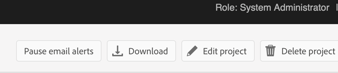

# Konfigurera AI-assistenten

Som administratör kan du konfigurera AI-assistentfunktionen i Experience Manager Guides. AI Assistant skyddas av automatisk autentisering med Adobe IMS. Integrera miljön med Adobe säkra tokenbaserade autentiseringsarbetsflöden och börja använda AI Assistant. Följande konfiguration hjälper dig att lägga till fliken **AI-konfiguration** i mappprofilen. När du har lagt till AI-assistenten kan du använda den i Experience Manager Guides.

Utför följande steg för att konfigurera AI-assistenten:

1. [Skapa IMS-konfiguration i Adobe Developer Console](#create-ims-configurations-in-adobe-developer-console).
2. [Lägg till IMS-konfigurationer i miljön](#add-ims-configuration-to-the-environment)
3. [Aktivera AI-flagga i miljön](#enable-ai-flag-in-the-environment)
4. [Tillämpa miljöändringar](#apply-changes-to-the-environment)
5. [Aktivera AI-assistenten i mappprofilen](#enable-ai-assistant-in-folder-profile)
6. [Konfigurera smarta förslag i mappprofilen](./conf-folder-level.md#configure-ai-assistant-for-smart-help-and-authoring)

## Skapa IMS-konfigurationer i Adobe Developer Console

Så här skapar du IMS-konfigurationer i Adobe Developer Console:

>[!NOTE]
>
>Om du redan har skapat ett OAuth-projekt för att konfigurera den mikrotjänstbaserade publiceringen kan du hoppa över följande steg för att skapa projektet.

1. Starta [Adobe Developer Console](https://developer.adobe.com/console).
1. När du har loggat in på Developer Console visas skärmen **Hem**. På skärmen **Hem** kan du enkelt hitta information och snabblänkar, inklusive länkar till projekt och hämtningsbara filer.
1. Om du vill skapa ett nytt tomt projekt väljer du **Skapa nytt projekt** från länkarna **Snabbstart** .
    {width="550" align="left"}
   *Skapa ett nytt projekt.*

1. Välj **Lägg till API** på skärmen **Projekt**.  Skärmen **Lägg till ett API** visas. På den här skärmen visas alla tillgängliga API:er, händelser och tjänster för Adobe-produkter och -tekniker som du kan använda för att utveckla program.

1. Välj **I/O-hanterings-API:t** för att lägga till det i ditt projekt.
   
   *Lägg till API för I/O-hantering i ditt projekt.*

1. Skapa en ny **OAuth-autentiseringsuppgift** och spara den.

   

   *Konfigurera OAuth-autentiseringsuppgifter för ditt API.*

1. Välj alternativet **OAuth Server till server** på fliken **Projekt** och välj sedan de nya autentiseringsuppgifterna.

1. Klicka på länken **OAuth Server-to-Server** om du vill visa information om projektets autentiseringsuppgifter.

    {width="800" align="left"}

   *Anslut till projektet om du vill visa autentiseringsuppgifter.*

1. Gå tillbaka till fliken **Projekt** och välj **Projektöversikt** till vänster.

   

   *Kom igång med det nya projektet.*

1. Klicka på knappen **Hämta** högst upp för att hämta JSON-tjänsten.

   

   *Hämta JSON-tjänstinformationen.*

Du har konfigurerat OAuth-autentiseringsinformationen och laddat ned JSON-tjänstinformationen. Ha den här filen till hands så som det behövs i nästa avsnitt.

## Lägg till IMS-konfiguration i miljön

Utför följande steg för att lägga till IMS-konfiguration i miljön:

1. Öppna Experience Manager och välj sedan det program som innehåller den miljö du vill konfigurera.
1. Växla till fliken **Miljö**.
1. Välj det miljönamn som du vill konfigurera. Du bör navigera till sidan **Miljöinformation**.
1. Växla till fliken **Konfiguration**.
1. Uppdatera JSON-fältet SERVICE_ACCOUNT_DETAILS. Se till att du använder samma namn och konfiguration som i skärmbilden nedan.

   {width="800" align="left"}

## Aktivera AI-flagga i miljön

Om du vill aktivera AI-assistentfunktionen i Experience Manager Guides-gränssnittet lägger du till flaggan `ENABLE_GUIDES_AI` i miljön.

Se till att du använder samma namn och konfiguration som i skärmbilden nedan.

{width="800" align="left"}

Om du anger flaggan som **true** aktiveras funktionen, medan **false** inaktiveras.

## Tillämpa miljöändringar

När du har lagt till IMS-konfigurationen och aktiverat AI Assistant-flaggan i miljön gör du så här för att länka dessa egenskaper till AEM Guides med OSGi:

1. Lägg till följande två filer (för filinnehåll, se [Bilaga](#appendix)) i Git-projektkoden för din molnhanterare.

   * `com.adobe.aem.guides.eventing.ImsConfiguratorService.cfg.json`
   * `com.adobe.guides.ai.config.service.AiConfigImpl.cfg.json`
1. Se till att de nyligen tillagda filerna täcks av din `filter.xml`.
1. Verkställ och skicka Git-ändringarna.
1. Kör pipeline för att tillämpa ändringarna på miljön.

## Aktivera AI-assistenten i mappprofilen

När konfigurationsändringarna har tillämpats aktiverar du AI-assistentfunktionen för den önskade mappprofilen.

Mer information finns i [Känn till redigeringsfunktionerna](../user-guide/web-editor-features.md).

{width="300" align="left"}

## Konfigurera smarta förslag i mappprofilen

När du har aktiverat funktionen AI Assistant konfigurerar du funktionen Smarta förslag i Mappprofil.

Mer information finns i [Konfigurera smarta förslag i mappprofilen](./conf-folder-level.md#configure-ai-assistant-for-smart-help-and-authoring).


## Bilaga {#appendix}

**Fil**:
`com.adobe.aem.guides.eventing.ImsConfiguratorService.cfg.json`

**Innehåll**:

```
{
 "service.account.details": "$[secret:SERVICE_ACCOUNT_DETAILS]"
}
```

**Fil**: `com.adobe.guides.ai.config.service.AiConfigImpl.cfg.json`

**Innehåll**:

```
{
  "conref.inline.threshold":0.6,
  "conref.block.threshold":0.7,
  "related.link.threshold":0.5,
  "emerald.url":"https://adobeioruntime.net/apis/543112-smartsuggest/emerald/v1",
  "instance.type":"prod",
  "chat.url":"https://aem-guides-ai.adobe.io"
}
```

## Konfigurationsinformation för AI Assistant

| Nyckel | Beskrivning | Tillåtna värden | Standardvärde |
|---|---|---|---|
| conref.inline.threshold | Tröskelvärde som styr precision/återkallande av förslag som hämtats för taggen som användaren skriver in just nu. | Alla värden mellan -1.0 och 1.0. | 0,6 |
| conref.block.threshold | Tröskelvärde som styr precision/återkallande av förslag som hämtats för taggar i hela filen. | Alla värden mellan -1.0 och 1.0. | 0,7 |
| emerald.url | Slutpunkt för vektordatabasen för smarta förslag | [https://adobeioruntime.net/apis/543112-smartsuggest/emerald/v1](https://adobeioruntime.net/apis/543112-smartsuggest/emerald/v1) | [https://adobeioruntime.net/apis/543112-smartsuggest/emerald/v1](https://adobeioruntime.net/apis/543112-smartsuggest/emerald/v1) |
| chat.url | Slutpunkt för AI-assistenttjänsten | [https://aem-guides-ai.adobe.io](https://aem-guides-ai.adobe.io) | [https://aem-guides-ai.adobe.io](https://aem-guides-ai.adobe.io) |
| instance.type | Typ av AEM-instans. Kontrollera att detta är unikt för varje AEM-instans som de smarta förslagen har konfigurerats för. Ett användningsexempel skulle vara att testa funktionen i scenmiljön med &quot;instance.type&quot; = &quot;stage&quot;, medan funktionen samtidigt är konfigurerad för &quot;prod&quot;. | En unik nyckel som identifierar miljön. Endast *alfanumeriska* värden tillåts. &quot;dev&quot;/&quot;stage&quot;/&quot;prod&quot;/&quot;test1&quot;/&quot;stage2&quot; | &quot;prod&quot; |

När du har konfigurerat den visas AI Assistant-ikonen på Experience Manager Guides hemsida och i redigeraren. Mer information finns i avsnittet [AI Assistant](../user-guide/ai-assistant.md) i Experience Manager användarhandbok.
