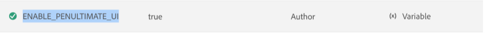

# Konfigurationsåsidosättningar {#id216IFC003XA}

Följande allmänna tillvägagångssätt bör användas för att göra konfigurationsuppdateringar:

1. Få tillgång till din Cloud Manager Git-databas.

1. Skapa en ny JSON-fil på följande plats:

   src/main/content/jcr\_root/apps/fmditaCustom/config/

1. Namnge filen i följande format:

   $\{PID\}.cfg.json

   Här är PID:t process-ID:t för konfigurationen.

1. Lägg till egenskaper i JSON-filen i följande format:

   ```
   {
      "aem.adminuname": "updatedUserjson",
      "valid.characters": "[-a-zA-Z0-9_@$]",
      "dita.serialization": true
   }
   ```

1. Genomför ändringarna och kör Cloud Manager pipeline för att distribuera den uppdaterade konfigurationen.

## Konfigurera användargränssnittet för Experience Manager Guides

2025.02.0-utgåvan av Adobe Experience Manager Guides har ett omgjort användargränssnitt och förbättrade funktioner som hjälper dig att arbeta snabbare och effektivare än någonsin. Detta inkluderar en helt ny hemsida, ett renare och mer organiserat redigeringsverktygsfält, en dedikerad kartkonsol och förbättrade funktioner.

För att säkerställa en smidig övergång och minimera avbrott tillhandahåller Experience Manager Guides ett konfigurationsalternativ som gör att du kan växla tillbaka till det gamla användargränssnittet ( och vice versa) efter behov.

>[!IMPORTANT]
>
> Det här konfigurationsalternativet för att växla mellan det nya och gamla användargränssnittet stöds fram till version 2025.4.0. I version 2025.6.0 är den här inställningen föråldrad och kan inte längre användas för att återgå till det gamla användargränssnittet.

Så här konfigurerar du användargränssnittet i Experience Manager Guides:

1. Öppna Adobe Experience Manager och välj sedan det program som innehåller den miljö du vill konfigurera.
2. Växla till fliken **Miljö**.
3. Välj det miljönamn som du vill konfigurera. Du bör navigera till sidan **Miljöinformation**.
4. Växla till fliken **Konfiguration**.
5. Välj **Lägg till/uppdatera**.
6. Lägg till information om gränssnittskonfigurationen. Se till att du använder samma namn och konfiguration som i skärmbilden nedan.

   {width="800" align="left"}

   Om du anger värdet till **true** behålls det gamla användargränssnittet, medan **false** aktiverar det nya användargränssnittet.


**Överordnat ämne:**&#x200B;[&#x200B; Hämta och installera](download-install.md)
