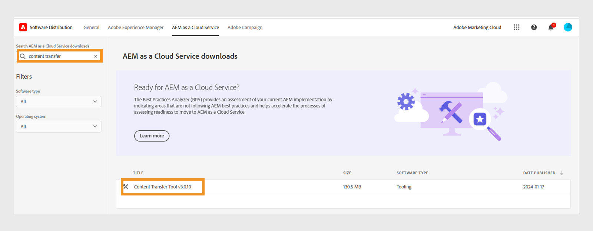
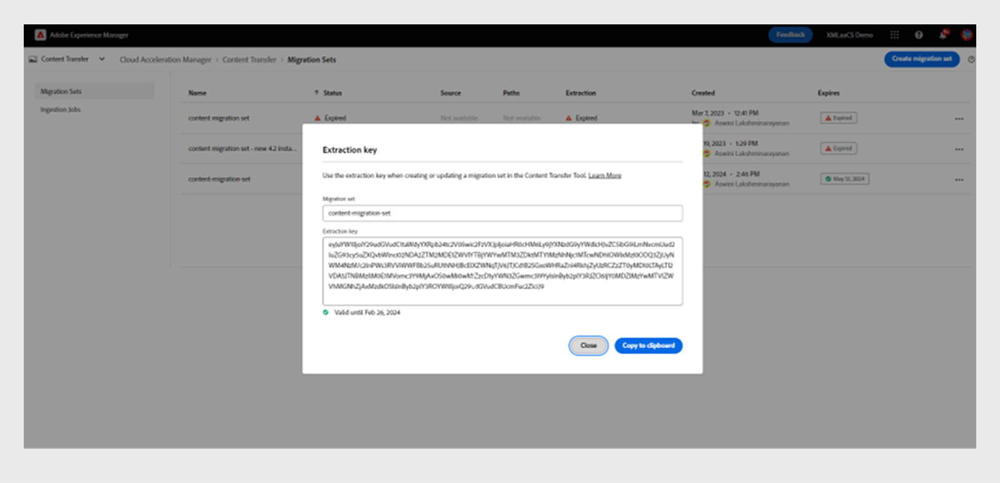

# Migrera innehåll från lokal till Cloud Service

Experience Manager as a Cloud Service utgör en skalbar, säker och flexibel teknikgrund för Experience Manager Assets, Forms och Screens. På så sätt kan marknadsförare och IT-personal fokusera på att leverera slagkraftiga upplevelser i stor skala.
Med Experience Manager as a Cloud Service kan era team fokusera på innovationer istället för att planera för produktuppgraderingar. De nya funktionerna testas grundligt och skickas till era team utan avbrott så att de alltid har tillgång till den senaste versionen av Adobe Experience Manager.
I den här artikeln beskrivs hur du migrerar lokalt eller Managed Services Experience Manager Guides-innehåll till Cloud Service steg för steg, vilket ger en smidig övergång till den molnbaserade plattformen.

## Migreringsprocess

**Verktyget Innehållsöverföring** är ett verktyg som utvecklats av Adobe och som du kan använda för att initiera migreringen av befintligt innehåll från en Adobe Experience Manager On-Local-källinstans eller Managed Services-Experience Manager Cloud Service till målinstansen.
Med det här verktyget överförs även huvudkonton (användare eller grupper) automatiskt.

Du kan hämta **innehållsöverföringsverktyget** som en ZIP-fil från **programdistributionsportalen**:

1. Välj fliken **AEM as a Cloud Service** på portalen **Programdistribution**.
1. Sök i **verktyget Innehållsöverföring**.
1. Välj **Verktyget Innehållsöverföring** i listan och hämta det.

Installera sedan paketet via **Package Manager** på Adobe Experience Manager-källinstansen. Glöm inte att hämta den senaste versionen.
Mer information om den senaste versionen finns i [Versionsinformation](https://experienceleague.adobe.com/docs/experience-manager-cloud-service/content/release-notes/release-notes/release-notes-current.html?lang=en).

>[!NOTE]
> 
> Endast version 2.0.0 och senare stöds, och du bör använda den senaste versionen.

### Krav

* Adobe Experience Manager 6.4 eller senare
* Upp till 20 TB lagringsutrymme stöds
* Total Lucene-indexstorlek på 25 GB
* Längden på ett nodnamn måste vara mindre än 150 byte

Utför följande steg för att migrera ditt Experience Manager Guides-innehåll till Experience Manager som en molntjänst.

1. Logga in på [experience.adobe.com](https://experience.adobe.com/) och välj **Experience Manager**.

   

1. Klicka på **Starta** på panelen **Cloud Acceleration Manager**.
   

1. Skapa ditt första projekt.
   

1. Lägg till namnet och beskrivningen och klicka på **Skapa**. Ditt projekt skapas.
1. Markera det skapade projektet och öppna projektskärmen.
1. Klicka på **Granska** på panelen **Innehållsöverföring**.

   

1. Klicka på **Skapa migreringsuppsättning**.

1. Ange namn och beskrivning för migreringsuppsättningen.

   

1. Markera de tre punkterna och välj **Kopiera extraheringsnyckel**.

1. Klicka på **Kopiera till Urklipp**. Skapa ditt första projekt.
   

1. Välj **Adobe Experience Manager** längst upp och välj sedan rutan **Programvarudistribution**.
   

1. På portalen **Programvarudistribution** väljer du **Adobe Experience Manager som Cloud Service**-flik, söker efter&quot;innehållsöverföringsverktyg&quot; och hämtar verktygspaketet för innehållsöverföring.

   >[!NOTE]
   >
   >  Se till att du laddar ned den senaste versionen.

1. Överför och installera paketet `content-transfer.all-3.0.10.zip` i **Package Manager** för din lokala instans.
   

1. På den lokala instansen väljer du **Verktyg** > **Åtgärder** > **Innehållsmigrering** > **Innehållsöverföring**.

1. Välj **Innehållsöverföring**, skapa en migreringsuppsättning och klistra in extraheringsnyckeln som kopierats från molnaccelerationshanteraren. Detta upprättar en anslutning mellan källan och målet. Sedan verifieras nyckeln och giltigheten visas efter att värdet har angetts.

1. Aktivera alternativet **Inkludera versioner** om du vill inkludera filversionerna.
   

1. Ange sökvägen som du vill migrera och klicka på **Spara**.
Exempel: `/content/we-retail`
eller
   `/content/dam/wknd-events`
   

   >[!NOTE]
   >
   > Du måste migrera följande sökvägar för **Experience Manager Guides** -innehåll.

   * `/content/dam`
   * `/var/dxml`

   Följande sökvägar är begränsade när du skapar en migreringsuppsättning:
   * `/apps`
   * `/libs`
   * `/home`
   * `/etc` Du kan välja några `/etc` sökvägar i CTT.

1. Klicka på **Spara**
1. Markera **migreringsuppsättningen** och välj sedan **Extrahera** överst.
   

1. Kontrollera informationen i popup-fönstret **Extrahering av migreringsuppsättning** för de sökvägar och konfigurationer du har valt och klicka på **Extrahera**. Extraheringen tar några minuter och du ser statusen som uppdaterad.
   

1. När extraheringen är klar och markeras med statusen `finished` går du till Cloud Acceleration Manager och väljer det projekt du skapade i steg 18.
Om du vill ha mer information markerar du de tre punkterna och väljer sedan **Visa information**.

1. Kontrollera konfigurationen av migreringsuppsättningen i popup-fönstret Information om migreringsuppsättning och stäng popup-fönstret. Du kan visa sökvägar och andra inställningar som på skärmbilden nedan:
   

1. Klicka på **Inmatningsjobb** > **Ny inmatning**.
1. Bekräfta de nödvändiga markeringsvärdena och klicka sedan på **Skapa**.
   

1. Välj migreringsuppsättningen, välj den server som krävs för miljön och klicka sedan på **Ingest**.

   

## Kör innehållsöverföringsverktyg på en Publish-instans

Installera verktyget Innehållsöverföring på Publish-källinstansen för att flytta innehåll till Publish-målinstansen.
Verktyget Innehållsöverföring skiljer inte mellan publicerat och opublicerat innehåll när innehåll importeras till en Publish-miljö. Innehållet som anges i migreringsuppsättningen kapslas in i den valda målinstansen. Användaren kan importera en migreringsuppsättning till en Author-instans, Publish-instans eller båda.

### Rekommenderat tillvägagångssätt

Tänk på följande rekommendationer:

* Använd samma version av **innehållsöverföringsverktyget** som användes på författarinstansen.
* Under importen till Publish skalas inte Publish-nivån ned (till skillnad från författaren).
* Migrera endast en Publish-nod. Innan du påbörjar extraheringen ska du ta bort den från belastningsutjämnaren.

>[!NOTE]
>
> Som en försiktighetsåtgärd bör du se till att inga skrivåtgärder utförs på Publish-instanser, inklusive användarinitierade åtgärder som:
> * Innehållsdistribution från AEM as a Cloud Service Author till Publish i den miljön
> * Användarsynkronisering mellan Publish-instanser

## Felsökning

Om extraheringen misslyckas på grund av följande fel kan du lösa problemet genom att importera det relevanta certifikatutfärdarcertifikatet:

`javax.net.ssl.SSLHandshakeException: sun.security.validator.ValidatorException: PKIX path building failed: sun.security.provider.certpath.SunCertPathBuilderException: unable to find valid certification path to requested target`

**Orsak**: Adobe Experience Manager-servern har brandväggsbegränsningar, så lägg till följande slutpunkt i tillåtelselista.

`casstorageprod.blob.core.windows.net`

*Aktivera SSL-loggning.*

