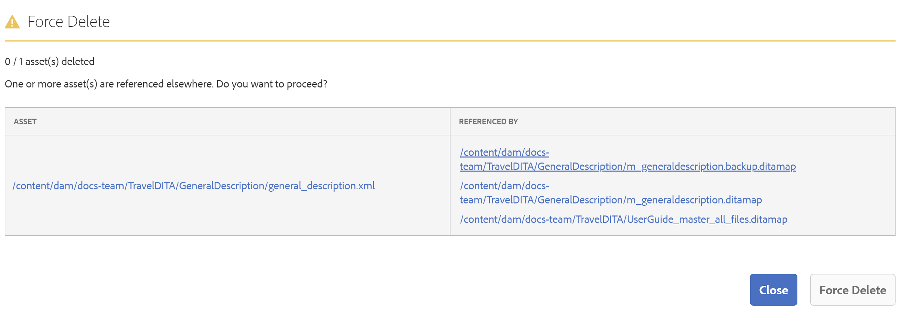
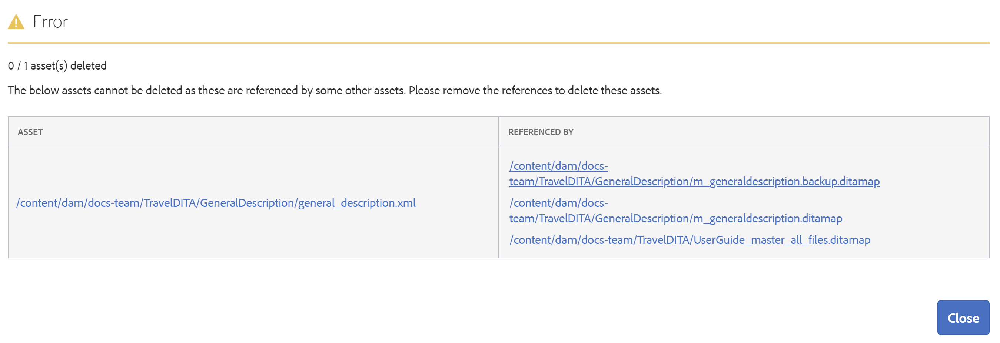
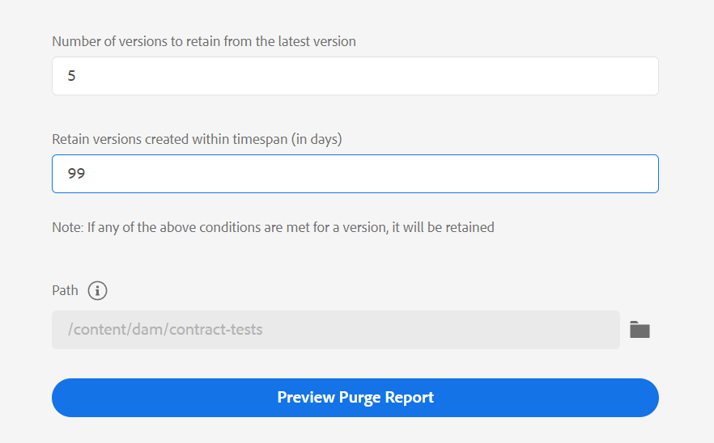

# Versionshantering {#id181GB000XY4}

Versionshantering är en viktig aspekt i alla innehållshanteringssystem. Du kan skapa en ögonblicksbild av din digitala resurs vid en viss tidpunkt. När du har en version av en digital resurs på plats kan du återställa den version av resursen som krävs och uppdatera den. När du skapar en version av en resurs checkar du ofta ut och checkar in den önskade resursen.

Som administratör kan du tillämpa regler som hindrar användare från att redigera en fil utan att checka ut den. På samma sätt kan du se till att alla utcheckade filer checkas in igen för att undvika dataförluster.

I fleranvändningsmiljöer är det också viktigt att se till att användarna inte tar bort filer från systemet. Detta krav är viktigare för filer som checkas ut av andra användare. För att förhindra att användare av misstag tar bort utcheckade filer från systemet, tillhandahåller AEM Guides en konfiguration som du kan använda. Förutom utcheckade filer kan du även styra borttagningen av filer som innehåller referenser eller som refereras från andra filer.

## Skapa ny version för överförd fil

>[!NOTE]
>
> Den här konfigurationen kan bara användas när filer överförs.

Följande flikar innehåller anvisningar om hur du aktiverar alternativet **Skapa ny version för överförd fil** baserat på din Experience Manager Guides-konfiguration: Cloud Service eller On-Premise.

1. Använd instruktionerna i [Konfigurationsåsidosättningar](download-install-additional-config-override.md#) för att skapa konfigurationsfilen.
1. Ange följande \(egenskap\)-information i konfigurationsfilen för att konfigurera alternativet **Skapa ny version för den överförda filen**:

   | PID | Egenskapsnyckel | Egenskapsvärde |
   |---|------------|--------------|
   | `com.adobe.fmdita.confi g.ConfigManager` | `create.ver.new.content` | Boolean \(true/false\).  **Standardvärde**: `true` |

>[!NOTE]
>
> När alternativet är markerat utförs en ny versionshanteringsmekanism och åsidosätter standardbeteendet för överföring som är för efterföljande överföring. Innehållet i den överförda filen sparas då som en ny version. Om alternativet är avmarkerat använder AEM Guides AEM standardmekanism för versionshantering.

## Konfigurera inställningar som tillåter redigering av utcheckade filer

Med AEM Guides Web Editor kan du skapa och uppdatera DITA-ämnen. Du kan konfigurera Web Editor så att endast de dokument som har checkats ut från databasen kan redigeras. Detta säkerställer att ingen annan skrivare av misstag skriver över ett ämne som har öppnats för redigering av en annan författare. När ett ämne öppnas för redigering kan författaren checka in filen när filen stängs.

En annan viktig regel är att se till att filer som har checkats ut checkas in i systemet igen. Detta förhindrar att användare av misstag stänger filerna utan att checka in dem igen.

Använd instruktionerna i [Konfigurationsåsidosättningar](download-install-additional-config-override.md#) för att skapa konfigurationsfilen. Ange följande \(egenskap\)-information i konfigurationsfilen för att konfigurera redigering av utcheckade filer:

| PID | Egenskapsnyckel | Egenskapsvärde |
|---|------------|--------------|
| `com.adobe.fmdita.xmleditor.config.XmlEditorConfig` | `xmleditor.autocheckout` | Boolean \(true/false\).  **Standardvärde**: `false` |

Dessutom kan du konfigurera så att ett varningsmeddelande visas när en utcheckad fil stängs utan att den sparas eller checkas in i databasen.

| PID | Egenskapsnyckel | Egenskapsvärde |
|---|------------|--------------|
| `com.adobe.fmdita.xmleditor.config.XmlEditorConfig` | `xmleditor.checkin` | Boolean \(true/false\).  **Standardvärde**: `false` |

>[!NOTE]
>
> Oavsett om du aktiverar eller inaktiverar den här funktionen är alternativen Checka ut och Checka in alltid tillgängliga i en ämnesförhandsvisning.

## Skriv över utcheckad fil vid överföring

>[!NOTE]
>
> *Den här konfigurationen gäller bara när du skapar filer från Assets-gränssnittet och inte när du överför filer med WebDAV-verktyget.*

Gör så här om du vill tillåta användare att skriva över filen vid överföring som har checkats ut av dem eller någon annan användare:

1. Använd instruktionerna i [Konfigurationsåsidosättningar](download-install-additional-config-override.md#) för att skapa konfigurationsfilen.
1. Ange följande \(egenskap\)-information i konfigurationsfilen för att konfigurera alternativet **Skriv över utcheckad fil vid överföring**:

| PID | Egenskapsnyckel | Egenskapsvärde |
|---|------------|--------------|
| `com.adobe.fmdita.confi g.ConfigManager` | `overwrite.checkout.onupload` | Boolean \(true/false\).  **Standardvärde**: `false` |

>[!NOTE]
>
> Som standard är det här alternativet inaktiverat. När det här alternativet är markerat kan användare skriva över utcheckade filer. Om alternativet inte är markerat går det inte att skriva över filen om den är utcheckad av någon annan användare.

## Förhindra borttagning av utcheckade filer

Använd instruktionerna i [Konfigurationsåsidosättningar](download-install-additional-config-override.md#) för att skapa konfigurationsfilen. Ange följande \(egenskap\)-information i konfigurationsfilen för att förhindra att användare tar bort filer som har checkats ut av misstag:

| PID | Egenskapsnyckel | Egenskapsvärde |
|---|------------|--------------|
| `com.adobe.fmdita.xmleditor.config.XmlEditorConfig` | `xmleditor.preventcheckedoutcontentdeletion` | Boolean \(true/false\).   **Standardvärde**: `true` |

## Förhindra borttagning av refererade filer

Som administratör kan du styra vem som kan ta bort filer från AEM-databasen. I synnerhet om en fil innehåller referenser eller refereras av någon annan fil, kan du definiera vem som kan ta bort sådana filer.

Med den här konfigurationen kan du tillåta eller neka alla användare att ta bort filer eller tillåta att endast en viss användargrupp tar bort filer. Om det är tillåtet att ta bort filer följer du följande process:

- Om du tar bort en mapp som innehåller alla refererade och refererade filer, tas alla filer bort. Processen tar först bort alla filer som inte innehåller några referenser, följt av filerna som innehåller referenser eller refereras.

- Om du tar bort en mapp, och en fil i mappen refereras till av en fil utanför den mappen, uppmanas du att ta bort referensen innan du tar bort filen.

Använd instruktionerna i [Konfigurationsåsidosättningar](download-install-additional-config-override.md#) för att skapa konfigurationsfilen. Ange följande \(egenskap\)-information i konfigurationsfilen för att definiera vem som kan ta bort en fil som innehåller referenser eller som andra filer refererar till:

| PID | Egenskapsnyckel | Egenskapsvärde |
|---|------------|--------------|
| `com.adobe.fmdita.config.ConfigManager` | `block.unsafe.delete` | Möjliga värden är:   - allow\_unsafe\_delete\_for\_all   -   allow\_unsafe\_delete\_for\_delete\_assets\_group   - block\_unsafe\_delete\_for\_all   **Standardvärde**: `allow_unsafe_delete_for_delete_assets_group`   Information om dessa konstanter anges nedan. |

Beroende på vem du vill ge åtkomst för borttagning anger du en av följande konstanter:

- allow\_unsafe\_delete\_for\_all: Ge alla användare behörighet att ta bort filer. Om filen innehåller referenser eller refereras av andra filer kan du även ta bort sådana filer. Innan du tar bort filen visas ett meddelande med referenserna, du kan avbryta borttagningsåtgärden, ta bort referenserna och slutligen ta bort filen. Du kan också framtvinga borttagning av filen utan att ta bort referenserna.

  

- allow\_unsafe\_delete\_for\_delete\_assets\_group: En administratör eller en användare som tillhör gruppen *delete-assets* kan ta bort filer. Om någon annan användare försöker ta bort filer med referenser, kommer de inte att kunna ta bort sådana filer förrän alla referenser tas bort. Följande skärmbild visas när en användare som inte har behörighet försöker ta bort filer.

  

- block\_unsafe\_delete\_for\_all: Tillåt inte alla användare \(inklusive administratörer\) att ta bort filer förrän referenser till och från filen\(erna\) tas bort.

## Rensa äldre versioner av DITA-filer

När du uppdaterar innehåll och skapar nya versioner bevaras de tidigare versionerna av DITA-filerna i databasen. Många versioner kan skapas för dina DITA-filer under en period och kan tillsammans ta upp mycket utrymme i din databas. I AEM Guides kan du konfigurera de äldre versionerna som ska tas bort från databasen.

Om du har administratörsbehörighet kan du komma åt det här verktyget via den angivna URL:en:

`<server folder path> /libs/fmdita/clientlibs/xmleditor_version_purge/page.html`

Den version av en DITA-fil som uppfyller något av de angivna villkoren bevaras och rensas inte:

- Är den första versionen av en fil
- Ingår i en baslinje
- Ingår i arbetsflödet för översättning och granskning
- Har en etikett tillämpat
- Uppfyller definierad ålder eller angivet antal versionskriterier

Utför följande steg för att rensa de äldre versionerna:

1. Ange följande information om de filer som du vill rensa:

   

1. 
   - **Antal versioner som ska behållas från den senaste versionen**: Ange antalet versioner som ska behållas och inte rensas. Om vi till exempel anger 5 behålls de senaste 5 versionerna och de tidigare versionerna är kvalificerade att rensas om andra rensningsvillkor uppfylls.
- **Behåll versioner som skapats inom tidsintervallet \(i dagar\)**: Ange den maximala åldern för en version i dagar. Versioner som är äldre än det angivna antalet dagar kan rensas om andra rensningsvillkor uppfylls. Om vi till exempel anger 100 kvalificeras alla versioner som skapats före 100 dagar att rensas om andra rensningsvillkor uppfylls.
- **Sökväg**: Välj sökvägen till filen eller mappen vars filer du vill rensa.

  >[!NOTE]
  >
  > Du kan bara rensa DITA-filer.

1. Klicka på **Förhandsgranska rensningsrapport**.

   >[!NOTE]
   >
   > Det kan bara finnas en rensningsåtgärd åt gången. Du kan inte initiera en annan versionsrensningsåtgärd om en sådan pågår.

   Rapporten för versionsrensning genereras.

1. Ladda ned versionsrensningsrapport och kontrollera vilka filer och versioner som ska rensas.
1. Du kan välja att **avbryta rensning** eller **starta tömning**.

   

   Tömningsstatusen visas.

   Klicka på **Hämta rapport om versionsrensning** om du vill visa de rensade versionerna. Den här rapporten innehåller rensningsstatus för alla versioner tillsammans med orsaker till varför en viss version kvarstod eller varför den rensades.

>[!NOTE]
>
> Rapporten hämtas på följande plats: `/var/dxml/versionpurge`
