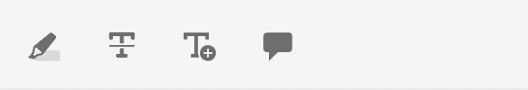

# Granskningsappens komponenter

Följande är huvudkomponenterna i granskningsappen:

- Textbunden granskningspanel: `id: inline_review_panel`
   - Den högra panelen där granskningskommentarerna återges på XML-redigeringssidan.

- Ämnesgranskningar: `id: topic_reviews`
   - Den högra panelen där kommentarerna återges i granskningsappen.

- Granskningskommentar: `id: review_comment`
   - Widgeten för varje granskningskommentar.

Granskningskommentar på granskningsappen:

Granska kommentaren i xml-redigeraren:

- Granskningskommentarssvar: `id: comment_reply`
   - Widgeten för varje svar på granskningskommentar.
     

- Nytt svar på granskningskommentar: `id: comment_new_reply`
   - Widgeten för svar på nya granskningskommentarer.
     

- Anteckningsverktygslåda: `id: annotation_toolbox`
   - Det övre högra verktygsfältet i granskningsappen.
     
