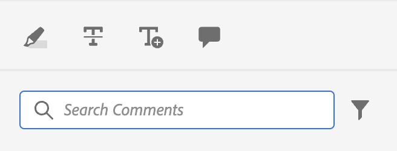

# Exempel på enkel anpassning

Låt oss nu se hur vi kan integrera dessa anpassningar i appen AEM Guides.

Vi vill lägga till den här knappen i en befintlig vy av appen.
Därför behöver vi tre grundläggande saker:

1. The `id` av den vy JSON vi vill lägga till vår komponent i.
2. The `target`, dvs. platsen i den JSON som vi vill lägga till den nya komponenten i. The `target` definieras med `key` och `value`. Nyckel-värde-paret kan vara vilket attribut som helst som används för att definiera komponenten som kan hjälpa till att identifiera den unikt.
Vi kan också använda index för att referera till målet.
Vi har tre vylägen:  `APPEND`, `PREPEND`, `REPLACE`.
3. JSON för den nyskapade komponenten och motsvarande metoder.

Säg att vi vill lägga till en knapp i anteckningsverktygslådan som används vid granskningen, som öppnar filen i AEM.

```typescript
export default {
  id: 'annotation_toolbox', 
  view: {
    items: [
      {
        component: 'button',
        icon: 'linkOut',
        title: 'Open topic in Assets view',
        'on-click': 'openTopicInAEM',
        target: {
          key: 'value',
          value: 'addcomment',
          viewState: VIEW_STATE.APPEND

        },
      },
    ],
  },
  controller: {
    openTopicInAEM: function (args) {
        const topicIndex = tcx.model.getValue(tcx.model.KEYS.REVIEW_CURR_TOPIC)
        const {allTopics = {}} = tcx.model.getValue(tcx.model.KEYS.REVIEW_DATA) || {}
        tcx.appGet('util').openInAEM(allTopics[topicIndex])
    },
  },
}
```

I exemplet ovan har vi:

1. den `id` av den JSON vi vill infoga vår komponent i, dvs. `annotation_toolbox`
2. målet är `addcomment` -knappen. Vi lägger till knappen efter `addcomment` knapp med viewState `append`.
3. Vi definierar händelsen on-click för knappen i kontrollenheten.

JSON för&quot;annotation_toolbox&quot;  `.src/jsons/review_app/annotation_toolbox.json`

Före anpassning såg anteckningsverktygslådan ut så här:



Efter anpassningen ser anteckningsverktygslådan ut så här:


## Lägga till CSS

För att uppnå enhetlighet tillhandahåller vi den komponent som redan är formaterad. Den infogade JSON-filen kommer att ha inbyggda format tillämpade. Det primära sättet att hantera css är genom extraClass-nyckeln i tilläggen.

```js
{    
    "view":{
        items:[
            {
                compoenent:"button",
                extraClass:"underline bg-red",
            }
        ]
    }
}
```

Du kan lägga till anpassade format med CSS-klasser genom att lägga till en CSS-fil i klientlibs. Under bygget skapar vi också [Tailwind](https://tailwindcss.com/docs/utility-first) utdata för verktygsklasserna i tailwind. Konfigurationen för samma sak finns på tilläggets `tailwind.config.js` på `./tailwind.config.js`
