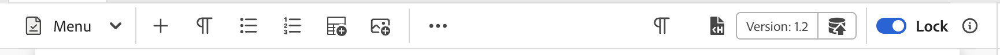

# Anpassa verktygsfältet

Om du vill anpassa `topbar` och `toolbar` kan du använda ID:n `topbar` eller `toolbar` och följa samma vy, kontrollenhetsstruktur.

>[!NOTE]
>
>Från och med version 2502 av Experience Manager Guides har ID:t **toolbar** bytt namn till **redigerarens verktygsfält**. Om du använder de tidigare versionerna kan du anpassa verktygsfältet med ID:t för **verktygsfältet** . Vi har nu inget ID som **topbar** och på plats har **editor_tab_bar**.

Nedan finns ett enkelt exempel på anpassning av verktygsfält. Här har vi tagit bort knappen `Insert Numbered List` och ersatt knappen `Insert Paragraph` med vår egen komponent med en anpassad klickhanterare.

>[!TIP]
>
>Eftersom **editor_toolbar** är utformat för att återge knappar kan CSS och svarstiderna påverkas om du lägger till widgetar i det. Vi rekommenderar att du bara inkluderar knappar eller grundläggande komponenter, som en etikett.

För att komma åt funktioner som visas under objektet `proxy` måste du komma åt dem med `this.getValue`, till exempel för att hämta ett värde.

I AEM Guides 2502 och senare finns ett exempel på hur du anpassar verktygsfält.

```js title = toolbar_customization.js
const toolbarExtend = {
    id: "editor_toolbar",
    view: {
        items: [
            {
                component: "div",
                target: {
                    key:"title",value: "Insert Numbered List",                    
                    viewState: VIEW_STATE.REPLACE
                }
            },
            {
                "component": "button",
                "icon": "textParagraph",
                "variant": "action",
                "quiet": true,
                "title": "Insert Paragraph",
                "on-click": "INSERT_P",
                target: {
                    key:"title",value: "Insert Paragraph",                    
                    viewState: VIEW_STATE.REPLACE
                }
            },
            {
                "component": "button",
                "icon": "fileHTML",
                "variant": "action",
                "quiet": true,
                "title": "URL Link Customization",
                "on-click": "openExternalLinkDialog",
                target: {
                key: "title", value: "Insert Bulleted List",
                viewState: VIEW_STATE.REPLACE
                }
            }
        ]
    },
    controller: {
        init: function() {
            console.log(this.getValue("canUndo"))
            this.subscribeAppEvent({
              key: "editor.preview_rendered",
              next: async function (e) {
                console.log(this.getValue("canUndo"))
              }.bind(this)
            })
        },
        INSERT_P(){
            this.appEventHandlerNext("AUTHOR_INSERT_ELEMENT",  "p" )
        },
        openExternalLinkDialog() {
            this.appEventHandlerNext("AUTHOR_INSERT_ELEMENT",
                {
                args: "<xref href='' scope='external' format = 'dita' ></xref>", activeTabId: "conkey_reference"
                }
            )
        }
    }
}
```


När du har anpassat resultatet kan du se det på följande sätt:



Se exemplet nedan om du vill anpassa verktygsfältet i AEM Guides 4.6.x och i tidigare versioner.

```js title = toolbar_customization.js
const topbarExtend = {
    id: "toolbar",
    view: {
        items: [
            {
                component: "div",
                target: {
                    key:"title",value: "Insert Element",                    
                    viewState: VIEW_STATE.REPLACE
                }
            },
            {
                component: "div",
                target: {
                    key:"title",value: "Insert Paragraph",                    
                    viewState: VIEW_STATE.REPLACE
                }
            },
            {
                component: "div",
                target: {
                    key:"title",value: "Insert Numbered List",                    
                    viewState: VIEW_STATE.REPLACE
                }
            },
            {
                component: "div",
                target: {
                    key:"title",value: "Insert Bulleted List",                    
                    viewState: VIEW_STATE.REPLACE
                }
            },
            {
                "component": "button",
                "extraclass": "insert-multimedia",
                "icon": "more",
                "variant": "action",
                "quiet": true,
                "holdAffordance": true,
                "title": "More Insert Options",
                "elementID": "toolbar_insert",
                "on-click": {
                    "name": "APP_SHOW_OPTIONS_POPOVER",
                    "args":{
                        "target": "toolbar_insert",
                        "extraclass": "new_options_buttons",
                        "items": [
                            {
                                "component": "button",
                                "icon": "add",
                                "variant": "action",
                                "quiet": true,
                                "title": "Insert Element",
                                "on-click": "AUTHOR_SHOW_INSERT_ELEMENT_UI"
                            },
                            {
                                "component": "button",
                                "icon": "textParagraph",
                                "variant": "action",
                                "quiet": true,
                                "title": "Insert Paragraph",
                                "on-click": "INSERT_P"
                            },
                            {
                                "component": "button",
                                "icon": "textNumbered",
                                "variant": "action",
                                "quiet": true,
                                "title": "Insert Numbered List",
                                "on-click": "AUTHOR_INSERT_REMOVE_NUMBERED_LIST"
                            },
                            {
                                "component": "button",
                                "icon": "textBulleted",
                                "variant": "action",
                                "quiet": true,
                                "title": "Insert Bulleted List",
                                "on-click": "AUTHOR_INSERT_REMOVE_BULLETED_LIST"
                            },
                            {
                                "component": "button",
                                "icon": "table",
                                "variant": "action",
                                "quiet": true,
                                "title": "Insert Table",
                                "on-click": "AUTHOR_INSERT_ELEMENT",
                            }
                        ]
                    },
                },
                target: {
                    key:"title",value: "Insert Table",                    
                    viewState: VIEW_STATE.REPLACE
                }
            },
        ]
    },
    controller: {
        init() {
            console.log(this.proxy.getValue('canUndo'))
            this.proxy.subscribeAppEvent({
                key: "editor.preview_rendered",
                next: async function (e) {
                    console.log(this.proxy.getValue('canUndo'))
                }.bind(this)
            })
        },
        INSERT_P(){
            this.next("AUTHOR_INSERT_ELEMENT",  "p" )
        }
    }
}
```

När du har anpassat resultatet kan du se det på följande sätt:


I ett annat exempel skulle vi skapa en anpassad verktygsfältsknapp som kan hoppa direkt till önskade underalternativ för **Korsreferens** som e-post, filreferens, webblänk osv.


```js title = toolbar_customisation.js
const toolbarExtend = {
    id: "editor_toolbar",
    view: {
        items: [
            
                {
                    "component": "button",
                    "icon": "fileHTML",
                    "variant": "action",
                    "quiet": true,
                    "title": "External URL Link",
                    "on-click": "openExternalLinkDialogP",
            
                target: {
                    key:"title",value: "Insert Bulleted List",                    
                    viewState: VIEW_STATE.REPLACE
                }
            }
        ]
    },
    controller: {
        openExternalLinkDialog() {
            tcx.eventHandler.next ("AUTHOR_INSERT_ELEMENT")
            t{
          args:"<xref href='' scope='external' format = 'dita' ></xref>",activeTabId:"conkey_reference"
        }
    }
  }
}
```

Här är `activeTabId` uppräkningen för att välja rätt flik. Som standard öppnas `file_link` när du väljer fliken Korsreferens. Du kan ändra `activeTabId`-värdena till `content_reference`, `conkey_reference`, `key_reference`, `file_link`, `web_link` och ` email_link` baserat på kravet.
