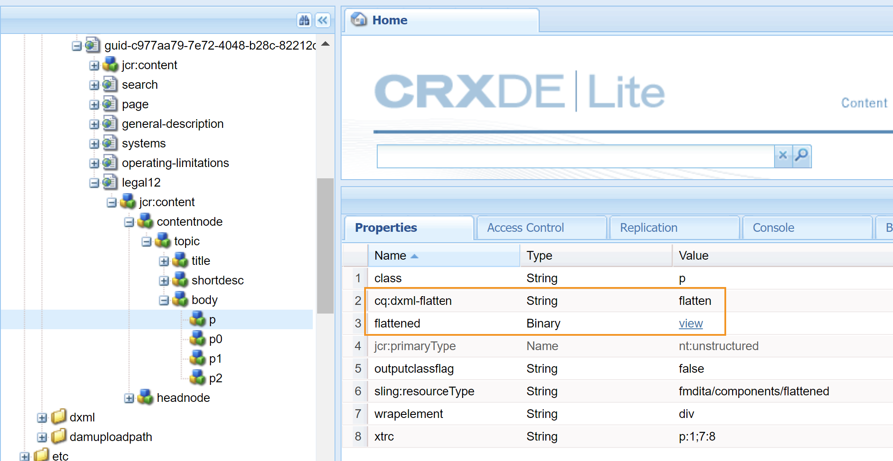

# Anpassa utdata för AEM Site {#id166TG0B30WR}

AEM Guides har stöd för att skapa utdatafiler i följande format:

- AEM Site
- PDF
- HTML5
- EPUB
- Anpassade utdata via DITA-OT

För utdata från AEM Site kan du tilldela olika designmallar med olika utdatauppgifter. Dessa designmallar kan återge DITA-innehållet i olika layouter. Du kan till exempel ange olika designmallar för interna och externa målgrupper.

Du kan också använda anpassade DITA Open Toolkit-plugin-program \(DITA-OT\) med AEM Guides. Du kan överföra dessa anpassade DITA-OT-plugin-program för att generera PDF-utdata på ett specifikt sätt.

>[!TIP]
>
> I avsnittet *AEM Site publishing* i [Best practices guide](https://helpx.adobe.com/content/dam/help/en/xml-documentation-solution/cs-mar-22/Adobe-Experience-Manager-Guides_Best-Practices_EN.pdf) finns information om hur du skapar utdata för AEM Site.


## Anpassa designmall för generering av utdata {#customize_xml-add-on}

AEM Guides använder en uppsättning fördefinierade designmallar för att generera utdata från AEM Site. Du kan anpassa AEM Guides designmallar för att generera utdata som passar företagets grafiska profil. En designmall är en samling med olika format \(CSS\), skript \(både server- och klientsidan\), resurser \(bilder, logotyper och andra resurser\) och JCR-noder som knyter samman alla dessa resurser. En designmall kan vara så enkel som ett enda skript på servern med bara ett par JCR-noder, eller en komplex kombination av format, resurser och JCR-noder. Designmallar används av AEM Guides undersystem för publicering när utdata från AEM Site genereras och de styr strukturen, utseendet och känslan hos de genererade utdata.

Det finns ingen begränsning för var designmallresurserna ska placeras på servern, men de är vanligtvis logiskt ordnade efter sin funktion. Standardmallen innehåller till exempel alla sina JavaScript- och CSS-filer som lagras i mappen `/etc/designs/fmdita/clientlibs/siteoutput/default`. Oavsett var filerna finns länkas de ihop av en samling JCR-noder. Tillsammans utgör dessa JCR-noder och filerna hela designmallen.

Med standarddesignmallen som levereras med AEM Guides kan du anpassa komponenterna för landning, ämne och söksida. Du kan skapa en kopia av standarddesignen och motsvarande referensmallar och ange olika komponenter för att generera önskat utvärde.

Följande flikar innehåller anvisningar om hur du anger en egen designmall som ska användas för att generera utdata för AEM Site baserat på din Experience Manager Guides-konfiguration: Cloud Service eller On-Premise.

>[!BEGINTABS]

>[!TAB Cloud Service]

1. Använd pakethanteraren för att hämta standarddesignmallen från följande plats:

   /libs/fmdita/config/templates

1. Skapa en kopia av de hämtade filerna på följande plats i Cloud Manager Git-databasen:

   /apps/fmdita/config/templates

1. Du måste också hämta och kopiera mallarna som refereras från standardmallnoden. De refererade mallarna placeras under:

   /libs/fmdita/templates/default/cqtemplates

>[!TAB Lokal]

1. Logga in på AEM och öppna CRXDE Lite-läget.

1. Navigera till standarddesignmallsnoden. Standarddesignmallsnodens plats är:

   `/libs/fmdita/config/templates/`

   {width="300" align="left"}

   >[!NOTE]
   >
   > Kopiera standarddesignmallarna från mappen `libs` till mappen `apps` och gör ändringarna i mappen `apps`. Du måste också göra ändringar i mallarna som refereras från standardmallnoden. De refererade mallarna placeras under noden `/libs/fmdita/templates/default/cqtemplates`. Gör en kopia av de refererade mallarna i mappen `apps` innan du gör några ändringar.

1. Klicka på komponenten *default* i noden *templates* för att komma åt dess egenskaper.

>[!ENDTABS]

AEM Guides designmallsegenskaper beskrivs i följande tabell.

| Egenskap | Beskrivning |
|--------|-----------|
| `landingPageTemplate`, `searchPageTemplate`, `topicPageTemplate`, `shadowPageTemplate` | Ange noden `cq:Template` för de motsvarande sidorna \(landning, sökning och ämne\). Som standard finns noden `cq:Template` för de här sidorna i noden `/libs/fmdita/templates/default/cqtemplates`. Den här noden definierar strukturen och egenskaperna för landnings-, söknings- och ämnessidorna.<br> `shadowPageTemplate` används för att optimera det segmenterade innehållet. Du måste ange värdet för den här egenskapen till: `fmdita/templates/default/cqtemplates/shadowpage` <br> **Obs!** Du måste ange ett värde för `topicPageTemplate`. `landingPageTemplate` och `searchPageTemplate` är valfria egenskaper. Om du inte vill att sök- och landningssidorna ska genereras ska du inte ange dessa egenskaper. |
| `title` | Ett beskrivande namn på designmallen. |
| `topicContentNode` | Platsen för noden som ska innehålla DITA-innehållet på en ämnessida. Sökvägen är relativ till ämnessidan. |
| `topicHeadNode` | Platsen för noden som ska innehålla huvudvärdena \(eller metadata\) som härleds från DITA-innehållet. Sökvägen är relativ till ämnessidan. |
| `tocNode` | Platsen för noden som ska innehålla innehållsförteckningen. Sökvägen är relativ till landningssidan eller målsökvägen. |
| `basePathProp` | Egenskapsnamnet för lagring av sökvägen till den publicerade platsens rot. |
| `indexPathProp` | Egenskapsnamnet för lagring av sökvägen till den publicerade platsens landnings-/indexsida. |
| `pdfPathProp` | Egenskapsnamnet för lagring av PDF-ämnets sökväg, om PDF-generering är aktiverat. |
| `pdfTypeProp` | Egenskapsnamnet för lagring av typen av PDF-generering. För närvarande innehåller den här egenskapen alltid&quot;Ämne&quot;. |
| `searchPathProp` | Egenskapsnamnet för lagring av söksidans sökväg, om mallen innehåller en söksida. |
| `siteTitleProp` | Egenskapsnamnet för lagring av titeln på den webbplats som publiceras. Den här titeln är vanligtvis densamma som titeln på kartan som publiceras. |
| `sourcePathProp` | Egenskapsnamnet för lagring av sökvägen till källans DITA-ämne för den aktuella sidan. |
| `tocPathProp` | Egenskapsnamnet för lagring av sökvägen till TOC-roten för den publicerade webbplatsen. |


>[!NOTE]
>
> När du har skapat en anpassad designmallsnod måste du uppdatera designalternativet i förinställningarna för AEM Site-utdata för att kunna använda den anpassade designmallsnoden.

Mer information finns i [Skapa din första Adobe Experience Manager-webbplats](https://experienceleague.adobe.com/docs/experience-manager-learn/getting-started-wknd-tutorial-develop/overview.html?lang=en) och [Grunderna](https://experienceleague.adobe.com/docs/experience-manager-cloud-service/implementing/developing/full-stack/develop-wknd-tutorial.html?lang=en) för att utveckla din egen webbplats på AEM.

## Använd dokumenttitel för att generera utdata från AEM webbplats

När du genererar utdata för AEM Site spelar det sätt på vilket URL:er genereras en viktig roll för att ditt innehåll ska kunna upptäckas. Om du använder UUID-baserade filnamn är det inte sökvänligt att generera URL:er baserade på UUID för dina filer. Som administratör eller utgivare kan du styra hur du vill generera URL:er för utdata från AEM Site. AEM Guides ger dig en konfiguration genom vilken du kan välja att generera URL:er för AEM Site-utdata med hjälp av filens titel i stället för UID-baserade filnamn. Som standard är det här alternativet aktiverat för UUID-baserade filsystem. Detta innebar att när du genererade utdata från AEM Site för UUID-baserade filsystem används filens namn för att generera URL:er och inte UUID:n för filerna.

Vid lokal installation med icke-UID-baserade filsystem genereras utdata från AEM Site med filnamnen och inte filens namn. Som standard är det här alternativet inaktiverat. Detta innebar att när du genererade utdata för AEM Site används filnamnen för att generera URL:er och inte filens titel. Du kan välja att generera URL:er baserat på filens titlar genom att aktivera det här alternativet.

På följande flikar finns anvisningar om hur du konfigurerar URL-genereringen i utdata för AEM Site baserat på din Experience Manager Guides-konfiguration: Cloud Service eller On-Premise.

>[!NOTE]
>
> Du kan konfigurera regler så att endast en teckenuppsättning tillåts i URL:er för utdata från AEM Site. Mer information finns i [Konfigurera regler för filtrering av filnamn för att skapa ämnen och publicera utdata för AEM Site](#id2164D0KD0XA).

>[!BEGINTABS]

>[!TAB Cloud Service]

Använd instruktionerna i [Konfigurationsåsidosättningar](download-install-config-override.md#) för att skapa konfigurationsfilen. Ange följande \(egenskap\)-information i konfigurationsfilen för att konfigurera URL-generering i utdata för AEM Site:

| PID | Egenskapsnyckel | Egenskapsvärde |
|---|------------|--------------|
| `com.adobe.fmdita.config.ConfigManager` | `aemsite.pagetitle` | Boolean \(true/false\). Om du vill generera utdata med sidrubriken ställer du in egenskapen på true. Som standard används filnamnet.<br> **Standardvärde**: false |


>[!TAB Lokal]

1. Öppna konfigurationssidan för Adobe Experience Manager Web Console.

   Standardwebbadressen för åtkomst till konfigurationssidan är:

   ```http
   http://<server name>:<port>/system/console/configMgr
   ```

1. Sök efter och klicka på paketet **com.adobe.fmdita.config.ConfigManager**.

1. Välj alternativet **Använd titel för AEM webbplatssidnamn**.

   >[!NOTE]
   >
   > Om du vill generera utdata med hjälp av filnamnen avmarkerar du det här alternativet.

1. Klicka på **Spara**.

>[!ENDTABS]

## Konfigurera URL:en för utdata från AEM-webbplatsen så att dokumenttiteln används (endast för Cloud Service)

Du kan använda dokumenttitlarna i URL:en för utdata från AEM Site. Om filnamnet inte finns eller innehåller alla specialtecken kan du konfigurera systemet så att specialtecknen ersätts med en avgränsare i URL:en för utdata från AEM Site. Du kan också konfigurera den så att den ersätter dem med namnet på det första underordnade ämnet.


Så här konfigurerar du sidnamnen:

1. Använd instruktionerna i [Konfigurationsåsidosättningar](download-install-config-override.md#) för att skapa konfigurationsfilen.
1. Ange följande (egenskap) information i konfigurationsfilen för att konfigurera sidnamnen för avsnitten.

| PID | Egenskapsnyckel | Egenskapsvärde |
|---|------------|--------------|
| `com.adobe.fmdita.common.SanitizeNodeName` | `nodename.systemDefinedPageName` | Boolean (`true/false`). **Standardvärde**: `false` |

Om exempelvis *@navtitle* i `<topichead>` har alla specialtecken och du anger egenskapen `aemsite.pagetitle` till true, används som standard en avgränsare. Om du ställer in egenskapen `nodename.systemDefinedPageName` på true visas det första underordnade ämnets namn.


## Konfigurera filnamnssaneringsregler för att skapa ämnen och publicera utdata i AEM Sites och andra format {#id2164D0KD0XA}

Som administratör kan du definiera en lista med giltiga specialtecken som tillåts i filnamn, som till slut utgör URL:en för utdata från en AEM-plats. I tidigare versioner tilläts användare att definiera filnamn som innehåller specialtecken som `@`, `$`, `>` med flera. Specialtecknen resulterade i kodad URL för generering av AEM Site-sidor.

Från och med version 3.8 har konfigurationer lagts till för att definiera en lista med specialtecken som tillåts i filnamnen. Som standard innehåller den giltiga filnamnskonfigurationen `a-z A-Z 0-9 - _`. Detta innebär att när du skapar en fil kan du ha ett specialtecken i filens titel, men internt kommer det att ersättas med ett bindestreck \(`-`\) i filnamnet. Du kan t.ex. ha filens namn som Introduktion 1 eller Introduction@1, så kommer motsvarande filnamn som skapas för båda dessa fall att vara Introduktion-1.

När du definierar en lista med giltiga tecken måste du komma ihåg att de här tecknen `*/:[\]|#%{}?&<>"/+` och `a space` alltid ersätts med ett bindestreck \(`-`\).

>[!NOTE]
>
> Om du inte konfigurerar den giltiga specialteckenlistan kan det hända att du får oväntade resultat när du skapar filen.

Följande flikar innehåller anvisningar om hur du konfigurerar giltiga specialtecken i filnamn och utdata för AEM Site baserat på din Experience Manager Guides-konfiguration: Cloud Service eller On-Premise.

>[!BEGINTABS]

>[!TAB Cloud Service]

Använd instruktionerna i [Konfigurationsåsidosättningar](download-install-config-override.md#) för att skapa konfigurationsfilen. Ange följande \(egenskap\)-information i konfigurationsfilen för att konfigurera giltiga specialtecken i filnamn och utdata för AEM-plats:

| PID | Egenskapsnyckel | Egenskapsvärde |
|---|------------|--------------|
| `com.adobe.fmdita.common.SanitizeNodeNameImpl` | `aemsite.DisallowedFileNameChars` | Kontrollera att egenskapen är inställd på ``'<>`@$``. Du kan lägga till fler specialtecken i listan. |

>[!NOTE]
> 
> Ovanstående konfiguration gäller för alla utdataformat. Det innebär att när du genererar ett PDF-, HTML- eller anpassat utdata kommer det slutliga resultatet att följa de konfigurerade reglerna för sanitifiering av filnamn.

Du kan också konfigurera andra egenskaper, till exempel använda gemener i filnamn, avgränsare för att hantera ogiltiga tecken och maximalt antal tecken som tillåts i filnamnen. Om du vill konfigurera de här egenskaperna lägger du till följande nyckelvärdepar i konfigurationsfilen:

| Egenskapsnyckel | Egenskapsvärde |
|------------|--------------|
| `nodename.uselower` | Boolean \(true/false\).<br> **Standardvärde**: true |
| `nodename.separator` | Alla tecken. <br> **Standardvärde**: \_ *\(understreck\)* |
| `nodename.maxlength` | Heltalsvärde.<br> **Standardvärde**: 50 |

>[!TAB Lokal]

1. Öppna konfigurationssidan för Adobe Experience Manager Web Console.

   Standardwebbadressen för åtkomst till konfigurationssidan är:

   ```http
   http://<server name>:<port>/system/console/configMgr
   ```

1. Sök efter och klicka på paketet *com.adobe.fmdita.common.SanitizeNodeNameImpl*.

1. I egenskapen **Otillåten teckenuppsättning för publicering till AEM Sites** kontrollerar du att egenskapen är inställd på ```'<>`@$```. Du kan lägga till fler specialtecken i den här listan, men det måste innehålla dessa specialtecken.

   >[!NOTE]
   >
   > Du kan också konfigurera andra egenskaper, till exempel **Använd gemener** i filnamn, **Avgränsare** för att hantera ogiltiga tecken och **Maximalt antal tecken** som tillåts i filnamn.

1. Klicka på **Spara**.

1. Sök efter och klicka på paketet **com.adobe.fmdita.config.ConfigManager**.

1. Kontrollera att egenskapen är inställd på **i egenskapen** Regex för giltiga tecken`[-a-zA-Z0-9_]` . Du kan lägga till fler tecken i den här listan, men den måste innehålla dessa grundläggande tecken och listan måste börja med ett bindestreck \(`-`\).

   >[!NOTE]
   >
   > This property define the list of valid character used to create a new file.

1. Klicka på **Spara**.

>[!ENDTABS]

## Konfigurera förenkling av nodstrukturen för AEM Site

När du genererar utdata för AEM Site skapas en nod för varje element i avsnitten internt. För en DITA-karta med tusentals ämnen kan den här nodstrukturen bli för djup. Den här typen av djupt kapslad nodstruktur kan ha prestandaproblem för större platser. Följande bild visar djupt kapslad nodstruktur för utdata från AEM Site:


Observera att det i ögonblicksbilden ovan finns en nod som skapas för varje `p`-element och dess efterföljande underelement, och en liknande struktur skapas för alla andra element som används i avsnittet.

Med AEM Guides kan du konfigurera hur nodstrukturen för AEM Site-utdata ska skapas internt. Du kan förenkla nodstrukturen vid angivna element, vilket innebär att du kan definiera ett element som ska betraktas som huvudelement och alla underelement i det sammanfogas med huvudelementet. Om du till exempel bestämmer dig för att förenkla elementet `p` sammanfogas alla element som finns i elementet `p` med huvudelementet `p`. Ingen separat anteckning skulle skapas för något underelement i elementet `p`. I följande ögonblicksbild visas nodstrukturen förenklad vid elementet `p`:


Följande flikar innehåller anvisningar om hur du förenklar nodstrukturen för AEM Site baserat på din Experience Manager Guides-konfiguration: Cloud Service eller On-Premise.

>[!BEGINTABS]

>[!TAB Cloud Service]

1. Identifiera det eller de element som du vill förenkla nodstrukturen vid:

1. Täcka över noden `libs` i noden `apps` och öppna filen elementmapping.xml.

1. Lägg till egenskapen `<flatten>true</flatten>` i definitionen av elementet där du vill lägga samman nodstrukturen. Om du till exempel vill förenkla nodstrukturen vid elementet `p` lägger du till attributet flatten i definitionen av elementet `p` enligt nedan:

   ```XML
   <ditaelement>
         <name>p</name>
         <class>- topic/p</class>
         <componentpath>fmdita/components/dita/wrapper</componentpath>
         <type>COMPOSITE</type>
         <target>para</target>
         <flatten>true</flatten>
         <wrapelement>div</wrapelement>
      </ditaelement>
   ```

   >[!NOTE]
   >
   > Som standard har egenskapen flatten node konfigurerats vid elementet `p`.

1. Använd instruktionerna i [Konfigurationsåsidosättningar](download-install-config-override.md#) för att skapa konfigurationsfilen.
1. Ange följande \(egenskap\)-information i konfigurationsfilen:

   | PID | Egenskapsnyckel | Egenskapsvärde |
   |---|------------|--------------|
   | `com.adobe.dxml.flattening.FlatteningConfigurationService` | `flattening.enabled` | Boolean \(true/false\).<br> **Standardvärde**: `false` |


När du genererar AEM Site-utdata förenklas nu noderna i elementet `p` och lagras i själva elementet `p`. Du hittar de nya förenklingsegenskaperna för elementet `p` i CRXDE.



>[!TAB Lokal]

1. Ange det element som du vill lägga samman nodstrukturen i.

   1. Täcka över noden `libs` i noden `apps` och öppna filen elementmapping.xml.

   1. Lägg till egenskapen `<flatten>true</flatten>` i definitionen av elementet där du vill lägga samman nodstrukturen. Om du till exempel vill förenkla nodstrukturen vid elementet `p` lägger du till attributet flatten i definitionen av elementet `p` enligt nedan:

      ```XML
      <ditaelement>
          <name>p</name>
          <class>- topic/p</class>
          <componentpath>fmdita/components/dita/wrapper</componentpath>
          <type>COMPOSITE</type>
          <target>para</target>
          <flatten>true</flatten>
          <wrapelement>div</wrapelement>
      </ditaelement>
      ```

      >[!NOTE]
      >
      > Som standard har egenskapen flatten node konfigurerats vid elementet `p`.

1. Aktivera platsnodens förenklingskonfiguration i configMgr.

   1. Öppna konfigurationssidan för Adobe Experience Manager Web Console.

      Standardwebbadressen för åtkomst till konfigurationssidan är:

      ```http
      http://<server name>:<port>/system/console/configMgr
      ```

   1. Sök efter och klicka på paketet *com.adobe.dxml.flattening.FlatteningConfigurationService*.

   1. Välj alternativet **Egenskap flattening.enabled**.

   1. Klicka på **Spara**.


>[!IMPORTANT]
>
> Om du har gjort några ändringar i elementmapping.xml-filen måste du öppna configMgr och spara eventuella paket så att ändringarna börjar gälla.

När du genererar AEM Site-utdata förenklas nu noderna i elementet `p` och lagras i själva elementet `p`. Du hittar de nya förenklingsegenskaperna för elementet `p` i CRXDE.

{width="650" align="left"}

>[!ENDTABS]

**Sök efter en sträng i innehållet i AEM Site-utdata (endast för Cloud Service)**

Som standard kan du bara söka efter en sträng i titlarna i utdata för AEM Site. Du kan konfigurera systemet så att det söker efter en sträng både i titlarna och i innehållet eller i texten i utdata för AEM Site.

>[!NOTE]
>
> Ibland kan din sökning fungera för vissa element i innehållet, men du kan konfigurera det så att det fungerar för hela innehållet.


Om du vill aktivera sökningen bör du konfigurera förenklingen av nodstrukturen för AEM Site.

VARNING:

Du kan söka efter upp till 1 MB förenklat innehåll. I den föregående skärmbilden kan du till exempel söka efter om innehållet under taggen &lt;p\> är &lt;= 1 MB.

>[!NOTE]
>
> Sökningen fungerar bara på elementen om attributet `<flatten>` har värdet true. Som standard har AEM Guides attributet `<flatten>` angivet till true för de vanligaste textelementen som &lt;p\> &lt;ul\> &lt;lI\>. Om du har skapat några anpassade element bör du emellertid ange attributet `<flatten>` till true i filen elementmapping.xml.

**Förhindra förenkling av nodstrukturen för AEM Site**

På samma sätt som du anger vilken nod som ska förenklas i utdata för AEM Site, kan du även ange ett element som du vill utesluta från den här konfigurationen. Om du till exempel vill lägga samman noder vid elementet `body`, men inte vill att något `table` -element i `body` ska läggas samman, kan du lägga till egenskapen exclude i elementets definition för `table` .

Om du vill utesluta elementet `table` från förenkling lägger du till följande egenskap i elementets definition för `table`:

`<preventancestorflattening>true|false</preventancestorflattening>`

## Konfigurera versionshantering för borttagna sidor i AEM Site-utdata

När du genererar utdata för AEM-webbplatsen med alternativet **Ta bort och** Skapa ****valt för inställningen Befintliga utdatasidor skapas en version för sidan/sidorna som tas bort. Du kan konfigurera systemet så att det inte längre skapas en version innan du tar bort den.

På följande flikar finns anvisningar om hur du stoppar skapandet av en version för de sidor som ska tas bort baserat på din Experience Manager Guides-konfiguration: Cloud Service eller On-Premise.

>[!BEGINTABS]

>[!TAB Cloud Service]

1. Använd instruktionerna i [Konfigurationsåsidosättningar](download-install-config-override.md#) för att skapa konfigurationsfilen.
1. Ange följande \(egenskap\)-information i konfigurationsfilen för att konfigurera alternativet **Skapa inte version för borttagna sidor**:

   | PID | Egenskapsnyckel | Egenskapsvärde |
   |---|------------|--------------|
   | `com.adobe.fmdita.confi g.ConfigManager` | `no.version.creation.on.deletion` | Boolean \(true/false\).<br> **Standardvärde**: `true` |

   >[!NOTE]
   >
   > När det här alternativet är markerat kan användare ta bort alla sidor direkt utan att skapa någon version för dem. Om alternativet inte är markerat skapas en version innan sidan tas bort.

>[!TAB Lokal]

1. Öppna konfigurationssidan för Adobe Experience Manager Web Console.

   Standardwebbadressen för åtkomst till konfigurationssidan är:

   ```http
   http://<server name>:<port>/system/console/configMgr
   ```

1. Sök efter och klicka på paketet *com.adobe.fmdita.config.ConfigManager*.

1. Välj alternativet **Skapa inte version för borttagna sidor**.

   >[!NOTE]
   >
   > När det här alternativet är markerat kan användare ta bort alla sidor direkt utan att skapa någon version för dem. Om alternativet inte är markerat skapas en version innan sidan tas bort.

1. Klicka på **Spara**.

>[!ENDTABS]

## Konfigurera anpassad omskrivare med Experience Manager Guides (endast för Cloud Service) {#custom-rewriter}

Experience Manager Guides har en anpassad [**rewriter**](https://sling.apache.org/documentation/bundles/output-rewriting-pipelines-org-apache-sling-rewriter.html)-modul för hantering av länkar som genereras vid korsmappningar (länkar mellan ämnen på två olika kartor). Denna omskrivarkonfiguration installeras på följande sökväg: <br> `/apps/fmdita/config/rewriter/fmdita-crossmap-link-patcher`.

Om du har en annan anpassad återskrivningsskrivare i kodbasen använder du ett `'order'`-värde som är större än 50, eftersom Experience Manager Guides återskrivningsprogram använder `'order'` 50.  Om du vill åsidosätta detta måste du ange ett värde >50. Mer information finns i [Skriva om utdata](https://sling.apache.org/documentation/bundles/output-rewriting-pipelines-org-apache-sling-rewriter.html).


