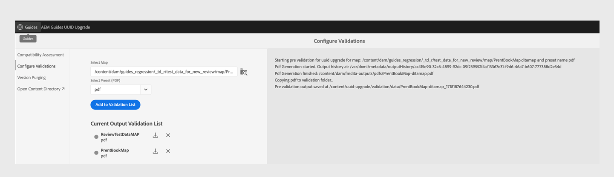
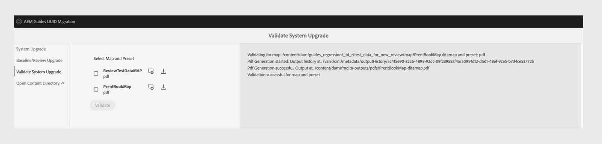

# 4.3.1 migrering av icke-UID till 4.3.2 UUID-innehåll

Följ de här stegen för att migrera ditt innehåll från version 4.3.1 som inte är UUID till version 4.3.2.

>[!IMPORTANT]
>
> * Innan du startar migreringsprocessen bör du kontrollera att du har:
>
>   1. Alla aktiva granskningar stängdes.
>   1. Alla översättningsuppgifter stängdes.
> * Innan du migrerar innehåll till UUID-servern kontrollerar du att du har en icke-UID-server med en kompatibel AEM Guides-version installerad på den.
> * Om du använder en version före 4.3.1 ska du uppgradera till version 4.3.1. Följ de [uppgraderingsinstruktioner](./upgrade-aemg-latest-version.md) som är specifika för den licensierade versionen av din produkt.
> * För närvarande stöds inte versioner efter 4.3.1 för migrering.

## Paketinstallation

Ladda ned de paket du behöver från Adobe Software Distribution Portal, baserat på din version:

1. **Före migrering**: [com.adobe.guides.pre-uid-migration-1.2.27.zip](https://experience.adobe.com/#/downloads/content/software-distribution/en/aem.html?package=%2Fcontent%2Fsoftware-distribution%2Fen%2Fdetails.html%2Fcontent%2Fdam%2Faem%2Fpublic%2Faemdox%2Fother-packages%2Fuuid-migration%2F3-0%2Fcom.adobe.guides.pre-uuid-migration-1.2.27.zip)
1. **Hämta UUID version 4.3.2**: [com.adobe.fmdita-6.5-uuid-4.3.2.1977.zip](https://experience.adobe.com/#/downloads/content/software-distribution/en/aem.html?package=%2Fcontent%2Fsoftware-distribution%2Fen%2Fdetails.html%2Fcontent%2Fdam%2Faem%2Fpublic%2Faemdox%2Fother-packages%2Fuuid-migration%2F3-0%2Fcom.adobe.fmdita-6.5-uuid-4.3.2.1977.zip)
1. **Migrering**: [com.adobe.guides.uid-upgrade-1.2.110.zip](https://experience.adobe.com/#/downloads/content/software-distribution/en/aem.html?package=%2Fcontent%2Fsoftware-distribution%2Fen%2Fdetails.html%2Fcontent%2Fdam%2Faem%2Fpublic%2Faemdox%2Fother-packages%2Fuuid-migration%2F3-0%2Fcom.adobe.guides.uuid-upgrade-1.2.110.zip)

## Kontroller före migrering

Gör följande kontroller av icke-UID version 4.3.1:

1. Installera paketet [com.adobe.guides.pre-uid-migration-1.2.27.zip](https://experience.adobe.com/#/downloads/content/software-distribution/en/aem.html?package=%2Fcontent%2Fsoftware-distribution%2Fen%2Fdetails.html%2Fcontent%2Fdam%2Faem%2Fpublic%2Faemdox%2Fother-packages%2Fuuid-migration%2F3-0%2Fcom.adobe.guides.pre-uuid-migration-1.2.27.zip) över version 4.3.1.

   >[!NOTE]
   >
   >* Du måste ha administratörsbehörighet för att kunna utföra migreringen.
   >* Du bör åtgärda filerna med fel innan du fortsätter med migreringen.

1. Om det finns fler än 100 000 DITA-filer i systemet uppdaterar du frågebegränsningskonfigurationerna så att skriptet fungerar:

   * Navigera till `/system/console/configMgr and increase both the configs to more than number of assets - queryLimitInMemory` och `queryLimitReads under org.apache.jackrabbit.oak.query.QueryEngineSettingsService`

1. Starta `http://<server-name>/libs/fmdita/clientlibs/xmleditor_uuid_upgrade/page.html`.
1. Välj **Kompatibilitetsutvärdering** i den vänstra panelen och bläddra i mappsökvägen `/content/dam` för alla resurser.
1. Kontrollera kompatibiliteten för att lista följande information:
   * Totalt antal filer
   * Beräknad tid för migrering
   * Antal filer med fel
   * Filer med GUID-filnamn

   

1. Om felet uppstår analyserar du loggarna och åtgärdar felen. Du kan köra kompatibilitetsmatrisen igen när du har åtgärdat felen.

1. Välj **Konfigurera valideringar** på den vänstra panelen. **Välj sedan karta** och **Välj förinställning** för kartan för att konfigurera dem. Den aktuella utdatavalideringslistan visar de utdatafiler som finns före migreringen och kan valideras mot de utdatafiler som genereras efter migreringen senare.

   Genom att markera flera och stora DITA-kartor kan du validera att allt innehåll har migrerats utan problem. Genom att markera förinställningar med baslinjer i dem kan du även vara säker på att baslinjer och versioner migreras korrekt.

   

1. (Valfritt) Rensa innehållet i version för att ta bort onödiga versioner och snabba upp migreringsprocessen. Om du vill rensa versionen väljer du alternativet **Rensa version** på migreringsskärmen och går till användargränssnittet med URL:en `http://<server- name>/libs/fmdita/clientlibs/xmleditor_uuid_upgrade/page.html`.
   >[!NOTE]
   >
   >Verktyget tar inte bort versioner som används i baslinjer eller granskningar och har inga etiketter.

Mer information finns i [Rensa äldre versioner](../install-conf-guide/version-management.md#purge-older-versions-of-dita-files).

## Krav för migrering

1. Kör endast UUID-migrering på en Author-instans.
1. Säkerställ följande infrastrukturberedskap:
   * Designinstansen har uppgraderats i CPU och minne för att ge snabbare bearbetning och ytterligare minne som behövs för satsaktivitet. Om t.ex. den aktuella allokerade CPU och minnet är 8 vCPU och 24 GB heap använder du dubbla storleken för den här aktiviteten.
   * Det totala diskutrymmet och det tillfälliga diskutrymmet `(crx-quickstart directory)` bör ha en buffert på 10 gånger det som redan har förbrukats. När du är klar med migreringen kan du återvinna större delen av diskutrymmet genom att köra en komprimering.
   * Kör **Offlinemålkomprimering** innan du startar den här aktiviteten.
   * Se till att ingen indexering eller inget systemunderhåll planeras under migreringens fönster.

1. Installera UUID-versionen av den version som stöds över den version som inte är UUID. Om du t.ex. använder 4.3.1 icke-UUID-bygge måste du installera UUID version 4.3.2 [com.adobe.fmdita-6.5-uuid-4.3.2.1977.zip](https://experience.adobe.com/#/downloads/content/software-distribution/en/aem.html?package=%2Fcontent%2Fsoftware-distribution%2Fen%2Fdetails.html%2Fcontent%2Fdam%2Faem%2Fpublic%2Faemdox%2Fother-packages%2Fuuid-migration%2F3-0%2Fcom.adobe.fmdita-6.5-uuid-4.3.2.1977.zip)) och köra migreringen.

1. Installera uppgraderingspaketet för UID-migrering [com.adobe.guides.uid-upgrade-1.2.110.zip](https://experience.adobe.com/#/downloads/content/software-distribution/en/aem.html?package=%2Fcontent%2Fsoftware-distribution%2Fen%2Fdetails.html%2Fcontent%2Fdam%2Faem%2Fpublic%2Faemdox%2Fother-packages%2Fuuid-migration%2F3-0%2Fcom.adobe.guides.uuid-upgrade-1.2.110.zip).
1. Inaktivera startprogram för följande arbetsflöden med URL:en: `http://<server-name>/libs/cq/workflow/content/console.html`.

   * Arbetsflöde för DAM-uppdatering
   * Arbetsflöde för DAM-metadataåterställning

   >[!NOTE]
   >
   >Alla arbetsflödesstarter som körs på alla sökvägar i `content/dam` bör helst inaktiveras.

1. Uppdatera följande konfigurationer enligt de föreslagna ändringarna:

   | Konfiguration | Egenskap | Värde |
   |---|---|---|
   | `com.adobe.fmdita.config.ConfigManager` | Aktivera startprogram för arbetsflöde efter bearbetning | Inaktivera |
   | `com.adobe.fmdita.config.ConfigManager` | uuid. regex | `^GUID-(?<id>.*)` |
   | `com.adobe.fmdita.postprocess.version.PostProcessVersionObservation` | Aktivera efterbearbetning av version | Inaktivera |
   | Dag CQ-taggningstjänst | Aktivera validering (validation.enabled) | Inaktivera |

1. Lägg till en separat loggare för:
   * `com.adobe.fmdita.uuid`
   * `com.adobe.guides.uuid`.

1. (Om det inte har gjorts tidigare) Om det finns fler än 100 000 DITA-filer i systemet uppdaterar du `queryLimitReads` under `org.apache.jackrabbit.oak.query.QueryEngineSettingsService` till ett större värde (vilket värde som helst som är större än antalet resurser, till exempel 200 000).

   | PID | Egenskapsnyckel | Egenskapsvärde |
   |---|---|---|
   | org.apache.jackrabbit.oak.query.QueryEngineSettingsService | queryLimitReads | Värde: 200000   standardvärde: 100000 |

## Migrering

1. Starta `http://<server-name>/libs/fmdita/clientlibs/xmleditor_uuid_upgrade/page.html`.

   
   >[!NOTE]
   >
   > Om du väljer Aktivera säkerhetskopiering av DITA-resurser lagras de temporära säkerhetskopiorna under `/content/uuid-upgrade` och DITA-säkerhetskopiorna tas bort när migreringen av en fil är klar.

1. Välj **Systemuppgradering** i den vänstra panelen för att köra migreringen. Vi rekommenderar att du migrerar alla data samtidigt eftersom systemet optimalt hanterar gruppering internt. Endast filer som inte är DITA-resurser och som inte används i några DITA-resurser kan hoppas över för migrering.

1. (Valfritt) Markera de mappar som du vill hoppa över migreringen för. Använd det här alternativet om du vill migrera de här mapparna senare eller hoppa över att migrera dem. Se till att dessa mappar inte har några DITA-resurser och att de inte refereras av (och i framtiden kommer inte att refereras till) några DITA-resurser. Exempel: `content/dam/projects`.

1. Välj *Aktivera säkerhetskopiering av datatillgångar* om du vill skapa en säkerhetskopia av resursen före migrering. Den här säkerhetskopian används för att återställa om det uppstår ett fel när en fil migreras. Säkerhetskopian tas bort om migreringen lyckas. Detta saktar dock ned migreringsprocessen.

1. Starta migreringen.
   >[!NOTE]
   >
   > Ladda ned de fullständiga loggarna och observera om det finns några fel. Om något fel eller undantag hittas *Fortsätt inte*, men åtgärda felet först. Vanliga fel visas i slutet av artikeln.

1. När migreringen är klar är rapporten tillgänglig för hämtning och hela loggar kan också hämtas.

1. Välj **Hämta rapport** när migreringen körs för att kontrollera om alla filer i mappen har uppgraderats korrekt och om alla funktioner bara fungerar för den mappen.

   >[!NOTE]
   >
   > Innehållsmigreringen kan köras på en mappnivå, hela `/content/dam` eller samma mapp (kör migreringen igen).

   Det är också viktigt att se till att innehållsmigreringen görs för alla medieresurser, till exempel bilder och grafik som du har använt i DITA-innehållet.

1. När alla filer har migrerats väljer du **Originalplan/Granska uppgradering** i den vänstra panelen för att migrera baslinjerna och granska på mappnivå.

>[!NOTE]
>
>Om du startar om systemet eller om migreringen avbryts, kommer skriptet att återupptas när du kör det igen med samma parametrar som tidigare. Kontakta kundens framgångsgrupp om du får problem på grund av avstängningen.

## Analysera rapporter från varje steg

**Steg: Systemuppgradering**

| Sammanfattning efter slutförande av process | Hur ska jag tolka? | Åtgärd |
|---|---|---|
| Totalt antal filer: 345997 | Totalt antal filer som bearbetats under den angivna mappuppsättningen. | NA |
| Antal filer som uppgraderats: 344516 | Antal filer som migrerats till UUID. | NA |
| Antal filer som uppgraderats med fel: 29 | Fel uppstod i dessa filer och bör vara samma som de som rapporteras i steget före migreringen. | NA |
| Antal överhoppade filer: 1452 | Vissa filer i DAM-databasen kan ha underresurser, och dessa underresurser hoppas över eftersom de inte är kvalificerade för UUID-migrering. | NA |
| Antal filer som inte kunde uppgraderas: 0 | Om antalet inte är 0 måste loggarna analyseras för eventuella problem. | Kontrollera undantaget. Du kan behöva åtgärda felet och köra migreringen igen. |
| Total tid tagen: 2:40:06.157 |  |  |

**Steg: Uppgradera baslinjer**

| Sammanfattning efter slutförande av process | Hur ska jag tolka? | Åtgärd |
|---|---|---|
| Totalt antal filer: 4833 | Antal DITA-kartor med minst 1 baslinje. |  |
| Antal filer som uppgraderats: 4705 | Antal DITA-kartor som uppgraderats med alla baslinjer. |  |
| Antal filer som uppgraderats med fel: 0 | Antal DITA-kartor vars baslinjer inte uppgraderades. |  |
| Antal överhoppade filer: 1647 | Antal DITA-kartor utan baslinje. |  |
| Antal filer som inte kunde uppgraderas: 128 | Antalet baslinjeobjekt som inte var giltiga (de var tomma) visas i rapporten (Excel). | Kontrollera om det finns andra fel än: `baselineObj not found on` |

## Efter migrering

1. När migreringen är klar väljer du **Verifiera systemuppgradering** på den vänstra panelen och validerar utdatafilerna före och efter migreringen för att säkerställa att migreringen lyckas.

   

1. När servern har migrerats kan du aktivera följande arbetsflöden och konfigurationer (inklusive alla andra arbetsflöden som inaktiverades från början under migreringen) för att fortsätta arbeta på servern:

   * Arbetsflöde för DAM-uppdatering
   * Arbetsflöde för DAM-metadata

   >[!NOTE]
   >
   >Helst ska alla arbetsflödesstarter som kördes på alla sökvägar i `content/dam` före migreringen aktiveras.

1. Aktivera följande konfigurationer:

   | Konfiguration | Egenskap | Värde |
   |---|---|---|
   | `com.adobe.fmdita.config.ConfigManager` | *Aktivera startprogram för arbetsflöde efter bearbetning* | Aktivera |
   | `com.adobe.fmdita.postprocess.version.PostProcessVersionObservation` | *Aktivera efterbearbetning av version* | Aktivera |
   | Dag CQ-taggningstjänst | *Aktivera validering (validation.enabled)* | Aktivera |

1. Assets-egenskaper för granskning efter migrering:

   | Konfiguration | Egenskap | Värde före migrering på icke-UID | Eftermigreringsvärde på UID |
   |---|---|---|---|
   | `com.adobe.fmdita.config.ConfigManager` | **Använd titel för sidnamn på AEM-webbplatser** | Falskt (standardvärde) | True |

   >[!NOTE]
   >
   > Om egenskapen **Använd titel för sidnamn på AEM-webbplatser** i `com.adobe.fmdita.config.ConfigManager` anges till *Falskt* före migreringen, måste den här egenskapen uppdateras efter migreringen.

1. När valideringen är klar kan större delen av diskutrymmet återvinnas genom att en komprimering körs (se `https://experienceleague.adobe.com/docs/experience-manager-65/deploying/deploying/revision-cleanup.html?lang=en`).

