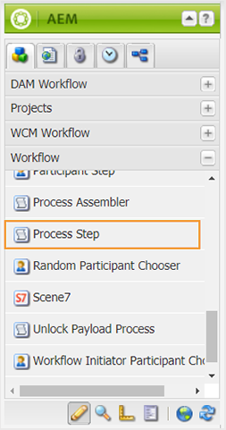

# Konfigurera dokumentlägen {#id181GB0400UI}

Med AEM Guides kan du definiera dokumenttillstånd för dina DITA-ämnen enligt organisationens krav. Du kan definiera olika lägen för dokumentet från början till slut. Det första läget kan till exempel vara Utkast och det kan gå till Granskning, Godkänd, Översatt och slutligen Publicerad.

Det finns två sätt att övergå från ett läge till ett annat - manuellt och automatiskt. Dokumentlägena som definieras i en profil kan användas för att manuellt ändra dokumentläget. Detta kan du göra på egenskapssidan för en ämnesfil. Du kan också definiera vem som kan flytta dokumentet från ett läge till ett annat. En författare kan t.ex. skapa ett dokument och standardläget för dokumentet kan vara Utkast. När författaren skickar dokumentet för granskning kan hon ändra dokumentläget till Granskning. Granskaren kan ändra dokumentstatus till Godkänd eller Utkast igen baserat på granskningsprocessen. Om dokumentet är godkänt kan utgivaren ändra dokumentläget till Översatt eller Publicerat beroende på arbetsflödet.

>[!NOTE]
>
> Om en användare tillhör gruppen *administratörer* kan användaren ändra ett dokuments tillstånd från vilket läge som helst, oavsett vilka dokumenttillståndsövergångar som har definierats i systemet.

## Skapa ett dokumentläge

AEM Guides levereras med en uppsättning standarddokumenttillstånd. Dessa lägen är:

- Utkast
- Redigera
- Granskning
- Godkänd
- Granskad
- Klar

Dessa standardlägen är tillgängliga för alla DITA-ämnen som skapas under DAM. Du kan skapa egna dokumentlägen och tilldela dem till en viss mapp. Alla DITA-filer som skapas under den mappen har sedan åtkomst till de nya dokumenttillstånden.

Så här skapar du dokumentlägen med hjälp av Mappprofil:

1. Klicka på länken Adobe Experience Manager överst och välj **Verktyg**.
1. Välj **Stödlinjer** i listan över verktyg.
1. Klicka på panelen Dokumentlägen.

   Sidan Lägen i Assets visas. Som standard visas en standardprofil på sidan.

1. Klicka på **Skapa profil** och ange följande information:
   - Ange profilens namn i fältet Profil.
   - Ange den sökväg där du vill använda den nya profilen.
   - Ange dokumentets lägen i **Tillåtna lägen** under **Lägen**. Standarddokumentlägena är Utkast, Redigera, Under granskning, Godkänd och Klar.-

     Klicka på knappen **Lägg till** om du vill lägga till ett dokumentläge.

      - Klicka på ikonen Ta bort om du vill ta bort ett dokumentläge.

     >[!NOTE]
     >
     > Ta inte bort ett dokumentläge om dokumenten fortfarande är i det läget. Om du tar bort ett dokumenttillstånd kan du inte ändra dokumenttillståndet för sådana dokument såvida du inte tillhör användargruppen *administrator* .

   - Ange startstatus för dokumentet i **Startläge**.
   - Ange slutläget för dokumentet i **slutläget**.
   - Ange dokumentets lägesövergång i **Från** och **Till** under **Lägesövergång**.

      - Ange de användare och användargrupper som kan ändra dokumenttillståndet i **Grupper**.

      - Klicka på knappen **Lägg till** för att lägga till en lägesövergång.

      - Klicka på ikonen Ta bort om du vill ta bort en lägesövergång.

     >[!NOTE]
     >
     > Ta inte bort en lägesövergång om dokumenten fortfarande är i läget `From`. Om du tar bort en lägesövergång kan du inte ändra dokumenttillståndet för sådana dokument såvida du inte tillhör användargruppen *administrator* .

1. Klicka på **Klar**.

## Skapa en kopia av en dokumenttillståndsprofil

Beroende på dina behov kan du skapa en kopia av en befintlig dokumenttillståndsprofil. Du kan använda kopian som bas när du skapar en annan dokumentprofil.

Så här skapar du en kopia av en dokumenttillståndsprofil:

1. Klicka på länken Adobe Experience Manager överst och välj **Verktyg**.
1. Välj **Stödlinjer** i listan över verktyg.
1. Klicka på panelen Dokumentlägen.

   Sidan Lägen i Assets visas.

1. Markera den dokumenttillståndsprofil som du vill duplicera och klicka på **Duplicera profil**.
1. Gör de ändringar som krävs och klicka på **Klar**.

## Ta bort ett dokumentläge eller en lägesövergång

>[!NOTE]
>
> Ta inte bort ett dokumentläge eller en lägesövergång om dokumenten fortfarande är i läget eller i lägesövergången. Om du tar bort ett läge eller en tillståndsövergång kan du inte ändra dokumenttillståndet för sådana dokument såvida du inte tillhör användargruppen *administrator* .

Så här tar du bort ett dokumentläge eller en lägesövergång från en dokumenttillståndsprofil:

1. Klicka på länken Adobe Experience Manager överst och välj **Verktyg**.
1. Välj **Stödlinjer** i listan över verktyg.
1. Klicka på panelen Dokumentlägen.

   Sidan Lägen i Assets visas.

1. Välj den dokumenttillståndsprofil från vilken du vill ta bort dokumentläget och klicka på **Redigera profil**.
1. Ta bort dokumentläget eller tillståndsövergången och klicka på **Klar**.

## Ta bort en dokumenttillståndsprofil

Så här tar du bort en dokumenttillståndsprofil:

1. Klicka på länken Adobe Experience Manager överst och välj **Verktyg**.
1. Välj **Stödlinjer** i listan över verktyg.
1. Klicka på panelen Dokumentlägen.

   Sidan Lägen i Assets visas.

1. Markera den dokumenttillståndsprofil som du vill ta bort och klicka på **Ta bort profil**.

## Automatisera ändring av dokumentstatus

Om du inte vill ändra dokumentens tillstånd manuellt kan du skapa ett arbetsflöde och automatisera ändringen av dokumentets tillstånd.

>[!NOTE]
>
> Automatiska arbetsflöden ska följa de dokumenttillstånd och övergångar som definieras i konfigurationen. Systemet utför inga kontroller för lägesändringar som gjorts via automatiserade arbetsflöden.

Utför följande steg för att automatisera ändringen av dokumentets tillstånd:

1. Öppna arbetsflödessidan från AEM server-URL:en.

   `<AEM_Server_URL>:<port>/workflow`

1. Öppna ett arbetsflöde från arbetsflödessidan. Exempel: Granska ämne.
1. Välj **Processsteg** under **Arbetsflöde** i dialogrutan AEM och dra och släpp i arbetsflödet.

   

1. Dubbelklicka på processen och öppna dialogrutan **Stegegenskaper**.
1. Ange följande information på fliken **Process** i dialogrutan och klicka på OK:
   - Välj **Ange dokumenttillstånd för en DAM-resurs** i listrutan Process.
   - Markera kryssrutan Avancerat för hanterare.
   - Ange namnet på dokumentläget i textrutan **Argument**.

     >[!NOTE]
     >
     > Se till att du anger rätt dokumenttillstånd i textrutan Argument. Om du anger fel namn ställs dokumentet in på fel dokumentläge.

1. Klicka på **Spara** för att spara arbetsflödet.

## Aktivera arbetsflöde för godkännande

AEM Guides tillhandahåller ett arbetsflöde för dokumentgodkännande som hjälper dig att styra dokumentutvecklingsprocessens livscykel. Så här aktiverar du arbetsflödet för godkännande:

1. Logga in på AEM och öppna CRXDE Lite-läget.

1. Navigera till standardkonfigurationsfilen som finns på följande plats:

   `/libs/fmdita/clientlibs/clientlibs/xmleditor/ui_config.json`

1. Skapa en kopia av standardkonfigurationsfilen på följande plats:

   `/apps/fmdita/xmleditor/ui_config.json`

1. Navigera till och öppna filen `ui_config.json` i noden `apps` för redigering.

1. Aktivera arbetsflödesfunktionen för godkännande i filen `ui_config.json` genom att ändra avsnittet *features* enligt nedan:

   ```json
   "features":  
   { 
      "approvalWorkflow":  true 
   }
   ```
