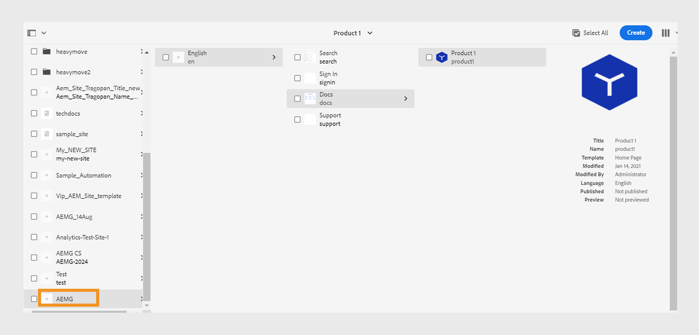

# Hämta och installera AEM Sites-mallar

Så här hämtar och installerar du AEM Sites-mallar i Experience Manager Guides för lokal programvara:


## Paketinstallation

1. Hämta följande paket

   - Komponenter: [guides-components-all.zip](https://github.com/adobe/aemg-sites-components/releases/tag/v1.0.0)

   - Webbplatser för lokal programvara: [Dokument](https://github.com/adobe/aemg-docs/releases/tag/v1.0.0)

1. Logga in i AEM och navigera till CRX Package Manager. Standardwebbadressen för att få åtkomst till pakethanteraren är:

   ```http
   http://<server name>:<port>/crx/packmgr/index.jsp
   ```

   Pakethanteraren hanterar paketen i din lokala AEM. Mer information om hur du arbetar med pakethanteraren finns i [Arbeta med paket](https://helpx.adobe.com/experience-manager/6-5/sites/administering/using/package-manager.html) i AEM.

1. Klicka på **Överför paket** om du vill överföra paketet.

1. I dialogrutan **Överför paket** navigerar du till filen som du hämtade i steg 1 och klickar på **OK**.

   Paketet överförs till din AEM.

1. Klicka på **Installera** om du vill installera paketet.

1. I dialogrutan **Installera paket** klickar du på **Installera** för att installera paketen.


## Konfigurera mallarna som ska användas med AEM Sites förinställningar

När paketen har installerats skapas en plats med namnet **AEMG** i webbplatsens användargränssnitt. I det här exemplet visas hur du kan ställa in platsstrukturen för att generera utdata från AEM Sites. Det här är bara ett exempel. Du kan skapa anpassade webbplatser efter dina behov.




**AEMG** innehåller följande komponenter.
- Det finns en mapp för det engelska språket (en) i mappen **AEMG**. Du kan skapa liknande språkversioner som du vill. En flerspråkig webbplats innehåller t.ex. engelska (en), tyska (de) och franska (fr) språkkopior.  Läs mer om hur du skapar en språkkopia med [språkkopieringsguiden](https://experienceleague.adobe.com/en/docs/experience-manager-65/content/sites/administering/introduction/tc-wizard).
- I den engelska språkmappen (en) innehåller Experience Manager Guides många exempelsidor som **Sök**, **Logga in**, **Dokument** och **Support**.

- **Dokument** är exempeldokumentationens startsida. Det är en central plats för all produktrelaterad dokumentation
och visar varje produkt som det finns dokumentation för som enskilda rutor.

- Tillsammans med dokumentationens startsida finns det exempelsidor för **Sök**, **Logga in** och **Support**. Du kan anpassa dessa exempel efter dina behov.
- Du kan ha startsidor för enskilda produkter som Produkt1. En exempelsida **Produkt1** finns under **Dokument**, som är dokumentationens startsida.

- Experience Manager Guides innehåller även följande fördefinierade mallar:

   - Mallen **Innehållssida**: Använd den här mallen för att skapa standardsidor som innehåller större delen av produktplatsens innehåll. De kan innehålla text, bilder, videor och andra innehållselement. Den här mallen innehåller bara sidhuvudet och sidfoten. Anpassa och använd den för att skapa valfri sida. Du kan till exempel skapa supportsidan eller inloggningssidan för din produkt.
   - Mallen **Hemsida**: Huvudstartsidan för en webbplats, som innehåller en översikt, nyckelavsnitt som nyckelelement och funktioner samt navigeringslänkar. Exempelvis ansluter huvudsidan för en produkt ABC till de andra innehålls- eller funktionssidorna.
   - Mallen **Ämnessida**: Sidorna som används för att ordna och presentera ämnesbaserat innehåll. En användarhandbok innehåller till exempel olika ämnessidor, som alla innehåller ett specifikt ämne som rör funktioner och felsökning.

  

Använd dessa exempel och mallar för att generera utdata från AEM Sites:
- En produkts hemsida motsvarar en karta hemsida och skapas med hjälp av hemsidmallen. Markera den här sökvägen i förinställningen för AEM Sites om du vill publicera kartans innehåll under den. Produktens hemsida kan innehålla andra hemsidor.
- Du har till exempel en produkt som Experience Manager Guides och behöver tre handböcker för användare, administratörer och utvecklare.  Skapa en hemsida för varje handbok med hjälp av hemsidesmallen och välj sedan motsvarande hemsida i förinställningen för AEM Sites-utdata.

Läs mer om hur du skapar och konfigurerar [AEM Sites-förinställningar i Web Editor](../user-guide/generate-output-aem-site-web-editor.md).

## Skapa en hemsida med hjälp av mallen

Så här skapar du startsidan för din produkt:
1. När paketet har installerats väljer du **Platser** i Global Navigation.
1. Välj mallen&quot;AEMG Docs&quot; som finns i webbplatsens användargränssnitt.
1. Klicka på knappen **Skapa** i det övre högra hörnet i webbplatsens gränssnitt.
1. Välj **Sida** i listrutan **Skapa**.
1. Välj **Hemsida** och klicka sedan på **Nästa**.
1. Ange webbplatsrubriken och platsnamnet och klicka på **Skapa** i det övre högra hörnet. En AEM webbplatsmall skapas med webbplatsmallen **Hemsida**. Du kan till exempel skapa en hemsida för din produkt `Product ABC`.


>[!NOTE]
>
>När du har skapat startsidan kan du använda den här sökvägen som **Publish Path** för att generera utdata för dina AEM Sites-förinställningar. Exempel: `aemg-docs-en/docs/product-abc`.

## Redigera ämnesmallar för AEM Sites

Du kan också anpassa ämnesmallarna för din AEM Sites. Du kan redigera innehållet eller konfigurera egenskaperna för de olika AEM komponenterna i ditt ämne. Du kan till exempel lägga till eller ta bort komponenter efter behov.\
Så här redigerar du ämnesmallarna:
1. Välj den mall som du vill redigera.
1. Välj ikonen **Redigera** längst upp.

AEM mallredigeraren öppnas. Du kan redigera ämnesmallen. Läs mer om [Skapa sidmallar](https://experienceleague.adobe.com/en/docs/experience-manager-65/content/sites/authoring/siteandpage/templates#editing-a-template-structure-template-author).


## Anpassa befintliga AEM Sites-mallar

Förutom de fördefinierade mallarna kan du även använda dina befintliga mallar med AEM Sites förinställningar. Följ de här stegen för att anpassa befintliga AEM Sites-mallar:

### Mallinställningar

Du behöver följande två typer av mallar:

- Kategori eller landningsmall: Den här mallen används för landningssidan för produktdokumentation och motsvarar en DITA-karta.  AEM för en DITA-karta genereras med den här mallen. Du kan använda den här mallen på alla nivåer.
- Lägg till en textkomponent i den befintliga mallen. Textkomponenten måste ha en obligatorisk egenskap, `text="$category.html$"`.
- Du kan t.ex. välja mallar för webbförsäljning och använda avsnittssidmallen som landningssidmall för DITA-kartan. Om du vill göra det gör du ändringarna enligt följande skärmbild:
  
   - Detaljsida eller mall för ämnessida: Använd den här mallen för innehållet i ett avsnitt i en karta. Alla webbplatssidor i DITA-/XML-innehåll skapas med ämnessidmallar. Det finns två krav för att skapa de här mallarna:
      - Lägg till en textkomponent i mallen, som finns i en behållarkomponent, med en obligatorisk egenskap. `text="$topic.content$"`.

        
      - Återspegla samma behållare och textkomponent i strukturen för samma mall, vilket visas i följande skärmbild:

        

### Tagga kategorisida som dokumentationsbehållare

Om en platshierarki skapas för dokumentationssidorna med den tidigare mallen väljer du en av kategorisidorna som skapades i platshierarkin. Tagga kategorisidan som en dokumentationsbehållare genom att ge den ett ID.
Om du vill göra det tilldelar du dess egenskap `id` värdet `category-page`. Se följande skärmbild:

