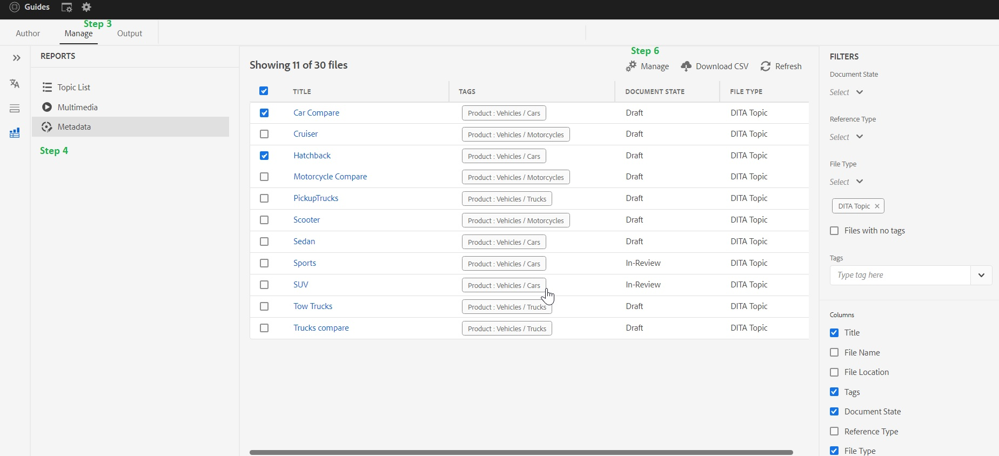

# Lägga till, ta bort och hantera taggar i DITA-innehåll

Taggar kan vara användbara för att kategorisera innehållet. Om innehållet är taggat på rätt sätt kan det hjälpa dig att hitta exakta ämnen i din dagskarta och slutanvändaren hittar rätt innehåll snabbare i dina publicerade utdata

> **_Obs!_** Följande artikel gäller AEM Guides Build 4.2 (lokal) /Feb 2023 (molnversion) eller senare

## Skapa taggar

Taggning är en inbyggd AEM och AEM kan hjälpa dig att skapa och konfigurera dessa taggar i början.

## Lägga till, ta bort och hantera taggar i DITA-innehåll

**Alla taggar som skapas i AEM cq: -taggar kan läggas till, tas bort och hanteras för DITA-innehållet**

Det finns olika sätt att lägga till taggar i DITA-innehåll, men den här artikeln kommer att koncentreras till AEM Guides webbredigeringsgränssnitt.

### Steg:

1. Gå till databasvyn i gränssnittet för guider
2. Dubbelklicka på diamap och öppna i kartvyn
3. Gå till fliken Hantera
4. Gå till alternativet Metadata på fliken Hantera
5. Alla dina direkta och indirekta redigeringsfiler visas här.
6. Markera en eller flera filer och klicka på ikonen Hantera. Här kan du lägga till taggar till markerade filer.
Du kan också ta bort befintliga taggar som är gemensamma för markerade filer.

## Felsökning och vanliga frågor

### Listan i manage->metadata är tom eller ofullständig

`If list is empty or  incomplete then you may need to run the indexing on your ditamap, You can refer` [Uppgraderingsinstruktioner(indexera ditt innehåll)](https://experienceleague.adobe.com/docs/experience-manager-guides-learn/tutorials/install-guide/on-prem-ig/download-install-upgrade-aemg/upgrade-xml-documentation.html?lang=sv-SE#steps-to-index-the-existing-content-to-use-the-new-find-and-replace%3A)

### Anpassade metadata visas inte i listan

`Only Tags present in cq:tags can be managed from here and custom metadata is not supported`

## Andra användbara resurser

- [Masstaggning med Map Dashboard (Assets UI)](https://experienceleague.adobe.com/docs/experience-manager-guides-learn/tutorials/user-guide/manaege-metadata/map-editor-bulk-tagging.html?lang=en)
- [Ditamap-rapporter i webbredigeraren](https://experienceleague.adobe.com/docs/experience-manager-guides-learn/tutorials/user-guide/reports-aem-guide/reports-web-editor.html?lang=en)
- [Taggning i AEM](https://experienceleague.adobe.com/docs/experience-manager-learn/assets/configuring/tagging.html?lang=sv-SE)

**Kontakta respektive CSM för eventuella andra frågor**
