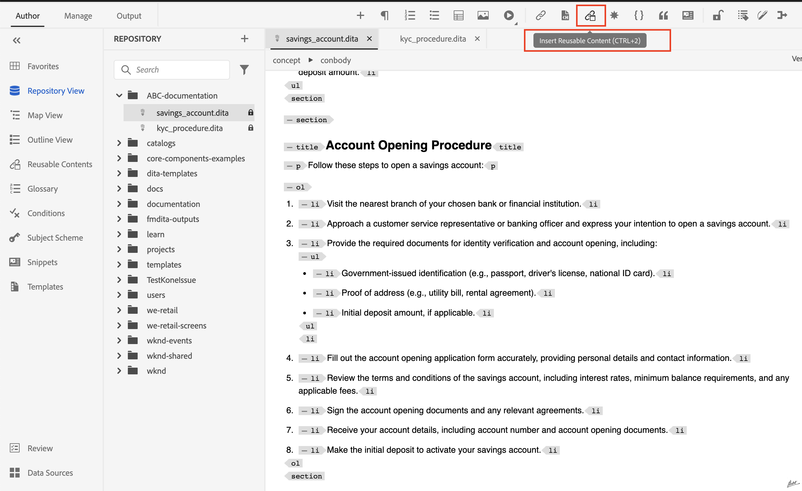

# Återanvändning av innehåll i AEM Guides

Adobe AEM Guides utnyttjar DITA:s styrkor för att skapa ett användarvänligt gränssnitt för återanvändning av innehåll.

I den här artikeln ska vi prata om:

1. [Återanvändning med ämnesreferens (](#reusability-using-topic-referencestopicref)
2. [Återanvändbarhet med hjälp av innehållsreferens (](#reusability-using-content-reference-conref--conkeyref)
3. [Bonustips för att återanvända material genom att dra och släppa i AEM Guides](#reuse-content-with-a-single-click-in-aem-guides)

## Återanvändbarhet med ämnesreferenser (topicref)


Låt oss anta att du är ett tillverkningsföretag och har generiska ämnen för säkerhetsåtgärder eller felsökningstekniker.

Dessa kan refereras och anpassas i specifika användarhandböcker för varje maskinmodell, vilket minskar redundansen och säkerställer att viktig säkerhetsinformation är konsekvent.

```
<map id="user_manual_model 100" title="ABC Model 100 User Manual ">


<topicref href="Safety_Information.dita" format="dita">
</topicref>
.
.
.
.
.
</map>
```


Liknande för modell 200

```
<map id="user_manual_model 200" title="ABC Model 200 User Manual ">

<topicref href="Safety_Information.dita" format="dita">
</topicref>
.
.
.
.
.
  
</map>
```

## Återanvändbarhet med innehållsreferens (conref &amp; conkeyref)

Med attributet för innehållsreferens (conref) kan du länka till andra delar av ditt innehåll. Detta främjar återanvändbarhet och minskar redundansen.

Till exempel:

Låt oss anta att du är ett finansiellt företag och har ett generiskt ämne för KYC som innehåller KYC-procedurer för privatpersoner, företag och så vidare.

Du vill återanvända enskilda KYC-fragment för dina&quot;sparkonto&quot;- och&quot;demonstrationskonton&quot;-avsnitt.

```
<section id="kyc_requirements_saving_account">
  <title>Know Your Customer (KYC) Requirements</title>
  <p>To comply with regulations and ensure customer identification, all individual applicants for savings  accounts must fulfill the KYC requirements as outlined below</p>
  <p conref=kyc_procedures.dita#individual_kyc></p>
</section>
```

Här är `conref=kyc_procedures.dita#indvidual_kyc` kyc_procedure.dita filidentifieraren och #individual_kyc är fragmentidentifieraren.

Kyc_procedure.dita är fortfarande den enda informationskällan. Om KYC-processen ändras i enlighet med gällande bestämmelser behöver du bara uppdatera ett ämne. Ändringarna återspeglas automatiskt i alla ämnen som refererar till det.

Med AEM Guides klickar man två gånger

Steg 1: Klicka på Infoga återanvändbart innehåll


<br>

Steg 2: Välj filen och fragmentet som ska återanvändas.


På samma sätt som &quot;conref&quot; kan du använda &quot;conkeyref&quot; och i stället för att ge innehållssökvägen kan du referera till innehåll via tangenter.

Kodexempel:

```
<section conkeyref="kyc_procedure/individual_kyc_procedure" id="individual_kyc_procedure"></section>
```

Nyckeldefinitionen ser ut så här:

```
<map id="ABC_manual">
  <title>ABC_Manual</title>
  <topicref href="kyc_procedure_2020.dita" keys="kyc_procedure" processing-role="resource-only" type="concept">
  </topicref>
  <topicref href="savings_account.dita" type="concept">
  </topicref>
</map>
```

Nyckel -&quot;Kyc_procedure&quot; kommer även fortsättningsvis att vara den enda informationskällan. Om KYC-processen ändras enligt gällande bestämmelser behöver du bara uppdatera en ämnessökväg med en ny ämnessökväg. Ändringarna återspeglas automatiskt i alla ämnen som refererar till den.

```
<map id="ABC_manual">
  <title>ABC_Manual</title>
  <topicref href="kyc_procedure_2024.dita" keys="kyc_procedure" processing-role="resource-only" type="concept">
  </topicref>
  <topicref href="savings_account.dita" type="concept">
  </topicref>
</map>
```

Här ändras ämnessökvägen från&quot;kyc_procedure_2020.dita&quot; till&quot;kyc_procedure_2024.dita&quot; på grund av de senaste ändringarna av reglerna.

Med AEM Guides klickar man två gånger

Steg 1: Klicka på Infoga återanvändbart innehåll


Steg 2: Välj rotkarta (valfritt), nyckel och fragment som behöver återanvändas.


Här markerades rotkartan automatiskt eftersom den redan var öppen i mappningsvyn


## Återanvänd material med ett enda klick i AEM Guides

AEM Guides har en funktion för att lägga till innehållsreferenser med ett enda klick.

Steg 1: Lägg till ett generiskt ämne i återanvändbart innehåll


Steg 2: Dra och släpp det fragment som du vill återanvända i något av målämnena när det har lagts till.


## Vanliga frågor

- ### Allt innehåll visas inte när du har valt fil/nyckel i dialogrutan Återanvänd innehåll

Du måste tilldela ID:n till fragment (Dita-element) som du vill återanvända i andra ämnen

- ## Tangenter visas inte i dialogrutan Återanvänd innehåll

Kontrollera att du har öppnat rotmappningen/den överordnade kartan i en kartvy som har en nyckeldefinition eller lägg till rotmappssökvägen manuellt i samma dialogruta.


<br>


Post på AEM Guides Community [forum](https://experienceleaguecommunities.adobe.com/t5/experience-manager-guides/ct-p/aem-xml-documentation) för alla frågor.
