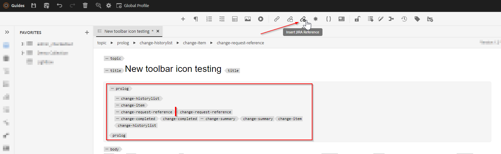

# Lägg till en ny anpassad åtgärdsknapp i webbredigeringsverktygsfältet

I den här artikeln får vi lära oss hur du lägger till en ny anpassad knapp i webbredigeringsverktygsfältet och anropar javascript för att utföra önskad anpassad åtgärd.

Om du lägger till en åtgärdsknapp i en webbredigerare utför du följande steg:
- Lägger till knappen i *ui_config.json* vid den position där den behövs
- Registrera knappens klickningshändelse i webbadministratören så att användaren kan utföra en åtgärd när han/hon klickar på den


## Implementera med ett exempel

Låt oss förstå detta med ett exempel där en författare vill lägga till en Jira-referens till ett avsnitt i ämnesprolog. Prolog-avsnittet med inbäddat Jira reference-id kan se ut så här:


Elementet &quot;change-request-id&quot; som innehåller JIRA ID ska hämtas från API:t (kan till exempel baseras på en specifik JIRA-fråga som avbildas av programmet). När användaren redigerar prologavsnittet bör användaren kunna klicka på en knapp och infoga ett jira-referens-ID från webbredigeringsverktygsfältet, till exempel:


När användaren klickar på knappen bör den visa en dialogruta där de möjliga alternativen kan väljas så att användaren kan välja önskat JIRA-ID, till exempel:


som sedan ska lägga till &quot;change-request-id&quot; i prologgen:


## Implementera


### Lägg till knappen i webbredigeraren genom att konfigurera den i *ui_config.json*

Använd mappprofilerna för att kontrollera *ui_config.json* på fliken XML-redigerarkonfiguration och lägg till knappkonfigurations-JSON i önskat avsnitt i gruppen&quot;toolbar&quot;

```
{
    "on-click":"insertJIRARef",
    "icon":"linkCheck",
    "variant":"quiet",
    "type":"button",
    "title":"Insert JIRA Reference"
}
```

[använd den här länken om du vill veta mer om mappprofilen och konfigurera ui_config.json](https://experienceleague.adobe.com/docs/experience-manager-guides-learn/videos/advanced-user-guide/editor-configuration.html?lang=sv-SE)


### Hantera on-click-händelsen för den nya knappen

    Obs! Steg som nämns nedan är tillgängliga som paket som bifogas i det här inlägget


- När du har sparat mappprofilen skapar du en&quot;cq:ClientLibraryFolder&quot; under en projektkatalog (kan finnas under */apps*) och lägger till egenskaper enligt skärmbilden nedan:
  

```
This example uses "coralui3" library to show a dialog as it is used in the Javascript sample we presented.
You may use different library of your choice.
```

- Skapa två filer enligt nedan i den här klientbiblioteksmappen:
   - *overrides.js*: som kommer att ha javascript-koden för att hantera on-click-händelsen för insertJIRARef (använd det bifogade paketet för att hämta innehållet i det här javascript-objektet)
   - *js.txt*: som kommer att innehålla &quot;overrides.js&quot; för att aktivera detta javascript

- Spara ändringarna så är du redo att testa.


### Testning

- Öppna webbredigeraren
- Välj den mappprofil i vilken du lade till den anpassade *ui_config.json* i användarinställningarna. Om du lade till den i den globala profilen använder du förmodligen redan den.
- Öppna ett avsnitt och lägg märke till att verktygsfältet har en ny knapp &quot;Insert Jira Reference&quot;
- Du kan sedan lägga till prologavsnittet enligt nedan och försöka klicka på knappen &quot;Infoga Jira-referens&quot; i prologelementet &quot;change-request-reference&quot;

```
<prolog>
    <change-historylist>
        <change-item>
            <change-request-reference>
            </change-request-reference>
            <change-completed></change-completed>
            <change-summary></change-summary>
        </change-item>
    </change-historylist>
</prolog>
```

Se skärmbilden nedan för att se hur den kommer att se ut:




### Bifogade filer

- Exempel på clientlibs-paket som installerar webbutvecklarklientbiblioteket med javascript-kod för verktygsfältsknappsåtgärd: [hämta med den här länken](../../../assets/authoring/webeditor-addbuttonontoolbar-insertjira-clientlib.zip)
- Exempel *ui_config.json* som du kan överföra till en mappprofil: [hämta exempel-ui_config.json](../../../assets/authoring/sample_ui_config_Guides4.2-InsertJiraReference.json)

```
Please note this is compatible to AEM 6.5 and AEM Guides version 4.2.
If you are using a different version please add the toolbar button to the ui_config.json manually.
```
