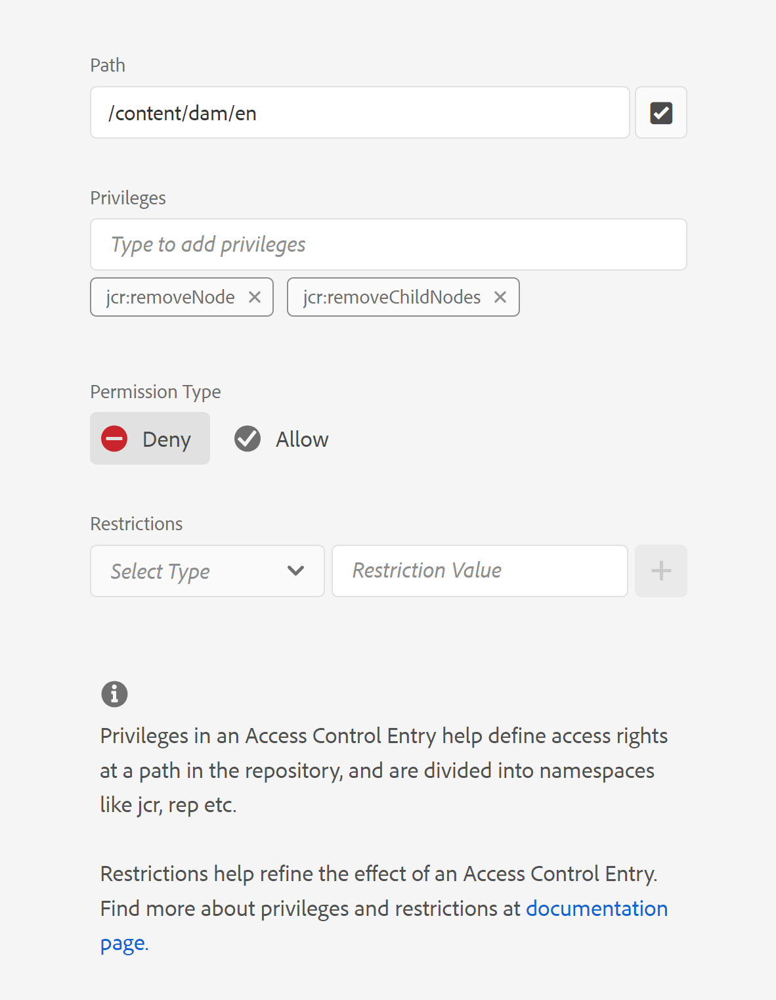

# Ta bort alternativet Ta bort från filsnabbmenyn i webbredigeraren

I den här artikeln får vi lära oss hur du döljer alternativet &quot;Ta bort&quot; på snabbmenyn i AEM Guides Web Editor för specifika användare eller grupper. Om du vill ha mer information om alternativen på snabbmenyn för filer läser du i ramverket för tillägg till stödlinjer. Mer information finns [här](https://github.com/adobe/guides-extension/tree/main).

Som du kan se nedan har filsnabbmenyn alternativet &quot;Ta bort&quot; tillgängligt för just den här användaren.


Låt oss nu se hur vi kan dölja alternativet &#39;Ta bort&#39; för den här användaren.

## Implementeringssteg:

- Navigera till Verktyg > Dokumentskydd > Behörigheter från AEM startsida.
- Välj gruppen eller användaren i sökrutan.
- Klicka på Lägg till ACE längst upp till höger.
- Välj mappsökväg.
- Inkludera privilegier, &quot;jcr:removeChildNodes&quot; och &quot;jcr:removeNode&quot;.
- Välj &quot;Behörighetstyp&quot; som &quot;neka&quot; och klicka på &quot;Lägg till&quot; enligt nedan.




### Testning

- Logga in AEM som den användare som ACE:n har lagts till för.
- Öppna webbredigeraren.
- Gå till databasvyn och välj den mapp som ACE:n har lagts till för.
- Öppna filens snabbmeny.
- Alternativet &#39;Ta bort&#39; visas inte på snabbmenyn.

Snabbmenyn ser nu ut så här:


```
Please note that these steps would also remove 'move' and 'rename' options from the Web Editor as they are also tied to delete process at the backend.
```
