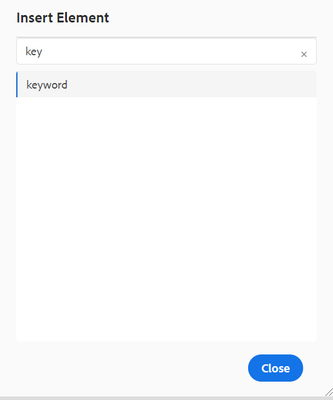

# Skapa nycklar

Organisationer bör använda nycklar i de fall där de har viss återanvändbar och vanlig text, som produktnamn eller produkttoning, som används på många ställen men som ofta ändras. Om du använder tangenter för sådan återanvändbar text kan du överföra en uppdatering på flera ställen genom att göra ändringen på en enda plats, t.ex. i nyckelvärdet.

## Steg 1: Skapa en global karta för att lagra nycklar

Skapa en karta och lägg till elementet [!UICONTROL keyref] i det.

```
<?xml version="1.0" encoding="UTF-8"?>
<!DOCTYPE map PUBLIC "-//OASIS//DTD DITA Map//EN" "technicalContent/dtd/map.dtd">
<mapid="map.ditamap_ffbdbf06-8658-4311-ad84-1c631bba904f">
  <title>global-keys-map</title>
  <keydefkeys="adobe">
    <topicmeta>
      <linktext>Adobe Systems</linktext>
    </topicmeta>
  </keydef>
  <keydefkeys="AEM">
    <topicmeta>
      <linktext>Adobe Experience Manager</linktext>
    </topicmeta>
  </keydef>
</map>
```

Här har du definierat två definitioner, som visas ovan, som [!UICONTROL keyref] som _AEM_ för texten _Adobe Experience Manager_.

## Steg 2: Lägg till kartan i publikationskartan

```
<?xml version="1.0" encoding="UTF-8"?>
<!DOCTYPE map PUBLIC "-//OASIS//DTD DITA Map//EN" "technicalContent/dtd/map.dtd">
<mapid="map.ditamap_cbf4a96d-e382-4e8c-8830-bcc093fe6638">
  <title>sample-map</title>
  <topicrefhref="sample-topic-using-the-keys.dita"type="topic">
  </topicref>
  <maprefformat="ditamap"href="global-keys-map.ditamap"type="map">
  </mapref>
</map>
```

## Steg 3: Använd tangenterna för att referera till variablerna som definieras i den globala tangentkartan

+ Redigera ämnet och lägg till nyckelvärdet med [!UICONTROL keyref].
+ Som framgår av skärmbilden visas ett litet fönster där du kan välja nyckelord. Detta visas när du lägger till nyckelordselementet.
  
  

```
<?xml version="1.0" encoding="UTF-8"?>
<!DOCTYPE topic PUBLIC "-//OASIS//DTD DITA Topic//EN" "technicalContent/dtd/topic.dtd">
<topicid="topic.dita_31b00e61-04b5-4193-af7a-68503e88b087">
  <title>sample-topic-using-the-keys</title>
  <shortdesc></shortdesc>
  <body>
    <p>This is a sample topic using the keys defined in the global map</p>
    <p>here i am using the key definition for AEM :<keyword keyref="AEM"></keyword></p>
  </body>
</topic>
```
