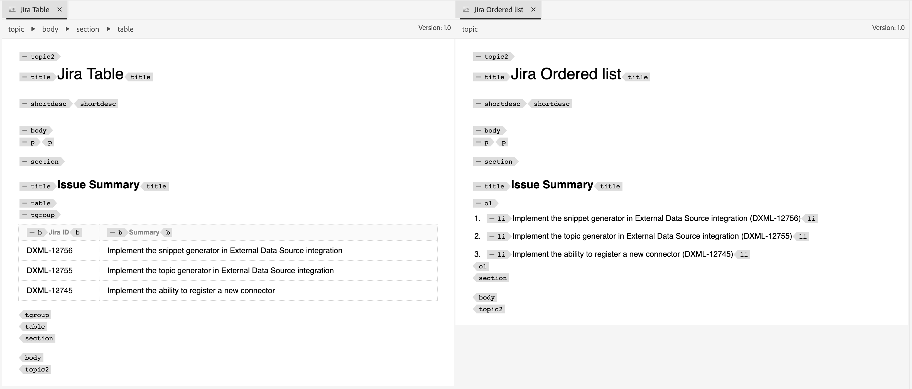

# Integrering med externa datakällor

Data från externa system kan enkelt integreras i er Experience Manager Guides-instans. Att ansluta till externa datakällor kan avsevärt förbättra funktionaliteten och användbarheten i ert innehållshanteringssystem.


Ni kan effektivt ansluta och hämta data från externa källor med hjälp av dataintegrering. Med den här funktionen behöver du inte förlita dig på att IT-teamet hämtar data och sedan manuellt kopiera och klistra in dem eller hela tiden uppdatera ändringarna i det externa systemet.

Den här funktionen säkerställer synkronisering med originalkällan och möjliggör harmoniska uppdateringar av dokumentationen utan att behöva förlita sig på manuella kopiera och klistra in-åtgärder. Det bidrar också till att upprätthålla datakonsekvensen mellan Experience Manager Guides och den externa datakällan.

När du har hämtat innehållet från externa datakällor kan du dessutom skapa det i DITA-format och även återanvända det integrerade innehållet.


## Integreringsramverk för datakällor

Integreringsramverket för en datakälla omfattar främst två huvudkomponenter: externa datakällor och deras integrering i Experience Manager Guides-instansen.

### Externa datakällor

Några av de datakällor som du kan ansluta från Experience Manager Guides är följande:

- Relationsdatabaser (RDBMS)
   - PostgreSQL, MySQL, Microsoft SQL Server, MariaDB och SQLite
- Icke-relationella databaser
   - MongoDB, Apache Cassandra, Apache CouchDB och Redis
- Product Information Management (PIM) / Product Lifecycle Management (PLM)
   - Pimcore, Salsify, Akeneo och Informatica
- Produkthanteringssystem
   - JIRA och Microsoft Azure DevOps Boards (ADO)
- OLAP (Online Analytical Processing) och analyssystem

### Integration i Experience Manager Guides


Genom att använda en autentiserad koppling överförs data från ett externt system och genererar data inom Experience Manager Guides.


### Integration i Experience Manager Guides

Så här integrerar du innehållet i Experience Manager Guides:

1. **Konfigurera datakällkopplingen**
   - Datakällans koppling fungerar som gränssnitt för att upprätta anslutning till externa datakällor. Du måste konfigurera anslutningen för att upprätta anslutningen och inkludera autentiseringsmetoder, som `Basic Auth` eller `API key Auth`. All konfigurationsinformation, inklusive krypterad information, lagras säkert i Adobe Experience Manager.
   - Kopplingslagret är utformat för att vara utbyggbart, så att du kan skapa implementeringar för att ansluta till olika system som inte levereras direkt från Experience Manager Guides.
     
   >[!NOTE]
   >
   > Gå till Konnect-definitionsmodulen och implementera Connector-gränssnittet för att skapa en anpassad koppling. Läs mer om hur du [konfigurerar anpassade datakällanslutningar](./conf-custom-data-source-connector.md).

1. **Anpassa snabbmallarna**

   - Experience Manager Guides stöder Velocity (https://velocity.apache.org/), en mycket robust mallmotor för att omvandla data från JSON-filer till DITA-innehåll. Med hastigheten kan du navigera i JSON-strukturer med alla kapslingsnivåer.
   - I följande exempel visas hur du kan integrera snabbmallar och data från Jira för att enkelt generera tabeller eller ordnade listor.
      - Jira-svar

        ```
        {
            "expand": "schema,names",
            "total": 5,
            "hostname": "https://jira.corp.adobe.com",
            "maxResults": "200",
            "issues": [
                {
                    "key": "DXML-12756",
                    "fields": {
                        "description": "Implement the snippet generator in External Data Source integration",
                        "summary": "Implement the snippet generator in External Data Source integration"
                    }
                },
                {
                    "key": "DXML-12755",
                    "fields": {
                        "description": "Implement the topic generator in External Data Source integration",
                        "summary": "Implement the topic generator in External Data Source integration"
                    }
                },
                {
                    "key": "DXML-12745",
                    "fields": {
                        "description": "Implement the ability to register a new connector",
                        "summary": "Implement the ability to register a new connector"
                    }
                }
            ],
            "startAt": 0
        }
        ```

      - Mallar
        {width="800" align="left"}
      - Data som genererats från samma datakälla men olika mallar
        {width="800" align="left"}

1. **Generera innehåll med hjälp av mallar**
   - Du kan generera innehåll från mallar som du har skapat.
   - Du kan generera olika typer av innehåll:
      - Kodavsnitt: Detta är engångsinnehåll som kan användas. Du kan generera data från kopplingen i den definierade mallen och sedan bädda in den i taggen önskvärd.
      - DITA-ämne: Generera olika ämnen som ska användas som i innehållet eller kan återanvändas som en *återanvändbar komponent*.
      - DITA-avsnitt och -karta: Du kan också generera en fullständig karta med ämnet och sedan använda data för direkt publicering eller använda den som en *återanvändbar komponent* i andra data.


1. **Publish det integrerade innehållet**
   - Publicering är OTB-funktionen i Experience Manager Guides och du kan direkt publicera alla data som genereras från det externa systemet som PDF eller AEM webbplatsutdata.

>[!MORELIKETHIS]
>
> Följande dokument innehåller mer information om hur du konfigurerar kopplingarna och använder dem i din instans.
> - [Konfigurera en datakällanslutning](../../../install-guide/conf-data-source-connector-tools.md)
> - [Generera innehåll med fragment eller ämnen](../../../user-guide/web-editor-content-snippet.md)