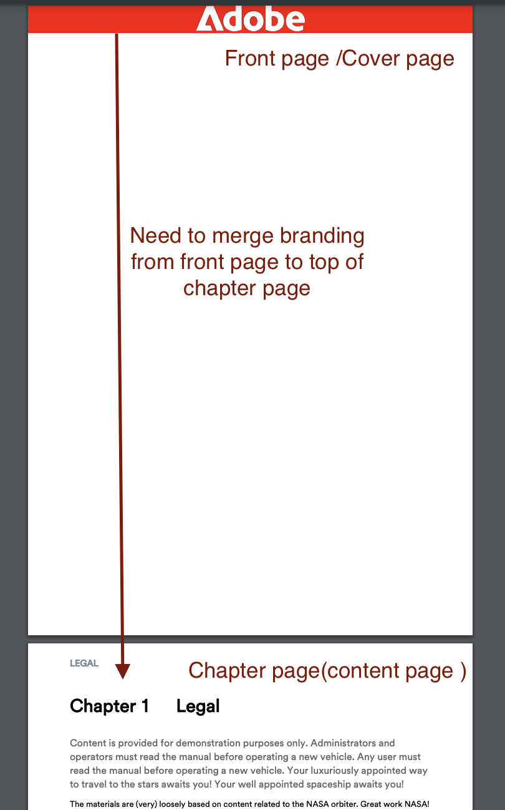

# Lägg till Enterprise Branding på första sidan i en DITA-PDF

## Den här artikeln kommer att omfatta:

Skapa företagsmärkning genom att smidigt sammanfoga FrontCover-sidan med kapitelsidan och säkerställa att företagets identitet tydligt visas överst i innehållet.

- [Konfigurera ditt innehåll](#set-up-your-content)
- [Gör de ändringar som behövs i mallen PDF](#create-necessary-changes-in-pdf-template)

**Före:**


<br>
<br>

**Efter:**


## Konfigurera ditt innehåll

Om du vill publicera innehåll i PDF-format måste du skapa en Ditamap eller Bookmap.

Exempel på bokmappsstruktur:

```
<bookmap>
  <title>My Bookmap Title </title>
  <frontmatter>
    <booklists>
      <toc/>
      <figurelist/>
      <tablelist/>
    </booklists>
  </frontmatter>

  <chapter href="chapter1.ditamap">
  <chapter href="chapter2.ditamap">
  </chapter>

  <backmatter>
    <booklists>
      <indexlist/>
    </booklists>
  </backmatter>
</bookmap>
```

Exempel på Ditamap-struktur:

```
<map title="My map Title">

  <topicref href="topic1.dita" >
  </topicref>
  <topicref href="topic2.dita">
  </topicref>
  
</map>
```

FrontCover för PDF genereras automatiskt om bokmappen innehåller `<frontmatter>`.


## Gör de ändringar som behövs i mallen PDF

I det här avsnittet ska vi skapa en mall. (Du kan använda eller duplicera en Hi-tech-mall för att komma igång.)

### Konfigurera din mall:

- Gå till mallen för egna PDF.
- Gå till layouten för FrontCover-sidan och redigera den.
- Här lägger du till din profilbild i `data-region="content"`.
- Lägg till andra nödvändiga ändringar i kapitelmallen vid behov.
- Följ nu stegen nedan baserat på ditt innehåll.


#### Om du använder Ditamap för PDF-generering:

När du publicerar en DITAMAP innehåller Native PDF funktioner för att automatiskt generera en FrontCover-sida. Alternativet att aktivera eller inaktivera generering av FrontCover-sidor kan konfigureras i mallen för PDF.

Sammanfoga:
- Gå till inställningarna för PDF-mallen —> Sidlayoutordning
- Nu kan du sammanfoga FrontCover med nästa sida, d.v.s. kapitel och avsnitt.
  
- Spara mall, välj den här mallen som förinställning och publicera!


#### Om du använder bokkarta för PDF-generering

När det gäller en bokmappning styrs sidlayoutordningen av bokmappens struktur i stället för mallens ordning.

För att uppnå detta för Bookmap använder vi NativePDF-filens JavaScript-funktion.

- Lägg till under JavaScript i mallens resursmapp

```
window.addEventListener('DOMContentLoaded', function () {
    window.pdfLayout.onAfterPagination(function () {
        var frontMatterWrappers = document.querySelectorAll('.rh-front-matter-wrapper');

        frontMatterWrappers.forEach(function(wrapper) {
            var contentDiv = wrapper.querySelector('div[data-region="content"]');
            var chapterBody = document.querySelector('.chapter-body');

            if (contentDiv && chapterBody) {
                chapterBody.insertBefore(contentDiv, chapterBody.firstChild);
            }

            wrapper.remove();
        });
    });
});
```

- Inkludera denna JavaScript i din kapitelmall.
  

- Aktivera JavaScript från ditt förinställda alternativ
  

- Publish!

## Bifogade filer:

- [Ladda ned exempelmallpaketet för PDF för att se vilka ändringar som gjorts.](../assets/publishing/NativePDF_DemoTemplate.zip)
- [Ladda ned exempelpaketet med förinställningar för PDF för att se vilka ändringar som gjorts.](../assets/publishing/Preset_Package.zip)


## Andra resurser:

- [Så här tar du med DITA-bokschemats innehåll i PDF](./how-to-include-bookmap-toc-in-pdf-publishing.md)
- [Video om expertsession på PDF](../../expert-sessions/native-pdf-publishing-eamples-part1-june2023.md)

