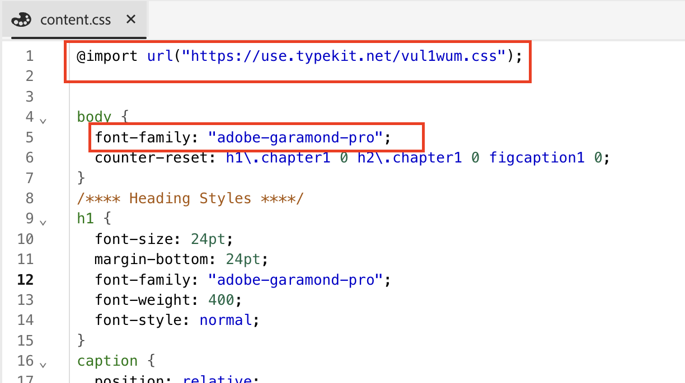

# Lägg till anpassade teckensnitt i DITA Native PDF

## Denna artikel omfattar

Lägg till det anpassade teckensnittet för att stärka varumärkesidentiteten och den visuella enhetligheten i allt innehåll.

Den här processen omfattar tre steg:

- [Överför det anpassade teckensnittet](#step-1--upload-the-custom-font-to-the-resource-folder-of-your-template)
- [Gör nödvändiga ändringar i formatmallen för PDF](#step-2--make-necessary-changes-in-pdf-templatess-stylesheet)

- [Bädda in använda teckensnitt (valfritt)](#step-3-optional--embed-used-font-in-pdf)

## Steg 1: Överför det anpassade teckensnittet till mallens resursmapp

## Steg 2: Gör nödvändiga ändringar i formatmallen för PDF

## Steg 3 (valfritt): Bädda in teckensnitt som används i PDF

## Vanliga frågor

- ### Kan jag använda Adobe Fonts?

> Ja, gå till fonts.adobe.com och klicka på&quot;Lägg till i webbprojekt&quot;.
> 
> Kopiera importkod som `" @import url("https://use.typekit.net/xxxx.css")`;
>
> Klistra in CSS-innehållet och gör önskade ändringar i CSS-filen.

- ### Mitt teckensnitt visas inte i PDF

> Dubbelkontrollera stavning av teckensnittsnamn (vanligaste fel)
>
> Kontrollera att du bäddar in teckensnitt om teckensnitten inte är tillgängliga i det system där PDF är öppet

- ## Kontakta dina respektive CSM för andra frågor

## Andra resurser:

- [Inkludera DITA-bokmappens innehållsförteckning i PDF](./how-to-include-bookmap-toc-in-pdf-publishing.md)
- [Inkludera innehållsförteckning i PDF](./how-to-include-bookmap-toc-in-pdf-publishing.md)
- [Video från expertsessioner på PDF](../../expert-sessions/native-pdf-publishing-eamples-part1-june2023.md)