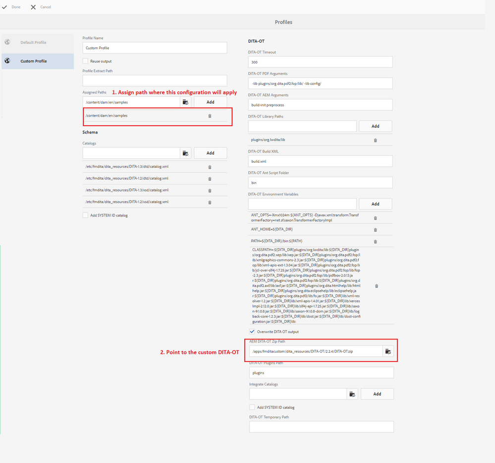

# Konfigurera anpassad DITA-OT i [!DNL AEM Guides] för AEM

Stegen för att lägga till en anpassad DITA-OT beskrivs i avsnittet _Använd anpassade DITA-OT-plugin-program_ i _installations- och konfigurationshandboken_.

På en hög nivå är stegen:

+ Skaffa grundläggande DITA-OT
   + Om du vill få en kopia av en färdig DITA-OT från [!DNL AEM Guides] hämtar du den från sökvägen `/etc/fmdita/dita_resources/DITA-OT.zip`
   + Om du vill hämta en annan version kan du hämta från [dita-ot-repo](https://www.dita-ot.org/download)
+ Gör ändringar i DITA-OT, till exempel [lägga till nytt plugin-program](https://www.dita-ot.org/dev/topics/plugins-installing.html) eller anpassa befintliga plugin-program (se exempel i avsnittet med relaterade länkar nedan)
+ Överföring av `DITA-OT.zip` mottagen till `/apps/<project-folder>/dita_resources` (skapa en anpassad projektmapp rekommenderas)
+ Lägg till DITA-profil via **[!UICONTROL Tools]** > **[!UICONTROL Guides]** > **[!UICONTROL DITA Profiles]** (använd DITA-OT-sökvägen där den anpassade DITA-OT-filen överförs, se skärmbild nedan)
  

>[!MORELIKETHIS]
>
>+ [Anpassa DITA-OT-plugin-exempel](https://www.dita-ot.org/dev/topics/pdf-customization.html)
