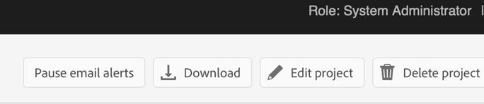

# Konfigurera mikrotjänstbaserad publicering med OAuth-autentisering

Med publiceringsmikrotjänsten kan du köra stora publiceringsarbetsbelastningar samtidigt på Experience Manager Guides as a Cloud Service och dra nytta av den branschledande serverlösa Adobe I/O Runtime-plattformen.

För varje publiceringsbegäran kör Experience Manager Guides as a Cloud Service en separat behållare som skalas vågrätt enligt användarens önskemål. Detta ger möjlighet att köra flera publiceringsbegäranden och få bättre prestanda än deras stora lokala Adobe Experience Manager-servrar.

>[!NOTE]
>
> Microservice-baserad publicering i Experience Manager Guides har stöd för PDF (både Native- och DITA-OT-baserade), HTML5, JSON och CUSTOM-baserade utdataförinställningar.

När molnpubliceringstjänsten skyddas av OAuth-baserad autentisering från Adobe IMS utför du följande steg för att integrera deras miljöer med Adobe säkra tokenbaserade autentiseringsarbetsflöden och börja använda den molnbaserade skalbara publiceringslösningen.


## Skapa IMS-konfigurationer i Adobe Developer Console

**Roll som krävs för att skapa konfigurationerna**: Systemadministratör

Så här skapar du IMS-konfigurationer i **Adobe Developer Console**:

>[!NOTE]
>
>Om du redan har skapat ett OAuth-projekt för att konfigurera AI-baserade smarta förslag för redigering kan du hoppa över följande steg för att skapa projektet.

1. Öppna **Developer Console**: `https://developer.adobe.com/console`.

1. Växla till fliken **Projekt** uppifrån.

   

   *Välj fliken **Projekt**på&#x200B;**Adobe Developer Console***

1. Om du vill skapa ett nytt tomt projekt väljer du **Tomt projekt** i listrutan **Skapa nytt projekt** .

   

   *Skapa ett nytt tomt projekt.*

1. Välj **API** i listrutan **Lägg till i projekt** om du vill lägga till IO-hanterings-API:t i projektet.

   

   *Välj ett API-projekt i listrutan.*

   

   *Lägg till API för I/O-hantering i ditt projekt.*

1. Skapa en ny OAuth-autentiseringsuppgift och spara den.

   

   *Konfigurera OAuth-autentiseringsuppgifter för ditt API.*


1. Gå tillbaka till fliken **Projekt** och välj **Projektöversikt** till vänster.

   

   *Kom igång med det nya projektet.*

1. Klicka på knappen **Hämta** överst för att hämta JSON-tjänsten.

   

   *Hämta JSON-tjänstinformationen.*

Du har konfigurerat OAuth-autentiseringsinformationen och laddat ned JSON-tjänstinformationen. Ha den här filen till hands så som det behövs i nästa avsnitt.


## Lägg till IMS-konfiguration i miljön

>[!NOTE]
>
>Om du redan har skapat ett OAuth-projekt för smarta förslag kan du återanvända samma projekt för mikrotjänster och hoppa över följande steg för att lägga till IMS-konfiguration i miljön.

### Uppdatera befintlig konfiguration (JWT   till OAuth shift )

Om du redan använder en mikrotjänst för publicering med JWT (utgått) utför du följande steg för att uppdatera konfigurationerna:


1. Öppna **Experience Manager** och markera det program som innehåller den miljö som du vill konfigurera.
1. Växla till fliken **Miljö**.
1. Välj namnet på miljön som du vill konfigurera. Du bör navigera till sidan **Miljöinformation**.
1. Växla till fliken **Konfiguration**.

1. Uppdatera JSON-fältet SERVICE_ACCOUNT_DETAILS med den nya OAuth JSON-filen som du hämtade.
1. Ta bort fältet PRIVATE_KEY.


   

   *Uppdatera befintliga JWT-miljökonfigurationer.*

### Första gången

Om du vill använda en publiceringsmikrotjänst för första gången uppdaterar du konfigurationerna enligt följande steg:
1. Öppna **Experience Manager** och markera det program som innehåller den miljö som du vill konfigurera.
1. Växla till fliken **Miljö**.
1. Välj namnet på miljön som du vill konfigurera. Du bör navigera till sidan **Miljöinformation**.
1. Växla till fliken **Konfiguration**.

1. Skapa en ny konfiguration med namnet SERVICE_ACCOUNT_DETAILS. I värdet lägger du till innehåll i OAuth JSON-filen som du hämtade från utvecklarkonsolen.


*Konfigurera miljön för första gången.*


### Första gången kod ändras för aktivering av mikrotjänstbaserad publicering

>[!NOTE]
>
> Hoppa över följande steg om du redan använder en mikrotjänstbaserad publicering:

När du har lagt till IMS-konfigurationen i miljön utför du följande steg för att länka dessa egenskaper till Experience Manager Guides med OSGi:

1. Lägg till följande två filer i `/apps/fmditaCustom/config` (för filinnehåll, se [Bilaga](#appendix)) i Git-projektkoden för din molnhanterare.

   * `com.adobe.aem.guides.eventing.ImsConfiguratorService.cfg.json`
   * `com.adobe.fmdita.publishworkflow.PublishWorkflowConfigurationService.xml`
1. Se till att de nyligen tillagda filerna täcks av din `filter.xml`.
1. Verkställ och skicka Git-ändringarna.
1. Kör pipeline för att tillämpa ändringarna på miljön.

När detta är klart kan du använda den mikrotjänstbaserade molnpubliceringen.

## Vanliga frågor


1. Om OSGi-konfigurationer för att använda mikrotjänsten är aktiverade, kommer publiceringsprocessen att fungera på den lokala Experience Manager-servern med samma kodbas?
   * Nej, om flaggan `dxml.use.publish.microservice` är inställd på `true` söker den alltid efter mikrotjänstkonfigurationer. Ange `dxml.use.publish.microservice` till `false` för att publiceringen ska fungera på den lokala servern.
1. Hur mycket minne tilldelas DITA-processen vid användning av mikrotjänstbaserad publicering? Drivs detta via DITA-profilen och -parametrarna?
   * Med mikrotjänstbaserad publicering styrs minnesallokeringen inte av DITA-profilen och -parametrarna. Det totala tillgängliga minnet för tjänstbehållaren är 8 GB, varav 6 GB tilldelas DITA-OT-processen.


## Bilaga {#appendix}

**Fil**:
`com.adobe.aem.guides.eventing.ImsConfiguratorService.cfg.json`

**Innehåll**:

```
{
"service.account.details": "$[secret:SERVICE_ACCOUNT_DETAILS]",
}
```

**Fil**: `com.adobe.fmdita.publishworkflow.PublishWorkflowConfigurationService.xml`

**Innehåll**:
* `dxml.use.publish.microservice`: Växla för att aktivera mikrotjänstbaserad publicering med DITA-OT
* `dxml.use.publish.microservice.native.pdf`: Växla för att aktivera mikrotjänstbaserad Native PDF-publicering

```
<?xml version="1.0" encoding="UTF-8"?>
<jcr:root xmlns:jcr="http://www.jcp.org/jcr/1.0" xmlns:sling="http://sling.apache.org/jcr/sling/1.0"
          jcr:primaryType="sling:OsgiConfig"
          dxml.publish.microservice.url="https://adobeioruntime.net/api/v1/web/543112-guidespublisher/default/publishercaller.json"
          dxml.use.publish.microservice="{Boolean}true"
          dxml.use.publish.microservice.native.pdf="{Boolean}true"
/>
```
