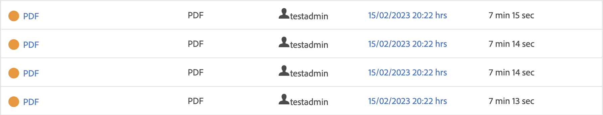
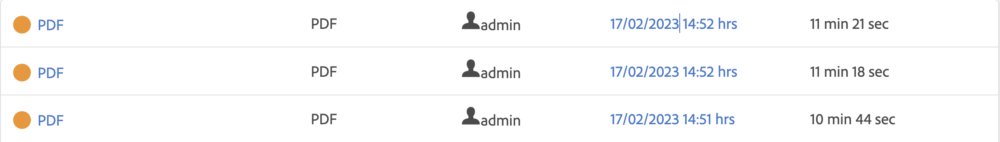

# Cloud Publishing Microservice Architecture and Performance Analysis

I den här artikeln får du information om arkitekturen och prestandanalen i den nya molnpubliceringsmikrotjänsten.

>[!NOTE]
>
> Microservice-baserad publicering i AEM Guides har stöd för PDF (både Native- och DITA-OT-baserad), AEM Site (med hjälp av komponentsammanställning), HTML5, JSON och CUSTOM-typer för utdatapresentationer.

## Problem med befintliga publiceringsarbetsflöden i molnet

DITA Publishing är en resurskrävande process som huvudsakligen är beroende av tillgängligt systemminne och CPU. Behovet av dessa resurser ökar ytterligare om utgivare publicerar stora kartor med många ämnen eller om flera parallella publiceringsbegäranden aktiveras.

Om du inte använder den nya tjänsten sker all publicering på samma Kubernetes(k8)-pod som också kör AEM molnserver. En vanlig k8-pod har en gräns för hur mycket minne och CPU som den kan använda. Om AEM Guides-användare publicerar stora eller parallella arbetsbelastningar kan den här gränsen bryta ut snabbt. K8 startar om poder som försöker använda fler resurser än den konfigurerade gränsen, vilket kan få allvarliga konsekvenser för själva AEM molninstans.

Resursbegränsningen var den främsta anledningen att komma på en dedikerad tjänst som gör att vi kan köra flera samtidiga och stora publiceringsarbetsbelastningar i molnet.

Mer information om publiceringsarbetsflöden i molnet finns i [Vanliga frågor om publiceringsarbetsflöde och skalbarhet](/help/product-guide/user-guide/publishing-scalability-faq.md).

## Introduktion till ny arkitektur

Tjänsten använder Adobe ledande molnlösningar som App Builder, IO Eventing och IMS för att skapa ett serverlöst erbjudande. Dessa tjänster bygger i sig på de allmänt vedertagna branschstandarderna Kubernetes och Docker.

Varje begäran till den nya publiceringsmikrotjänsten körs i en isolerad dockningsbehållare som endast kör en publiceringsbegäran åt gången. Flera nya behållare skapas automatiskt om nya publiceringsbegäranden tas emot. Denna enda behållare per begäran-konfiguration gör att mikrotjänsten kan leverera bästa prestanda till kunderna utan att medföra några säkerhetsrisker. Behållarna tas bort när publiceringen är klar och frigör därmed oanvända resurser.

All kommunikation skyddas av Adobe IMS med JWT-baserad autentisering och auktorisering och körs via HTTPS.

>[!NOTE]
>
> Publiceringsprocessen kör vissa innehållsberoende delar av begäran på själva AEM-servern, som generering av beroendelistor. De mest omfattande delarna av publiceringsprocessen, som att köra DITA-OT eller inbyggd motor, har dock avlästs till den nya tjänsten.

## Resultatanalys

I det här avsnittet visas mikrotjänstens prestandanummer. Den jämför mikrotjänstens prestanda med AEM Guides direktförsäljning eftersom den gamla molnarkitekturen hade problem med samtidig publicering eller publicering av mycket stora kartor.

Om du publicerar en stor karta lokalt kanske du måste justera Java-heap-parametrarna, annars kan du råka ut för minnesfel. I molnet är mikrotjänsten redan profilerad och har optimala Java-heap och andra konfigurationer direkt.

### Köra en publicering i molnet jämfört med lokalt

* Cloud

  Om du utför en enstaka publicering i molnet med den nya tjänsten kan publiceringen ta lite längre tid jämfört med en enstaka publicering på plats. Den här något förhöjda tiden beror på den nya molnarkitekturens utbredning.

  

* Lokalt

  Resultatet av en enstaka publicering är bättre på den gamla molnarkitekturen eller på plats när den fullständiga publiceringen sker på samma stativ/dator där AEM körs.

  

### Köra flera publiceringar i molnet jämfört med lokalt

* Cloud

  Ny publiceringsmikrotjänst visas i det här scenariot. Som du ser i bilden nedan kan molnet publicera flera samtidiga publiceringsjobb utan att publiceringstiden ökar nämnvärt.

  

* Lokalt

  Om samtidig publicering körs på en lokal server försämras prestandan avsevärt. Den här prestandasänkningen är allvarligare om utgivare publicerar ännu fler kartor samtidigt.

  

## Ytterligare fördelar

En del av varje publiceringsbegäran måste köras på AEM-instansen för att hämta korrekt publiceringsinnehåll som ska skickas till mikrotjänsten. Den nya molnarkitekturen använder AEM-jobb istället för AEM arbetsflöden, vilket var fallet i den gamla arkitekturen. Med den här ändringen kan AEM Guides-administratörer konfigurera köinställningar för molnpublicering separat utan att det påverkar andra AEM-jobb eller arbetsflödeskonfigurationer.

Information om hur du konfigurerar den nya publiceringsmikrotjänsten finns här: [Konfigurera Microservice](configure-microservices.md)
