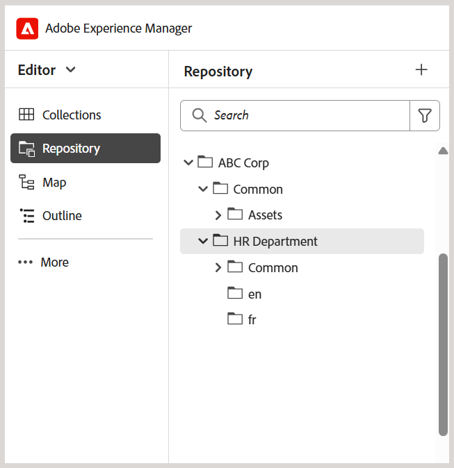

# Bästa tillvägagångssätt för att konfigurera mappstrukturen

I den här artikeln beskrivs viktiga steg och bästa tillvägagångssätt för administratörer när de konfigurerar mappstrukturer i Adobe Experience Manager Guides. En välordnad mapphierarki säkerställer smidiga arbetsflöden för utveckling, publicering och översättning av utbildningsmaterial.

## Konfigurera mappstrukturen

Om du vill tillåta åtkomst till olika redigerings-, publicerings- och översättningsfunktioner i Experience Manager Guides måste du konfigurera mapparna i rätt hierarki enligt anvisningarna nedan.

**Skapa en rotnivåmapp**

Börja med att skapa en rotmapp för din organisation. Detta fungerar som bas för alla mappar på avdelningsnivå och gemensamt delade resurser.

Exempel: `/content/dam/ABC-Corp/`

I den här rotmappen skapar du en dedikerad mapp för att hantera resurser som ska användas på flera avdelningar. Skapa till exempel en **gemensam**-mapp som innehåller delade resurser som bilder, videoklipp med mera.

**Skapa mappar på avdelningsnivå**

Skapa separata mappar för varje avdelning, till exempel HR, Finance och Legal, så att de kan hantera sitt eget innehåll.

*Bildtext: Separat mappstruktur skapad för HR-avdelningen i rotmappen*

**Bästa tillvägagångssätt för att ange mappar på avdelningsnivå**

- Skapa en dedikerad **gemensam** > **resurser**-mapp under varje avdelning för gemensamma resurser på avdelningsnivå (om det behövs).
- Om du vill dela ditt innehåll för översättning skapar du språkspecifika mappar (t.ex. en, de, fr). Författare bör bara skapa eller uppdatera innehåll i källspråksmappen (som en), eftersom innehåll utanför källspråksmappen inte tas med i översättningsarbetsflödet. De andra språkmapparna kan vara tomma som platshållare. Läs mer om [innehållsöversättning](../user-guide/translation.md).
- Behörigheter kan utnyttjas för att begränsa åtkomsten för vissa avdelningar eller användare till den nyligen skapade mappstrukturen. Tilldela till exempel behörigheter så att endast HR-avdelningsanvändare kan skapa eller ändra innehåll i den angivna mappen.

Upprepa samma struktur för andra avdelningar som Ekonomi, Juridik osv.

## Ställ in utdatamappens struktur

Mappen `fm-ditaoutputs` fungerar som standardlagringsplats för genererade utdata från utbildningsinnehåll och utbildningsinnehåll. Dessa utdata innehåller vanligtvis SCORM-paket (ZIP-filer) i mappen **alm** och PDF-filer i mappen **pdf**. Du kan ändra den här standardutdatasökvägen på förinställningsnivå från **kartkonsolen** om det behövs.

När du arbetar med flera avdelningar bör du överväga att skapa avdelningsspecifika mappar i mappstrukturen `fm-ditaoutputs` för att se till att användare inom en viss avdelning har tillgång till de relevanta utdatamapparna.

## Skapa användare och tilldela dem till lämpliga grupper

När mapphierarkin är etablerad kan du börja skapa användare och lägga till dem i grupper så att de har tillgång till relevanta funktioner i Experience Manager Guides. Experience Manager Guides har tre färdiga grupper - författare, granskare och utgivare. Beroende på vilken grupp en användare är kopplad till, kan de utföra specifika åtgärder. Publiceringsåtgärder kan till exempel bara utföras av en utgivare, men inte av en författare.

Om du vill skapa nya användare och lägga till dem i grupper går du till **Verktyg** > **Dokumentskydd** > **Användare**.

På sidan Användarhantering väljer du **Skapa** för att skapa en ny användare. Lägg till användarinformation och tilldela dem till en grupp.

Mer information finns i [Användaradministration och -säkerhet](../cs-install-guide/user-admin-sec.md)

## Tilldela behörigheter till varje användargrupp

När användare har lagts till i lämpliga grupper konfigurerar du behörigheter på gruppnivå för att se till att de har tillgång till rätt redigerings- och utdatamappar i databasen.

Om du vill tilldela behörigheter går du till **Verktyg** > **Dokumentskydd** > **Behörigheter**.

Dessa behörigheter gör att användarna kan skapa och ändra innehåll endast i de mappar de har valt.

Mer information finns i [Behörigheter i AEM](https://experienceleague.adobe.com/sv/docs/experience-manager-65/content/security/security#permissions-in-aem).

