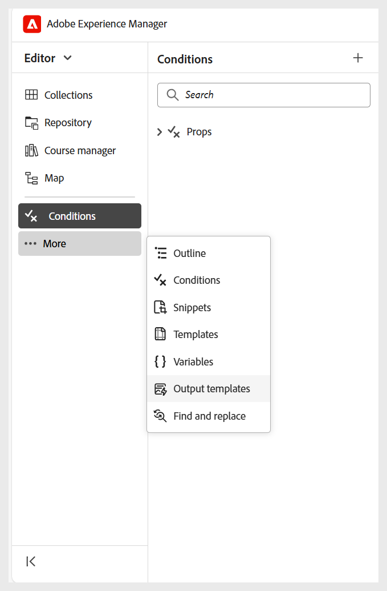
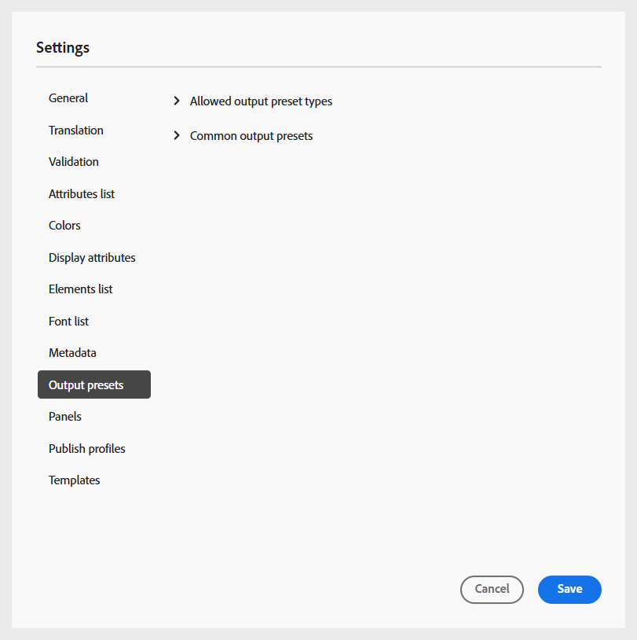

# Konfigurera mappprofiler

Det krävs en mappprofil för att kunna dela upp konfigurationerna för olika avdelningar eller produkter i företaget. För utbildningsmaterial och utbildningsmaterial kan du skapa och konfigurera en profil på mappnivå för att hantera redigeringsmallar, utdatamallar, utdatainställningar och andra inställningar på mappnivå.

Läs mer om [Bästa tillvägagångssätt för att konfigurera mappstrukturen](best-practices-folder-structure.md).

Om du vill komma igång med mappprofilkonfigurationen för utbildningsinnehåll måste du:

1. **Skapa olika mappar för att hantera redigerings- och utdatamallar**: Du kan skapa mappar för författare och utgivare som arbetar i olika avdelningar eller produkter i ditt företag. Mapparna kan mappas till specifika mappprofiler, som alla är konfigurerade med olika skribent- och utdatamallar som har stöd för avdelningsspecifika kurser och decentraliserad administration.

   Du kan skapa en ny mapp från databaspanelen.

   {width="350" align="left"}
2. **Skapa språkmappar för att hantera översättning**: Om du översätter innehåll till olika språk måste du skapa mappar för varje språk. Var och en av dessa språkmappar kommer att innehålla det innehåll som motsvarar det språket.

3. **Skapa en mapp för att hantera Assets**: På samma sätt som för mappar kan du skapa olika Assets-mappar som passar olika avdelningars behov. På så sätt ser du även till att författare och utgivare har tillgång till rätt CSS som konfigurerats i deras mallar, bilder och andra resurser.

   {width="350" align="left"}
4. [Skapa en mappprofil](../cs-install-guide/conf-folder-level.md#create-and-configure-a-folder-level-profile) om du vill mappa olika mappar.
5. **Välj den mappprofil som ska konfigureras**: När mappprofilen har skapats måste du välja mappprofilen på sidan [Användarinställningar](../user-guide/intro-home-page.md#user-preferences) för att se till att författare och utgivare har tillgång till rätt mallar.

   {width="650" align="left"}

6. **Konfigurera mappprofilinställningar**: Följande inställningar kan konfigureras på mappnivå för utbildningsinnehåll och utbildningsinnehåll:
   - [Paneler](#configure-panels)
   - [Mallar](#configure-templates)
   - [Utdatainställningar](#configure-output-presets)
   - [HTML-redigerare](#html-editor-settings)
   - [Publicera profiler](#manage-publish-profiles)

Om du vill komma åt de här inställningarna växlar du till redigeringsvyn och väljer **Inställningar** på menyn **Alternativ** enligt nedan:

## Konfigurera paneler

Den här inställningen styr panelerna som visas på den vänstra och högra panelen i **redigeraren** och **kartkonsolen** i Experience Manager Guides. Du kan växla knappen för att visa eller dölja den önskade panelen.

För utbildningsmaterial och utbildningsmaterial ska du se till att endast följande funktioner är aktiverade för redigeraren och kartkonsolen.

{width="350" align="left"}

### Redigerare

**Vänster panel**

- **Samlingar**: Du kan ordna och spara filer som du använder ofta, eller snabbt komma åt delade filer.
- **Databas**: Gör att du kan visa och komma åt alla kartor, ämnen, bilder och andra resurser som lagras i innehållsdatabasen.
- **Kurshanteraren**: Tillhandahåller en dedikerad arbetsyta för att skapa och hantera kurser.
- **Kodavsnitt**: Gör att du kan skapa och återanvända små innehållsfragment för olika ämnen i dina utbildningskurser.
- **Villkor**: Gör att du kan konfigurera villkorliga attribut på global nivå och på mappnivå.
- **Variabler**: Gör att du kan skapa och hantera variabler som ska användas i ditt utbildningsinnehåll.
- **Språkvariabler**: Gör att du kan definiera lokaliserade strängar för publicerade utdata eller statisk text i mallar.
- **Mallar**: Används för att skapa och hantera mallar som ska användas av författarna.
- **Utdatamallar**: Gör att du kan skapa och hantera utdatamallar för att generera utdata i olika format.
- **Sök och ersätt**: Innehåller alternativ för att söka efter och ersätta text mellan filer på en karta eller i en mapp i databasen. 

**Höger panel**

- **Innehållsegenskaper**: Innehåller information om det markerade elementets typ och attribut i redigeraren.
- **Filegenskaper**: Gör att du kan visa och hantera egenskaperna för den markerade filen.
- **Stilar**: Visa de globala klassbaserade formateringsalternativen som du kan använda i ditt utbildningsinnehåll.
- **Filter**: Du kan filtrera innehåll baserat på använda villkor i ett ämnes förhandsgranskningsläge.

### Kartkonsol

**Vänster panel**

- **Förinställningar**: Gör att du kan konfigurera förinställningar för publicering av utbildningskursen.
- **Översättning**: Tillhandahåller alternativ för att översätta ditt innehåll till flera språk.
- **Rapporter**: Gör att du kan generera och hantera rapporter för att få en användbar inblick i innehållets övergripande hälsa i kursen.
- **Villkorsförinställningar**: Innehåller alternativ för att konfigurera villkorsbaserade förinställningar för olika målgrupper, avdelningar och annat.

**Höger panel**

- **Filter**: Gör att du kan använda filter när du arbetar med rapporter och översättning.

## Konfigurera mallar

Med den här inställningen kan du hantera de redigerings- och publiceringsmallar som finns i panelen [Vänster i redigeraren](../user-guide/web-editor-left-panel.md). Du kan lägga till, ta bort eller ändra ordning på skribent- och utdatamallar, som sedan är tillgängliga för författare och utgivare.

{width="350" align="left"}

Redigeringsmallarna finns i fyra kategorier: Utbildningsmaterial, Utbildningsmaterial, Quiz och Frågebank. Om du har konfigurerat några fördefinierade mallar i instansen visas de som standard.

{width="350" align="left"}

### Lägg till mallar

Gör så här för att lägga till en ny mall:

1. Navigera till mallkategorin där du vill lägga till en mall och välj **Lägg till**.
2. Välj önskad mall i dialogrutan Välj bana.
3. Välj **Markera**.

   {width="350" align="left"}

Mallen läggs till i respektive kategori på panelen Inställningar.

På samma sätt kan du lägga till de andra redigerings- och utdatamallarna. När du har lagt till mallarna blir de tillgängliga för författare och utgivare i deras respektive kursdialogrutor. Den mall för utbildningskurser som lagts till av administratören blir till exempel tillgänglig för författare när de skapar en ny kurs.

{width="350" align="left"}

### Arbeta med nya mallar för redigering och utdata

Om du vill använda en annan mall än de som visas i dialogrutan **Välj sökväg** skapar du en anpassad redigerings- eller utdatamall.

**Skapa nya redigeringsmallar**

Om du vill använda en annan mappnings- eller ämnesmall skapar du en ny redigeringsmall på panelen Mallar i Editor. Använd kartmallar för att skapa kurser och ämnesmallar för utbildningsmaterial, kunskapsfrågor och utbildningssammanfattning.

Mer information finns i [Skapa anpassade mallar från redigeraren](../user-guide/create-maps-customized-templates.md).

{width="350" align="left"}

**Skapa nya utdatamallar**

Så här skapar du en ny utdatamall för utbildningsinnehållet:

1. Välj **Mer** > **Utdatamallar** i den vänstra panelen i redigeraren.

   Panelen Utdatamallar visas.

   {width="350" height="" align="left"}
2. Skapa en ny utdatamall genom att välja (+) på panelen Utdatamallar.

   {width="350" align="left"}
3. Välj en utdatamall i listrutan.

   {width="650" align="left"}
4. Baserat på den valda utdatamalltypen visas en dialogruta där du kan skapa en ny mall baserad på de tillgängliga mallarna.

   {width="350" align="left"}

5. Välj **Skapa**.

   En ny utdatamall skapas.

6. Om du vill komma åt och lägga till utdatamallen för utgivare går du till **Inställningar** > **Mallar** > **Utdatamallar** och väljer **Lägg till**.

   {width="350" align="left"}

   Utdatamallen visas i dialogrutan Välj sökväg.
7. Markera mallen och välj **Bekräfta**.

   {width="350" align="left"}

   Den valda utdatamallen läggs nu till på panelen Inställningar.

   {width="350" align="left"}

### Ta bort eller ändra ordning på mallar

När du har lagt till mallar kan du ta bort eller ändra ordning på dem från panelen Inställningar.

Om du vill ta bort en mall markerar du ikonen **Ta bort** bredvid den.

{width="350" align="left"}

Du kan också definiera i vilken ordning mallarna i en kategori ska visas. Om du vill ändra visningsordningen för mallarna markerar du de prickade strecken och drar en mall till önskad plats.

{width="350" align="left"}

## Konfigurera förinställningar för utdata

På fliken Utdataförinställningar kan du definiera vilka utdataformat som är tillgängliga för publicering av en kurs. Den innehåller två avsnitt: **Tillåtna förinställningstyper för utdata** och **Vanliga förinställningar för utdata**.

{width="350" align="left"}

- **Tillåtna förinställningstyper**: I det här avsnittet visas alla förinställningar för utdata som stöds i Experience Manager Guides-instansen. Vid publicering är endast formaten **SCORM** och **PDF** tillämpliga. Du kan välja ett eller båda alternativen. De valda förinställningarna är tillgängliga för utgivare när de genererar kursutdata.

  {width="350" align="left"}

- **Vanliga förinställningar för utdata**: I det här avsnittet visas de förinställningar för utdata som vanligtvis skapas och läggs till av utgivare i en viss mappprofil. Du kan också ta bort förinställningar som inte längre behövs.

  {width="350" align="left"}

## Inställningar för HTML Editor

Med den här inställningen kan du konfigurera redigeraren för HTML-baserad redigering. De viktigaste konfigurationsalternativen i den här inställningen är följande:

{width="350" align="left"}

- **Dölj infogad formatering**: Aktivera det här alternativet om du inte vill att författare ska kunna använda infogad formatering i kursinnehållet. När det här alternativet är aktiverat döljs alla inbyggda formatalternativ som Teckensnitt, Kant, Layout, Bakgrund och Kolumner på den högra panelen i redigeraren för författare. Författare kan dock fortfarande använda de globala klassbaserade formateringsalternativ som finns på panelen **Format**. Detta bidrar till att upprätthålla enhetligheten med organisationens riktlinjer för stil.
- **Dölj Source-vyn för författare**: Aktivera det här alternativet om du vill begränsa åtkomsten till HTML källkod. Detta är användbart när du vill förenkla redigeringen eller undvika oavsiktliga ändringar av den underliggande koden.

## Hantera publiceringsprofiler

I det här avsnittet kan du visa, skapa och hantera publiceringsprofiler som används för att publicera kurser i SCORM Cloud. Varje profil definierar de anslutningsinställningar och den konfigurationsinformation som krävs för att publicera en kurs i en specifik SCORM Cloud-miljö.

Du kan skapa flera profiler om du behöver publicera till olika SCORM Cloud-konton, vilket ger flexibilitet och kontroll över publiceringsprocessen.

Ange serverinformationen tillsammans med klient-ID och klienthemlighet för det associerade SCORM-molnprogrammet för att konfigurera publiceringsprofilen för SCORM-molnet.

{width="350" align="left"}
