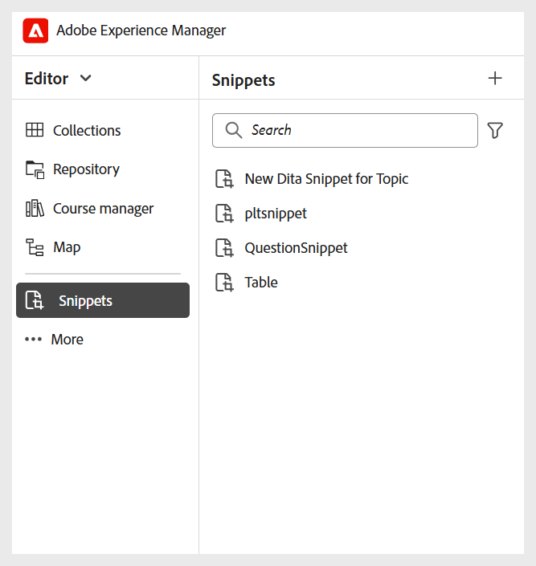
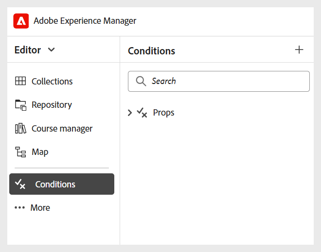

# Konfigurera andra inställningar

Som administratör kan du även konfigurera följande inställningar för Lärarskapare och utgivare:

- **Mappinställningar**
   - **Skapa olika mappar**: Du kan skapa mappar för författare och utgivare som arbetar i olika avdelningar eller produkter i ditt företag. Mapparna kan mappas till specifika mappprofiler, som alla är konfigurerade med olika skribent- och utdatamallar som har stöd för avdelningsspecifika kurser och decentraliserad administration.

     Du kan skapa en ny mapp från databaspanelen.

     {width="350" align="left"}
   - **Skapa språkmappar**: Om du översätter innehåll till olika språk måste du skapa mappar för varje språk. Var och en av dessa språkmappar kommer att innehålla det innehåll som motsvarar det språket.

     Mer information finns i [Bästa tillvägagångssätt för innehållsöversättning](../user-guide/translation-first-time.md).
   - **Assets-hantering**: På samma sätt som för mappar kan du skapa olika Assets-mappar som passar olika avdelningars behov. På så sätt ser du även till att författare och utgivare har tillgång till rätt CSS som konfigurerats i deras mallar, bilder och andra resurser.

     {width="350" align="left"}
- **Kodavsnitt**: Du kan konfigurera kodavsnitt på mappnivå för att se till att författare har tillgång till rätt kodavsnitt. Endast administratörer kan skapa kodfragment i Experience Manager Guides, som sedan kan användas av författare i redigeraren.

  Du kommer åt Fragment från den vänstra panelen i Editor.

  {width="350" align="left"}
- **Villkor**: Som administratör kan du konfigurera villkorliga attribut som stöds av DITA på global nivå eller mappnivå. Författarna använder sedan de konfigurerade villkoren genom att helt enkelt dra och släppa det önskade villkoret i innehållet.

  Du kommer åt Villkor från den vänstra panelen i Redigeraren.

  {width="350" align="left"}
- **Variabler**: Du kan definiera variabler för att göra innehållet mer portabelt, konsekvent och enklare att uppdatera. Vid generering av utdata ersätts variablerna med värdena från den valda variabeluppsättningen, vilket gör att du kan producera anpassade utdata effektivt.

  Mer information finns i [Skapa en ny variabel](../native-pdf/native-pdf-variables.md#create-a-new-variable)

- **Redigerarens verktygsfält**: Du kan anpassa redigerarens verktygsfält efter organisationens behov. Du kan till exempel föredra att ändra namnet på en verktygsfältsknapp, ändra dess placering och så vidare.

  Mer information finns i [Konfigurera och anpassa XML-redigeraren](../cs-install-guide/conf-folder-level.md#configure-and-customize-the-xml-editor-id2065g300o5z).
