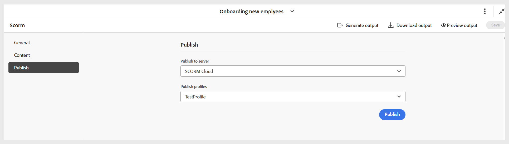

# Konfigurera förinställning för SCORM-utdata

När du har skapat förinställningen konfigurerar du inställningarna för SCORM-förinställningen. De förinställda konfigurationsalternativen är ordnade på flikarna Allmänt, Innehåll och Publicera.

- **Allmänt:** Används för att ange grundläggande utdatainställningar, till exempel vilken version som stöds, utdatasökväg, ZIP-filnamn, utdatamall och annat.

  {width="650" align="left"}

- **Innehåll:** Används för att ange tillgänglig villkorsstyrd filtrering (med DITAVAL eller med någon villkorsförinställning) och variabeluppsättningen.

  {width="650" align="left"}

- **Publicera:** Använd bara den här inställningen om du vill publicera utdata till SCORM Cloud för direkt åtkomst.

  {width="650" align="left"}

När alla ändringar har konfigurerats sparar du ändringarna för SCORM-förinställningen med **Spara** till höger i verktygsfältet på sidan SCORM-förinställning.
