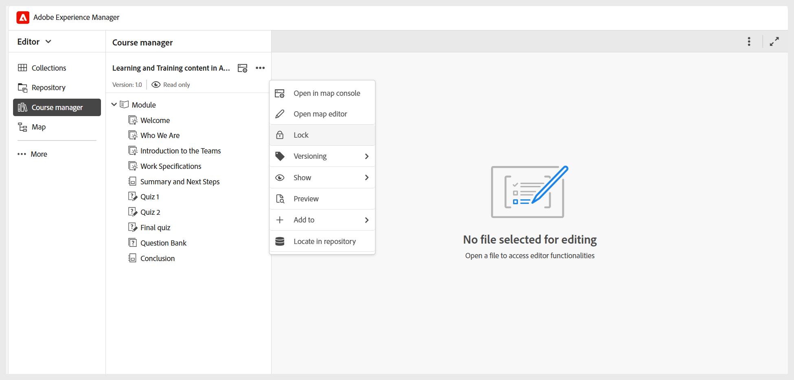

# Lär dig grunderna i kurshanteraren

**Kurshanteraren** är din centrala arbetsyta för att skapa och hantera kurser. När du skapar en ny kurs öppnas den automatiskt i kurshanteringspanelen där du kan börja skapa kursen.

När du arbetar med kurshanteraren bör du tänka på följande:

- Kursen öppnas i skrivskyddat läge och version 1.0 tilldelas automatiskt, vilket anger den inledande versionen av kursen.
- Om du vill kunna redigera en kurs måste du hämta ett lås från menyn **Alternativ** . När kursen är låst kan du börja lägga till ämnen eller redigera befintliga ämnen som finns i kursen.

  
- Ikonen **Kartkonsol** på panelen tar dig till kartkonsolen, där de förinställningar som konfigurerats av administratören visas. Du kan även komma åt **kartkonsolen** från menyn **Alternativ** .