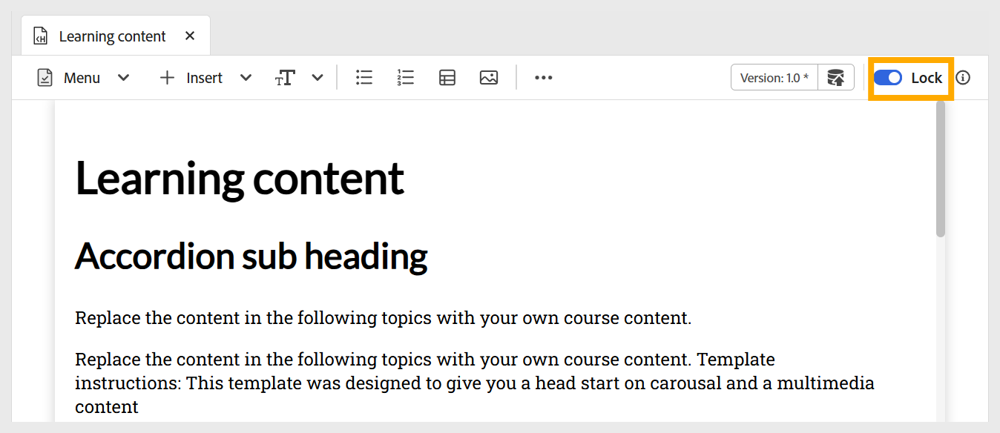

# Redigera ämne

Utför följande steg för att redigera ämnet:

1. Dubbelklicka på ämnet för att öppna det från kurshanterarpanelen.
1. Du måste **låsa** ämnet med hjälp av växlingsknappen som visas nedan. På så sätt kan du redigera innehållet, och ingen annan kan göra några ändringar i det här ämnet.

   {width="650" align="left"}

1. Om du vill lägga till innehåll i ett ämne kan du [lägga till grundläggande byggstenar](./lc-basic-blocks.md), till exempel text, multimedia och olika [interaktiva widgetar](./lc-widgets.md).
1. Om du vill spara ditt arbete använder du **Spara som ny version** och skapar en ny version, eller trycker på `Ctrl+S` och skriver över den befintliga filen.

   {width="650" align="left"}

1. När du har sparat innehållet kan du **Lås upp** ämnet som andra kan redigera.
