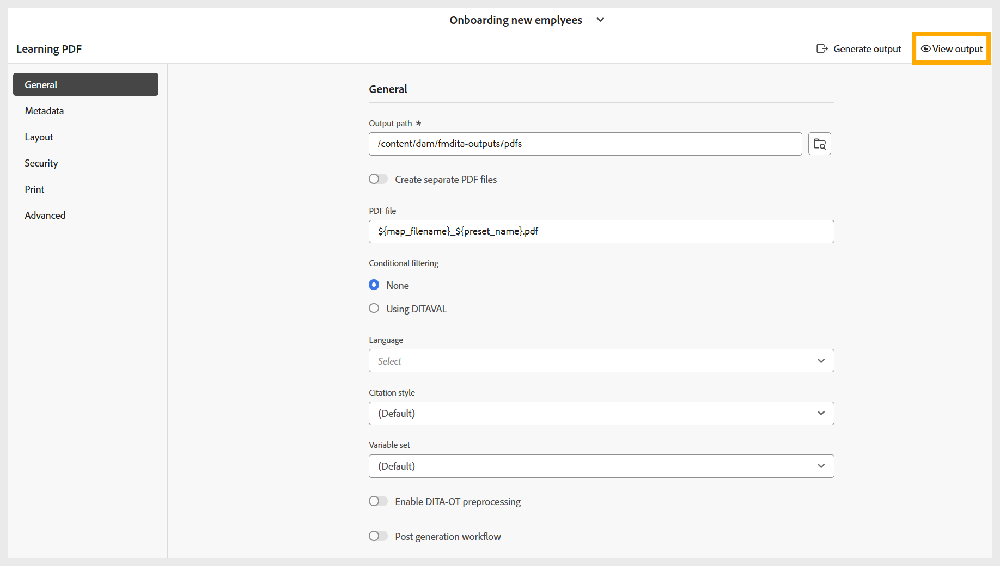

# Generera PDF

Så här skapar du en PDF:

1. När du har konfigurerat alla nödvändiga inställningar för PDF-utdata baserat på dina inställningar går du till verktygsfältet på sidan med PDF förinställningar.
1. Välj **Generera utdata**.

   {width="650" align="left"}

1. När genereringen är klar visas ett meddelande som bekräftar att PDF har skapats.

   {width="350" align="left"}

1. Du kan hämta PDF genom att välja **Visa utdata** i meddelandet och i verktygsfältet.

   {width="650" align="left"}
