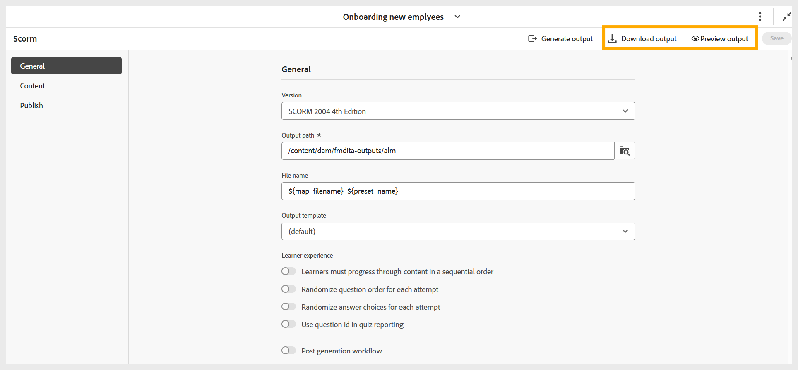

# Generera SCORM-utdata

Så här skapar du SCORM-utdata:

1. När du har konfigurerat alla nödvändiga inställningar för SCORM-utdata baserat på dina inställningar, navigerar du till verktygsfältet på sidan SCORM-förinställning.
1. Välj **Generera utdata**.

   {width="650" align="left"}

1. När genereringen är klar visas ett meddelande som bekräftar att filen **filename.zip** har skapats. Du kan förhandsgranska utdata med **Visa utdata** i meddelandet.

   {width="350" align="left"}

1. Du kan hämta eller förhandsgranska utdata genom att välja **Hämta utdata** respektive **Förhandsgranska utdata**.

   {width="650" align="left"}

Du kan överföra ZIP-filen till ditt LMS-system för att göra kursen tillgänglig för dina elever.

