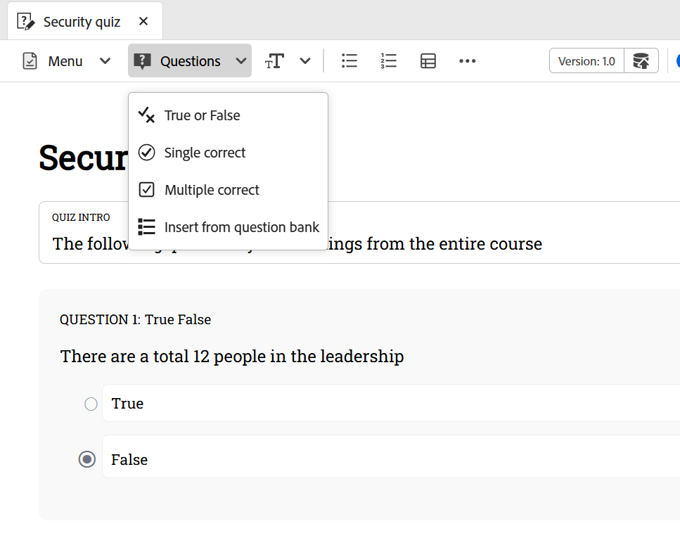

# Infoga frågor från frågebanken

Följ de här stegen för att infoga frågor från frågebanken i frågeformuläret:

1. Välj alternativet **Infoga från frågebank** i listrutan **Frågor** i verktygsfältet enligt nedan.

   {width="350" align="left"}

   Dialogrutan **Infoga från HTML frågebank** visas.

1. Ange sökvägen till frågebanken som är lagrad i din databas och välj de frågor som du vill lägga in i ditt frågeformulär, som visas nedan. Du kan också välja alla frågor för frågebanken med **Markera alla**.

   {width="650" align="left"}

1. De markerade frågorna infogas i frågeformuläret med en blå markering, vilket anger att de inte går att redigera. De visas dock normalt i publicerade utdata.

   {width="650" align="left"}

1. Dessutom kan du aktivera alternativet **Välj slumpmässig fråga** med hjälp av växlingsknappen. När du har aktiverat kan du definiera antalet frågor som ska väljas slumpmässigt. Frågeformuläret visar sedan en platshållare som anger att en slumpmässig fråga har infogats, vilket visas på den andra skärmbilden. Under publiceringen väljs automatiskt och infogas det angivna antalet slumpmässiga frågor från frågesajten.

   {width="650" align="left"}

   De slumpmässiga frågorna läggs till i frågeformuläret enligt nedan.

   {width="650" align="left"}

Om du vill få en snabb videoöversikt kan du visa [Infoga frågor från frågebanken](https://video.tv.adobe.com/v/3475212/learning-content-aem-guides) .
