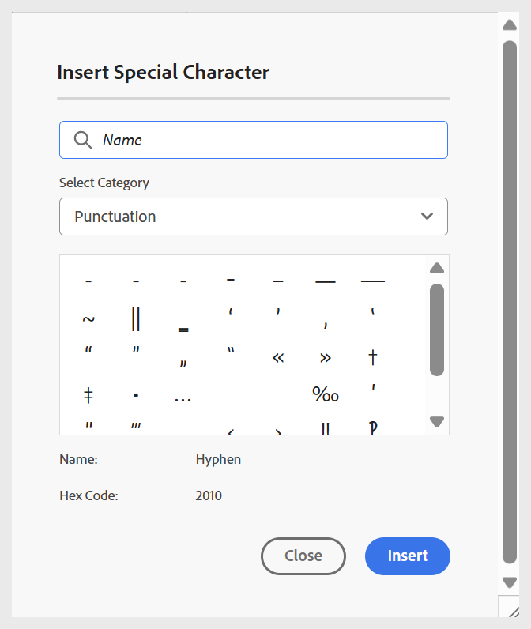
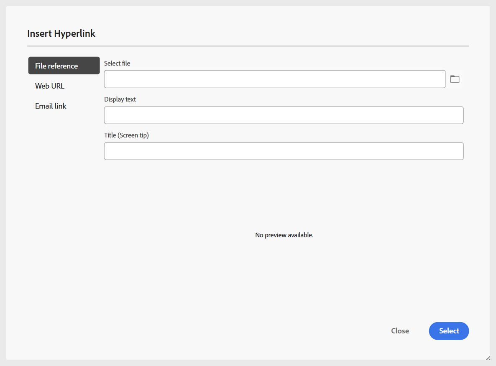

# Lägg till grundläggande byggstenar i ditt ämne

I följande video ges en kort översikt över de tillgängliga funktionerna så att du får en bättre förståelse för hur du skapar ett utbildningsämne och lägger till grundläggande byggstenar i det.

>[!VIDEO](https://video.tv.adobe.com/v/3469535/learning-content-aem-guides)

Du kan använda de grundläggande redigeringsfunktionerna som finns i redigeringsverktygsfältet enligt beskrivningen nedan:

- **Infoga-alternativ**: Tillhandahåller alternativ för att lägga till [lägga till interaktiva widgetar](./lc-widgets.md) som dragspelspanel, Carousel, HotSpot, Tabbar, Flip-kort och Click-objekt, samt [strukturella element](./lc-other-insert-options.md) som Iframe, Block Quotes, Code Block med mera. Använd den här menyn för att lägga till funktionalitet och variation i undervisningsmaterialet, så att det blir engagerande och välstrukturerat.

  {width="650" align="left"}

- **Textkomponenter**: Lägger till rubrik, stycke, inline-citat, upphöjd, nedsänkt och citat i innehållet.

  >[!NOTE]
  >
  > Du kan även inkludera en titel och en undertitel i ditt utbildningsinnehåll. Mer information om hur du lägger till den i innehållet finns i [Lägg till rubrik och underrubrik i utbildningsinnehåll](#add-title-and-subtitle-to-learning-content).

  {width="650" align="left"}

- **Numrerad lista**: Lägger till en osorterad lista i innehållet.

  {width="650" align="left"}

- **Numrerad lista**: Infogar en numrerad lista i innehållet.

  {width="650" align="left"}

- **Tabell**: Infogar en tabell med nödvändiga dimensioner i innehållet. Du kan hantera olika tabellegenskaper ytterligare med panelen **Innehållsegenskaper** som visas nedan.

  {width="650" align="left"}

- **Bild**: Infoga bilder i innehållet tillsammans med alternativ text och ett skärmtips. Du kan lägga till bilder från databasen eller via en extern URL. Dessutom kan bildegenskaper ändras med panelen **Innehållsegenskaper** .

  {width="650" align="left"}

- **Multimedia**: Lägger till video och ljud i innehållet. Du kan anpassa deras egenskaper med panelen **Innehållsegenskaper** .

  {width="650" align="left"}

- **Återanvändbart innehåll**: Gör att du kan införliva befintligt innehåll från dina resurser eller din databas för återanvändning. Följ de här stegen för att infoga ett återanvändbart innehåll:

   1. Välj **Återanvändbart innehåll** i verktygsfältet.
Dialogrutan **Återanvänd innehåll** öppnas.
   2. Navigera och markera det önskade ämnet för att inkludera innehållet i kursen.
   3. Markera ID:t för det innehåll som du vill lägga till. En förhandsvisning visas tillsammans som referens.

      {width="650" align="left"}

   4. Välj **Markera**.

  Innehållet infogas. Avsnittet om fordonsstruktur är t.ex. en innehållspunkt som återanvänds och läggs till i kursens ämne. Typen visas som **Referens** och dess **ID** återspeglas i panelen **Innehållsegenskaper**.

  {width="650" align="left"}

- **Symboler**: Lägger till valfria symboler i innehållet från en lista enligt nedan.

  {width="350" align="left"}

- **Hyperlänkar**: Lägger till hyperlänkar till den önskade platsen i ditt innehåll. Det kan vara en filreferens, en webb-URL eller en e-postlänk enligt nedan.

  {width="650" align="left"}

Dessutom ger listrutan **Meny** åtkomst till redigeringsåtgärderna (Klipp ut, Kopiera, Ta bort), Sök och ersätt och Versionsetikett.

## Lägga till titel och underrubrik i undervisningen

Följ de här stegen för att inkludera titel och underrubrik i ditt utbildningsinnehåll:

1. Öppna kursen i kartkonsolen.
1. Öppna ämnet, frågeformuläret eller någon annan kurskomponent där du vill lägga till en titel eller en undertitel.
1. Navigera till panelen File-egenskaper och välj **Lägg till titel**.

   
1. Välj om du vill använda den befintliga rubriken som rubrik när du uppmanas till det.

   >[!NOTE]
   >
   > Om du inte vill använda den befintliga rubriken som rubrik infogar du först en rubrik med komponenten Text i redigerarens verktygsfält och väljer sedan **Lägg till rubrik**. Detta lägger till ett exempel **Rubrik** som läggs till i innehållet, som du kan redigera efter behov.
1. Välj **Lägg till underrubrik** i filegenskaperna.
Ett exempel på **underrubrik** har lagts till i innehållet.

   

Om du vill ta bort en titel avmarkerar du alternativet **Lägg till titel** i filegenskaperna. Om du tar bort titeln tas den tillhörande underrubriken automatiskt bort.

