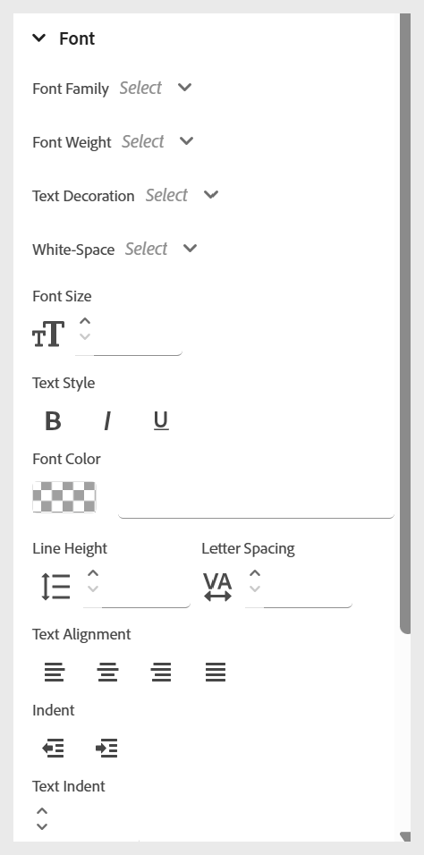
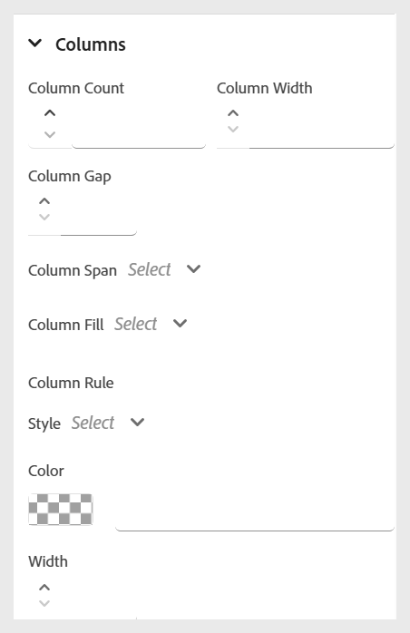

# Använda textbundna format

Använd textbundna format för att anpassa utseendet på viss text direkt i kursinnehållet. På så sätt kan du göra snabba formateringsjusteringar som teckenstorlek, färg, justering med mera. Du kan ändra textbundna format för den markerade texten med panelen **Innehållsegenskaper** .

>[!NOTE]
>
> Dessa formatalternativ visas bara om de har aktiverats av administratören.

>[!VIDEO](https://video.tv.adobe.com/v/3469533/aem-guides-learning-content)

Följande alternativ för textbundna format är tillgängliga.

{width="350" align="left"}

- **Teckensnitt:** Används för att anpassa textutseendet med olika alternativ som teckensnittsfamilj, teckenbredd, textdekoration, teckensnittsstorlek med mera. Dessa inställningar hjälper dig att formatera ditt innehåll så som visas i exemplet nedan.

  {width="350" align="left"}

- **Kant**: Gör att du kan definiera och anpassa kanten för ett element med alternativ som kant, bredd, stil (heldragen, streckad, prickad med mera), färg. Med de här inställningarna kan du visuellt separera eller markera specifika avsnitt av innehållet.

  {width="350" align="left"}

- **Layout**: Hjälper dig att styra placeringen och mellanrummet för element i innehållet. Du kan justera egenskaper som marginaler, utfyllnad, justering, visningstyp med mera. för att organisera innehållsstrukturen effektivt.

  {width="350" align="left"}

- **Bakgrund**: Gör att du kan anpassa bakgrunden för ett element genom att ange alternativ som bakgrundsfärg, bild, position och upprepningsformat. De här inställningarna gör innehållet snyggare och tydligare.

  {width="350" align="left"}

- **Kolumn**: Gör att du kan ordna innehåll i flera kolumner. Du kan justera antalet kolumner, mellanrummet mellan dem, kolumnbredden och mycket mer. för att förbättra läsbarheten och layoutstrukturen i innehållet.

  {width="350" align="left"}
