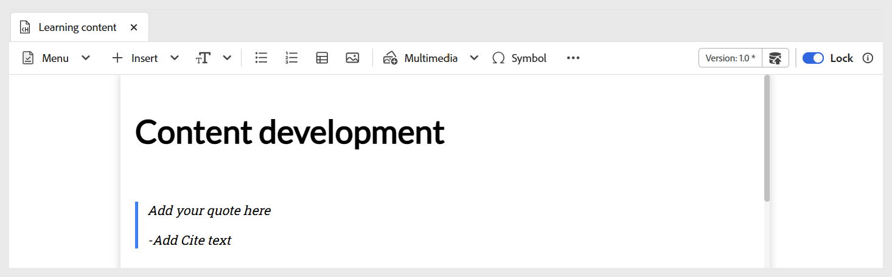
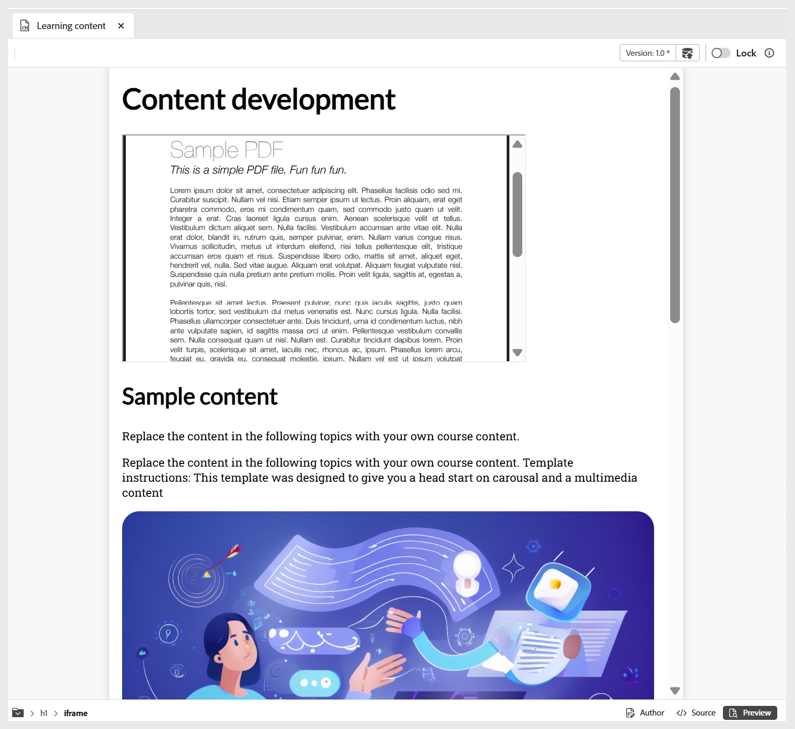

# Andra alternativ på Infoga-menyn

De andra alternativen som är tillgängliga på menyn Infoga i redigerarens verktygsfält är:

- **Blockcitattecken:** Lägger till blockcitattecken tillsammans med citattecken i innehållet.

  {width="650" align="left"}

- **Kodblock:** Lägger till ett kodblock i innehållet.

  {width="650" align="left"}

- **Iframes:** Infogar en iframe i innehållet för att bädda in externa webbsidor eller interaktiva resurser. Du kan konfigurera iframe-egenskaperna med panelen **Innehållsegenskaper** , inklusive käll-URL:en, bredden, höjden, justeringen och titeln. Du kan visa innehållet som lagts till i iframe genom att växla till **förhandsgranskningsläget** enligt nedan.

  Vyn **Författare**:

  {width="650" align="left"}

  **Förhandsgranska**-läge:

  {width="650" align="left"}

- **H5P:** Lägger till interaktivt H5P-paket i ditt utbildningsinnehåll. Om du vill lägga till H5P-innehåll placerar du markören på önskad plats och väljer **H5P** på Infoga-menyn. I dialogrutan Infoga H5P anger du en referens till den H5P-fil som du vill lägga till i utbildningsinnehållet.

  

  Om du föredrar att använda H5P-innehållet från datorn ska du först [överföra filen i DAM](../user-guide/authoring-upload-existing-files.md) med alternativet **Överför resurser** och sedan låta den ingå i databasvyn/Assets.

  

  När du är klar granskar du H5P-innehållet i förhandsgranskningsläget och publicerade utdata.

  >[!NOTE]
  >
  > Det går inte att redigera eller skapa H5P-innehåll i Adobe Experience Manager Guides. Förbered H5P-paketet externt innan du överför det.

- **Matematisk ekvation:** Infogar MathML-ekvationer i ditt innehåll. Du kan skapa en MathML-ekvation och välja **Infoga** för att lägga till den i dokumentet.

  {width="350" align="left"}

  Ekvationen infogas med ljusgrå bakgrund. Du kan när som helst uppdatera en ekvation genom att högerklicka på en befintlig ekvation och välja **Redigera matematisk ekvation** på snabbmenyn. Mer information om hur du validerar MathML-ekvationer i Experience Manager Guides finns i [Validering av ekvationer i MathML-redigeraren](../user-guide/web-editor-other-features.md#validation-of-equations-in-the-mathml-editor).

- **Kunskapskontroll:** Gör att du kan lägga till frågor i tillgängliga format (Enkelkorrigering, Flera korrigeringar, Sant/falskt, Matcha följande eller infoga från frågebanken) i ditt ämne för granskning och bekräfta förståelsen utan klassificering eller rapportering. Dessa frågor speglar standardformat och utesluter poängsättning, vilket gör dem idealiska för självbedömning och lämpliga som en del av kursinnehållet eller ett ämne före ett prov eller en utvärdering senare, efter behov.

  {width="650" align="left"}

  Du kan konfigurera korrekta svar och andra obligatoriska fält via panelen **Innehållsegenskaper**. Mer information finns i [Frågetyper](./quiz-insert-questions.md). Du kan lägga till olika frågetyper med alternativen för kunskapskontroll enligt nedan.

  {width="650" align="left"}

- **Indatafält:** Lägger till ett textinmatningsfält tillsammans med en knapp i innehållet. Du kan använda den här kombinationen för att hämta användarindata och aktivera specifika åtgärder. En uppspelningsknapp läggs till i innehållet enligt nedan.

  {width="650" align="left"}

- **Fler alternativ:** Du har ytterligare alternativ för att förbättra ditt utbildningsinnehåll, bland annat infoga en vågrät linje, radbrytning, textruta, positionerad textruta och inbäddad HTML.

  {width="650" align="left"}
