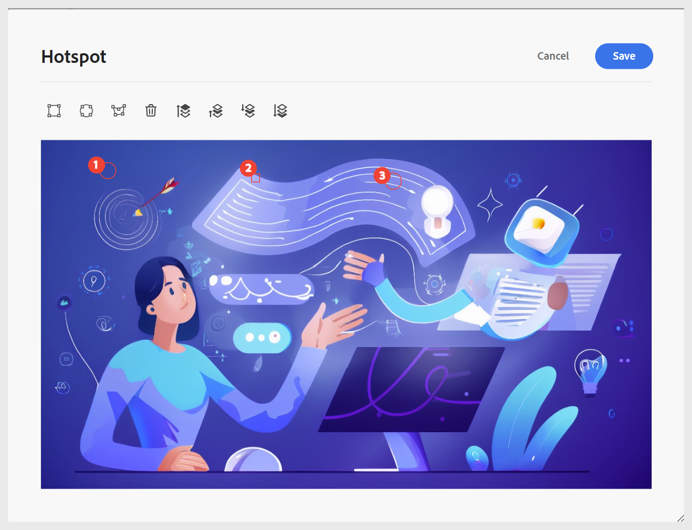

# Använda interaktiva widgetar

Du kan förbättra utbildningsinnehållet genom att lägga till flera widgetar för att göra kursen mer interaktiv. Välj menyn **Infoga** i verktygsfältet för att komma åt widgetarna. De tillgängliga widgetarna är:

- **Dragspel:** Lägger till ett dragspel i innehållet. Du kan infoga lämplig text i både dragspelsrubriken och dess brödtext. Dess egenskaper kan hanteras med panelen **Innehållsegenskaper**, inklusive alternativ för att tillåta att enstaka eller flera dragspelspaneler öppnas samtidigt samt för att lägga till eller ta bort element.

  {width="650" align="left"}

- **Carousel:** Lägger till Carousel i innehållet. Du kan infoga lämplig text både i korttiteln och i brödtexten. Dess egenskaper kan hanteras med panelen **Innehållsegenskaper** , inklusive alternativ för att lägga till eller ta bort element.

  {width="650" align="left"}

- **Aktiveringspunkter:** Lägg till aktiveringspunkter i en markerad bild. Börja med att välja en bild och gå sedan till **Infoga > Aktiveringspunkt**. Då öppnas dialogrutan Aktiveringspunkt, där du kan konfigurera olika alternativ, till exempel ställa in olika hotspot-storlekar, lägga till motsvarande länkar och justera lagret genom att flytta områden framåt eller bakåt.

  {width="650" align="left"}

- **Blockcitattecken:** Lägger till blockcitattecken tillsammans med citattecken i innehållet.

  {width="650" align="left"}

- **Kodblock:** Lägger till ett kodblock i innehållet.

  {width="650" align="left"}

- **Iframes:** Infoga en iframe i innehållet för att bädda in externa webbsidor eller interaktiva resurser. Du kan konfigurera iframe-egenskaperna med panelen **Innehållsegenskaper** , inklusive käll-URL:en, bredden, höjden, justeringen och titeln. Du kan visa innehållet som lagts till i iframe genom att växla till **förhandsgranskningsläget** enligt nedan.

  Vyn **Författare**:

  {width="650" align="left"}

  **Förhandsgranska**-läge:

  {width="650" align="left"}

- **Indatafält:** Lägg till ett textinmatningsfält tillsammans med en knapp i innehållet. Du kan använda den här kombinationen för att hämta användarindata och aktivera specifika åtgärder. En uppspelningsknapp läggs till i innehållet enligt nedan.

  {width="650" align="left"}

- **Fler alternativ:** Du har ytterligare alternativ för att förbättra ditt utbildningsinnehåll, bland annat infoga en vågrät linje, radbrytning, textruta, positionerad textruta och inbäddad HTML.

  {width="650" align="left"}
