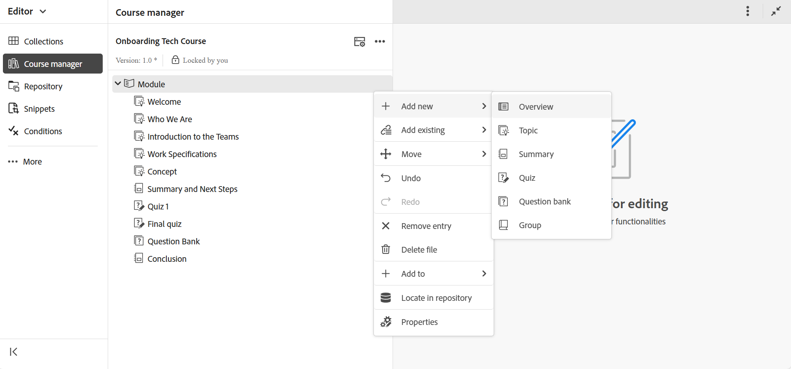
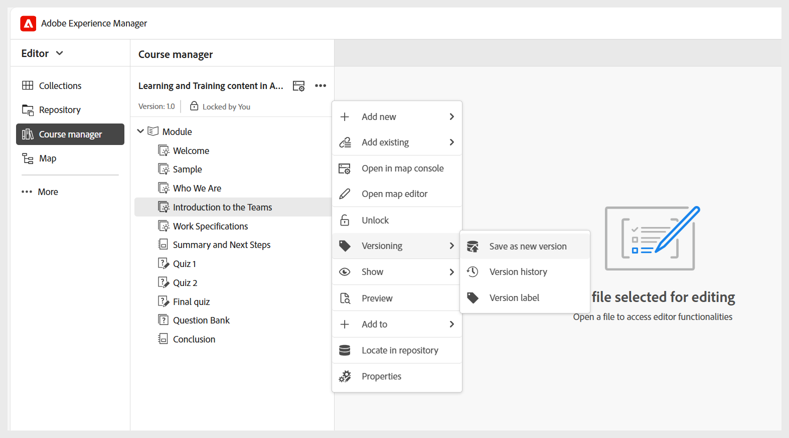

# Hantera din kurs

När du har skapat en kurs öppnas den på kurshanterarpanelen. Du kan låsa kursen och göra alla nödvändiga ändringar på kursnivå. I följande avsnitt beskrivs de tillgängliga alternativen för att redigera kursen.

## Lägg till nytt innehåll

Gör så här för att lägga till nytt innehåll i kursen:

1. Välj menyn **Alternativ** > **Lägg till ny**.

   
2. Välj den typ av innehåll som du vill skapa. De tillgängliga alternativen är:
   - **Översikt**: Det första ämnet i kursen som ger en snabb introduktion till vad kursen omfattar.
   - **Ämne**: Huvudmaterialet i en kurs består av korta, fokuserade delar som steg, exempel eller förklaringar som lär ut en viss skicklighet eller idé. Mer information finns i [Skapa och anpassa ämne](./create-content.md).
   - **Sammanfattning**: En snabb genomgång i slutet av ett kurskapitel som påminner eleverna om de viktigaste punkterna de just lärt sig.
   - **Quiz**: En uppsättning frågor som används för att kontrollera hur väl någon förstår vad de har lärt sig. Mer information finns i [Skapa och hantera frågor](./create-quiz.md).
   - **Frågebank**: En delad pool med återanvändbara frågor som kan användas för att skapa frågor snabbt och konsekvent. Mer information finns i [Frågebank](./create-qb.md).
   - **Grupp**: En utbildningsgrupp hjälper dig att ordna relaterade ämnen som kapitel, ämnen och andra moduler i en logisk ordning och skapar en tydlig hierarki som gör det enklare att hantera och återanvända utbildningsmaterial.
3. Välj **Skapa**.

Det markerade innehållet skapas och läggs till i kursen. Om du vill se en videoöversikt kan du visa [Lägga till nytt innehåll i en kurs](https://video.tv.adobe.com/v/3469537/aem-guides-learning-content?quality=12&learn=on) .

## Lägg till befintligt innehåll

Du kan lägga till befintligt innehåll från din innehållsdatabas i kursen. Gör så här för att lägga till befintligt innehåll:

1. Välj menyn **Alternativ** > **Lägg till befintlig**.
2. Välj vilken typ av kursinnehåll du vill skapa.
3. I dialogrutan **Välj sökväg** navigerar du till innehållsplatsen och väljer önskat utbildningsinnehåll.

   
4. Välj **Markera**.

Det valda kursinnehållet läggs till kursen från databasen.

>[!NOTE]
>
>Du kan också använda alternativet **Lägg till befintlig** > **Fil (endast resursen)** för att inkludera en ZIP-fil som packas upp och integreras i mappstrukturen för den slutliga SCORM-utdatafilen. Detta effektiviserar resursanvändningen under kurspubliceringen.

Visa [Lägg till befintligt innehåll i en kurs](https://video.tv.adobe.com/v/3469537/aem-guides-learning-content?quality=12&learn=on)  om du vill se en videoöversikt.

## Ta bort innehåll

Du kan ta bort alla ämnen från kursen genom att välja menyn **Alternativ** för det specifika ämnet och sedan välja **Ta bort post** enligt nedan.

Om du vill se en videoöversikt kan du visa [Ta bort innehåll från kursen](https://video.tv.adobe.com/v/3475210/learning-content-aem-guides) .

## Skapa kursversioner

Du kan styra versionshanteringen av kursen genom att välja menyn **Alternativ** > **Versionshantering** .

Du får följande alternativ för att versionshantera en kurs:

- **Spara som ny version**: Sparar kursen med ett nytt versionsnummer.
- **Versionshistorik**: Visar förhandsgranskningen av den aktuella versionen och gör det även möjligt att jämföra den med andra tillgängliga versioner för kursen.
- **Versionsetikett**: Gör att du kan ange etiketter i ett friformstextformat eller använda en uppsättning fördefinierade etiketter.

## Visningsinställningar: Visa

Alternativet **Visa** avgör hur ämnen visas. Du kan välja att presentera dem med kryssrutor för flera ämnesval, numrering för att ange hierarkisk struktur, eller genom att visa antingen ämnestiteln eller filnamnet.

>[!NOTE]
>
> De här visningsinställningarna används endast i kurshanteraren och påverkar inte publicerade utdata.

Visa [Visa inställningar](https://video.tv.adobe.com/v/3475210/learning-content-aem-guides)  om du vill se en videoöversikt.

## Skapa granskningsaktivitet

Som författare till en utbildningskurs eller administratör kan du skapa en granskningsuppgift för kursen och tilldela den till en granskare för feedback. Börja med att öppna kursen på panelen **Kurshanteraren** och välj sedan **Skapa granskningsaktivitet** på menyn **Alternativ** enligt nedan:

Du dirigeras till sidan **Skapa granskningsaktivitet** där du måste lägga till uppgiftsinformation, till exempel granskningsaktivitetens titel, ange DITA-projektet som aktiviteten ingår i, definiera tidslinjer för uppgifter, tilldela granskare och mycket annat. När du är klar får granskarna ett meddelande om detta. De valda kurserna öppnas i granskningsgränssnittet där granskarna kan lägga till kommentarer och skicka tillbaka ämnen för uppdateringar.

Om du vill veta mer om granskningsarbetsflödet i Experience Manager Guides kan du visa [Skicka ämnen för granskning](../user-guide/review-send-topics-for-review.md).

