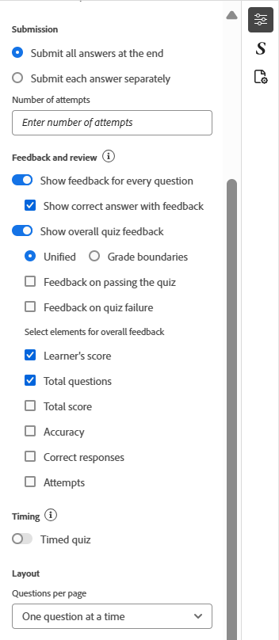

# Frågeformulärsegenskaper

Du kan konfigurera frågeformulärsegenskaperna med följande alternativ:

- Placera markören på frågetiteln eller frågeformuläret i rutan och öppna sedan panelen **Innehållsegenskaper** från den högra panelen. Du kan redigera frågeformulärsegenskaperna härifrån.

  {width="650" align="left"}

- Se till att frågetiteln och introduktionen inte lämnas tomma när du redigerar frågeformuläret, som de visas på den första bilden i det publicerade frågeformuläret. Om de tas bort av misstag kan du återställa dem genom att välja alternativen **Lägg till frågetitel** och **Lägg till frågesport**.
- Du kan aktivera klassificering för ditt frågeformulär genom att aktivera alternativet **Graderad fråga**. När du har aktiverat kan du välja klassificeringsmetoden, antingen procentbaserad eller absolut, och definiera sändningsvillkoren därefter.

  {width="350" align="left"}

- Du kan också konfigurera ytterligare inställningar som alternativ för att skicka svar, alternativ för feedback och granskning, timinginställningar för frågor och layout enligt nedan.

  {width="350" height="200" align="left"}

- Du kan använda alternativet **Tillåt innehållsåterbesök** i Frågegenskaper för att granska kursinnehåll under en pågående fråga, ungefär som ett öppet boktest. När det här alternativet är aktiverat kan du inte konfigurera sändningsalternativ och timingfunktionen för frågor är inaktiverad.
  {width="350" height="200" align="left"}
