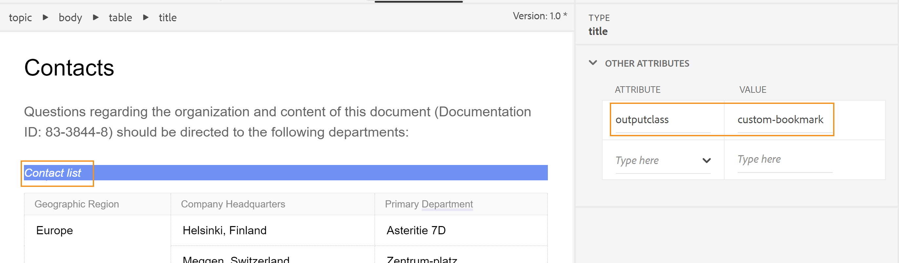

# Lägga till ett anpassat bokmärke i PDF-utdata

Vanligtvis replikeras innehållsförteckningen i en DITA-karta som bokmärken i den slutliga PDF-utdatafilen, inklusive rubriken **Innehåll** som öppnar innehållsförteckningssidan när den är markerad. Innehållsförteckningen skapas utifrån avsnittet eller avsnittsrubrikerna på din DITA-karta.

Ibland kanske du vill lägga till ett eget bokmärke för ett visst innehåll i PDF-utdata för enkel navigering. Detta kan uppnås genom att lägga till ett `outputclass`-attribut i elementet och tillämpa följande attribut på det:

`bookmark-level: 3`

Här är `bookmark-level` ett attribut och nummer `3` är det värde som anger nivån i bokmärkeshierarkin där bokmärket läggs till. I följande exempel innehåller ämnet Kontakter på första nivån en tabell, Kontaktlista, där vi har lagt till ett `outputclass`-attribut med värdet `custom-bookmark`.




Följande definition av klassen `custom-bookmark` har lagts till i CSS-filen:

```css
…
/*Adding a custom bookmark*/
.custom-bookmark{
    bookmark-level: 2
}
…
```

I PDF-utdata läggs tabellen *Kontaktlista* till på den andra nivån i PDF bokmärkeslista, enligt nedan:

 {width="300" align="left"}

>[!NOTE]
>
>Du måste välja rätt nivå där det anpassade bokmärket ska läggas till. Om du anger ett tal som är mindre än det överordnade objektets bokmärke, får det anpassade bokmärket det överordnade bokmärkets position och alla andra bokmärken visas som underordnade. Detta kan leda till oväntad bokmärkesstruktur.

**Tar bort innehållstiteln från PDF-utdatabokärken**

Om du inte vill inkludera rubriken **Contents** i PDF-utdata kan du ta bort den genom att placera elementet **Contents** i `<p>` i stället för elementet `<h1>`.

Så här tar du bort innehållsrubriken från bokmärken steg för steg:

1. Öppna PDF-mallen som du använder för PDF-utdata.
2. Öppna **innehållsförteckningssidan** i **Sidlayouter**.
Sidan med innehållsförteckningen visas till höger.
3. Växla till läget **Source** och ändra elementet där innehållet finns från `<h1>` till `<p>`.

Före ändringen:

```
<h1 class="toc-title">Contents</h1>
```

Efter ändringen:

```
<p class="toc-title">Contents</p>
```

Spara ändringarna och generera om utdata.


