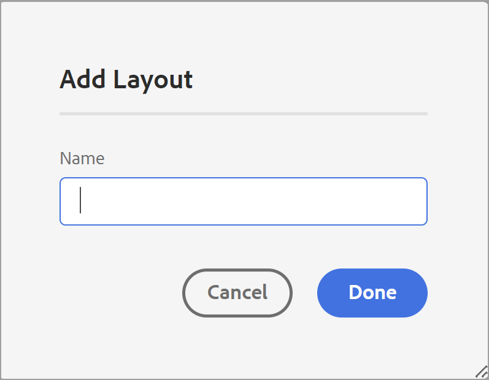
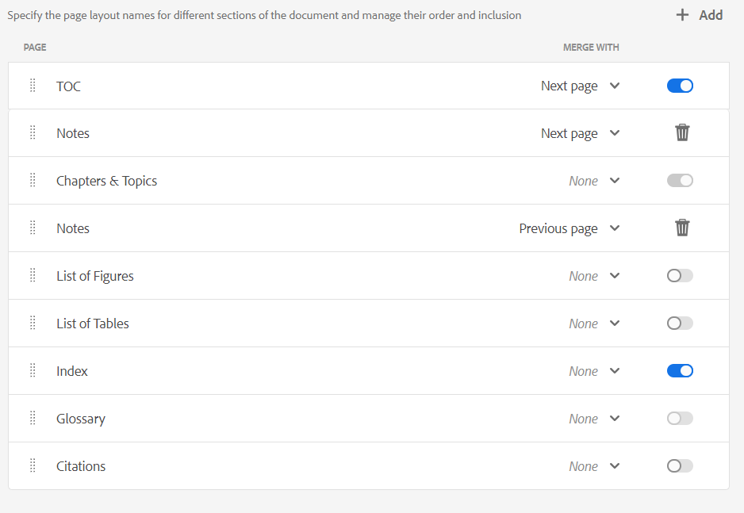

# Komponenter i en PDF-mall {#components-pdf-template}

En PDF-mall har fyra komponenter: Sidlayouter, Formatmallar, Resurser och Inställningar. Du kan skapa en mall genom att anpassa de här enskilda komponenterna och koppla mallen till en förinställning för utdata när du genererar en utdatafil från PDF. I följande avsnitt beskrivs dessa komponenter och deras anpassningsprocess i detalj.

## Skapa och anpassa sidlayouter {#create-customize-page-layout}

Med inställningarna i komponenten Sidlayout kan du utforma strukturen för en sida genom att definiera sidhuvudet, sidfoten och innehållsområdet på en sida. Med WYSIWYG sidlayoutredigerare kan du skapa en sidlayout för olika avsnitt i en PDF, t.ex. framsidan och baksidan av försättsbladet, kapitel, tabell över
Innehåll (innehållsförteckning), index, tom sida, sidor för Front Matter, sidor för Back Matter, Lista över illustrationer (LOF), Lista över tabeller (LOT), ordlista eller skapa en layout för en anpassad sida. I mallinställningarna för PDF kan du tilldela en sidlayout med olika avsnitt i en PDF som sedan används för att generera PDF-utdata.

### Skapa en ny sidlayout {#create-page-layout}

>[!NOTE]
>
>Det finns exempelsidlayouter som levereras utanför kartongen. Du kan anpassa dessa eller skapa nya sidlayouter.

1. Gå till fliken **Utdata** i Web Editor.
1. Expandera den vänstra sidlisten och klicka på **Mallar**.
1. Öppna mallen som du vill arbeta med.

   >[!NOTE]
   >
   >Du kan öppna en mall genom att dubbelklicka på dess namn eller klicka på >-ikonen bredvid dess namn.

1. Om du vill skapa en ny sidlayout gör du något av följande:

   * Hovra över **Sidlayouter** och klicka på ikonen (*Alternativ* ) **..** och välj **Ny sidlayout**.

   * Klicka på ikonen **+** bredvid **Mallar** på panelen **Mallar** och välj **Sidlayout** på snabbmenyn.

     Dialogrutan **Lägg till layout** öppnas.

     

1. Ange ett namn för den nya sidlayouten.
   >[!NOTE]
   >
   >Undvik att använda specialtecken när du namnger en sidlayout. Ett blanksteg i namnet ersätts med understrecket&quot;_&quot;.

1. Klicka på **Klar**.

   Den nya layouten skapas och läggs till under Sidlayouter.

### Duplicera en sidlayout {#duplicate-page-layout}

1. Dubbelklicka på **Sidlayouter** i avsnittet **Mallar** i mallen som du vill duplicera eller klicka på ikonen **>** före **Sidlayouter** .

   Då visas en lista med sidlayouter i mallen.

1. Håll pekaren över den sidlayout som du vill duplicera och klicka på ikonen (*Alternativ* ) **..** och välj **Duplicera** på snabbmenyn.

1. Ange ett namn för sidlayouten i dialogrutan _Duplicera layout_.

1. Klicka på **Klar**.
En kopia av den valda sidlayouten skapas och läggs till under Sidlayouter.

### Anpassa en sidlayout {#customize-page-layout}

1. Dubbelklicka på **Sidlayouter** i avsnittet **Mallar** i mallen som du vill redigera eller klicka på ikonen **>** före **Sidlayouter** .

   Då visas en lista med sidlayouter i mallen.
1. Gör något av följande om du vill anpassa en sidlayout:
   * Dubbelklicka på en sidlayout.
   * Håll muspekaren över en sidlayout och klicka på ikonen (*Alternativ* ) **..** och välj **Redigera** på snabbmenyn.

   Då öppnas sidlayoutredigeraren för anpassning.
1. När du har gjort de önskade ändringarna klickar du på *Spara alla* (eller `Crl+S`).

   Mer information om hur du definierar enskilda layoutelement som sidhuvud, sidfot, sidnummer, rubrik med mera finns i [Designa en sidlayout](design-page-layout.md).

## Anpassa PDF med hjälp av formatmallar {#stylesheet-customization}

Med inställningarna i Stylesheets-komponenten kan du formatera sidlayoutkomponenter och DITA-innehåll med WYSIWYG-redigeraren eller arbeta direkt med CSS-filen. Du kan skapa egna format eller anpassa standardformategenskaperna. Med WYSIWYG Editor får du tillgång till de flesta egenskaper som du behöver för att formatera din sidlayout eller DITA-innehåll. För avancerade anpassningar kan du arbeta direkt i vyn Source.

### Skapa en ny formatmall {#create-stylesheet}

CSS-filer tillhandahålls för innehåll och layout, men du kan skapa en ny formatmall som använder flera anpassningar för en viss formattyp som sedan kan användas för en målkomponent. Som standard paketeras CSS-exempelfiler i produkten. Dessa CSS-filer är avsedda att hjälpa dig att ordna formatinformation för innehåll och layout. Du kan välja att sammanfoga dessa format i en eller flera CSS-filer.

Som standard inkluderas filen `layout.css` i den nya sidlayouten när du skapar en ny sidlayout. Om du vill att sidlayouten ska innehålla format från en annan CSS-fil kan du helt enkelt dra och släppa önskad CSS-fil i den nya sidlayoutens innehållredigeringsområde. Om du vill verifiera om CSS-filen har bäddats in i sidlayouten växlar du till Source-vyn så att du hittar en länk till CSS-filen i `<head>`-elementet.

Så här skapar du en formatmall:
1. Gör något av följande på panelen **Mallar**:
   * Håll muspekaren över fliken **Formatmallar** och klicka på ikonen (*Alternativ* ) **..** och välj **Ny formatmall**.
   * Klicka på ikonen **+** bredvid **Mallar** och välj **Formatmall** på snabbmenyn.

   Dialogrutan Lägg till formatmall öppnas.

   
1. Ange ett namn för den nya formatmallen.
1. Klicka på **Klar**.

   En ny formatmall skapas och läggs till under formatmallsavsnittet.

### Skapa ett nytt format {#create-style}

Som standard innehåller CSS-filerna som finns i mallen format för rubriker, stycken, tecken, hyperlänkar, bilder, tabeller, div, sidor och andra format. Du kan åsidosätta standardformatet eller skapa ett nytt format.

Du kan skapa ett nytt format och använda det i mallens sidlayout eller använda ett anpassat format för ett DITA-element. Om du vill använda dessa anpassade format på DITA-elementet måste du se till att formatets klassnamn är detsamma som DITA-elementets namn eller attributet `outputclass`.  Till exempel styrs `
` i DITA av `.div {}` i CSS eller dess `outputclass`-attribut. Om du använder `
` i DITA styrs det av `.div {}` eller `.my-div {}` i CSS.

Så här skapar du ett nytt format:
1. Expandera den vänstra sidlisten och dubbelklicka på mallen som du vill skapa formatet i.
1. Expandera avsnittet **Formatmallar**. Den öppnar panelen **Format** som innehåller alla formatalternativ.
1. Välj ikonen + om du vill lägga till ett nytt format.

   Dialogrutan **Lägg till format** öppnas.

   

1. Ange ett **klassnamn**. Om du vill använda ett format på DITA-elementet kontrollerar du att formatets klassnamn är detsamma som DITA-elementets namn eller `outputclass`-attributet.
1. I fältet **Tagg** (valfritt) väljer du en tagg som du vill skapa ett nytt format för.

1. Välj en **Pseudoklass** om du vill formatera ett element. Med en pseudoklass kan du definiera ett speciellt läge för elementet. Använd till exempel pseudoklassen för att formatera ett element när du håller muspekaren över det eller när du fokuserar över det. Du kan också välja flera pseudoklasser. Du kan till exempel använda pseudoklassen `a::visited {color: blue;}` för att formatera de besökta länkarna.

1. Lägg till väljaren för det nya formatet. Fältet **Väljare** hjälper dig att lägga till anpassade väljare förutom kombinationen Klass, Tagg och Pseudo-klass. Du kan till exempel skapa formatet `table a.link` för alla hyperlänkar i en tabell.

   Mer information om CSS-taggar finns i [Mer information finns i CSS-formatgrammatik](https://www.w3.org/TR/CSS21/syndata.html#characters).

1. Klicka på **Klar**.

   Ett nytt format skapas och läggs till i formatlistan.

### Anpassa ett fördefinierat eller nytt format {#customize-style}

När du har skapat en ny CSS-fil med standardformat eller vill anpassa format i en befintlig CSS-fil kan du använda formatredigeraren för att göra det.

Följ stegen nedan för att anpassa en stil:
1. Dubbelklicka på **Formatmallar** eller klicka på ikonen **>** före **Formatmallar**.

   Detta visar standardfilerna (Innehåll och layout) och anpassade CSS-filer.
1. Öppna en formatmall för redigering.

   Gör något av följande om du vill öppna en formatmall för redigering:
   * Dubbelklicka på formatmallens namn.
   * Håll muspekaren över formatmallens namn och klicka på (alternativikonen) ... och välj Redigera.

   Då öppnas formatmallen för redigering och formatlistan visas på formatpanelen.

   

1. Om du vill anpassa ett format markerar du det för att visa och anpassa det med stilredigeraren.

### Egenskaper för format

I mittpanelen kan du redigera egenskaperna, men det kan vara svårt att få en ögonblicksbild av vilka värden som finns.  Panelen **Egenskaper** ger en snabb vy över alla attribut och värden i formatet.

På mittpanelen kan du redigera de vanligaste egenskaperna, men inte alla de egenskaper som CSS stöder. I rutan **Egenskaper** kan du redigera alla egenskaper som CSS har stöd för och förhandsgranska dem. Du behöver inte växla till källvyn för att redigera några egenskaper.

Läs mer om hur du använder formatredigeraren för att [arbeta med vanliga innehållsformat](stylesheet.md).

## Arbeta med resurser {#work-with-resources}

Detta är en behållare för alla resurser som används för att utforma en mall. Du kan tänka dig det som en mapp som innehåller resurser som bakgrundsbilder, anpassade teckensnitt, logotyper med mera. När du lägger till en resurs i mallen överförs den eller checkas in i resursmappen. Du kan sedan använda dessa resurser för att anpassa eller utforma dina PDF-mallar.

Följ stegen nedan för att lägga till en resursfil i resursmappen:

1. Håll muspekaren över fliken Resursmapp, klicka på (alternativikonen) ... och välj Importera.

   Dialogrutan Överför Assets öppnas.

   

   Sökvägen dit resursfilen ska överföras visas i fältet **Välj resursmapp**.
   >[!NOTE]
   >
   >Du kan inte ändra sökvägen för överföring av resurser. Som standard lagras alla resurser i mappen `/content/dam/dita-templates/pdf/<PDF-template-name>`.

1. Klicka på **Välj filer** om du vill bläddra i resursfilen från den lokala datorn

1. Klicka på **Överför**.
Den valda filen importeras och visas under mappen Resurser.

## Avancerade PDF-inställningar {#advanced-pdf-settings}

Använd avsnittet Inställningar för att konfigurera de avancerade inställningarna för PDF sidlayout, från udda till jämna sidor, format för korsreferenserna och aktivering av utskriftsmärken i den slutliga PDF som genereras
med hjälp av mallen.

>
>
> Från och med Experience Manager Guides 5.0/2025.02.0 har avsnittet **Skriv ut** i de avancerade PDF-inställningarna flyttats till panelen **Utdatainställningar** . Visa [Publicera PDF-utdata](../web-editor/native-pdf-web-editor.md#print) om du vill konfigurera utskriftsinställningar.

Om du vill konfigurera klickar du på **Inställningar** på panelen **Mallar** för att visa följande alternativ:

### Allmänt

Ange de grundläggande konfigurationsinställningarna för att starta ett kapitel från udda eller jämn sida, innehållsförteckningsstrukturen och definiera ledarradformatet för posterna i innehållsförteckningen. Du kan definiera följande inställning:

* **Starta ett nytt kapitel från**: Gör att du kan definiera hur varje kapitel ska publiceras i den slutliga PDF. Du kan välja mellan alternativen **Ny sida**, **Udda sida**, **Jämn sida** eller **Aktuell sida** . Om du väljer att starta ett nytt kapitel från en udda sida infogas en tom sida efter ett kapitel som slutar på en udda sida. Om kapitlet till exempel slutar på sidan 15 infogar publiceringsprocessen en tom -th-sida så att det nya kapitlet kan börja på sidan 17th.  Om du väljer alternativet **Aktuell sida** kommer alla kapitel att publiceras utan sidbrytningar. Om ett kapitel t.ex. avslutas mitt på sidan 15, kommer nästa kapitel också att startas från den 15:e sidan.

* **Starta varje ämne från en ny sida**: Om du vill att varje ämne i kapitlet ska börja från en ny sida väljer du **Starta varje ämne från en ny sida** . Om du vill att dina ämnen ska fortsätta utan sidmellanrum avmarkerar du det här alternativet.

* **Innehållsförteckningsstruktur**: Gör att du kan anpassa innehållsförteckningens hierarki. Följande ytterligare inställningar används:

   * **Använd rubriker upp till nivå**: Du kan justera antalet rubriknivåer som ska visas i innehållsförteckningsstrukturen för din PDF.
   * **Visa inte sidnummer för den första nivån i innehållsförteckningen**: Välj det här alternativet om du vill dölja motsvarande sidnummer för alla kapitel som innehåller kapslade eller underordnade ämnen. Titta på följande exempel där en utdatafil skapas utan att markera det här alternativet.

  

  I ovanstående exempel är Avancerade PDF-inställningar, Bilaga och Legal ämnesrubriker på första nivån eller kapitelrubriker. Alla rubriker tilldelas ett sidnummer.

  Om du väljer det här alternativet och genererar utdata får du nu följande innehållsförteckning:

  

  Här ser du att det första kapitlet Avancerade inställningar för PDF inte får något sidnummer, som kapslade eller underordnade avsnitt. Ett sidnummer om det tilldelas till Bilaga och Rättslig information eftersom de är fristående ämnen utan något underordnat ämne.

* **Visa inte kapitelnummer i innehållsförteckningen** : Välj det här alternativet om du vill visa kapitelnamnen utan kapitelnumren i innehållsförteckningen.   Som standard visas kapitelnumren i innehållsförteckningen för dina PDF-utdata.
* **Ledarformat**: Använd listrutan för att välja Prickade, Helfyllda eller Blanksteg för att koppla rubriknivåer till motsvarande sidnummer.
Information om hur du använder rubriknivåer för innehållsförteckningens struktur och format finns i [Lägga till en innehållsförteckning för kapitel](design-page-layout.md#add-chapter-toc).

  >[!NOTE]
  >
  >Om du är CSS-utvecklare kan du definiera ledarformatet direkt i CSS-filen också.

* **Använd fortsättningsmarkör för tabell**: Välj det här alternativet om du vill definiera markörer för långa tabeller som sprids över flera sidor.
Du kan definiera texten som ska visas före och efter brytningen. En tabell bryts till exempel på sidan 5 och du definierar `<Continued on page %page-num%>` för **Text före brytning**.  Texten visas&quot;Fortsättning på sidan 6&quot; längst ned på sidan 5.

  Använd språkvariabler för att definiera fortsättningsmarkörtexten före och efter brytningen. Beroende på vilket språk du väljer hämtas det lokaliserade värdet automatiskt i PDF-utdata. Du kan till exempel publicera `Continued on page %page-num%` som en text på engelska och `Fortsetzung auf Seite %page-num%` på tyska.

  Hovring  nära alternativet om du vill visa mer information om det.
* **Länka ordlistor till ordlistan**: Välj det här alternativet om du vill visa ordlistorna som hyperlänkar i innehållet och länka dem till termerna på ordlistan. Det gör att läsarna snabbt kan se definitionen av en term som definierats i ordlistan.

  Om du vill konvertera ordlistan till hyperlänkar måste du:
   * Aktivera **Ordlista** på fliken **Sidlayoutordning** för en DITA-karta.
   * Lägg till ordlistan på sidan Bakåt Matcha sidor för en bokkarta.

  Om du inte aktiverar ordbokssidan konverteras inte de ordlistliga termerna i innehållet till hyperlänkar i PDF-utdata.
  <!--For more information on using table continuation markers, see Use table continuation markers.-->

### Sidlayouter {#page-layouts}

Inställningarna för sidlayout ger dig fullständig kontroll över hur du anger vilken sidlayout som ska användas för ett visst avsnitt i dokumentet. Om du till exempel vill välja en layout för innehållsförteckningen klickar du på listrutan under innehållsförteckningsfältet och väljer den layout som du har utformat för att generera innehållsförteckningen.

Observera att bokmappsinställningarna har företräde framför sidlayoutsinställningarna.

Följande inställningar är tillgängliga under avsnittet Sidlayout:

**Standardsidlayout**: Välj en sidlayout som fungerar som standardlayout för alla sidor i din PDF. Det här är den grundläggande sidlayouten som används i avsnitt eller ämnen där du inte har skapat en dedikerad sidlayout.

**Sidlayout för olika avsnitt**: Du kan mappa en sidlayout med följande avsnitt i dina PDF-utdata. Om du har utformat en sidlayout för det relaterade avsnittet väljer du det i listrutan. Om ingen sidlayout har skapats för ett visst avsnitt används standardsidlayouten.

* **Kapitel och ämnen**: Du kan ange sidlayout för kapitlen och avsnitten. Den valda layouten används för alla kapitel och avsnitt.

* **Innehåll**: Om du har utformat sidlayouten för innehållsförteckningen väljer du **Innehåll** i listrutan så får alla innehållsförteckningssidor i dokumentet sidlayouten för innehållsförteckningen.

* **Lista över illustrationer och Lista över tabeller**: Du kan också ange sidlayout för figurer och tabeller. Den valda layouten används på alla figurer och tabeller.

* **Index**: Om du har utformat en indexsidlayout kan du mappa den till alternativet Index. Med formatmallarna kan du formatera olika indexelement i PDF-utdata. Använd indexformaten `.idx-header`, `.idx-footer`, `.idx-body`, `.idx-title`, `.idx-keyword-group`, `.idx-unit`, `.idx-keyword`, `.idx-name`, `.idx-link` och `.idx-child` för att anpassa formaten för elementen i indexet.

* **Ordlista**: Om du har en ordlista mappas den till alternativet Ordlista.

  Termerna i ordlistan för dina PDF-utdata sorteras alltid i alfabetisk ordning.

  Du kan också lägga till taggen `sort-as` för att definiera en sorteringsnyckel för ordlistorna. Experience Manager Guides använder sedan sorteringsnyckeln för att sortera ordlistorna i stället för ordlistorna. Om du inte har definierat sorteringsnyckeln används ordlistetermer för sortering. Du kan till exempel lägga till taggen `sort-as` i `glossterm` och ange värdet `A` för termen &quot;USB&quot; (till exempel `<glossterm>USB<sort-as>A</sort-as></glossterm>`). På samma sätt kan du lägga till taggen `sort-as` och ange dess värde som `B` för termen&quot;Ritstiftsenhet&quot;. När du sorterar de här ordlistorna visas sorteringsnyckeln `A` för den ordlistebeteckningen &quot;USB&quot; före sorteringsnyckeln `B` för den ordlista som innehåller ordet &quot;Pen Drive&quot;. I PDF-utdata kommer &quot;USB&quot; före &quot;Pen Drive&quot; på ordlistan.

  Med formatmallarna kan du formatera olika ordlisteelement i PDF-utdata. Använd ordlisteformaten `.glo-header`, `.glo-footer`, `.glo-body`, `.glo-title`, `.glo-unit`, `.glo-link` och `.glo-term` för att anpassa formaten för ordlistans element.

  Läs mer om hur du använder formatredigeraren för att [arbeta med vanliga innehållsformat](stylesheet.md).

* **Sidor för sidordning på framsidan och sidor på baksidan**: Dessa sidlayouter definierar formateringen för framsidan eller baksidan av boken. Om du har utformat layouten för den främre delen mappar du den till alternativet **Sidor för den främre delen**. När du väljer layouten på framsidan i listrutan används layouten på alla ämnen som finns på framsidan.

  Om du har utformat bakomliggande materiallayout kan du mappa den till alternativet **Bakåtviktiga sidor** . När du väljer bakgrundslayout i listrutan används bakomliggande layout på alla ämnen som finns i bakgrunden.

  **Front Matter Pages** används också som en grundlayout för **TOC**, **List of Figures** och List of Tables.  På samma sätt används även **Bakåt-mallsidor** som en grundlayout för layouterna **Index** och **Glossary**. Om du inte har valt layouten för dessa används den valda layouten för fram- eller bakåtsidor.  Om du inte har valt layouten för sidhuvud och baksida tillämpas standardsidlayouten på dem.

* **Sidlayout för tomma sidor**:    Du kan också ange sidlayouten för de tomma sidorna. Den valda layouten används på alla tomma sidor. Om du till exempel har utformat en tom sidlayout för alla tomma sidor, väljer du **Tom** i listrutan så får alla tomma sidor i dokumentet en tom sidlayout.

* **Försättsblad och Baksida**: Om du har utformat en försättsbladslayout mappar du den till alternativet **Försättsblad**. Om du har en äldre sidlayout kan du mappa den till alternativet **Baksida** . Om ingen layout för omslag eller baksidor har skapats används standardsidlayouten.

Mer information om sidlayouter finns i [Designa en sidlayout](design-page-layout.md).

### Layoutordning {#page-order}

Du kan visa eller dölja följande avsnitt i din PDF och även ordna i vilken ordning de ska visas i den slutliga PDF-utdatafilen:

* Innehåll
* Kapitel och ämnen
* Lista över figurer
* Lista över tabeller
* Index
* Ordlista
* Citat

  

  Om du inte vill visa ett visst avsnitt i dina PDF-utdata kan du dölja det genom att stänga av växlingsknappen.

  Du kan också ange i vilken ordning de olika avsnitten ska genereras i din PDF. Om du vill ändra standardordningen för de här avsnitten markerar du de prickade strecken för att dra och släppa avsnitten på önskad plats.

  >[!NOTE]
  >
  > Inställningarna för ordning och inkludering gäller bara för en DITA-karta. Dessa inställningar gäller inte för bokmappar. Sidorna i en bokmapp visas enligt ordningen i avsnitten i bokmappen.

.
Layouten **Kapitel och avsnitt** är alltid aktiverad som standard. Du kan inte växla den.

**Sammanfoga sidor**

Som standard börjar alla avsnitt på en ny sida. Välj alternativet **Föregående sida** eller **Nästa sida** i listrutan **Lägg samman med** om du vill sammanfoga ett avsnitt med en föregående eller nästa sida. Detta publicerar avsnittet tillsammans med den valda sidan i PDF-utdata. Med det här blir det ingen sidbrytning däremellan.

>[!NOTE]
>
> Den här inställningen gäller endast avsnittet och inte dess komponenter.  Om du till exempel väljer alternativet **Föregående sida** för **Kapitel och ämnen** sammanfogas avsnittet **Kapitel och avsnitt** med föregående sida. De olika kapitlen och avsnitten publiceras enligt inställningarna för **Allmänt**.Om du till exempel väljer **Udda sida** i **Starta ett nytt kapitel från inställning**, infogas en tom sida efter ett kapitel som slutar på en udda sida.

När du sammanfogar ett avsnitt till föregående eller nästa sida sammanfogas innehållet och formatet för målavsnittet där innehållet sammanfogas används.

Om du till exempel aktiverar **Innehåll** och **Kapitel och ämnen** och väljer **Nästa sida** för **Innehåll** sammanfogas **Innehåll** med nästa avsnitt, som är **Kapitel och ämnen**. Formatet för avsnittet **Kapitel och avsnitt** tillämpas på det sammanfogade innehållet i båda avsnitten.

Sammanfogningsalternativet fungerar stegvis, så om du har valt **Nästa sida** för flera sammanhängande avsnitt sammanfogas alla med det första avsnittet (i nästa riktning), som inte har den här egenskapen angiven. Du kan till exempel aktivera **Innehåll**, **Kapitel och ämnen**, **Lista över bilder** och **Index**. Om du sedan anger **Nästa sida** för **Innehåll**, **Kapitel och ämnen**, **Lista över illustrationer** och **Inget** för **Index** sammanfogas alla med **Index**.

**Statiska sidor**

De olika sidlayouterna hjälper dig att utforma utdata från de olika avsnitten. Dessa avsnitt genereras från DITA-kartan när du publicerar utdata.
Du kan också skapa anpassade sidlayouter och publicera dem som statiska sidor i PDF-utdata. Detta hjälper dig att lägga till statiskt innehåll som anteckningar eller tomma sidor.

Utför följande steg för att lägga till en anpassad sidlayout:

1. Välj **Lägg till**  om du vill lägga till en ny sidlayout. Panelen Lägg till sidlayout öppnas.
2. Markera sidlayouten i listan och klicka på Lägg till. Den nya sidlayouten läggs till i listan över sidlayouter.

Du kan även utföra följande åtgärder:

* Markera de prickade strecken för att dra och släppa sidlayouten på önskad plats.

* Välj **Ta bort layout**  om du vill ta bort en layout.

* Du kan också sammanfoga en statisk sida med föregående sida eller nästa sida.

* Du kan också lägga till en anpassad layout flera gånger och ordna dem. Det gör att du kan publicera statiskt innehåll i enlighet med detta.

  Du kan till exempel använda en anpassad layout för att publicera en statisk varning flera gånger i PDF-utdata.

### Sidorganisation

Sidorna i ett PDF-dokument publiceras vanligtvis enligt innehållet som är organiserat i DITA-kartan eller bokmappsfilen. Du kan också ändra ordningen på sidorna i PDF-dokumentet. Du kan till exempel skriva ut ett flersidigt dokument som ett häfte. När du sorterar, viker och häftar arken blir resultatet en enda bok med rätt sidordning.  Sedan kan du läsa det publicerade häftet som en bok.

Följande inställningar är tillgängliga under avsnittet **Sidorganisation**:

#### Sidordning

Välj en sidordning som bestämmer sidordningen i ditt PDF-dokument. Du kan välja följande alternativ i listrutan:

* **Standard**: Standardordningen för sidorna enligt källfilen.
* **Udda sidor först**: Alla udda sidor flyttas före alla jämna sidor.
* **Jämna sidor först**: Alla jämna sidor flyttas före alla udda sidor.
* **Invertera**: Sidordningen inverteras.
* **Häfte**: Alla sidor ordnas som i ett häfte.
* **Häfte från höger till vänster**: Alla sidor är i häftesordningen höger till vänster.
* **Egen**: Definiera en anpassad ordning för sidor i stället för en fördefinierad ordning.
   * &quot;a..b&quot; - Alla på varandra följande sidor från a till b.
   * &quot;a,b,c&quot; - Ny sidordning a, b, c.
   * &quot;a*b&quot; - Sidan a upprepas b gånger.
   * &quot;-a&quot; - Negativa sidnummer räknas bakåt från den sista sidan och kan kombineras med andra anpassade ordningsnummer.
   * &quot;X&quot; - Alla sidor i dokumentet. Samma resultat som &quot;1..-1&quot;.

Du kan t.ex. skapa en anpassad ordning som &quot;2,3,5*2,7.10,-1,-2.
Den angivna sidordningen resulterar i att ett PDF får följande sidnummer från originaldokumentet, förutsatt att det har totalt 25 sidor: 2, 3, 5, 5, 7, 8, 9, 10, 25, 24.

#### Konfigurera mer än en sida per ark

Välj det här alternativet om du vill publicera flera sidor på ett enda pappersark.  Markera sedan antalet rader och kolumner och publicera sidorna som ett rutnät på ett enda ark. Du kan till exempel publicera sidorna som ett rutnät med 2 rader och 4 kolumner.

Definiera målarkets storlek och den orientering i vilken du vill publicera kalkylbladet. Du kan också ange marginal- och utfyllnadsegenskaperna för bladet.

### Korsreferenser {#cross-references}

Använd fliken **Korsreferens** för att definiera hur korsreferenserna ska publiceras i PDF. Du kan formatera korsreferenserna för ämnesrubrik, tabeller, figurer och mycket annat.

>[!NOTE]
>
> Om du har definierat länktexten när du infogar korsreferensen, prioriteras den framför korsreferensformatet som har definierats i den ursprungliga PDF-mallen.

Du kan också använda variabler för att definiera en korsreferens.  När du använder en variabel hämtas dess värde från egenskaperna. Du kan använda en enda eller en kombination av variabler för att definiera en korsreferens. Du kan också använda en kombination av en sträng och en variabel.

Du kan till exempel använda `View details on {chapter}`. Om kapitelnamnet är &quot;Allmänna inställningar&quot; är korsreferensen i utdata &quot;Se information om Allmänna inställningar&quot;.

AEM Guides innehåller följande variabler:

* {title}: Skapar en korsreferens till ämnestiteln. Exempel: Se Användbara länkar på sidan 2.
* {page} lägger till en korsreferens till sidnumren. Se till exempel på sidan 1.
* {description}: Lägger till en korsreferens till texten i beskrivningen. Se t.ex. informationen om AEM Guides.
* {chapter}: Lägger till en korsreferens till kapitelnumren. Se till exempel Kapitel 1.
* {bookmarkText}: Skapar en korsreferens till den bokmärkta texten. Se till exempel stop_words på sidan 5.
* {captionText}: Skapar en korsreferens till bildtexten för figuren eller tabellen i ditt ämne. Se till exempel Luftflöde på sidan 2.
* {figure}: Lägger till en korsreferens till talnumret. Hämtar nummertalet från de automatiska nummerformat som du har definierat för bildtext.  Du kan till exempel använda &quot;Se {figure} på sidan {page}&quot;. Korsreferensen i utdata innehåller det automatiskt genererade bildnumret och dess sidnummer, &quot;Se figur 1 på sidan 5&quot;.
* {table}: Lägger till en korsreferens till tabellnumret. Hämtar tabellnumret från de automatiska nummerformat som du har definierat för bildtext. Du kan till exempel använda &quot;Se {table} på sidan {page}&quot;. Korsreferensen i utdata innehåller det automatiskt genererade tabellnumret och dess sidnummer, &quot;Se tabell 1 på sidan 5&quot;.

  >[!NOTE]
  >
  >Du kan skapa automatiska nummerformat för bildtext- och bildtexttaggar.

#### Standardkorsreferensformat

Om du lämnar textfältet tomt och du inte har definierat länktexten när du infogar en korsreferens, lägger Experience Manager Guides till följande variabler för respektive korsreferens:

* **Titel**: `{title}`
* **Beskrivning**: `{description}`
* **Stycke**: `{bookmarkText}`
* **Bokmärke**: `{bookmarkText}`
* **Figur**: `{captionText}`
* **Tabell**: `{captionText}`

Prioritetsordningen för korsreferenser är:
* Länktext i korsreferenserna
* Korsreferensformat definierat i den ursprungliga PDF-mallen
* Standardkorsreferensformat

#### Språkvariabler i korsreferenser

Du kan också använda språkvariabler för att definiera lokaliserade korsreferenser. Beroende på vilket språk du väljer hämtas det lokaliserade värdet automatiskt i PDF-utdata.

Du kan till exempel lägga till en språkvariabel,&quot;reference-label&quot;, och definiera värdena på engelska och tyska.

* Engelska -&quot;Visa på sidan {page}&quot;
* Tyska -&quot;Einzelheiten finden Sie auf der Seite {page}&quot;

När du lägger till `${lng:<variable name>}` i avsnittet Stycke innehåller korsreferenserna i styckena i utdata den lokaliserade texten och sidnumret.\
På följande skärmbilder visas korsreferenserna &quot;Visa på sidan 1&quot; på engelska och &quot;Einzelheiten finden Sie auf der Seite 1&quot; på tyska.

*En korsreferens i ett stycke när den publiceras på engelska.*

*En korsreferens i ett stycke när den publiceras på tyska.*

<!--For more information, see *Format cross-references*.-->
