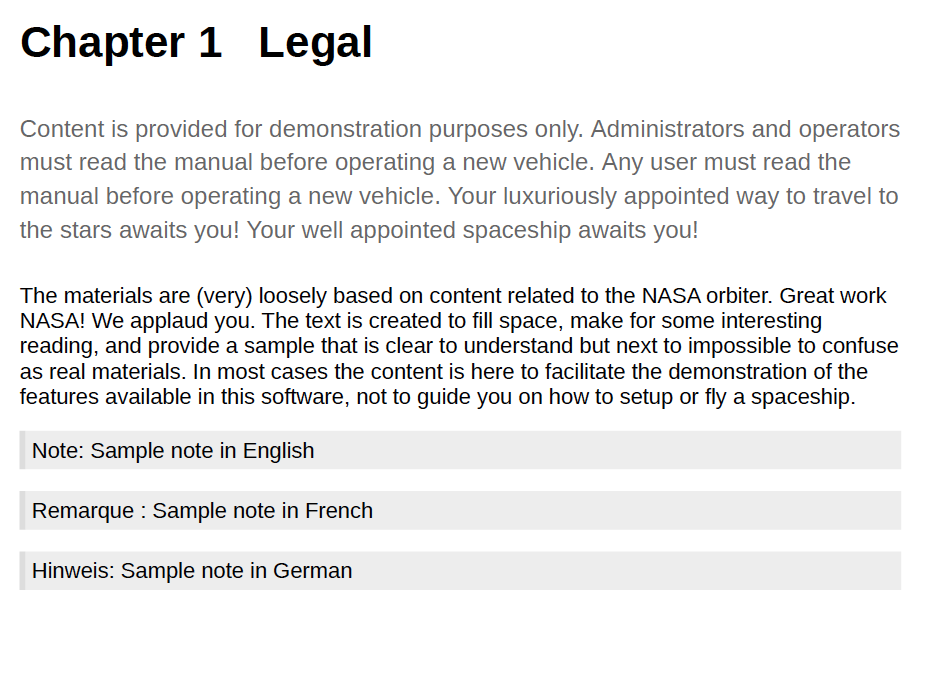

# Stöd för språkvariabler

AEM Guides innehåller en funktion för att använda språkvariabler. Du kan använda språkvariabler för att definiera lokaliserade strängar i utdata från PDF eller för att lokalisera statisk text i utdatamallarna. Du kan använda CSS-format för att lokalisera strängarna som kommer från en CSS.

## Använd språkvariabler i PDF-utdata

Du kan använda språkvariabler för att definiera en lokaliserad version av körklara etiketter som Anteckning, Varning och Varning eller statisk text i utdata från PDF. Variabelnamnet är detsamma för alla språk men kan ha olika värden för de olika språken. Du kan uppdatera värdet för dessa variabler på ett eller flera språk, och sedan hämtas det lokaliserade värdet automatiskt i utdata från PDF.

Du kan till exempel ha följande sätt att presentera etiketten `Note` i utdata från PDF:

- Engelska: Note

- Franska: Remarque

- Tyska: Hinweis



*En exempelanteckning på engelska, franska och tyska språk.*

>[!NOTE]
>
> Om värdet för en variabel inte är definierad på ett visst språk, väljs strängen från språket i användargränssnittet (programmets användargränssnitt) som en reservfunktion.
>
> Om du inte har definierat värdet på gränssnittets språk söker den efter engelska (`en_us`), annars väljer den värdet English(`en`) och visar samma värde i utdata från PDF.

## Typer av språkvariabler

AEM Guides har stöd för två typer av variabler: Program- och användarvariabler.

### Programvariabler

AEM Guides innehåller en uppsättning fördefinierade eller färdiga programvariabler. Du kan använda dessa fördefinierade variabler för att lägga till information om ett dokument som är specifikt för AEM Guides. Variabeln `chapter-number`, om den ingår på en sida, visar till exempel kapitelnumret som sidan tillhör. Variabeln `author-label` visar namnet på dokumentförfattaren.

>[!NOTE]
>
> Du kan åsidosätta värdet för en programvariabel.


### Användarvariabler

Du kan också skapa nya språkvariabler. Du kan t.ex. skapa en användarvariabel, Publisher, för etiketten för utgivaren av dokumentet.

>[!NOTE]
>
>  Du bör ha administratörsbehörighet för att skapa användarvariabler och redigera programvariabler.


*Lägg till och visa språkvariablerna för ett valt språk.*

## Lägg till en ny språkvariabel

1. Gå till fliken Utdata i Web Editor.
1. Välj **språkvariabler**  i den vänstra panelen.
1. Välj **Redigera** för att öppna fönstret **Språkvariabler**. Programmet och användarvariablerna som finns i det valda språket visas i alfabetisk ordning. Värdena visas enligt det valda språket. Om du t.ex. väljer det franska språket visas&quot;Tips&quot; som&quot;Konsol&quot;.
1. I listrutan **Språk** väljer du det språk som du vill redigera en variabel på.

   >[!NOTE]
   >
   > Om du inte visar de önskade språken aktiverar du det önskade språket från **Språkvariabelinställningar**. Välj inställningar  om du vill öppna dialogrutan **Inställningar för språkvariabler**.

1. Ange variabelnamnet i kolumnen **Namn** och dess värde i kolumnen **Värde**.

   >[!NOTE]
   >
   >Du kan använda valfritt HTML-innehåll som ett variabelvärde om du vill visa variabelvärdet i en viss formatering. Du kan till exempel lägga till taggen `<b>` i variabelvärdet för att visa utgivaren i fet stil.

1. Välj **Lägg till språkvariabel**  om du vill lägga till en ny språkvariabel för det valda språket. Om du lägger till en variabel till ett språk läggs den automatiskt till på alla språk. Du kan inte skapa en variabel med samma namn som en befintlig variabel. Ett fel visas.

>[!NOTE]
>
> Om du inte väljer **Lägg till språkvariabel** skapas inte variabeln och läggs till i listan

## Exportera och importera språkvariabler

Experience Manager Guides har stöd för att exportera och importera språkvariabler som finns på det valda språket. Du kan enkelt exportera alla språkvariabler tillsammans med de definierade värdena. Detta inkluderar både program- och användarvariabler. Använd den exporterade filen för att göra önskade ändringar av värdena eller för att översätta dem till andra språk.

Du kan också importera XML-filen som innehåller språkvariablerna. Experience Manager Guides importerar bara de språkvariabler som redan är definierade, både program- och användarvariabler. Inga variabler som inte redan är definierade importeras.

### Exportera språkvariabler

Om du vill exportera språkvariablerna för ett språk väljer du språket i listrutan och väljer **Exportera** .
Den skapar en XML-fil med formatet `language_variable_<ln>` där `<ln>` är koden för det valda språket. Till exempel `language_variable_en.xml` för engelska och `language_variable_fr.xml` för franska.

>[!NOTE]
> 
>Om det finns ändringar i språkvariablerna som inte har sparats kan du inte exportera dem. Spara ändringarna för att visa den aktiverade **Exportera** -ikon.

### Importera språkvariabler

Så här importerar du språkvariabler:

1. Välj ett språk i listrutan och välj **Importera** .
2. Bläddra och välj XML-koden som innehåller språkvariablerna. Exempel: language_variable_en.xml.
Du kan importera XML-filer i följande format:

```
<?xml version="1.0" encoding="UTF-8"?>
<variables>    
<variable id="note-important">Important: </variable>    
<variable id="note-caution">Avertir: </variable>    
<variable id="image-with-text">Text and image &lt;img src=&quot;/content/dam/assets/images/image_with_text.png&quot; /&gt; </variable> 
</variables> 
```

Variablerna med samma ID importeras när du har importerat filen. Värdena för variablerna i det valda språket uppdateras med värdena i XML-filen.  Ett meddelande om antalet variabler som har uppdaterats visas.

>[!NOTE]
> 
><ul><li>Om filen inte är en XML-fil, eller om filen innehåller ett felaktigt format som inte överensstämmer med språkvariablerna, visas ett felmeddelande om att det har uppstått ett problem med XML-filen. 
&gt;<li>Om filen inte innehåller några variabler med samma ID visar du en varning om att det inte finns någon matchande språkvariabel i den importerade filen.

### Alternativ för en språkvariabel

Håll pekaren över variabeln för att visa menyn **Alternativ** för den.


*Använd menyn **Alternativ**för att ta bort, förhandsgranska eller duplicera en språkvariabel.*

Du kan förhandsgranska både program- och användarvariabler. Om du vill visa hur variabelns värde visas i utdata väljer du **Förhandsgranska** på menyn **Alternativ** för den valda variabeln.
Du kan också välja att **ta bort** eller **duplicera** användarvariablerna. Om du tar bort en variabel från ett språk tas den automatiskt bort från alla språk.

### Redigera eller återställa programvariablerna

Du kan också redigera värdena för en programvariabel. Senare kan du återställa en programvariabel till det ursprungliga värdet. **Återställ variabel**  visas för en programvariabel med ett ändrat värde.

## Använda språkvariabler i utdatamallarna

Du bör lägga till språkvariabler i dina lokaliserade dokument. Du kan infoga dessa språkvariabler i sidlayouten som visas på olika sidor i dina lokaliserade dokument. Du kan till exempel lägga till språkvariabeln för `author-name` som visas i sidlayoutens sidhuvudsområde (eller andra delar som sidfoten eller brödtexten).


*Författaren och varumärkesnamnet som är lokaliserat i utdata från PDF som genererats för det franska språket.*

Så här infogar du en språkvariabel som din `copyright-label` i sidhuvudsområdet:

1. Öppna önskad sidlayout för redigering.

   >[!NOTE]
   >
   > Visa [Anpassa ett sidlayoutavsnitt](../native-pdf/components-pdf-template.md#customize-a-page-layout-customize-page-layout) för att öppna en sidlayout för anpassning eller redigering.

1. Markera rubriken för att aktivera den för att infoga en variabel.
1. Välj **Infoga variabel**   i verktygsfältet.
1. I popup-fönstret **Infoga variabel** markerar du namnet på den språkvariabel som ska infogas och klickar på **Infoga** för att infoga den i sidhuvudsområdet.

   >[!NOTE]
   >
   > Du kan också ange söksträngen i textrutan. Variabelnamnen som innehåller den angivna strängen filtreras och visas i listan.
   > Den valda språkvariabeln infogas i sidhuvudsområdet.


*Det `copyright-label` som lagts till i sidhuvudsområdet.*

### Använd innehållsformat på språkvariabler

Förutom det värde du tilldelar en språkvariabel kan du även använda HTML-taggar för att visa variabelvärdet i en viss formatering. Du kan till exempel visa värdet för `publisher-label` i fet stil.

- Du kan också formatera värdeformaten med taggen <span>. Om du till exempel använder språkvariabeln för sidnummer kan du visa sidnumret i latinskt nummerformat på engelska och ange formatet för andra språk.

  Värde för engelska:
  `<span data-field="page-number" data-format="upper-roman">1</span>`

  Värde för tamil:
  `<span data-field="page-number" data-format="tamil">1</span>`

På samma sätt kan du lägga till språkvariabler och formatera andra fält som listas i funktionen Infoga fält i sidlayouterna. Mer information om hur du lägger till fält finns i [Lägg till fält och metadata](../native-pdf/design-page-layout.md#add-fields-metadata).

- Du kan också lägga till lokaliserade bilder i värdena. Du kan till exempel lägga till en bildikon på kapitelnummerspråket och få lokaliserade bilder av ikonen i utdata från PDF.

  För engelska kan variabelvärdet för en bild vara som ``, och för samma variabel på tyska kan det vara ``. Så bilderna tas upp beroende på språk.

## Lokalisera strängarna med CSS-format

Med CSS-format kan du också lokalisera strängarna som används i ett autonummer som Kapitel, Avsnitt, Figur och Tabell. Eftersom de här strängarna kommer från CSS-filer kan du inte lokalisera dem med språkvariabler. Om du vill lokalisera de här strängarna kan du skapa CSS-format för varje språk där du vill lokalisera dem.
Du kan till exempel använda följande CSS för att visa kapitelprefixet och motsvarande talformat på olika språk.
Du kan till exempel använda följande CSS för att visa Kapitel som Hoofdstuk på tyska och kapitelnumret i decimalformat. För japanska kan du använda det japanska nummerformatet för att visa kapitelnumren i innehållsförteckningen.

```
// for English
h1:before {
  counter-increment: h11;
  content: "Chapter " counter(h11, decimal)".";
}

// for German
:root:lang(de) h1:before {
  content: "Hoofdstuk " counter(h11, decimal)".";
}

// for Japanese
:root:lang(ja) h1:before {
  content: "章 " counter(h11, japanese-formal)".";
}
```

På följande skärmbilder visas strängarna på tyska och japanska PDF.


### Formatera prefixen

Med CSS-format kan du även formatera prefixen. Du kan t.ex. formatera etiketten `Note` så att den visas i röd färg i utdata från PDF på olika språk.

```
.note .prefix-content 
{
color: red;
} 
```
