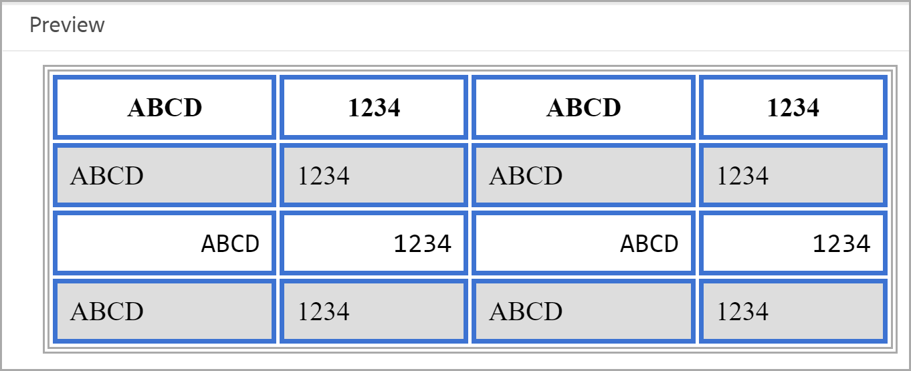

# Arbeta med vanliga innehållsformat {#work-with-common-styles}

En formatmall innehåller definitioner av format för de element som används i utdata från PDF. Du kan välja att arbeta med exempelformatmallarna eller skapa nya. I de flesta fall kan du snabbt komma igång genom att skapa en kopia av OTB-exempelformatmallen.

Formatredigeraren är en WYSIWYG-redigerare som döljer alla komplexa CSS-koder bakom användargränssnittet. Med stilredigeraren kan du enkelt och mycket snabbt anpassa stilarna för de element du vill använda. Formaten är kategoriserade under följande rubriker:

* Rubrikformat
* Styckeformat
* Teckenformat
* Hyperlänkformat
* Bildformat
* Listformat
* Tabellformat
* Div-format
* Sidformat
* Andra format

När du arbetar med strukturerat DITA-innehåll finns formatmappningen för de flesta DITA-elementen på plats i standardformatmallen. Om du arbetar med DITA-standardelement kan du ändra deras utseende och känsla genom att ändra formatdefinitionen direkt. Dessa formatdefinitioner är tillgängliga under kategorin Annat format. Mer information finns i [Arbeta med andra format](#other-styles) senare i det här avsnittet.

I följande avsnitt beskrivs de vanligaste formatinställningarna i form av exempel.

>[!NOTE]
>
>I följande exempel antas du arbeta med den exempelformatmall som levereras med produkten.

## Arbeta med rubrikformat {#heading-styles}

Rubrikformaten kapslar in alla basformat för de rubriker som används i innehållet. OTB får du 6 basrubrikformat och ett rubrikformat för ämnet/kapitlet och bilagans rubrikrubrik. I ett strukturerat dokument representerar H1 ämnets eller kapitlets rubrik och H2 till H6 används för underämnen eller avsnitt i ett ämne/kapitel. Den här rubrikhierarkin används automatiskt på innehållet när motsvarande rubrik hittas.

>[!NOTE]
>
>Du kan skapa egna rubrikformat och de kan användas i ditt innehåll med hjälp av klassen output. Mer information finns i Steg 4 i exemplet [Använd sidorientering och vyrotation](design-page-layout.md#page-orientation-rotation).

### Skapa anpassade rubriker på kapitelnivå {#create-chapter-level-heading}

I en bok (eller en bokmapp) arbetar du med kapitel. Basrubrikformaten är utformade på ett sådant sätt att de tillämpas på rubriker på kapitelnivå utan anpassningar. Men om du vill skapa rubriker för innehållet måste du skapa rubrikerna. Standardrubriken `h1.chapter` används till exempel på kapitlets rubrik. Om du vill att kapiteltiteln ska visas i ett annat format måste du anpassa formatet `h1.chapter`. På samma sätt kan du skapa egna format för underrubriker i kapitlet. Om du till exempel vill skapa ett anpassat format för alla rubriker på nivå 2<sup>nd</sup> och 3<sup>rd</sup> i kapitlet, måste du skapa ett nytt format som `h2.chatper` och `h3.chatper`.

Eftersom publiceringsfunktionen för ursprungliga PDF innehåller basformatsdefinitionerna för de vanligaste formaten, används standardformatet för innehållet även om du av misstag tar bort ett format. Om det t.ex. inte finns någon formatdefinition för h2-formatet i din formatmall kommer publiceringsfunktionen för PDF att använda en grundstil för h2-innehåll.

I det här exemplet skapar vi en kapitelrubrikstil på den andra nivån:

1. Öppna den formatmall du vill använda för redigering.
   >[!NOTE]
   >
   >Se [Anpassa ett fördefinierat eller nytt format](components-pdf-template.md#customize-style) för att öppna en formatmall för anpassning eller redigering.

1. Expandera **Rubrikformat** i listan **Format**.
1. Högerklicka på formatet **Rubrikformat** och välj **Nytt format**.
1. I dialogrutan *Lägg till format* behåller du namnet **Tagg** som `h2` och anger `chapter` i namnfältet **Klass**.
1. Klicka på **Klar**.

Ett nytt rubrikformat med namnet `h2.chapter` skapas och läggs till i listan Rubrikformat.

När du har skapat ett format kan du anpassa de önskade egenskaperna för formatet med hjälp av formatredigeraren.

### Skapa rubriker med automatisk numrering {#auto-number-heading}

Ett av de vanligaste utdataformaten är autonumrerade rubriker. Dessa rubriker representerar kapitelnummer, ämne och underteman. Rubrikerna för automatisk numrering skiljer sig från listformaten där en lista med objekt i ett ämne tilldelas automatiska nummer.

I det här exemplet anpassar vi rubrikerna från nivå 1 till nivå 3 för att använda automatiska nummer i olika format.

1. Öppna den formatmall du vill använda för redigering.

   >[!NOTE]
   >
   >Se [Anpassa ett fördefinierat eller nytt format](components-pdf-template.md#customize-style) för att öppna en formatmall för anpassning eller redigering.

1. Expandera **Rubrikformat** i listan **Format**.

1. Välj formatet **h1** i listan.
Egenskaperna för formatet h1 visas på egenskapspanelen tillsammans med förhandsvisningen.

   >[!NOTE]
   >
   >På panelen Förhandsgranska får du en realtidsvy över alla formatuppdateringar som du kan använda på ett element.

1. Välj egenskapen **Autonum**.

   De format som du kan använda i listan med automatiska nummer visas under egenskapen för autonummer.

1. Ange följande egenskaper:
   * **Format**: Välj bland ett stort antal språkspecifika eller generiska numreringsformat. Du kan välja format som arabiska-indiska, Devanagari, Georgiska, Decimal, Lower-Alpha med flera. För det aktuella exemplet väljer du `upper-alpha`.

   * **Format**: Standardformatet är `<x>`, där värdet `x` ersätts med numreringsformatet som du valde i egenskapen Format. Om du till exempel har valt formatet `decimal` (1) blir värdet `x` automatiskt i steg för varje instans av formatet `h1` 2, 3 och så vidare. Du kan också lägga till egen text i fältet för att formatera rubrikformatet. Om du till exempel vill att alla h1-rubriker ska ha prefixet `Chapter` måste du ange det här fältet som `Chapter <x>`.

   * **Infoga tecken**: Om du vill lägga till ett specialtecken i formatet klickar du på Infoga tecken (). Markera det tecken du vill lägga till i formatformatet och klicka på Infoga. Det finns olika typer av specialtecken som du kan välja i listrutan Välj kategori. Välj till exempel högerpekande dubbelt vinkelcitattecken i kategorin Interpunktion.

     


   * **Starta numrering från**: Om du vill att numreringen ska börja från ett visst nummer anger du det värdet. Behåll till exempel standardvärdet 1.

   * **Indrag**: Om du vill dra in rubriken måste du ange värdet för Indrag. Ange det till exempel till 0 px.

     >[!NOTE]
     >
     >Du kan ange värdet i pixlar, pt (punkter), rem, em, % (procent) eller in (tum).

   * **Prefixbredd**: Detta är det område som upptas av formatet för automatisk numrering. Den ställs automatiskt in på en storlek som enkelt kan anpassas till det valda formatformatet. Om du vill öka storleken kan du ersätta standardvärdet.

     När du anger det här värdet manuellt kan du prova att ändra de andra egenskaperna som påverkar bredden. Du kan till exempel ändra teckensnittsstorlek, format med prefix (Kapitel) eller suffix (:), ange det maximala värdet i egenskapen *Starta numrering från* och de olika teckensnittsegenskaperna så att den optimala storleken uppnås.

     Behåll till exempel standardvärdet.

   * **Mellanrum**: Ange det vågräta och lodräta mellanrummet. Behåll till exempel standardvärdena.

     Med ovanstående anpassningar anpassas formatet så som visas nedan:

     

   * **Använd formatering på**: Med egenskaperna i kategorin Autonom kan du definiera numreringsformatet. Om du vill anpassa numreringsformatet ytterligare eller innehållet i rubrikformatet kan du välja Numrering eller Stycke i det här fältet. Om du väljer Numrering tillämpas alla ändringar av kategorierna Teckensnitt, Kant, Layout och andra endast på numreringsformatet i rubriken. Om du väljer Stycke används dock ändringarna på rubrikinnehållet och inte på numreringsformatet.

   Använd följande inställningar för att generera utdata som visas på följande skärmbild:

   | **Rubrikformat** | **Egenskap** | **Värde** | **Ytterligare kommentarer** |
   | :- | :- | :- | :- |
   | h1 | Stil | Decimal | Dessa egenskaper tillhör kategorin Autonom |
   |  | Format | `Capter <x>:` |  |
   |  | Prefixbredd | 160 px |  |
   |  | Teckensnitt > Textjustering | Vänster | Kontrollera att Använd formatering på är inställt på Numrering |
   | h2 | Stil | Decimal | Dessa egenskaper tillhör kategorin Autonom |
   |  | Format | `Section <x>:` |  |
   |  | Prefixbredd | 125 px |  |
   |  | Teckensnitt > Textjustering | Vänster | Kontrollera att Använd formatering på är inställt på Numrering |
   | h3 | Stil | Decimal | Dessa egenskaper tillhör kategorin Autonom |
   |  | Infoga nivå | 2 |  |
   |  | Format | `Section <2>.<x>:` |  |
   |  | Prefixbredd | 125 px |  |
   |  | Teckensnitt > Textjustering | Vänster | Kontrollera att Använd formatering på är inställt på Numrering |
   |  |

   

## Arbeta med styckeformat {#paragraph-style}

Du kan skapa ett styckeformat om du vill använda specialformatering för ett helt stycke. Med pseudoklassen kan du emellertid bara använda ett format på en viss del av texten. I följande exempel skapar vi ett styckeformat som använder anfangsformatet.

### Skapa anfangsstil {#drop-cap-style}

En anfangsstil (eller en versalstil som tappats) används i tidskrifter och litterära dokument där det första tecknet i ett stycke eller avsnitt får en viss speciell formatering. Du kan uppnå samma effekt med publiceringsfunktionen för PDF.

I följande exempel skapar vi en anfangsstil:

1. Öppna den formatmall du vill använda för redigering.

   >[!NOTE]
   >
   Se [Anpassa ett fördefinierat eller nytt format](components-pdf-template.md#customize-style) för att öppna en formatmall för anpassning eller redigering.

1. Expandera **Styckeformat** i listan **Format**.

1. Högerklicka på **styckeformatet** och välj **Nytt format**.

1. I dialogrutan *Lägg till format* behåller du namnet **Tagg** som p och väljer `::first-letter` i fältet **Pseudo** **Klass** .

1. Klicka på **Klar**.

   Ett nytt styckeformat med namnet `::first-letter` skapas och läggs till under listan **Styckeformat**.

1. Välj `::first-letter` under stilen p och ange följande egenskaper:

   * **Teckensnitt**: Ange önskat teckensnitt för den första bokstaven i stycket. Du kan till exempel ställa in teckensnittsfamiljen till kursiv, teckenbredden till 500, teckenstorleken till 30 pt och välja en teckensnittsfärg.

   * **Layout**: Ange lodrät justering för texten runt anfangsformatet. Vi ställer t.ex. in Lodrät justering till Underkant.

Eftersom taggen `p` mappas med elementet `<p>` i DITA behöver du inte lägga till det här formatet explicit med attributet outputclass. Oavsett var i ditt innehåll ett `<p>`-element används används anfangsformatet automatiskt på det. På följande skärmbild har kapitelrubriker, korta beskrivningar och definitionslistelement inte formaterats med anfangsformatet. Endast styckeformatet formateras med anfangsformatet:


## Arbeta med teckenformat {#char-style}

Med teckenformat kan du skapa format för formatering av tecken och ord i innehållet. Du kan till exempel skapa ett teckenformat för infogad kod eller ett filnamn, eller skapa ett format som använder flera formatformat för markerat innehåll.

### Skapa ett textbundet teckenformat {#inline-char-style}

Formatering av infogade tecken eller ord i ett stycke är ett mycket vanligt format. När du skapar ett infogat format måste du utföra två åtgärder: först skapar du ett nytt format i formatmallen och sedan tillämpar du formatet i innehållet med attributet `outputclass`.

I följande exempel skapar vi ett textbundet teckenformat:

1. Öppna den formatmall du vill använda för redigering.

   >[!NOTE]
   >
   Se [Anpassa ett fördefinierat eller nytt format](components-pdf-template.md#customize-style) för att öppna en formatmall för anpassning eller redigering.

1. Expandera **Teckenformat** i listan **Format**.

1. Högerklicka på **teckenformatet** och välj **Nytt format**.

1. I dialogrutan Lägg till format behåller du namnet **Tagg** som intervall och anger `BoldItalic` i namnfältet **Klass**.

   

1. Klicka på **Klar**.

   Ett nytt teckenformat med namnet code skapas och läggs till i listan Teckenformat.

1. Välj `span.BoldItalic` i listan **Teckenformat** och ange följande egenskaper:

   * **Teckensnitt**: Alla teckensnittsrelaterade egenskaper kan anpassas i det här avsnittet. Som standard medföljer vissa teckensnitt. Du kan välja önskat teckensnitt för teckenformatet. Du kan till exempel ställa in teckensnittsfamiljen på *Serif* och välja *Fet* och *Kursiv* i egenskapen Teckensnittsformat. Du kan också anpassa andra teckensnittsegenskaper som Teckenbredd (som fet, ljusare), Textdekoration (som understrykning, överstrykning), Teckenstorlek, Teckenfärg, Textjustering med mera.

     >[!NOTE]
     >
     Du kan också lägga till teckensnitt i mallen, som lagras i avsnittet Resurser i mallen. Mer information om hur du lägger till teckensnitt och arbetar med resurser finns i [Arbeta med resurser](components-pdf-template.md#work-with-resources).

   * **Layout**: Du kan ange layoutrelaterade egenskaper som höjd och bredd, marginal, utfyllnad, justering med mera.

   * **Bakgrund**: Med bakgrundsegenskaperna kan du formatera bakgrundsfärgen för ett visst format. Du kan definiera bakgrundsfärgen eller bilden för alla format.

När du har skapat det infogade teckenformatet måste du använda det i innehållet. Om du vill använda det infogade kodformatet går du till källvyn och lägger till attributet `outputclass` i det önskade innehållet:

`outputclass="BoldItalic"`

I följande exempel visas det fetkursiva formatet som används på olika ställen i den text som körs:


## Anpassa listformat {#custom-list-style}

Listformaten innehåller standardformatinställningarna för de sorterade och osorterade listorna. Du kan enkelt anpassa de här listformaten så att de uppfyller dokumentationskraven.

I följande exempel anpassar vi det numrerade eller ordnade listformatet:

1. Öppna den formatmall du vill använda för redigering.

   >[!NOTE]
   >
   Se [Anpassa ett fördefinierat eller nytt format](components-pdf-template.md#customize-style) för att öppna en formatmall för anpassning eller redigering.

1. Expandera **Listformat** i listan **Format**.

1. Välj formatet **ol** i listan.

   Egenskaperna för verktygstilen visas på egenskapspanelen tillsammans med förhandsvisningen.

   

1. Välj alternativet **Avancerad formatering**.

   Ett bekräftelsemeddelande visas.

1. Klicka på **Ja** i meddelandet *Bekräftelse* för att öppna egenskaperna för **Avancerad formatering**.

   Följande egenskaper är tillgängliga som standard:

   * **Nivå**: Som standard finns det 6 nivåer med numrerade listor. Den nivå du väljer i den här listrutan styr formatändringen på den valda nivån och alla efterföljande nivåer. Om du t.ex. väljer nivå 4, ställs alla formatändringar du gör in på nivåerna 4, 5 och 6.

   * **Listformattyp**: Det finns ett antal listnumreringsformat som du kan välja mellan. Listan innehåller språkspecifika och generiska numreringsformat som används för att skapa en numrerad lista. Vissa listformat är arabiska, kambodjanska, devanagari, etiopisk, hangul, hebreiska, japanska, koreanska, enkel kinesiska, urdu med flera.

   Dessutom kan du arbeta med följande avancerade formateringsegenskaper:

   * **Nummerformat**: Standardformatet är `<x>`, där värdet `x` ersätts med det numreringsformat som du valde i egenskapen Listformattyp. Om du till exempel har valt formatet `decimal` (1), blir värdet för `x` automatiskt stegvis för varje instans av listelementet och blir 2, 3 och så vidare. Du kan också lägga till egen text i fältet för att formatera listformatet. Om du till exempel vill att alla listformat på första nivån ska ha suffixet `)` måste du ange det här fältet för listformatet på första nivån som `<x>)`.

   * **Infoga tecken**: Om du vill lägga till ett specialtecken i nummerformatet klickar du på Infoga tecken (). Markera det tecken du vill lägga till i formatformatet och klicka på Infoga. Det finns olika typer av specialtecken som du kan välja i listrutan Välj kategori.

   * **Infoga nivå**: Du kan inkludera talet från någon av de föregående nivåerna i ditt nummerformat. Om du till exempel vill inkludera nummerformatet från 5 på 6:e nivån i talformatet väljer du 5 i listrutan Infoga nivå. Observera att listrutan Infoga nivå endast visar siffrorna för föregående nivåer och inte för följande nivå. När du till exempel är på nivå 3 visas bara nivåerna 1 och 2 i listan Infoga nivå.

     

     Du kan också ändra nummerformatet för att visa listvärdena efter behov. Om du till exempel använder ett kapslat nummerformat för nivå 3 kan du formatera det som `<2>.<x>))`. Då visas listnummer 2, följt av en punkt, följt av lista nummer 3 och sedan två hakparenteser, som `2.3))`.

   * **Indrag**: Om du vill dra in listan måste du ange värdet för Indrag. Alla ändringar i indraget kan granskas på panelen Förhandsgranska och justeras.

     >[!NOTE]
     >
     Du kan ange värdet i pixlar, pt (punkter), rem, em, % (procent) eller in (tum).

   * **Prefixbredd**: Detta är det område som upptas av nummerformatet. Den ställs automatiskt in på en storlek som lätt kan anpassas till det valda formatet. Om du vill öka storleken kan du ersätta standardvärdet.

     När du anger det här värdet manuellt kan du prova att ändra de andra egenskaperna som påverkar bredden. Du kan till exempel ändra teckensnittsstorlek, format med prefix eller suffix och de olika teckensnittsegenskaperna så att den optimala storleken visas.

   * **Mellanrum**: Ange det vågräta mellanrummet mellan listnummerformatet och innehållet. Det lodräta avståndet styr mellanrummet mellan de två listobjekten.

     I följande skärmbild visas den anpassade sorterade listan för varje nivå:

     

## Arbeta med tabellformat {#table-styles}

Med formatmallarna kan du utforma *n* antal tabellformat. Med tabellformaten kan du utforma hur hela tabellen, en viss rad eller kolumn, ska se ut. Med kontroll för formatering på cellnivå kan du skapa mycket presenterbara tabellformat.

I följande exempel ser vi hur du skapar ett tabellformat och de olika tabellformateringsalternativen som du kan anpassa:

1. Öppna den formatmall du vill använda för redigering.

   >[!NOTE]
   >
   Se [Anpassa ett fördefinierat eller nytt format](components-pdf-template.md#customize-style) för att öppna en formatmall för anpassning eller redigering.

1. Högerklicka på **tabellformatet** i listan **Format** och välj **Nytt format**.

1. I dialogrutan *Lägg till format* behåller du namnet **Tagg** som `table` och anger `double-border` i namnfältet **Klass**.

1. Klicka på **Klar**.

   Ett nytt tabellformat med namnet `table.double-border` skapas och läggs till i listan Tabellformat.

1. Välj `table.double-border` i listan **Tabellformat** och ange följande egenskaper:

   * **Använd formatering på**: Du kan välja att använda formateringen på hela tabellen, udda/jämna rader eller kolumner, eller första/sista raden eller kolumnen.

     >[!NOTE]
     >
     Följande inställningar är tillgängliga under avsnittet **Allmänt** när **Använd formatering på** är inställt på **Hela tabellen**.

   * **Figursättning**: Välj hur text ska radbrytas runt tabellen. Detta är användbart när tabellen finns i ett annat blocknivåelement och tabellen måste återges tillsammans med annat innehåll i blockelementet. Radbrytningsalternativen är *vänster* eller *höger* justerade, eller *ingen*.

   * **Kantkomprimering**: Välj utseende på tabellkanten. Om du markerar komprimering ritas bara en kantlinje mellan tabellcellerna. För olika format visas emellertid kantlinjen runt varje cell med ytterligare utfyllnad.

     

   * **Kantavstånd**: Den här inställningen är bara tillgänglig när Kantkomprimering är inställt på Separat. Med den här inställningen kan du ange det lodräta och vågräta avståndet mellan cellkanterna.

     

     >[!NOTE]
     >
     Följande inställningar är tillgängliga under avsnittet **Cell** när **Använd formatering för** är inställt på **Hela tabellen**.

   * **Utfyllnad**: Ange utfyllnaden mellan tabellceller. Du kan ange olika utfyllnadsvärden för de övre, nedre, vänstra och högra sidorna.

   * **Lodrät justering**: Ange lodrät justering för cellinnehåll. Tillgängliga alternativ är: Överkant, Mitten och Nederkant.

   * **Kantsida, Format, Färg, Bredd, Radie:** Ange kantrelaterade egenskaper. Du kan välja att bara ha kantlinjer på vissa sidor, som vänster eller höger. I kantlinjeformatet visas tillgängliga kantlinjeformat som Heldragen, Streckad, Dubbel rad med mera. Ange kantfärgen med färgpaletten. Du kan ange kantbredden i px, pt, rem, em, % och i enheter. Radien definierar kurvan för att skapa runda hörn.

   Övriga egenskaper under Teckensnitt, Kant, Layout, Sidnumrering och Bakgrund beskrivs i andra exempel i det här avsnittet. Beroende på vad du har valt i egenskapen **Använd formatering på** kan du använda dessa värden på hela tabellen eller på markerade rader eller kolumner.

   En förhandsvisning av en exempeltabell med olika rader formaterade på ett annat sätt visas nedan:

   

## Arbeta med andra format {#other-styles}

Om du arbetar med strukturerat (DITA) innehåll kommer du att märka att nästan alla DITA-element har en formatkoppling i standardformatmallen. Ett `<shortdesc>`-elements format definieras till exempel under formatdefinitionen **Annat format** > **.shortdesc** . Du kan enkelt anpassa alla dessa format och de används automatiskt i PDF-utdata som genereras från ditt strukturerade innehåll. Detta innebär att du, till skillnad från andra anpassade format, inte behöver lägga till ett `outputclass`-attribut i innehållet för dessa format.

Om du vill skapa en formatdefinition för ett element som inte är tillgängligt som standard, eller om du har ett anpassat element, kan du enkelt skapa det i formatmallen. Det enda du behöver tänka på är att skapa formatet med samma namn som det strukturerade elementets namn.

I följande exempel skapar vi ett nytt fönstertitelformat (`wintitle`):

1. Öppna den formatmall du vill använda för redigering.

   >[!NOTE]
   >
   Se [Anpassa ett fördefinierat eller nytt format](components-pdf-template.md#customize-style) för att öppna en formatmall för anpassning eller redigering.

1. Expandera **Andra format** i listan **Format**.

1. Högerklicka på **Annat format** och välj **Nytt format**.

1. I dialogrutan *Lägg till format* behåller du namnet **Tagg** som *tomt* och anger `wintitle` i namnfältet **Klass**.

   Eftersom `wintitle` är ett känt DITA-elementnamn mappas formatdefinitionen automatiskt till `<wintitle>` -elementet i källan.

1. Klicka på **Klar**.

   Ett nytt format med namnet `.wintitle` skapas och läggs till under listan **Andra format**.

1. Välj .wintitle i listan **Andra format** och ange de egenskaper som behövs.

På följande skärmbild visas den wintitle-stil som används på texten &quot;Primär kontroll&quot;.


## Definiera ett unikt format för en enda sidlayout

När du publicerar utdata från det ursprungliga PDF sammanfogas alla format i det slutliga PDF, och det är viktigt att tilldela varje mall i CSS ett unikt format.
Använd distinkta CSS-formatnamn för att använda specifika teckensnitt och format på olika avsnitt i PDF. Du kan till exempel definiera önskat teckensnitt för omslagssidan med följande CSS.

```css
...
[data-page-layout="Front"] * { 
    font-size: 18pt; 
}  
...
```


I resten av dokumentet används det standardteckensnitt som du angav för body-taggen i `content.css` eller `layout.css`. Detta garanterar att formaten inte sammanfogas och att varje avsnitt behåller sin avsedda design. Om du vill ha olika teckensnittsstorlekar skapar du särskilda format för dem.

Du kan till exempel definiera följande format för att definiera teckensnittsstorleken 18 på styckena på försättsbladet och teckensnittsstorleken 11 pt för baksidan:

```css
[data-page-layout="Front"] p { //For all paragraphs inside Front page
  font-size: 18pt; 
} 
  
[data-page-layout="Back"] p { //For all paragraphs inside Back page
  font-size: 11pt; 
}
```

>[!NOTE]
>
I föregående exempel är&quot;Framsida&quot; och&quot;Baksida&quot; exempelnamnen på de layoutfiler som du kan använda i mallarna.


## Definiera anpassat CSS-format för prefix- och suffixinnehåll

Om du definierar de anpassade CSS-formaten får de den första prioriteten när du genererar utdata från det ursprungliga PDF.
Följande standard-CSS-format döljer både prefix- och suffixinnehåll.

```css
...
.prefix-content, .suffix-content{
    display: none;
} 
...
```

Om du vill tillåta dessa prefix i elementet `<note>` inkluderar du följande CSS i `content.css`:

```css
...
.prefix-content{
    display: inline !important;
}
...
```

Elementet `<note>` genererar ytterligare en `<span>` med det klassprefix-innehåll som motsvarar dess type-attribut. Den här CSS-regeln riktar in sig på klassen `.prefix-content` i `<note>`-element med ett typattribut, vilket gör att du kan formatera eller ändra prefixinnehållet efter behov.

