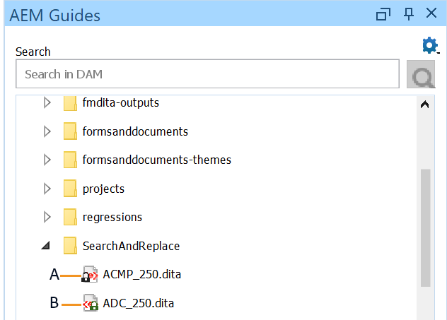
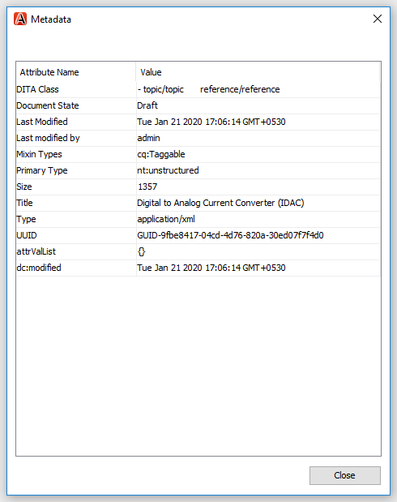
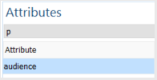

# Syrgas-plugin för Adobe Experience Manager Guides {#id1645H6010Q5}

Med Syrgas-pluginen för Adobe Experience Manager Guides \(kallas senare för Syrgas-plugin för AEM Guides i guiden\) kan du ansluta Syrgas-XML-författaren till Adobe Experience Manager \(AEM\)-databasen för att skapa och hantera innehåll. Du kan använda plugin-programmet för att bläddra bland, söka efter och öppna filer, checka ut och in filer, överföra mappar och filer AEM databasen. På AEM Guides-panelen i skrivbordsprogrammet kan du markera önskade mappar \(från AEM databas\) i favoritmapplistan för snabb åtkomst. Dessutom kan du installera ett paket i AEM webbgränssnitt och öppna DITA-filerna i Sygen XML Author direkt från AEM webbgränssnitt.

## Hämta och installera {#id1826M0L0PUI}

Syrgaspluginen för AEM Guides görs tillgänglig via Adobe Software Distribution Portal. Sök efter&quot;syre&quot; på fliken Experience Manager och hämta installationsprogrammet för plugin-programmet från [Adobe Software Distribution Portal](https://experience.adobe.com/#/downloads/content/software-distribution/en/general.html).

>[!NOTE]
>
>Kontrollera versionskompatibiliteten för Syrgasanslutning i versionsinformationen för den specifika Adobe Experience Manager Guides.

När du har installerat installationsprogrammet installerar du det på den lokala datorn där syre-XML-författaren är installerad. Innan du påbörjar installationen måste du se till att datorn uppfyller de tekniska kraven för att installera syrgas-pluginen för AEM Guides.

### Tekniska krav

- Syrgas-XML-författare version 26.1

- Adobe Experience Manager Guides version 4.6 eller senare

- Adobe Experience Manager version 6.5 med Service Pack 21, 20 och 19

- Operativsystem som stöds av Sygen XML Author version 26.1

- Java Development Kit
   - Oracle SE 8 JRE 1.8

### Installera plugin-programmet i Windows

>[!IMPORTANT]
>
>Om du har en äldre version av plugin-programmet installerad på datorn måste du avinstallera det innan du startar installationsprocessen. Avinstallationsanvisningar finns i avsnittet **Avinstallera paket** i artikeln [Arbeta med paket](https://helpx.adobe.com/experience-manager/6-4/sites/administering/using/package-manager.html) .

Utför följande steg på datorn där Oxygen XML Author är installerat:

1. Starta installationsprogrammets `.exe`-fil.

   Installationsguidens välkomstskärm visas.

1. Klicka på **Nästa** och bläddra till den plats där .exe-filen för Sygen XML Author finns tillgänglig.

1. Markera filen och klicka på **Öppna**.

   Den valda filens plats läggs till i installationsguiden.

1. Klicka på **Nästa**.

1. Klicka på **Installera**.

1. Klicka på **Slutför** för att stänga installationsguiden.
1. Starta Syrgas XML Author.

   AEM Guides-panelen visas i Sygen XML Author.

   {width="800" align="left"}

   >[!NOTE]
   >
   >Om du inte ser panelen AEM Guides läser du de tillfälliga lösningar som finns i felsökningsavsnittet:[AEM Guides-panelen saknas](#id192BH200ZAX).


### Installera plugin-programmet på Mac

>[!IMPORTANT]
>
>Om du har en äldre version av plugin-programmet installerad på datorn måste du avinstallera det innan du startar installationsprocessen. Se avsnittet **Avinstallera paket** i artikeln [Så här arbetar du med paket](https://helpx.adobe.com/experience-manager/6-4/sites/administering/using/package-manager.html) avinstallationsinstruktioner.

Utför följande steg på datorn där Oxygen XML Author är installerat:

1. Leta reda på plugin-programmets .dmg-fil på datorn.

1. Dubbelklicka på .dmg-filen för att öppna filinnehållet.

   DMG-filen innehåller en mapp av typen aem-connector-x.x och en aem-connector-x.x-setup.

   >[!NOTE]
   >
   >x.x i filnamnet är plugin-programmets versionsnummer.

1. Kopiera mappen aem-connector-x.x i mappen plugins i Oxygen XML Author.
1. Dubbelklicka på filen aem-connector-x.x-setup för att starta installationsprogrammet.

1. Starta Syrgas XML Author.

   AEM Guides-panelen visas i Sygen XML Author.

    {width="800" align="left"}

   >[!NOTE]
   >
   >Om du inte ser panelen AEM Guides läser du de tillfälliga lösningar som finns i felsökningsavsnittet:[AEM Guides-panelen saknas](#id192BH200ZAX).


### Installera paketet för att aktivera dokumentredigeringsfunktionen från AEM webbgränssnitt {#id182CE0Q0TY4}

Som författare kan du öppna och redigera dina DITA-kartor eller ämnen i Sygen XML Author direkt från AEM webbgränssnitt. Om du vill aktivera den här funktionen i AEM webbgränssnitt måste AEM-administratören installera ett paket i den AEM utvecklingsinstansen.

Som AEM administratör följer du de här stegen för att installera paketet:

1. Hämta paketets ZIP-fil från IT-avdelningen.
1. Logga in i AEM *\(som administratör\)* och navigera till CRX Package Manager. Standardwebbadressen för att få åtkomst till pakethanteraren är

   `http://<server name>:<port>/crx/packmgr/index.jsp`

   Pakethanteraren hanterar paketen i din lokala AEM. Mer information om hur du arbetar med pakethanteraren finns i [Arbeta med paket](https://experienceleague.adobe.com/docs/experience-manager-cloud-service/content/implementing/developer-tools/package-manager.html?lang=en) i AEM.

    {width="650" align="left"}

1. Klicka på **Överför paket** om du vill överföra syrepaketet.
1. I dialogrutan Överför paket navigerar du till syrepaketfilen som du hämtade i steg 1 och klickar på OK.

   Paketet överförs till din AEM.

1. Klicka på **Installera** om du vill starta installationsprocessen.

   {width="650" align="left"}

1. Klicka på **Installera** i dialogrutan Installera paket.
1. När installationen är klar klickar du på hemknappen i det övre vänstra hörnet av CRX Package Manager.
1. Välj en DITA-fil i resursmappen.

   Alternativet **Redigera i syre** är tillgängligt i verktygsfältet. Mer information om hur du använder det här alternativet finns i [Öppna DITA-avsnittet i Sygen XML Author från AEM webbgränssnitt](#id182CE0I905Z).

   >[!NOTE]
   >
   >Alternativet **Redigera i syre** visas när du väljer ett DITA-avsnitt. Om du markerar flera ämnen visas inte alternativet.


## Konfigurera Syre-plugin-programmet för AEM Guides {#id1826KF00AHS}

När du har hämtat och installerat plugin-programmet måste du konfigurera följande så att det fungerar med plugin-programmet:

- **Webbautentiseringsinställningar**: Inställningar för enkel inloggning i plugin-programmet för AEM Guides.
- **Allmänna inställningar**: Anslutningsinställningar för plugin-programmet, t.ex. URL för AEM server, inloggningsinformation osv.
- **Inställningar för anpassning av profilattribut och filnamn i korsreferenser**: Den här konfigurationen krävs för profileringsattributscheman för dokumentationsuppsättningarna.

### Inställningar för webbautentisering

JxBrowser används för SSO-autentisering av syreanslutningens plugin. Det är en krombaserad webbläsare. För java 9+ krävs åtkomst till icke-publika API:er, och du måste uttryckligen ge åtkomst till JxBrowser. Mer information finns i [Felsökning för JxBrowser](https://jxbrowser-support.teamdev.com/docs/guides/troubleshooting/issues.html).

Uppdatera de angivna filerna för att konfigurera inställningarna för webbautentisering i Syrgas-pluginprogrammet för AEM Guides:

>[!NOTE]
>
>Säkerhetskopiera filen innan du uppdaterar den.

**För Mac och syre 26.1**

Lägg till följande rader i env.sh

```java
--illegal-access=permit\
--add-opens=java.desktop/javax.swing.plaf.basic=ALL-UNNAMED\
--add-exports=javafx.controls/com.sun.javafx.scene.control=ALL-UNNAMED\
--add-exports=javafx.graphics/com.sun.javafx.stage=ALL-UNNAMED\
--add-exports=javafx.graphics/com.sun.javafx.scene=ALL-UNNAMED\
--add-exports=javafx.graphics/com.sun.javafx.scene.traversal=ALL-UNNAMED\
--add-exports=javafx.graphics/com.sun.javafx.tk=ALL-UNNAMED\
--add-exports=javafx.graphics/com.sun.glass.ui=ALL-UNNAMED\
--add-opens=javafx.graphics/com.sun.glass.ui=ALL-UNNAMED\
--add-opens=javafx.graphics/javafx.stage=ALL-UNNAMED\
--add-opens=javafx.graphics/com.sun.javafx.tk.quantum=ALL-UNNAMED\
--add-exports=java.desktop/sun.awt=ALL-UNNAMED\
--add-opens javafx.swing/javafx.embed.swing=ALL-UNNAMED
```

Lägg till följande rader i syreAuthor.sh

```java
-Djdk.module.illegalAccess=permit\-Djava.ipc.external=true\
```

**För Windows och syre 26.1**

Lägg till följande rader i env.bat

```java
--illegal-access=permit --add-opens=java.desktop/javax.swing.plaf.basic=ALL-UNNAMED --add-exports=javafx.controls/com.sun.javafx.scene.control=ALL-UNNAMED --add-exports=javafx.graphics/com.sun.javafx.stage=ALL-UNNAMED --add-exports=javafx.graphics/com.sun.javafx.scene=ALL-UNNAMED --add-exports=javafx.graphics/com.sun.javafx.scene.traversal=ALL-UNNAMED --add-exports=javafx.graphics/com.sun.javafx.tk=ALL-UNNAMED --add-exports=javafx.graphics/com.sun.glass.ui=ALL-UNNAMED --add-opens=javafx.graphics/com.sun.glass.ui=ALL-UNNAMED --add-opens=javafx.graphics/javafx.stage=ALL-UNNAMED --add-opens=javafx.graphics/com.sun.javafx.tk.quantum=ALL-UNNAMED --add-exports=java.desktop/sun.awt=ALL-UNNAMED --add-opens javafx.swing/javafx.embed.swing=ALL-UNNAMED
```

Lägg till följande rader i syreAuthor.bat

```java
-Djdk.module.illegalAccess=permit -Djava.ipc.external=true
```

>[!NOTE]
>
>Du måste köra syre från syreAuthor.sh för Mac och syreAuthor.bat för Windows som administratör.

### Allmänna inställningar

Utför följande steg för att konfigurera anslutningsinställningarna i Syre-pluginen för Adobe Experience Manager Guides:

1. Klicka på inställningsikonen på panelen AEM Guides och välj sedan **Inställningar**.

   {width="800" align="left"}

1. Ange följande information:
   - **Server-URL**: URL för AEM server, till exempel:

     ```http
     http[s]://<host>:<port>
     ```

     Ange värdnamnet och porten för servern där AEM distribueras i ovanstående URL.

     >[!IMPORTANT]
     >
     >Om AEM distribueras på port 80 eller 443 behöver du inte ange den i URL:en.

   - **Autentisering:** Välj mellan **Grundläggande \(Användarnamn/lösenord\)** eller **Webbautentisering**. Om du väljer **Grundläggande** autentisering måste du ange **användarnamn** och **lösenord** i dialogrutan Inställningar.

     Om du väljer Webbautentisering visas AEM inloggningsskärm. Ange dina inloggningsuppgifter och klicka på knappen **Logga in**. När inloggningen är klar stängs AEM inloggningsskärmen och AEM Guides-panelen visar fillistan från AEM.

   - **Tidsgräns för anslutning**: Ange hur många sekunder klienten ska vänta på ett svar från AEM server. Om inget svar från servern tas emot inom den angivna tiden avslutas begäran. Standardvärdet är 20 sekunder.

   - **Lokal mapp**: Plats på din lokala dator där filerna från AEM sparas efter utcheckning. Om du anger en plats som inte finns på enheten skapas platsen av plugin-programmet.
   - **Öppna fil vid utcheckning**: Om det här alternativet är markerat öppnas filerna vid utcheckning.
   - **Stäng filen vid incheckning**: Om det här alternativet är markerat stängs filerna vid incheckning. Innan du stänger filen visas ett popup-fönster där du kan ange versionskommentarerna.
   - **Visa dialogruta för incheckning vid stängning av fil**: Om du väljer det här alternativet visas ett popup-fönster när du stänger en fil. I popup-fönstret kan du välja att checka in filen eller stänga filen utan att checka in den.
   - **Automatisk utcheckning av fil när öppnad**: Om det här alternativet är markerat checkas den ut automatiskt när du dubbelklickar på en fil och öppnas för redigering. Om filen redan är utcheckad öppnas den helt enkelt för redigering. Om det här alternativet inte är markerat öppnas en fil som du inte har ett lås i skrivskyddat läge när du öppnar den.
1. Klicka på **OK**.

### Inställningar för anpassning av profilattribut och filnamn i korsreferenser {#id1827K0D0OHT}

Du måste konfigurera inställningarna i Sygen XML Author för att använda profileringsattributet som är kopplat till DITA-avsnitten i AEM. Du måste också konfigurera inställningen för att visa filnamn i stället för GUID i korsreferenserna.

Utför följande steg för att konfigurera profileringsattribut och korsreferenser:

1. Klicka på **Alternativ** \> **Inställningar** i Författaren för syrgas-XML.
1. Välj **DITA** på fliken **Dokumenttypsassociation** och klicka sedan på **Utöka**.

   {width="650" align="left"}

1. På fliken **Klassökväg** väljer du `com.adobe.o2.connector` i listrutan **Använd inläsare för överordnad klass från plugin-program med ID**.

   {width="650" align="left"}

1. Gör följande ändringar på fliken **Tillägg**:

   - Klicka på **Välj** bredvid **tilläggspaketet** och välj   `LinkResolverExtensionBundle - com.adobe.o2.framework.extn` i listan **Klass** . Klicka på **OK**.
      {width="650" align="left"}
   - Klicka på **Välj** intill **Författartilläggslägesavlyssnaren** under **Enskilda tillägg** och välj `CustomAuthorExtensionStateListener - com.adobe.o2.framework.extn` i listan **Klass**. Klicka på **OK**.
   - Klicka på **Välj** bredvid **redigeraren för anpassade attributvärden** under **Individuella tillägg** och välj `CustomValueEditor - com.adobe.o2.framework.extn` i listan **Klass**. Klicka på **OK**.
   - Klicka på **Välj** intill **Författaren för extern objektinsättningshanterare** under **Individuella tillägg** och välj `CustomURLInsertionHandler - com.adobe.o2.ui ` i listan **Klass**. Klicka på **OK**.


   På följande skärmbild visas den konfigurerade fliken **Tillägg** för DITA-avsnitt:
   
1. Klicka på **OK** i alla dialogrutor för att spara ändringarna.

### Konfigurera DITA-mappningstillägg

Konfiguration av DITA-mappningstillägg krävs för att aktivera öppning av mappningsfiler i Sygen XML Author direkt från AEM webbgränssnitt. Dessa konfigurationer liknar konfigurationerna för profileringsattribut som gjordes i föregående procedur.

Utför följande steg för att konfigurera DITA-mappningstillägget:

1. Klicka på **Alternativ** \> **Inställningar** i Författaren för syrgas-XML.
1. Välj **DITA-schema** på fliken **Dokumenttypsassociation** och klicka sedan på **Utöka**.
1. På fliken **Klassökväg** väljer du com.adobe.o2.connector i listrutan **Använd inläsare för överordnad klass från plugin-program med ID**.
1. Gör följande ändringar på fliken **Tillägg**:
   - Klicka på **Välj** bredvid **tilläggspaketet** och välj   `com.adobe.o2.framework.extn.LinkResolverDITAMapExtensionBundle` i listan **Klass** . Klicka på **OK**.

   - Klicka på **Välj** intill **Författartilläggslägesavlyssnaren** under **Enskilda tillägg** och välj `CustomDITAMapAuthorExtensionStateListener - com.adobe.o2.framework.extn` i listan **Klass**. Klicka på **OK**.

   - Klicka på **Välj** intill **Författaren för extern objektinsättningshanterare** under **Individuella tillägg** och välj `CustomURLInsertionHandler - com.adobe.o2.ui ` i listan **Klass**. Klicka på **OK**.

   - Klicka på **Välj** bredvid **redigeraren för anpassade attributvärden** under **Individuella tillägg** och välj `CustomValueEditor - com.adobe.o2.framework.extn` i listan **Klass**. Klicka på **OK**.

   - Klicka på **Välj** bredvid **Referenslösaren** under **Individuella tillägg** och välj `CustomDITAMapReferenceResolver - com.adobe.o2` i listan **Klass**. Klicka på **OK**.
   - *\(Valfritt\)* Om du inte vill lösa referenser när du öppnar en mappningsfil måste du utföra följande ytterligare konfiguration:

   På följande skärmbild visas den konfigurerade fliken **Tillägg**:
   

1. Klicka på **OK** i alla dialogrutor för att spara ändringarna.

## Arbeta med Sygen Plugin för AEM Guides {#id1826JG00WY4}

### Panelen AEM Guides

På följande skärm visas panelen AEM Guides.

{width="550" align="left"}

**A**\) Visar sökfältet.

**B**\) Visar mappen Favoriter. Som standard är den tom. Du kan lägga till mappar från AEM databas som favoriter. Favoritmappar visas här.

**C**\) DAM-mappen visar AEM. Du kan expandera och komprimera mappvyn.

**D**\) Ikonen Inställningar \(kugghjul\) med följande alternativ:

- **Anslut**: Välj det här alternativet om du vill ansluta till AEM. Alternativet är inaktiverat när Sygen XML Author är ansluten till AEM Server.
- **Uppdatera**: Välj det här alternativet om du vill hämta den senaste statusen för filerna och mappen från AEM.

  >[!NOTE]
  >
  >Spara filerna innan du uppdaterar dem. När du väljer alternativet **Uppdatera** får du en varning om att spara filerna innan du uppdaterar dem. Om du inte har sparat dina filer kan du klicka på **Avbryt** och spara dem.

- **Inställningar**: Du kan använda det här alternativet för att öppna den allmänna dialogrutan Inställningar för plugin-programmet.
- **Logga ut**: Välj det här alternativet om du vill stänga AEM. Det här alternativet är bara tillgängligt om du använder läget Webbautentisering.

### Funktioner på snabbmenyn

Funktionerna för Sygen-plugin-programmet för AEM Guides är tillgängliga när du högerklickar på en mapp eller fil i AEM. De funktioner som är tillgängliga för mapparna skiljer sig från filerna. Här är en fullständig lista över funktioner i Syre Plugin för AEM Guides snabbmeny:

- **Öppna**: Öppnar den markerade filen eller expanderar den markerade mappen.
- **Öppna i**: Du kan välja att öppna den markerade filen i AEM Guides webbredigerare, kartkontrollpanel eller kartredigeraren. Mer information om de här alternativen finns i [Öppna filen i AEM Guides redigerare](#id195GH0V30KX).
- **Checka ut**: Checkar ut en fil från AEM. Mer information finns i [Checka ut filer](#id195HC020TS4).
- **Checka ut med underordnade**: Checkar ut en fil med dess direkta referenser. Mer information finns i [Checka ut filer](#id195HC020TS4).
- **Checka ut med skrivskyddade beroenden**: Checkar ut den markerade filen tillsammans med tillhörande beroenden. Du kan inte göra några ändringar i de beroende filerna. Mer information finns i [Checka ut filer](#id195HC020TS4).
- **Avbryt utcheckning**: Avbryter den utcheckade filen, stänger filen från redigeraren och återställer ändringarna till den senaste versionen av filen som sparats på servern.
- **Uppdatera**: Om det är en fil hämtar den senaste kopian av filen från AEM. För en mapp hämtas mappstrukturen och filens status. Det innebär att en fil läggs till och sedan visas den i AEM Guides-vyn. Om en fil är utcheckad på AEM server visas filen som utcheckad när du uppdaterar i Syrgasförfattaren. Detta uppdaterar dock inte fillistan i *Utcheckade filer i AEM Guides*-vyn.
- **Uppdatera utcheckade filer**: Uppdaterar listan över utcheckade filer i vyn *Utcheckade filer i AEM Guides*. Om en fil är utcheckad på AEM server uppdateras listan med utcheckade filer i vyn *Utcheckade filer i AEM Guides* när du gör en uppdatering. Om en ny fil har lagts till eller status för en fil har ändrats, uppdateras den inte i trädvyn i AEM Guides. Om du vill uppdatera status för filer på AEM måste du göra en uppdatering.
- **Incheckning**: Checkar in filer som du har checkat ut. Mer information finns i [Checka in en fil](#id182CF0J0FHS).
- **Checka in med underordnade**: Om du har checkat ut filer med underordnade, checkar det här alternativet in huvudfilen tillsammans med tillhörande underordnade filer. Mer information finns i [Checka in en fil](#id182CF0J0FHS).
- **Skapa mapp**: Skapar en mapp i AEM. Det här alternativet är bara tillgängligt på mappnivå.
- **Överför fil\**: Överför en eller flera filer. Mer information finns i [Överför filer och mappar](#id195HC03F03J).
- **Överför med beroenden**: Överför DITA-filer \(XML, DITA, Book map, eller DITA-karta\) med tillhörande beroenden. Mer information finns i [Överför filer och mappar](#id195HC03F03J).
- **Överför mapp**: Överför en mapp i AEM. Mer information finns i [Överför filer och mappar](#id195HC03F03J).
- **Lägg till i Favoriter**: Lägger till en mapp i mappen *Favoriter* på panelen AEM Guides. Vi rekommenderar att du lägger till din arbetsmapp här, vilket gör det enklare att synkronisera filer och filens status från AEM.
- **Ta bort från Favoriter**: Tar bort en mapp från *Favoriter*. Mer information finns i [Lägg till eller ta bort favoriter](#id195HC04405P).
- **Visa metadata**: Visar metadata som DITA-klass, dokumentets titel, typ, UUID och annan information som är associerad med en fil. Mer information finns i [Visa metadata för en fil](#id195GHN0H05C).
- **Visa versioner**: Visar versionshistoriken för en fil. Mer information finns i [Visa versionshistorik för en fil](#id195GI000D5Q).

### Öppna en fil i Sygen XML Author {#id195GHJ0A0UB}

När du har anslutit till AEM kan du öppna filer för redigering i Sygen XML Author. Så här öppnar du en fil för redigering i Sygen XML Author:

1. Högerklicka på en fil i panelen AEM Guides som du vill öppna för redigering.

1. Välj **Öppna** på snabbmenyn.

   Filen öppnas i redigeraren i Sygen XML Author.

    {width="800" align="left"}

   När du håller muspekaren över en fils flik visas serversökvägen tillsammans med dess UUID. I skärmbilden ovan markeras dokumentets UUID.


Om du har markerat alternativet **Automatisk utcheckning av fil när den är öppen** \(i dialogrutan Inställningar\) checkas filen automatiskt ut och är tillgänglig för redigering när du öppnar en fil. Om du vill öppna en fil kan du antingen dubbelklicka på ett filnamn eller högerklicka på filnamnet och välja **Öppna** på snabbmenyn. Om det här alternativet inte är markerat öppnas filen i skrivskyddat läge.

>[!NOTE]
>
>Du kan också dubbelklicka på en fil för att öppna den.

### Öppna filen i AEM Guides Editor {#id195GH0V30KX}

Om du vill använda de redigeringsprogram som är tillgängliga i AEM Guides kan du göra det genom att välja önskat alternativ på snabbmenyn. Utför följande steg för att använda AEM Guides redigerare i stället för redigeraren i Sygen XML Author:

1. Högerklicka på en fil i panelen AEM Guides som du vill öppna för redigering.

1. Välj **Öppna i** på snabbmenyn och välj bland följande alternativ:

   - **Webbämnesredigerare**: Om filen som du öppnar är en XML- eller DITA-fil kan du öppna den för redigering i webbredigeraren. Välj alternativet **Webbämnesredigerare** om du vill öppna den markerade filen för redigering i webbredigeraren.

   - **Mappa kontrollpanel**: Du kan välja att redigera en .ditamap-fil på kartkontrollpanelen, där du kan utföra olika åtgärder på kartfilen. De här åtgärderna är beroende av rollen/gruppen som du tillhör.

   - **Redigerare för webb-DITA-karta**: Om du vill öppna .ditamap-filen för redigering i kartredigeraren väljer du det här alternativet. Med alternativet DITA Map Editor kan du lägga till eller ta bort ämnen, lägga till relationstabeller och utföra andra åtgärder på kartan.


### Checka ut filer {#id195HC020TS4}

När du checkar ut en fil lagras den lokalt på datorn och låses för redigering i AEM. Så här checkar du ut en fil:

1. Du kan checka ut dina filer på något av följande sätt:
   - Högerklicka på en fil på panelen AEM Guides.
   - Högerklicka på kartfliken på panelen DITA Maps Manager.
   - Högerklicka på en fil på DITA Maps Manager-panelen.
   - Högerklicka på filfliken när du öppnar en karta eller ett ämne i Redigeraren.

1. Välj något av följande alternativ:
   - **Checka ut:** Checkar ut en fil från AEM och gör den tillgänglig för redigering.
   - **Checka ut med underordnade**: Checkar ut en fil med dess direkta referenser. Du kan göra ändringar på överordnade och underordnade sidor med det här alternativet. Syrgas-plugin för AEM Guides har stöd för utcheckning av en nivå med beroenden. Karta A refererar till exempel till ämne A och ämne A refererar till ämne B. Om du checkar ut karta A checkas ämne A ut oavsett nivå i TOC-hierarkin. Ämne B kommer dock inte att checkas ut eftersom det inte är direkt länkat från A-karta.
   - **Checka ut med skrivskyddade beroenden**: Checkar ut en fil och hämtar dess beroenden till din lokala dator som skrivskyddade kopior. Du kan inte göra några ändringar i de beroende filerna.

Om du har markerat alternativet **Öppna filer vid utcheckning** \(i dialogrutan Inställningar\) öppnas filen automatiskt för redigering när du checkar ut en fil.

Om du har markerat alternativet **Automatisk utcheckning av fil när den är öppen** \(i dialogrutan Inställningar\) checkas filen automatiskt ut och blir tillgänglig för redigering när du öppnar filen. Om du vill öppna en fil kan du antingen dubbelklicka på ett filnamn eller högerklicka på filnamnet och välja **Öppna** på snabbmenyn.

När en fil är utcheckad ändras ikonen för filen så att dess låsta status visas.

{width="650" align="left"}

På skärmbilden ovan visas en fil som har checkats ut av en annan användare med en svart låsikon \(A\). Filen som har checkats ut av den aktuella användaren visas med ett grönt lås \(B\).

>[!NOTE]
>
>Om den utcheckade filen tas bort eller flyttas till en annan mapp i AEM visas ett felmeddelande när du checkar in filen. Kontrollera att den utcheckade filen inte flyttas eller tas bort med AEM webbgränssnitt.

### Checka in en fil {#id182CF0J0FHS}

När du checkar in en fil lagras den lokala kopian från systemet i AEM och fillåset tas bort. Utför följande steg för att checka in en fil:

1. Spara filen genom att klicka på **Arkiv** \> **Spara**.

1. Högerklicka på en utcheckad fil eller karta på någon av följande platser:
   - Panelen AEM Guides
   - Panelen DITA Maps Manager
   - Filfliken när du öppnar en karta eller ett ämne i Redigeraren.
   - Fliken Karta i DITA Maps Manager-panelen.

1. Välj mellan följande två alternativ:

   - **Incheckning**: Checkar in den valda filen från ditt lokala system i AEM.
   - **Checka in med beroende:** Om du har checkat ut en fil tillsammans med dess underordnade, använder du det här alternativet för att checka in alla beroende filer i en enda åtgärd. När du väljer det här alternativet visas dialogrutan Checka in med alla beroende filer. Klicka på OK om du vill checka in alla filer samtidigt.

   Om du inte har checkat ut beroende filer och sedan väljer det här alternativet checkas bara de beroende filerna som du har \(separat\) utcheckade in. En lista över filer som inte kunde checkas in visas:

   {width="800" align="left"}

   Vi rekommenderar att du inte flyttar en fil som är utcheckad. Om en utcheckad fil flyttas till en annan plats måste du dock avbryta utcheckningen av filen. Om du vill uppdatera filen checkar du ut den igen, gör ändringar och checkar sedan in den igen. Om du försöker checka in en fil som har flyttats från den ursprungliga platsen visas ett fel.

   Om en beroende fil är utcheckad i AEM visas inte den beroende filen i dialogrutan Checka in med beroende. Om du vill visa en lista över beroende filer som är utcheckade i AEM måste du göra en mappuppdatering.

   Om du har checkat in en beroende fil via AEM uppdateras inte fillistan i Syrgasförfattaren förrän du uppdaterar mappen Uppdatera och Uppdatera utcheckade filer. Om du gör en incheckning med beroende med vissa filer incheckade AEM visas ett felmeddelande med en lista över de filer som inte kunde checkas in.

1. \(Valfritt\) Lägg till en kommentar i textrutan **Versionskommentarer** i dialogrutorna **Checka in** eller **Checka in med underordnade**.

   >[!NOTE]
   >
   >Den här kommentaren visas i filens AEM versionshistorik.

1. Lägg till etiketter i textrutan **Etikett** i dialogrutan **Incheckning** eller i dialogrutan **Incheckning med underordnade** . Ange en etikett och tryck på Enter. Exempel: *2307 Release*.

   Om administratören har fördefinierat en lista med etiketter och överfört dem i filen `label.json` visas dessa etiketter som en listruta. Du kan välja en eller flera etiketter i listrutan.

   {width="550" align="left"}

   Du kan lägga till flera etiketter (avgränsade med kommatecken) i samma version av ett ämne.  Exempel: *Adobe*, *AEM*, *Stödlinjer*.
Du kan dock inte lägga till samma etikett till olika versioner av ett ämne. Om du lägger till en etikett som du redan har lagt till i en tidigare version läggs den till i den senaste versionen och tas bort från den tidigare versionen.

   >[!NOTE]
   > 
   > Dessa etiketter visas i filens AEM versionshistorik.


1. Klicka på **OK**.

>[!NOTE]
>
>Om den utcheckade filen tas bort eller flyttas till en annan mapp i AEM visas ett felmeddelande när du checkar in filen. Kontrollera att den utcheckade filen inte flyttas eller tas bort med AEM webbgränssnitt.

### Utcheckade filer i AEM Guides-vyn

När du har flera mappar är det inte lätt att ta reda på hur många filer som är utcheckade i en vy. AEM Guides innehåller utcheckade filer i AEM Guides-vyn som ger en fullständig ögonblicksbild av de utcheckade filerna. I den här vyn kan du enkelt ta reda på vilka filer som har checkats in av dig i AEM med AEM Guides. Utför följande steg för att komma åt och arbeta med den här vyn:

1. Klicka på **Fönster** \> **Visa** \> **Utcheckade filer i AEM Guides**.

   Utcheckad fil i AEM Guides-vyn visas.

   {width="550" align="left"}

1. Högerklicka på en fil i den här vyn för att få följande alternativ:

   - [Öppna](#id195GH0V30KX)
   - [Öppna i](#id195GH0V30KX)
   - Avbryt utcheckning
   - [Checka in](#id182CF0J0FHS)
   - [Checka in med beroende](#id182CF0J0FHS)
   - [Visa metadata](#id195GHN0H05C)
   - [Visa versioner](#id195GI000D5Q)

**Anteckningar om utcheckade filer i AEM Guides-vyn:**

- *Utcheckade filer i AEM Guides*-vyn bevarar användarens sessioner. Detta innebär att filer som checkas ut av den aktuella användaren lagras och underhålls i vyn över samma användares sessioner \(eller cache\).

- Om användaren ändrar inloggningsuppgifterna eller AEM server återställs den utcheckade filens data \(eller cache\) i vyn. Användaren måste manuellt köra kommandot *Uppdatera utcheckade filer* för varje mapp som filerna tidigare checkades ut från. För att förenkla detta rekommenderar vi att du lägger till dina arbetsmappar i *Favoriter*, där du snabbt kan göra en mappuppdatering.

- Du kan sortera fillistan utifrån filnamn, titel eller sökväg. Om en ny fil är utcheckad visas filen i sorterad ordning i vyn.


### Överför filer och mappar {#id195HC03F03J}

Så här överför du filer eller mappar:

1. Högerklicka på en mapp på panelen AEM Guides.
1. Välj något av följande alternativ:
   - **Överför fil\**: Välj det här alternativet om du vill överföra en eller flera filer till den valda mappen i AEM. I dialogrutan Välj filer \(er\) som ska överföras markerar du filerna och klickar på **Öppna**.
   - **Överför med beroenden**: Välj det här alternativet om du vill överföra en DITA-fil med tillhörande beroenden. I dialogrutan Välj fil som ska överföras markerar du filerna och klickar på **Öppna**.
   - **Överför mapp**: Välj det här alternativet om du vill överföra en mapp i AEM. I dialogrutan Välj markerar du mappen och klickar på **Välj**.

**Ytterligare information om att arbeta med UUID-baserade filer**:

Följande punkter måste beaktas när innehåll flyttas eller kopieras från ditt lokala system till AEM:

- När du överför en eller flera filer genereras ett nytt UUID för filer som inte har något UUID. Detta UUID läggs till i `topic id` för en DITA-fil.

- När du kopierar en mapp uppdateras referenserna till filerna \(i mappen\) automatiskt i alla DITA-mappar som refererar till filer i den mappen.

- När du kopierar en DITA-mappningsfil ändras inte UUID-referenserna i mappningsfilen.

- Om en fil eller mapp har en konflikt eller har en dubblett, skapas ett unikt filnamn för den nya filen som kopieras eller flyttas.

- Två filer kan inte ha samma UUID. Alla nya filer tilldelas ett unikt UUID.

- Om en fil överförs av två olika användare samtidigt, kommer den fil som bearbetas senare att skriva över den tidigare filen. En sådan metod bör dock undvikas.

- När du checkar ut innehåll från AEM databas och gör ändringar i det lokala systemet, kontrollerar du att filnamnet inte ändras när du överför filen.

- När du infogar en referens i DITA Maps Manager eller Editor visas filens namn och inte UUID:t. Om titeln inte finns visas filnamnet.

### Lägg till eller ta bort favoriter {#id195HC04405P}

Gör så här för att lägga till eller ta bort en mapp i mappen Favoriter på panelen AEM Guides:

- Högerklicka på en mapp och välj **Lägg till i Favoriter**. Du kan lägga till en mapp i favoriter om den inte finns i Favoriter.
- Du kan ta bort en mapp från favoriter på följande sätt:
   - Högerklicka på en mapp i mappen **Favoriter** och välj **Ta bort från Favoriter**.
   - Högerklicka på en mapp i AEM databas under mappen **DAM** som redan har lagts till som favorit och välj **Ta bort från Favoriter**.

### Visa versionshistorik för en fil {#id195GI000D5Q}

Följ de här stegen för att visa en fils versionshistorik:

1. Högerklicka på en fil på panelen AEM Guides.

1. Välj **Visa versioner** på snabbmenyn.

   Filens versionshistorik visas i dialogrutan Versioner.

   {width="550" align="left"}


### Visa metadata för en fil {#id195GHN0H05C}

Så här visar du metadata för en fil:

1. Högerklicka på en fil på panelen AEM Guides.

1. Välj **Visa metadata** på snabbmenyn.

   Filens metadata som DITA-klass, dokumenttillstånd, ändringsdatum, storlek, titel och UUID visas i dialogrutan Metadata.

   {width="550" align="left"}


## Söka i ett ämne i AEM {#id1826J20405Z}

Du kan söka efter ämnen i den AEM databasen med hjälp av sökfältet på panelen AEM Guides. Du kan söka i hela DAM-mappen eller markera en mapp och sedan söka efter ett ämne i den mappen. Sökresultatet visar de ämnen som har textmatchning med sökfrågan.

Utför följande steg för att söka efter ämnen:

1. Välj en mapp i den AEM databasen där du vill söka efter ett ämne.
1. Ange sökfrågan \(t.ex. `introduction`\) i sökfältet i Syre-pluginen för AEM Guides.
1. Klicka på sökknappen eller tryck på Retur.

   Resultatet visas på fliken Sökresultat som en lista med filsökvägen. Om det inte finns något matchande resultat för sökfrågan visas inga resultat i &lt;path för den valda mappen\>-meddelandet.

   {width="550" align="left"}

1. \(Valfritt\) Dubbelklicka på en fil i sökresultatet för att öppna den i Sygen XML Author.
1. Gör något av följande om du vill gå tillbaka till AEM.
   - Klicka på fliken **Bläddra** om du vill visa vyn AEM databas utan att rensa sökresultaten.
   - Om du vill ta bort sökresultaten och visa AEM databas klickar du på ikonen Ta bort sökning.

## Öppna DITA-avsnittet i Sygen XML Author från AEM webbgränssnitt {#id182CE0I905Z}

Du kan öppna och redigera ditt DITA-ämne i Sygen XML Author från AEM webbgränssnitt. Du måste installera ett paket i AEM för att kunna aktivera det här alternativet. Mer information om paketinstallation finns i [Installera paketet för att aktivera dokumentredigeringsfunktionen från AEM webbgränssnitt](#id182CE0Q0TY4).

>[!NOTE]
>
>Alternativet **Redigera i syre** är tillgängligt från olika platser i AEM: när ett ämne markeras, när ett ämne förhandsgranskas eller från fliken Ämnen och rapporter i DITA-kartkonsolen. Om du markerar flera ämnen visas inte alternativet i verktygsfältet.

**Öppna ett DITA-avsnitt**

Gör så här för att öppna ett DITA-ämne i Sygen XML Author:

1. Välj ett ämne i dina resurser och klicka på alternativet **Redigera i syre** i verktygsfältet.

   >[!NOTE]
   >
   >Om ämnet inte är utcheckat checkas det först ut och öppnas sedan i syrgas i redigeringsläge.

1. Välj Syrgas-XML-författare *&lt;version\>* i meddelanderutan **Starta program**. Du kan välja alternativet **Kom ihåg mitt val AEM länkar** om du vill spara dina inställningar.

**Redigera ett DITA-avsnitt**

Utför följande steg för att redigera ett DITA-ämne i Sygen XML Author:

1. Markera och checka ut ett ämne i dina resurser.
1. Klicka på alternativet **Redigera i syre** i verktygsfältet.

   >[!NOTE]
   >
   >Om ämnet inte är utcheckat checkas det först ut och öppnas sedan i syrgas i redigeringsläge.

1. Välj Syrgas-XML-författare *&lt;version\>* i meddelanderutan **Starta program**. Du kan välja alternativet **Kom ihåg mitt val AEM länkar** om du vill spara dina inställningar.
1. Redigera ämnet i Syrgas XML Author.
1. Kolla in ämnet från Syrgaspluginen för AEM Guides.

   Mer information om hur du checkar in ett ämne med Syrgas-plugin för AEM Guides finns i [Checka in en fil](#id182CF0J0FHS).

   >[!NOTE]
   >
   >Kontrollera att du checkar in ämnet med Syrgas-plugin för AEM Guides. Om du checkar in från AEM webbgränssnitt sparas inte de ändringar du gör i Syrgas-XML-författare i den incheckade versionen av ämnet.

**Infoga en referens till ett ämne från Experience Manager Guides-databasen**

Du kan också dra och släppa ett ämne för att infoga referensen i ett ämne eller en DITA-karta.
>[!NOTE]
>
> Du måste checka ut en fil innan du lägger till en referens till den.

Följande element läggs till baserat på typen av referenser:

Om du släpper till Redigeraren med ett öppet ämne:
- En referens läggs till med elementet `<image>` för bilderna.
- Ett objektelement läggs till för en video eller ett ljud.
- Elementet `<xref>` har lagts till för alla andra referenser, till exempel ämne, map, DITAVAL, PDF, ZIP och XML.

Om du släpper till Editor eller DITA Maps Manager med en öppen karta:
- Elementet `<mapref>` har lagts till för kartreferenser, som innehåller en DITA-karta, en bokkarta eller ett ämnesschema.
- Elementet `<topicref>` har lagts till för alla andra referenser, till exempel ämne, map, DITAVAL, PDF, ZIP och XML.


## Arbeta med attributprofiler {#id1827JA002YK}

Med AEM Guides kan du enkelt skapa och associera villkorliga attribut med relevanta DITA-attribut. Du kan definiera villkorliga attribut på global nivå eller på mappnivå. De globalt definierade villkoren visas i alla projekt och på mappnivå visas bara i projekt som skapats i den angivna mappen. Innehållsförfattare kan använda dessa villkorsstyrda attribut för att villkoralisera innehåll i sina DITA-avsnitt eller -kartor som de skapar eller använder. Mer information om hur du skapar villkorliga attribut i AEM med AEM Guides finns i avsnittet *Konfigurera villkorliga attribut för globala profiler och profiler på mappnivå* i Installera och konfigurera Adobe Experience Manager Guides.

>[!NOTE]
>
>Kontrollera att du har lagt till villkorsattributen i AEM och angett [Inställningar för anpassning av profileringsattribut](#id1827K0D0OHT) innan du lägger till villkorsattribut i innehållet.

Följ de här stegen för att lägga till villkorliga attribut i innehållet i Sygen XML Author:

1. Checka ut och öppna ett ämne från *syrgaspluginen för AEM Guides*.
1. Markera den del av innehållet där du vill använda villkorsattributen.
1. Dubbelklicka på villkorsattributet på attributpanelen i Författaren för syrgas-XML.

   {width="300" align="left"}

1. I kolumnen **Tillgängligt** i dialogrutan Redigera attribut markerar du attributet och klickar på **Lägg till**.

   Följande skärm visar `audience` attribut.

   {width="550" align="left"}

1. Klicka på **OK**.

   Attributen läggs till i innehållet.


## Felsöka vanliga problem {#id188ABC00RY4}

Det här avsnittet handlar om några av de vanligaste problemen som du kan stöta på när du arbetar med plugin-programmet, tillsammans med deras lösningar.

### AEM Guides-panel saknas {#id192BH200ZAX}

**Problem** - Om du inte ser AEM Guides-panelen i Sygen XML Author kan du prova följande lösningar:

Lösning 1:

1. Aktivera plugin-programmet i Sygen XML Author.

   Klicka på **Alternativ** \> **Inställningar** \> **Plugins** och välj **Syrgas-plugin för Adobe Experience Manager Guides.**

1. Starta om Syrgas XML Author.


Lösning 2:

1. Aktivera AEM Guides-fönstret om du fortfarande inte ser panelen AEM Guides.

   Klicka på **Fönster** \> **Visa** \> **AEM Guides** i Författaren för syre-XML.

Lösning 3:

1. Avinstallera och installera om Syre-pluginen för Adobe Experience Manager Guides.

   - I Windows avinstallerar du plugin-programmet från listan **Lägg till eller ta bort program**. Installera sedan om plugin-programmet.

   - I Mac går du till mappen aem-connector-x.x i mappen plugins i Oxygen XML Author och flyttar den till **Papperskorgen**. Töm sedan mappen **Papperskorgen**.


### Konfigurera port för DITA-OT-omvandling

**Problem** - När du kör en DITA-OT-omformning på filer som bearbetas av plugin-programmet misslyckas omformningen med följande fel:

{width="800" align="left"}

**Lösning** - Problemet har åtgärdats genom att en proxyserver har lagts till mellan DITA-OT och plugin-programmet. Den här proxyservern bearbetar och delar alla filer som begärts av DITA-OT för omvandlingar. Standardporten som servern har konfigurerats på är: `5972`. Om du använder den här porten för någon annan server kan du ange en annan port för proxyservern.

Utför följande steg för att ändra standardporten för proxyservern:

1. Bläddra till din \(användarens\) arbetskatalog.
1. Skapa en fil med namnet aem\_connector\_proxy.
1. Öppna filen i valfri textredigerare och lägg till ett tillgängligt portnummer på den första raden i filen.
1. Spara och stäng filen.
1. Starta om Syrgas XML Author och kör DITA-OT-omvandlingen.


### AEM Guides-panelen bläddrar inte till den öppnade filplatsen

Problem: När du väljer att öppna en fil för redigering i Sygen XML Author från AEM server öppnas filen för redigering i Sygen XML Author. Platsen för filen i navigeringsträdet visas dock inte på panelen i AEM Guides.

Lösning: Det här problemet har observerats i scenarier där filsökvägen innehåller /content/dam två gånger. Som standard lagras alla resurser i AEM under mappen /content/dam. Om du överför eller skapar en mappstruktur som även innehåller /content/dam i mappen, observeras problemet. Du kan utföra alla normala åtgärder för sådana filer, men deras plats i navigeringsträdet visas inte som standard. Om du vill komma åt den filen i navigeringsträdet måste du bläddra till filens plats manuellt. Observera att dubblettsökvägen /content/dam ersätts med /content/assets i navigeringsträdet.

### Konfigurera loggning

Problem: Som standard genereras inga loggar av Sygen-pluginen för AEM Guides, vilket gör det svårt att felsöka ett felscenario.

Lösning: Utför följande steg för att konfigurera loggarna för Syrgas och JxBrowser:

1. Stäng Författaren av syre-XML

1. Skapa en fil med namnet `logback.xml` med följande innehåll:

   ```xml
   <configuration>
       <appender name="R2" class="ch.qos.logback.core.rolling.RollingFileAppender">
           <file>${user.home}/Desktop/oxygenLog/oxygen.log</file>
           <rollingPolicy class="ch.qos.logback.core.rolling.FixedWindowRollingPolicy">
               <fileNamePattern>${user.home}/Desktop/oxygenLog/oxygen%i.log.gz</fileNamePattern>
               <minIndex>1</minIndex>
               <maxIndex>20</maxIndex>
           </rollingPolicy>
           <triggeringPolicy class="ch.qos.logback.core.rolling.SizeBasedTriggeringPolicy">
               <maxFileSize>100MB</maxFileSize>
           </triggeringPolicy>
           <encoder>
               <pattern>%r %marker %p [ %t ] %c - %m%n</pattern>
           </encoder>
       </appender> 
   
       <root level="debug">
           <appender-ref ref="R2" />
       </root>
   </configuration>   
   ```

1. Spara filen i katalogen `Oxygen Author 26`. (Sökvägen skulle till exempel vara: `C:\Program Files\Oxygen XML Author 26\logback.xml`)

1. Stäng filen. Detta aktiverar syresloggar, som kommer att vara tillgängliga på sökvägen: `${user.home}/Desktop/oxygenLog/oxygen.log`
1. Öppna filen `oxygenAuthor.bat` i en textredigerare.
1. Konfigurera JxBrowser-relaterade loggar genom att lägga till parametern
   `-Denable.aem.jx.log=true`. Detta aktiverar JxBrowser-relaterade loggar som du kan visa på sökvägen: `${user.home}\AppData\Local\Temp\Oxygen_Plugin_Javax_Log.log`:


   ```java
   SET OXYGEN_JAVA=java.exe
   if exist "%JAVA_HOME%\bin\java.exe" set OXYGEN_JAVA="%JAVA_HOME%\bin\java.exe"
   if exist "%~dp0\jre\bin\java.exe" SET OXYGEN_JAVA="%~dp0\jre\bin\java.exe"
   rem Set environment variables
   call "%~dp0\env.bat"
   %OXYGEN_JAVA% -XX:-OmitStackTraceInFastThrow -XX:SoftRefLRUPolicyMSPerMB=10 -Djdk.module.illegalAccess=permit -Djava.ipc.external=true 
   -Denable.aem.jx.log=true -Dsun.java2d.noddraw=true -Dsun.awt.nopixfmt=true -Dsun.java2d.dpiaware=true -Dsun.io.useCanonCaches=true -Dsun.io.useCanonPrefixCache=true 
   -Dsun.awt.keepWorkingSetOnMinimize=true -Dcom.oxygenxml.app.descriptor=ro.sync.exml.AuthorFrameDescriptor
    -Dcom.oxygenxml.ApplicationDataFolder="%APPDATA%" -cp %CP% ro.sync.exml.Oxygen %*
   ```


Med föregående steg aktiveras loggarna och du kan använda dem för att felsöka problemen.
